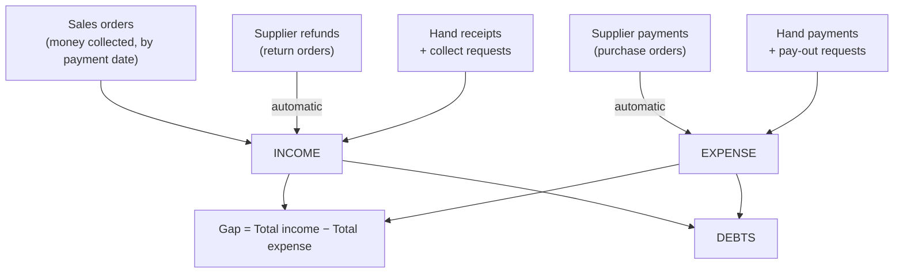
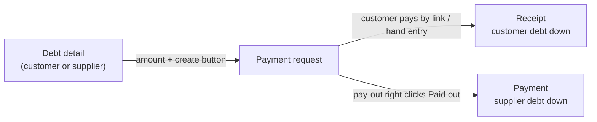

> 🌐 **Language:** [🇻🇳 Tiếng Việt](./in-out-cashflow-and-debt_vi.md) · 🇬🇧 English (current)

# InOut — Part 3: Cash flow, debts & period closing

## Introduction
This document covers the financial side of InOut: the **cash book** (automatic and hand receipts/payments), the **period summary**, **customer & supplier debts**, **opening balances**, **collecting/paying debts through payment requests**, and **period closing**. It is for accountants and business owners. After reading it you understand the store's money picture, know where to collect and pay debts correctly, and can close a period safely.

## Money flow overview

## 1. The cash book
Go to **Orders → [IO] Cash Flow**. Every money movement meets here:

- **Automatic income:** money customers paid on sales orders; supplier refunds (return orders).
- **Automatic expense:** payments to suppliers (purchase orders).
- **Hand receipts/payments:** vouchers for everything else (electricity, wages, deposits, old debts collected…).
- **Vouchers written by payment requests:** when you collect a customer debt or pay a supplier through a payment request (section 4), each real money movement writes one receipt/payment voucher on that party.

The screen has four tabs — **Receipts/Payments** (hand vouchers), **Sales orders**, **Purchase orders**, **Return orders** — all filtered by the **date range** at the top.

### Record a hand receipt or payment
1. On the **Receipts/Payments** tab, click **Create receipt/payment**.
2. Choose the **type** (Receipt / Payment) and the **party**: *Customer*, *Supplier* (from the list) or *Other* (type a name). Required, so the debt lands on the right party.
3. For a customer, the **For order (optional)** box lists the customer's unpaid orders. **Money for an order → pick that order** — it is posted to the order itself and the order's debt goes down. Leave it empty only for money that belongs to no order (a deposit before ordering, an old debt); the system warns but does not block.
4. Enter the **amount** (> 0, base currency), **date**, method, **category** (e.g. *Wages*, *Utilities*), note → **Save**. The code is generated (`CE-YYYYMMDD-XXXX`).

If it worked, the voucher appears in the tab and the summary figures change. Hand vouchers can be **edited / deleted** (buttons at the end of the row); every action is logged.

> Only **hand vouchers** can be edited or deleted. Vouchers from purchase/return orders are changed on that order; vouchers written by a **payment request** are handled (cancelled, refunded) on that request.

## 2. The summary
Pick a date range at the top of the Cash Flow screen to see:

| Figure | Meaning |
|--------|---------|
| Sales revenue | Money customers **actually paid** on sales orders, by **payment date** (minus what was refunded) |
| Hand receipts | Total of hand receipt vouchers (including those written by collect requests) |
| Supplier refunds | Total refunds recorded on return orders |
| **Total income** | Sum of the three lines above |
| Purchase payments | Total payments recorded on purchase orders |
| Hand payments | Total of hand payment vouchers (including those written by pay-out requests) |
| **Total expense** | Sum of the two lines above |
| **Profit** | Total income − Total expense — the **cash gap for the period**, not accounting profit |
| Sales − purchases gap | Sales revenue − Purchase payments |

Because revenue follows the **payment date**, an order placed at the end of August but paid in early September lands in September — matching the money that actually reached your account.

## 3. Debts
Click **Debts** from the Cash Flow screen. There is a party search box and a date range filter.

### Customer debts (customers owe you)
- Lists customers with orders **not fully paid**: order count, order total, paid, order debt, hand vouchers, **net debt**.
- Click **View detail** for each order (total, received, outstanding, payment status), its items and costs, and the customer's hand vouchers.
- **Net debt** = order debts − hand receipts + hand payments (of that customer).

### Supplier debts (you owe suppliers)
- Lists suppliers with purchase orders **not fully paid**.
- **Net debt** = purchase order debts + opening balance − return refunds − hand payments + hand receipts.

### Opening balance (suppliers only)
Use it when you **already owed a supplier** before using InOut:
1. On the Debts screen, open **Supplier Opening Balance** → **Add opening balance**.
2. Pick the supplier, enter the amount and the date → **Save**. The amount is added to the supplier's debt.
3. Entered wrongly? **Delete** that record. Both create and delete are logged and subject to period closing.

> **Customer** debts come straight from sales orders, so there is **no** customer opening balance. For a customer's old debt from before the system: create a matching manual order in S-Cart, or track it through receipts as the customer pays.

## 4. Collect customer debts / pay suppliers through payment requests
Instead of waiting for money and typing a voucher, create a **payment request** right from the debt: the customer gets an **online pay link** (or you record a hand transfer), while a supplier payment goes through **someone with the pay-out right** clicking "Paid out". When money really moves, the receipt/payment voucher appears in the book and the debt goes down by itself.

Steps:
1. Go to **Debts** → **View detail** of the customer or supplier.
2. At the top, the amount box is **pre-filled with the net debt**; change it to collect/pay only part.
3. Click **Create collect request** (customer) or **Create pay-out request** (supplier). The new request opens.
4. Customer: send the pay link (valid **7 days**), or click **Received** when the customer transferred by hand. Supplier: the accountant transfers the money, then someone with the pay-out right clicks **Paid out**.

The full request lifecycle, pay-out rights and refunds: see [Payment requests](../s-cart/order-processing/payment-request.md).

Specifics when used for InOut debts:
- The button appears only if you have the **Payment requests** permission (on top of InOut's).
- The request uses the store's **base currency** — the cash book has one unit.
- Vouchers written by a request **cannot be edited/deleted in the cash book**; cancel or refund on the request and the matching voucher is written for you.
- Refunding money collected by link → writes a **payment voucher** back to the customer.

## 5. Period closing
Closing **locks the figures** of a past period: nobody can change a document in it, not even by accident.

### Close & reopen
1. On the Cash Flow screen, open **Period Closing** → enter the **closing date** → click **Close period**. Every document dated ≤ that date is locked; the section shows how many periods are closed.
2. Need to fix old figures? Click **Reopen** on that closing date, fix, then close again.
3. Any account allowed on the cash flow screen can close/reopen; the action records who did it.

### Rule: cut-off by document date
Closing is checked against the **document's date**, not the day you act. Closed up to 31 May? Today you still **cannot** edit a payment voucher dated 20 May, but you work normally with documents dated 1 June.

Blocked inside a closed period: adding/removing costs, adding/removing purchase order products, cancelling orders, adding/removing payments (by payment date), adding/removing refunds (by refund date), creating/editing/deleting hand vouchers, adding/deleting opening balances, and **recording / refunding money on sales orders** dated in that period.

Money a **payment gateway already collected** through a payment request is never refused (it really arrived): the voucher is dated **today** with a note of the original date so you can reconcile.

## Conditions & Rules (know before you act)
**Hand receipts/payments:**
- The **type**, **party group** and **specific party** are required — to attach the debt correctly.
- Amount **> 0** in the base currency; **date** required.
- A customer receipt attached to an order is posted to the order, and refused if the order is not in this store or does not accept the money (e.g. more than outstanding).
- Only **hand** vouchers can be **edited/deleted**; those from purchase/return orders or payment requests cannot.
- When **editing**: period closing is checked for **both the old and the new date** — moving a voucher into a closed period is blocked too.

**Opening balances:**
- **Suppliers** only.
- Amount **> 0**; **date** required; subject to period closing on that date.

**Collect / pay-out requests:**
- Needs the **Payment requests** permission; amount **> 0**; **base currency** only.
- A customer collect link expires after **7 days**; create a new request afterwards.

**Period closing:**
- **No future dates** — the period has not ended.
- **Cannot close** a date already inside a closed period.
- Cut-off always follows the **document date**; with Multi-Store, each store has its own closing dates.

## Q&A
**Q1: Is "Profit" in the summary the real profit of the business?**

→ It is the **cash collected − cash paid** gap for the period, not gross/net accounting profit (no cost of goods sold, depreciation…). Use it for a quick view.

**Q2: A customer paid for an order — where do I record it?**

→ On that order — from the order screen, or by creating a receipt and picking the order in **For order**. Never record one amount in both places; it would be counted twice.

**Q3: Can I edit a voucher generated from a purchase/return order?**

→ No. Fix it on the original purchase/return order (delete the payment/refund and record it again); the voucher follows.

**Q4: Why can't I delete a voucher "written by a payment request"?**

→ Because that money went through a request with its own lifecycle (link, expiry, refund). Cancel or refund on the request; the counter-voucher is written for you.

**Q5: Why can some documents still be edited after closing?**

→ Because they are dated **after** the closing date. Closing only locks documents dated ≤ that date.

**Q6: Closed up to 31 May — how do I reopen to fix a voucher dated 20 May?**

→ Under Period Closing, click **Reopen** on the 31 May closing, fix, then close again.

**Q7: Why can't I close up to tomorrow?**

→ A period that has not ended cannot be closed. Only dates ≤ today.

**Q8: Can I enter an opening balance for a customer?**

→ No. Only suppliers have opening balances. For an old customer debt, create a matching manual order in S-Cart and track it like any order.

**Q9: I record a receipt for a customer — does their debt go down?**

→ Yes. A receipt on the right customer is deducted from their net debt; if you picked an order, it goes straight against that order.

**Q10: Does deleting a hand voucher lose the trail?**

→ No. The history keeps who deleted it, when, and the voucher's contents.

---

◀ [Part 2 — Return orders](./in-out-return-order.md) · [Index](./in-out.md) · [Part 4 — Sales orders](./in-out-sales-order-integration.md) ▶

---

📅 **Last updated:** 2026-10-03 · ✍️ **Author:** GP247
