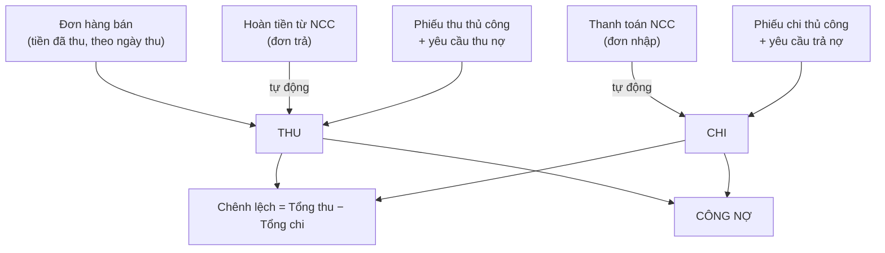
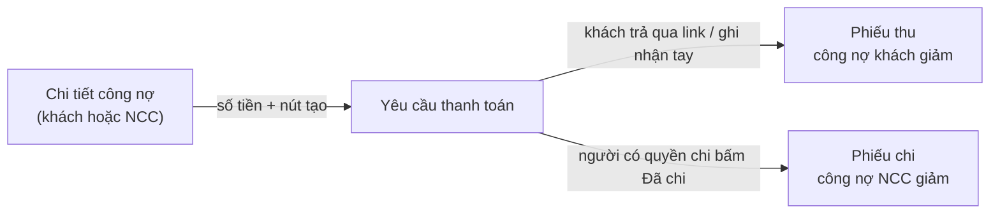

> 🌐 **Ngôn ngữ:** 🇻🇳 Tiếng Việt (hiện tại) · [🇬🇧 English](./in-out-cashflow-and-debt.md)

# InOut — Phần 3: Thu chi, công nợ & khóa sổ

## Giới thiệu
Tài liệu này hướng dẫn phần tài chính của InOut: **sổ thu chi** (thu/chi tự động và thủ công), **bảng tổng kết** theo kỳ, **công nợ** khách hàng & nhà cung cấp, **số dư đầu kỳ**, **thu/trả nợ qua yêu cầu thanh toán**, và **khóa sổ**. Dành cho kế toán và chủ doanh nghiệp. Đọc xong bạn nắm được bức tranh tiền của cửa hàng, biết thu nợ và trả nợ đúng chỗ, và chốt sổ an toàn theo kỳ.

## Tổng quan dòng tiền

## 1. Sổ thu chi
Vào **Đơn hàng → [IO] Quản Lý Thu Chi**. Đây là nơi tập trung mọi giao dịch tiền:

- **Thu tự động:** tiền khách đã trả cho đơn hàng bán; hoàn tiền từ nhà cung cấp (đơn trả hàng).
- **Chi tự động:** thanh toán cho nhà cung cấp (đơn nhập hàng).
- **Thu/chi thủ công:** phiếu thu/chi cho các khoản khác (tiền điện, lương, đặt cọc, thu nợ cũ…).
- **Phiếu do yêu cầu thanh toán tạo:** khi thu nợ khách hoặc trả nợ nhà cung cấp qua yêu cầu thanh toán (mục 4), mỗi lần tiền thực di chuyển sinh một phiếu thu/chi đúng đối tác.

Màn này có bốn tab: **Phiếu thu/chi** (thủ công), **Đơn hàng bán**, **Đơn nhập hàng**, **Đơn trả hàng** — cùng lọc theo **khoảng thời gian** ở đầu trang.

### Tạo phiếu thu/chi thủ công
1. Ở tab **Phiếu thu/chi**, bấm **Tạo phiếu thu/chi**.
2. Chọn **loại** (Phiếu thu / Phiếu chi) và **đối tượng**: *Khách hàng*, *Nhà cung cấp* (chọn từ danh sách) hoặc *Khác* (gõ tên). Bắt buộc, để công nợ gắn đúng người.
3. Nếu đối tượng là khách hàng, ô **Thuộc đơn hàng (tùy chọn)** liệt kê các đơn khách còn nợ. **Tiền của một đơn thì chọn đơn đó** — khoản tiền được ghi vào chính đơn, công nợ đơn giảm. Để trống chỉ khi tiền không thuộc đơn nào (đặt cọc trước, nợ cũ); hệ thống cảnh báo nhưng không chặn.
4. Nhập **số tiền** (> 0, theo đồng tiền cơ sở), **ngày**, phương thức, **phân loại** (ví dụ *Lương*, *Điện nước*), ghi chú → **Lưu**. Mã phiếu tự sinh (`CE-YYYYMMDD-XXXX`).

Nếu thành công, phiếu xuất hiện trong tab và các con số ở bảng tổng kết đổi theo. Phiếu thủ công **sửa / xóa** được (nút ở cuối dòng); mọi thao tác đều ghi lịch sử.

> Chỉ **phiếu thủ công** mới sửa/xóa được. Phiếu sinh từ đơn nhập/đơn trả chỉnh trên chính đơn đó; phiếu do **yêu cầu thanh toán** tạo thì xử lý (hủy, hoàn) trên chính yêu cầu đó.

## 2. Bảng tổng kết
Chọn khoảng thời gian ở đầu trang Quản Lý Thu Chi để xem:

| Chỉ số | Ý nghĩa |
|--------|---------|
| Doanh thu bán hàng | Tiền khách **đã trả** cho đơn hàng bán, tính theo **ngày thu** (trừ phần đã hoàn lại) |
| Phiếu thu thủ công | Tổng phiếu thu nhập tay (kể cả phiếu do yêu cầu thu nợ tạo) |
| Hoàn tiền từ NCC | Tổng hoàn tiền ghi ở đơn trả hàng |
| **Tổng thu** | Cộng ba dòng trên |
| Chi mua hàng | Tổng thanh toán ghi ở đơn nhập hàng |
| Phiếu chi thủ công | Tổng phiếu chi nhập tay (kể cả phiếu do yêu cầu trả nợ tạo) |
| **Tổng chi** | Cộng hai dòng trên |
| **Lợi nhuận** | Tổng thu − Tổng chi — là **chênh lệch tiền mặt trong kỳ**, không phải lãi kế toán |
| Chênh lệch thu bán − chi mua | Doanh thu bán hàng − Chi mua hàng |

Vì doanh thu tính theo **ngày thu tiền**, một đơn đặt cuối tháng 8 nhưng khách trả đầu tháng 9 sẽ nằm trong tháng 9 — khớp với tiền thực vào tài khoản.

## 3. Công nợ
Bấm **Công Nợ** từ màn Quản Lý Thu Chi. Có ô tìm theo tên đối tác và bộ lọc khoảng thời gian.

### Công nợ khách hàng (khách nợ bạn)
- Liệt kê khách có đơn hàng **chưa thanh toán đủ**: số đơn, tổng đơn, đã trả, công nợ đơn, phiếu thu/chi, **công nợ thực**.
- Bấm **Xem chi tiết** để thấy từng đơn (tổng, đã nhận, còn nợ, trạng thái thanh toán), các mặt hàng và chi phí của đơn, cùng các phiếu thu/chi thủ công của khách.
- **Công nợ thực** = công nợ các đơn − phiếu thu thủ công + phiếu chi thủ công (của khách đó).

### Công nợ nhà cung cấp (bạn nợ nhà cung cấp)
- Liệt kê nhà cung cấp có đơn nhập **chưa thanh toán đủ**.
- **Công nợ thực** = công nợ đơn nhập + số dư đầu kỳ − hoàn tiền trả hàng − phiếu chi thủ công + phiếu thu thủ công.

### Số dư đầu kỳ (chỉ cho nhà cung cấp)
Dùng khi bạn **đã nợ nhà cung cấp từ trước** khi dùng InOut:
1. Ở màn Công Nợ, mở mục **Số dư Đầu kỳ Nhà cung cấp** → **Thêm số dư đầu kỳ**.
2. Chọn nhà cung cấp, nhập số tiền và ngày ghi nhận → **Lưu**. Số này cộng vào công nợ nhà cung cấp.
3. Nhập nhầm thì **Xóa** bản ghi đó. Cả tạo lẫn xóa đều ghi lịch sử và chịu kiểm tra khóa sổ.

> Công nợ **khách hàng** lấy thẳng từ đơn hàng bán nên **không** có số dư đầu kỳ cho khách. Nợ cũ của khách từ trước hệ thống: tạo một đơn thủ công tương ứng trong S-Cart, hoặc theo dõi bằng phiếu thu khi khách trả.

## 4. Thu nợ khách / trả nợ nhà cung cấp qua yêu cầu thanh toán
Thay vì chờ tiền về rồi gõ phiếu, bạn tạo một **yêu cầu thanh toán** ngay từ công nợ: khách nhận **link thanh toán online** (hoặc bạn ghi nhận tay khi khách chuyển khoản), còn khoản trả nhà cung cấp đi qua **người có quyền chi** bấm "Đã chi". Tiền thực di chuyển thì phiếu thu/chi tự xuất hiện trong sổ và công nợ tự giảm.

Các bước:
1. Vào **Công Nợ** → **Xem chi tiết** của khách hoặc nhà cung cấp.
2. Ở đầu trang, ô số tiền đã **điền sẵn công nợ thực**; sửa nếu chỉ thu/trả một phần.
3. Bấm **Tạo yêu cầu thu nợ** (khách) hoặc **Tạo yêu cầu trả nợ** (nhà cung cấp). Hệ thống mở trang yêu cầu vừa tạo.
4. Với khách: gửi link thanh toán cho khách (hiệu lực **7 ngày**), hoặc bấm **Đã nhận** khi khách chuyển khoản tay. Với nhà cung cấp: kế toán chuyển tiền, rồi người có quyền chi bấm **Đã chi**.

Toàn bộ vòng đời của yêu cầu, quyền chi tiền, hoàn tiền: xem [Yêu cầu thanh toán](../s-cart/order-processing/payment-request_vi.md).

Điểm riêng khi dùng cho công nợ InOut:
- Nút chỉ hiện khi bạn có quyền **Yêu cầu thanh toán** (ngoài quyền InOut).
- Yêu cầu dùng **đồng tiền cơ sở** của cửa hàng — sổ thu chi chỉ có một đơn vị tiền.
- Phiếu do yêu cầu tạo **không sửa/xóa được ở sổ thu chi**; hủy hay hoàn thì làm trên chính yêu cầu, phiếu tương ứng tự sinh.
- Hoàn một khoản đã thu qua link → sinh **phiếu chi** trả lại khách.

## 5. Khóa sổ
Khóa sổ **chốt số liệu** một kỳ đã qua: không ai sửa được chứng từ thuộc kỳ đó, kể cả vô tình.

### Cách khóa & mở lại
1. Ở màn Quản Lý Thu Chi, mở mục **Khoá Sổ Kỳ** → nhập **Ngày khoá** → bấm **Khoá sổ**. Mọi chứng từ có ngày ≤ ngày này bị khóa; mục này hiện số kỳ đang khóa.
2. Cần sửa lại số liệu cũ? Bấm **Mở lại** ở mốc khóa tương ứng, sửa xong khóa lại.
3. Mọi tài khoản có quyền dùng màn thu chi đều khóa/mở được; thao tác có ghi người thực hiện.

### Nguyên tắc: cut-off theo ngày chứng từ
Khóa được xét theo **ngày của chứng từ**, không phải ngày bạn thao tác. Đã khóa đến 31/05 thì hôm nay bạn vẫn **không** sửa được phiếu chi đề ngày 20/05, nhưng thao tác bình thường với chứng từ đề ngày 01/06.

Bị chặn khi thuộc kỳ đã khóa: thêm/xóa chi phí, thêm/xóa sản phẩm đơn nhập, hủy đơn, thêm/xóa thanh toán (theo ngày thanh toán), thêm/xóa hoàn tiền (theo ngày hoàn), tạo/sửa/xóa phiếu thu chi, nhập/xóa số dư đầu kỳ, và **ghi nhận / hoàn tiền cho đơn hàng bán** với ngày thuộc kỳ đó.

Riêng tiền **cổng thanh toán đã thực thu** qua yêu cầu thanh toán thì không bị từ chối (tiền đã về thật): phiếu được ghi vào **hôm nay** kèm ghi chú ngày gốc để bạn đối soát.

## Điều kiện & ràng buộc (hiểu trước khi thao tác)
**Phiếu thu/chi thủ công:**
- **Bắt buộc** chọn **loại**, **nhóm đối tượng** và **đối tượng cụ thể** — để gắn đúng công nợ.
- Số tiền **> 0** theo đồng tiền cơ sở; **ngày** bắt buộc.
- Phiếu thu của khách có gắn đơn: hệ thống ghi vào đơn, và từ chối nếu đơn không thuộc cửa hàng này hoặc đơn không nhận thêm tiền (ví dụ vượt số còn nợ).
- Chỉ **sửa/xóa** phiếu **thủ công**; phiếu từ đơn nhập/đơn trả và từ yêu cầu thanh toán thì không.
- Khi **sửa** phiếu: kiểm tra khóa sổ cho **cả ngày cũ lẫn ngày mới** — đổi ngày sang kỳ đã khóa cũng bị chặn.

**Số dư đầu kỳ:**
- Chỉ áp dụng cho **nhà cung cấp**.
- Số tiền **> 0**; **ngày ghi nhận** bắt buộc; chịu kiểm tra khóa sổ theo ngày đó.

**Yêu cầu thanh toán thu/trả nợ:**
- Cần quyền **Yêu cầu thanh toán**; số tiền **> 0**; chỉ **đồng tiền cơ sở**.
- Link thu nợ khách hết hạn sau **7 ngày**; hết hạn thì tạo yêu cầu mới.

**Khóa sổ:**
- **Không khóa ngày tương lai** — kỳ chưa kết thúc.
- **Không khóa lại** ngày đã nằm trong kỳ đang khóa.
- Cut-off luôn theo **ngày chứng từ**; mỗi cửa hàng (nếu dùng Multi-Store) có mốc khóa riêng.

## Hỏi & Đáp (Q&A)
**Câu 1: "Lợi nhuận" ở bảng tổng kết có phải lãi thật của doanh nghiệp không?**

→ Đây là **chênh lệch tiền thực thu − thực chi** trong kỳ, không phải lãi gộp/lãi ròng kế toán (chưa tính giá vốn hàng bán, khấu hao…). Dùng để theo dõi nhanh.

**Câu 2: Khách trả tiền cho một đơn, tôi nên ghi ở đâu?**

→ Vào chính đơn đó — ở màn đơn hàng, hoặc tạo phiếu thu và chọn đơn ở ô **Thuộc đơn hàng**. Đừng ghi một khoản ở cả hai nơi, sẽ đếm trùng.

**Câu 3: Tôi sửa được phiếu tự động sinh từ đơn nhập/đơn trả không?**

→ Không. Chỉnh ngay trên đơn nhập/đơn trả gốc (xóa khoản thanh toán/hoàn tiền rồi ghi lại), phiếu tự cập nhật.

**Câu 4: Phiếu "do Yêu cầu thanh toán tạo" vì sao không xóa được?**

→ Vì tiền đó đi qua một yêu cầu có vòng đời riêng (link, hết hạn, hoàn). Hủy hoặc hoàn trên chính yêu cầu; phiếu đối ứng tự sinh.

**Câu 5: Vì sao đã khóa sổ mà vẫn có chứng từ sửa được?**

→ Vì chứng từ đó đề **ngày sau** mốc khóa. Khóa sổ chỉ chặn chứng từ có ngày ≤ ngày khóa.

**Câu 6: Đã khóa đến 31/05, tôi mở lại thế nào để sửa phiếu ngày 20/05?**

→ Mục Khoá Sổ Kỳ, bấm **Mở lại** ở mốc 31/05, sửa xong rồi khóa lại.

**Câu 7: Vì sao không khóa được cho ngày mai?**

→ Không thể chốt một kỳ chưa kết thúc. Chỉ khóa đến ngày ≤ hôm nay.

**Câu 8: Công nợ khách hàng có nhập số dư đầu kỳ được không?**

→ Không. Chỉ nhà cung cấp có số dư đầu kỳ. Nợ cũ của khách: tạo đơn thủ công tương ứng trong S-Cart để theo dõi như đơn thường.

**Câu 9: Tôi ghi một phiếu thu cho khách, công nợ của khách có tự giảm không?**

→ Có. Phiếu thu gắn đúng khách được trừ vào công nợ thực của khách đó; nếu chọn đơn thì giảm thẳng vào đơn.

**Câu 10: Xóa phiếu thủ công có mất dấu vết không?**

→ Không. Lịch sử lưu ai xóa, khi nào, nội dung phiếu.

---

◀ [Phần 2 — Đơn trả hàng](./in-out-return-order_vi.md) · [Mục lục](./in-out_vi.md) · [Phần 4 — Đơn hàng bán](./in-out-sales-order-integration_vi.md) ▶

---

📅 **Cập nhật lần cuối:** 2026-10-03 · ✍️ **Tác giả (Author):** GP247
