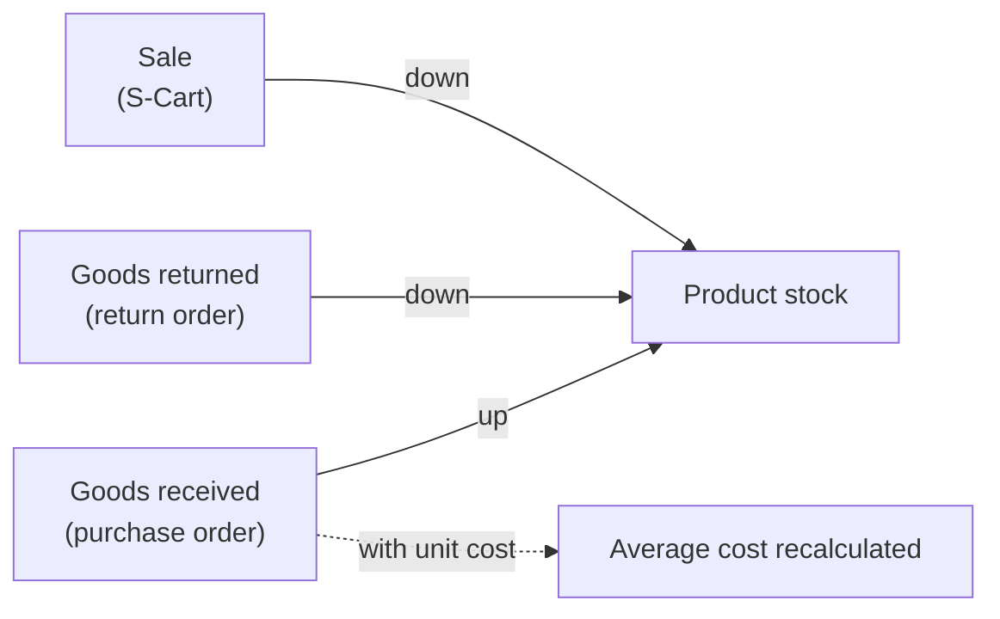

> 🌐 **Language:** [🇻🇳 Tiếng Việt](./in-out-export-print_vi.md) · 🇬🇧 English (current)

# InOut — Part 5: Export, printing, automatic stock & history

## Introduction
This document groups the shared features of the InOut plugin: **Excel/PDF export** of documents, the **automatic stock** mechanism, **cost categories** and the **operation history**. It is for accountants and managers who print documents, reconcile stock and need to know who did what. After reading it you know where to get the files, who controls stock, and how to look up the history.

## 1. Export & printing
The plugin exports these documents:

| Document | Format | Content |
|----------------|-----------|----------|
| Purchase order | Excel (.xlsx), PDF | Product lines, costs, payment history |
| Return order | Excel (.xlsx), PDF | Returned products, costs, refunds |
| Receipt / Payment voucher | PDF | Standard voucher with signature boxes |
| Cash book | Excel (.xlsx) | Vouchers in the filtered date range |
| Debt report | Excel (.xlsx) | Customer and supplier debt summary |
| Debt detail of one party | Excel (.xlsx), PDF | Each order, hand vouchers, opening balance, net debt |

How: open the document's detail page (or the list / debts page) and click **Export Excel** / **Export PDF**. The file is named after the document code and the export date (e.g. `PO_PO-20261003-0001_20261003.pdf`), so repeated exports do not overwrite each other.

Every file uses a **business document template**: store logo and name, formatted tables, signature boxes. Amounts are in the store's base currency.

### Signatures on documents

| Document | Box 1 | Box 2 | Box 3 |
|---------------|--------|--------|--------|
| Purchase order | Prepared by | Seller | — |
| Return order | Prepared by | Goods receiver | — |
| Receipt voucher | Prepared by | Payer | Cashier |
| Payment voucher | Prepared by | Receiver | Cashier |
| Debt detail | Prepared by | Partner/Customer | — |

## 2. Automatic stock

| Action | Stock effect | Managed by |
|----------|-------------------|-------------|
| Receive goods on a purchase order | Stock **up** by qty received | InOut |
| Lower a recorded received qty | Stock **down** by the difference | InOut |
| Return goods to a supplier | Stock **down** by qty returned | InOut |
| Sell to a customer | Stock **down** per the sales order | S-Cart |
| Cancel a purchase order (nothing received) | No effect | — |

When goods are received with a unit cost, the product's **average cost price** is recalculated as a weighted average — only at receipt time, never retroactively for earlier receipts.

> **In short:** InOut manages stock **coming in** and **going back**; **sales** are handled by S-Cart ([Product stock management](../s-cart/product/product-stock-management.md)).

## 3. Cost categories
When adding an extra cost to a purchase/return order, pick a category so costs can be filtered and summed later:

| Category | Examples |
|------|-------|
| Shipping | Domestic, international freight |
| Insurance | Cargo insurance |
| Import tax | Customs duties |
| Handling | Loading, packaging |
| Other | Anything else |

## 4. History & control
Every business action is recorded: who created an order, who received goods and how many (old → new), who recorded a payment/refund, who cancelled an order, who created/edited/deleted a voucher, who added/deleted an opening balance — with timestamps. The history shows under **Action History** on each order's/voucher's detail page. A deleted voucher keeps its trail (who deleted it, when, its contents).

## Conditions & Rules (know before you act)
- You need **access** to the matching screen (the **Inout Cash** permission group is enough) to export — the files hold financial data.
- An export reflects **the data at the moment you click** and **the active filters** (date range, party search…). For a full-year report, select the whole year first.
- PDF needs a server with a **Unicode font that supports Vietnamese** for correct diacritics; the bundled template already uses a suitable font.
- Stock changes only through **receiving/returning goods** (InOut) or **sales** (S-Cart) — the plugin has no manual stock field, so every change has a document behind it.
- The average cost price is recalculated **only when goods are received with a unit cost**; **never** when an old order is edited.

## Q&A
**Q1: I am looking for a CSV export button and cannot find it?**

→ The plugin exports **Excel (.xlsx)**; there is no CSV. Use **Export Excel** — it opens directly, keeping number formats and Vietnamese text intact.

**Q2: The PDF shows broken Vietnamese characters?**

→ The template uses a Vietnamese-capable font. If it still breaks, check that the server has Unicode fonts; contact GP247 support if needed.

**Q3: Why does stock not change when I sell?**

→ That is the selling side, deducted by **S-Cart**, not InOut. Check S-Cart's stock settings.

**Q4: Is the average cost recalculated when I edit an old purchase order?**

→ No. The cost price updates only at **receipt time**; editing old orders does not recompute it.

**Q5: Who can see the action history?**

→ Anyone with access to the matching screen. The history is on each order's/voucher's detail page.

**Q6: Are the signatures the same on Excel and PDF?**

→ Yes. One document type uses **the same signature set** on both Excel and PDF.

---

◀ [Part 4 — Sales orders](./in-out-sales-order-integration.md) · [Index](./in-out.md)

---

📅 **Last updated:** 2026-10-03 · ✍️ **Author:** GP247
