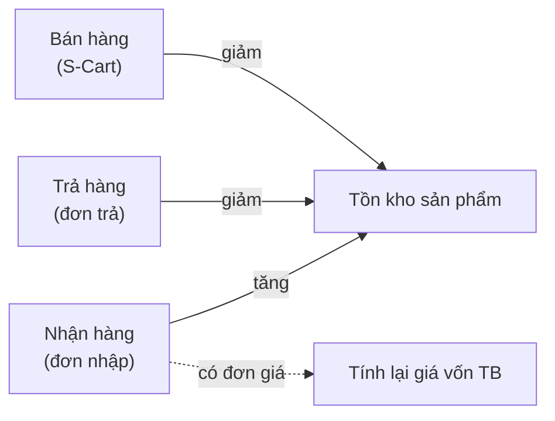

> 🌐 **Ngôn ngữ:** 🇻🇳 Tiếng Việt (hiện tại) · [🇬🇧 English](./in-out-export-print.md)

# InOut — Phần 5: Xuất file, in ấn, tồn kho tự động & lịch sử

## Giới thiệu
Tài liệu này gộp các chức năng dùng chung của plugin InOut: **xuất Excel/PDF** cho chứng từ, cơ chế **tồn kho tự động**, **phân loại chi phí** và **lịch sử thao tác**. Dành cho kế toán và quản lý cần in chứng từ, đối chiếu tồn kho và kiểm soát ai làm gì. Đọc xong bạn biết lấy file ở đâu, ai đang điều khiển tồn kho, và tra cứu lịch sử thế nào.

## 1. Xuất dữ liệu & in ấn
Plugin xuất được các chứng từ sau:

| Loại tài liệu | Định dạng | Nội dung |
|----------------|-----------|----------|
| Đơn nhập hàng | Excel (.xlsx), PDF | Chi tiết sản phẩm, chi phí, lịch sử thanh toán |
| Đơn trả hàng | Excel (.xlsx), PDF | Chi tiết sản phẩm trả, chi phí, hoàn tiền |
| Phiếu thu / Phiếu chi | PDF | Mẫu phiếu chuẩn có ô chữ ký |
| Sổ thu chi | Excel (.xlsx) | Danh sách phiếu theo khoảng thời gian đang lọc |
| Báo cáo công nợ | Excel (.xlsx) | Tổng hợp công nợ khách hàng và nhà cung cấp |
| Chi tiết công nợ một đối tác | Excel (.xlsx), PDF | Từng đơn, phiếu thu/chi, số dư đầu kỳ, công nợ thực |

Cách lấy: mở trang chi tiết chứng từ (hoặc trang danh sách / công nợ) và nhấn **Export Excel** / **Export PDF**. File tải về đặt tên theo mã chứng từ và ngày xuất (ví dụ `PO_PO-20261003-0001_20261003.pdf`), nên lưu nhiều lần không ghi đè nhau.

Mọi file dùng **mẫu chứng từ doanh nghiệp**: logo và tên cửa hàng, bảng dữ liệu có định dạng, ô chữ ký. Số tiền theo đồng tiền cơ sở của cửa hàng.

### Chữ ký trên chứng từ

| Loại chứng từ | Ô ký 1 | Ô ký 2 | Ô ký 3 |
|---------------|--------|--------|--------|
| Đơn nhập hàng | Người lập đơn hàng | Người bán hàng | — |
| Đơn trả hàng | Người lập đơn hàng | Người nhận hàng | — |
| Phiếu thu | Người lập phiếu | Người nộp | Thủ quỹ |
| Phiếu chi | Người lập phiếu | Người nhận | Thủ quỹ |
| Chi tiết công nợ | Người lập | Đối tác/Khách hàng | — |

## 2. Tồn kho tự động

| Thao tác | Ảnh hưởng tồn kho | Quản lý bởi |
|----------|-------------------|-------------|
| Nhận hàng từ đơn nhập | Tồn kho **tăng** theo số thực nhận | InOut |
| Giảm số thực nhận đã ghi | Tồn kho **trừ lại** phần chênh | InOut |
| Trả hàng cho nhà cung cấp | Tồn kho **giảm** theo số thực trả | InOut |
| Bán hàng cho khách | Tồn kho **giảm** theo đơn bán | S-Cart |
| Hủy đơn nhập (chưa nhận) | Không ảnh hưởng | — |

Khi nhận hàng có đơn giá, hệ thống tính lại **giá vốn trung bình** của sản phẩm theo bình quân gia quyền — chỉ tính lúc nhận, không tính lại cho các lần nhận trước.

> **Tóm lại:** InOut quản lý kho chiều **nhập vào** và **trả ra**; chiều **bán ra** do S-Cart xử lý ([Quản lý tồn kho sản phẩm](../s-cart/product/product-stock-management_vi.md)).

## 3. Phân loại chi phí
Khi thêm chi phí phụ vào đơn nhập/đơn trả, chọn một nhóm để sau này lọc và tổng hợp:

| Nhóm | Ví dụ |
|------|-------|
| Vận chuyển | Phí ship nội địa, quốc tế |
| Bảo hiểm | Bảo hiểm hàng hóa |
| Thuế nhập khẩu | Thuế hải quan |
| Bốc xếp / Xử lý | Phí bốc dỡ, đóng gói |
| Khác | Khoản phát sinh khác |

## 4. Lịch sử & kiểm soát
Mọi thao tác nghiệp vụ đều được ghi lại: ai tạo đơn, ai nhận hàng và bao nhiêu (số cũ → số mới), ai ghi thanh toán/hoàn tiền, ai hủy đơn, ai tạo/sửa/xóa phiếu thu chi, ai nhập/xóa số dư đầu kỳ — kèm thời điểm. Lịch sử hiển thị ở mục **Lịch Sử Thao Tác** trong trang chi tiết của từng đơn/phiếu. Phiếu thu chi bị xóa vẫn giữ lại dấu vết (ai xóa, khi nào, nội dung phiếu).

## Điều kiện & ràng buộc (hiểu trước khi thao tác)
- Cần **quyền truy cập** màn tương ứng (nhóm quyền **Inout Cash** là đủ) mới xuất được chứng từ — vì file chứa số liệu tài chính.
- File xuất phản ánh **đúng dữ liệu tại thời điểm bấm xuất** và **bộ lọc đang áp dụng** (khoảng thời gian, từ khóa tìm đối tác…). Muốn báo cáo cả năm thì chọn khoảng thời gian cả năm trước khi xuất.
- PDF cần máy chủ có **font Unicode hỗ trợ tiếng Việt** để hiển thị đúng dấu; mẫu đi kèm đã dùng font phù hợp.
- Tồn kho chỉ thay đổi qua nghiệp vụ **nhận/trả hàng** (InOut) hoặc **bán hàng** (S-Cart) — plugin không có ô sửa tồn kho tay, để mọi thay đổi đều có chứng từ.
- Giá vốn trung bình chỉ tính lại **khi nhận hàng có đơn giá**; **không** tính lại khi sửa đơn cũ.

## Hỏi & Đáp (Q&A)
**Câu 1: Tôi tìm nút xuất CSV nhưng không thấy?**

→ Plugin xuất **Excel (.xlsx)**, không có CSV. Dùng nút **Export Excel**; Excel mở trực tiếp được, giữ đúng định dạng số và tiếng Việt.

**Câu 2: File PDF bị lỗi font tiếng Việt thì sao?**

→ Mẫu dùng font hỗ trợ tiếng Việt. Nếu vẫn lỗi, kiểm tra máy chủ có đủ font Unicode; liên hệ hỗ trợ GP247 nếu cần.

**Câu 3: Vì sao tồn kho không đổi khi tôi bán hàng?**

→ Đó là chiều bán ra, do **S-Cart** trừ kho, không phải InOut. Kiểm tra cấu hình tồn kho của S-Cart.

**Câu 4: Giá vốn trung bình có tính lại khi tôi sửa đơn nhập cũ không?**

→ Không. Giá vốn chỉ cập nhật tại thời điểm **nhận hàng**; không tính lại khi chỉnh sửa đơn cũ.

**Câu 5: Ai xem được lịch sử thao tác?**

→ Người có quyền truy cập màn tương ứng. Lịch sử nằm trong trang chi tiết của từng đơn/phiếu.

**Câu 6: Chữ ký trên Excel và PDF có giống nhau không?**

→ Có. Cùng một loại chứng từ dùng **cùng bộ chữ ký** trên cả Excel lẫn PDF.

---

◀ [Phần 4 — Đơn hàng bán](./in-out-sales-order-integration_vi.md) · [Mục lục](./in-out_vi.md)

---

📅 **Cập nhật lần cuối:** 2026-10-03 · ✍️ **Tác giả (Author):** GP247
