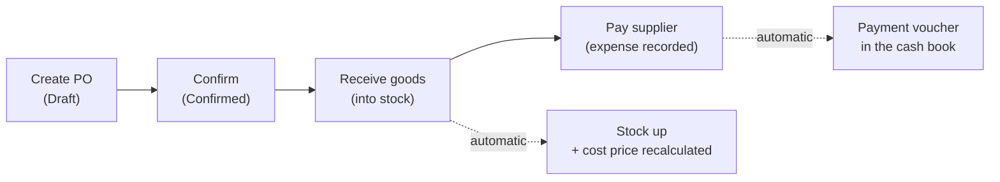

> 🌐 **Language:** [🇻🇳 Tiếng Việt](./in-out-purchase-order_vi.md) · 🇬🇧 English (current)

# InOut — Part 1: Purchase orders (receiving goods from suppliers)

## Introduction
This document walks through **purchasing** in the InOut plugin: creating an order with a supplier, confirming it, receiving the goods into stock, and paying the supplier. It is for store owners, warehouse managers and in-house accountants. After reading it you can create and process a complete purchase order, and you understand why the system blocks an action when it does.

## Purchasing workflow

## Steps

### Step 1 — Create the purchase order
1. Go to **Orders → [IO] Purchase Orders** and click **Create Purchase Order**.
2. **Pick the supplier** from the list (required — before adding products). No supplier yet? Create one under S-Cart's **Suppliers** first.
3. Add product lines: type a name or SKU to search, pick an existing product, then enter the **quantity** and **unit cost**. Quantities may be fractional (up to 2 decimals, e.g. `1.5`).
4. If the goods are taxed, enter a **tax rate (%)** per line — the tax amount is computed for you.
5. (Optional) Add **extra costs** (shipping, insurance, handling…) and choose a **category** for each. A cost may be **negative** to record a discount from the supplier.
6. (Optional) Fill in the **expected delivery date**, **payment due date** and a note.
7. Click **Save purchase order**. The system generates the code (`PO-YYYYMMDD-XXXX`) and computes: goods total + tax total + extra costs = **grand total**.

If it worked, you land on the order detail page in **Draft** status. Every amount here is in the store's **base currency**.

> Product lines can only be added or removed while the order is a Draft.

### Step 2 — Confirm the order
1. Open a **Draft** order and click **Confirm**.
2. The order becomes **Confirmed**, ready to receive. The product list is now locked.

### Step 3 — Receive goods (into stock)
1. On the order detail, enter **Qty received** on each line and click **Update qty**.
2. You may receive in **several deliveries** — the line status moves *Pending → Partial → Received*. When every line is complete the order becomes **Received**.
3. As soon as you save, the **product stock goes up** by the quantity just received and the product's **average cost price** is recalculated from the unit cost.

> Entered too much and **lowered** the received quantity? The system **takes back** exactly the surplus it had added to stock.

### Step 4 — Pay the supplier
1. On the order detail, under **Payment History**, click **+ Record**: enter the **amount**, **payment date**, method and note → save.
2. Watch three figures: **Total / Paid / Remaining**. You may record **several instalments**; a recorded payment can be deleted while its period is not closed.
3. Each payment **becomes a payment voucher** in the cash book by itself — no re-typing.

> To pay a supplier with an approval step or across several orders, use a **pay-out request** from the debt screen, see [Part 3](./in-out-cashflow-and-debt.md).

## Purchase order statuses

| Status | Meaning |
|------------|---------|
| Draft | Just created, not confirmed (products can be added/removed) |
| Confirmed | Approved, ready to receive |
| Partially received | Some products received, not all |
| Received | Every product fully received |
| Cancelled | Order cancelled (only possible while **nothing** was received) |

## Search & filters
The purchase order list filters by **code**, **supplier**, **status** and **creation date range**. An order's detail also shows **Related Return Orders** once goods from it were returned.

## Conditions & Rules (know before you act)
Each rule has a business reason:

**Creating / editing an order:**
- **Pick the supplier before adding products** — so the debt lands on the right party.
- **At least 1 product**; every line must be a **real product** in your catalogue with a **name**.
- **Ordered quantity > 0**, at most **2 decimals** (`1.25` is fine, `1.255` is rejected) — the system stores 2 decimals.
- **Unit cost ≥ 0** — a cost cannot be negative.
- **Tax rate** (if given) between **0–100%**.
- **Extra costs** may be **negative** (discounts); name ≤ 255 characters, note ≤ 500 characters.
- Order note ≤ 2000 characters.

**Receiving:**
- Qty received **cannot exceed the ordered qty** of that line.
- Qty received ≥ 0, at most 2 decimals.
- **Lowering** the received qty must not push stock below zero (goods already sold) → blocked, so stock never goes negative.

**Paying:**
- Amount **> 0**.
- **Paid so far + new amount ≤ order total** — no overpayment on an order. Money beyond the order (an advance, an old debt) goes through a **hand payment voucher** in the cash book.

**Adding/removing products, confirming, cancelling:**
- Products can be **added/removed** only in **Draft** — once confirmed/received the list is frozen to protect the figures.
- A line already received (qty received > 0) or with a related return order **cannot be deleted**.
- An order can be **cancelled** only while **nothing** was received. After that, go through [returns](./in-out-return-order.md).
- Only a **Draft** order can be **confirmed**.

**Period closing:** every change to an order dated inside a **closed period** (by the **order date**; payments by the **payment date**) is blocked. See [Part 3](./in-out-cashflow-and-debt.md).

## Q&A
**Q1: Must I "Confirm" before I can receive?**

→ Follow Draft → Confirm → Receive to keep data clean. Product lines can only be added/removed in **Draft**, so check the list carefully before confirming.

**Q2: I entered the wrong received quantity — how do I fix it?**

→ Enter the right number and click **Update qty**. A lower number takes the surplus back out of stock; a higher one adds the difference.

**Q3: What is a negative extra cost for?**

→ To record a **discount** the supplier gives you. A cost of `-200,000` lowers the order's grand total.

**Q4: Why can't I add a product to the order?**

→ Only **Draft** orders accept product changes. Once confirmed/received the product list is locked.

**Q5: Why was my payment refused?**

→ Because paid so far plus the new amount **exceeds the order total**, or the payment date falls in a **closed period**. Check the remaining amount and the closing dates before entering.

**Q6: How is the "average cost price" computed?**

→ Weighted average at receipt time: `(old stock × old cost + qty received × unit cost) ÷ (old stock + qty received)`. It only updates when goods are received; earlier receipts are not recomputed.

**Q7: Can I cancel an order that was already received?**

→ No. Only orders with **nothing received** can be cancelled. Already received? Use [Part 2 — Return orders](./in-out-return-order.md).

**Q8: Where do I export a purchase order to Excel/PDF?**

→ On the order detail page, click **Export Excel** or **Export PDF**. See [Part 5](./in-out-export-print.md).

---

◀ [Index](./in-out.md) · [Part 2 — Return orders](./in-out-return-order.md) ▶

---

📅 **Last updated:** 2026-10-03 · ✍️ **Author:** GP247
