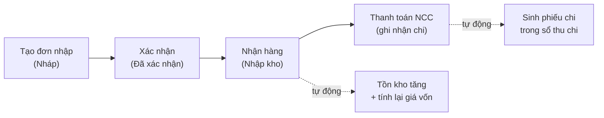

> 🌐 **Ngôn ngữ:** 🇻🇳 Tiếng Việt (hiện tại) · [🇬🇧 English](./in-out-purchase-order.md)

# InOut — Phần 1: Đơn nhập hàng (nhập kho từ nhà cung cấp)

## Giới thiệu
Tài liệu này hướng dẫn nghiệp vụ **nhập hàng** trong plugin InOut: từ lúc tạo đơn đặt hàng cho nhà cung cấp, xác nhận, nhận hàng vào kho, cho tới thanh toán công nợ. Dành cho chủ cửa hàng, quản lý kho và kế toán nội bộ. Đọc xong bạn tự tạo và xử lý được một đơn nhập hàng hoàn chỉnh, và hiểu vì sao hệ thống chặn một thao tác khi nó chặn.

## Quy trình nhập hàng

## Các bước thực hiện

### Bước 1 — Tạo đơn nhập hàng
1. Vào menu **Đơn hàng → [IO] Đơn Nhập Hàng**, nhấn **Tạo Đơn Nhập Hàng**.
2. **Chọn nhà cung cấp** từ danh sách (bắt buộc — chọn trước khi thêm sản phẩm). Chưa có nhà cung cấp thì tạo ở **Nhà cung cấp** của S-Cart trước.
3. Thêm từng dòng sản phẩm: gõ tên hoặc mã SKU để tìm, chọn sản phẩm có sẵn, rồi nhập **số lượng** và **đơn giá nhập**. Số lượng hỗ trợ số lẻ (tối đa 2 chữ số thập phân, ví dụ `1.5`).
4. Nếu hàng có thuế, nhập **thuế suất (%)** cho từng dòng — hệ thống tự tính tiền thuế.
5. (Tùy chọn) Thêm **chi phí phụ** (vận chuyển, bảo hiểm, bốc xếp…), chọn **phân loại** cho mỗi chi phí. Chi phí có thể nhập **số âm** để ghi chiết khấu/giảm giá từ nhà cung cấp.
6. (Tùy chọn) Điền **ngày nhận dự kiến**, **hạn thanh toán**, ghi chú.
7. Nhấn **Lưu đơn nhập hàng**. Hệ thống tự sinh mã đơn (dạng `PO-YYYYMMDD-XXXX`) và tự tính: tổng tiền hàng + tổng thuế + chi phí phụ = **tổng cộng**.

Nếu thành công, bạn được đưa tới trang chi tiết đơn, trạng thái **Nháp**. Mọi số tiền ở đây theo **đồng tiền cơ sở** của cửa hàng.

> Chỉ khi ở trạng thái Nháp bạn mới thêm/xóa được dòng sản phẩm.

### Bước 2 — Xác nhận đơn hàng
1. Mở chi tiết đơn đang **Nháp**, nhấn **Xác nhận**.
2. Đơn chuyển sang **Đã xác nhận**, sẵn sàng để nhận hàng. Danh sách sản phẩm từ đây bị khóa.

### Bước 3 — Nhận hàng (nhập kho)
1. Trong chi tiết đơn, tại mỗi dòng sản phẩm nhập **SL thực nhận** rồi bấm **Cập nhật SL**.
2. Bạn có thể nhận **nhiều đợt** — trạng thái dòng tự đổi: *Chờ nhận → Nhận một phần → Đã nhận*. Khi mọi dòng đã nhận đủ, đơn chuyển sang **Đã nhận đủ**.
3. Ngay khi ghi nhận, **tồn kho sản phẩm tăng** đúng phần vừa nhận và **giá vốn trung bình** của sản phẩm được tính lại theo đơn giá nhập.

> Lỡ nhập dư và sửa **giảm** số thực nhận: hệ thống tự **trừ lại** đúng phần tồn kho đã cộng thừa.

### Bước 4 — Thanh toán cho nhà cung cấp
1. Trong chi tiết đơn, mục **Lịch Sử Thanh Toán**, bấm **+ Ghi nhận**: nhập **số tiền**, **ngày thanh toán**, phương thức, ghi chú → lưu.
2. Theo dõi ba con số: **Tổng tiền / Đã thanh toán / Còn lại**. Có thể ghi nhận **nhiều đợt**; xóa được một khoản đã ghi nếu kỳ chưa khóa sổ.
3. Mỗi khoản thanh toán **tự thành một phiếu chi** trong sổ thu chi — không phải nhập tay lại.

> Muốn trả nợ nhà cung cấp theo cách có người duyệt chi hoặc gộp nhiều đơn: dùng **yêu cầu trả nợ** từ màn công nợ, xem [Phần 3](./in-out-cashflow-and-debt_vi.md).

## Trạng thái đơn nhập hàng

| Trạng thái | Ý nghĩa |
|------------|---------|
| Nháp | Mới tạo, chưa xác nhận (được thêm/xóa sản phẩm) |
| Đã xác nhận | Đã duyệt, sẵn sàng nhận hàng |
| Nhận một phần | Đã nhận một số sản phẩm, chưa nhận hết |
| Đã nhận đủ | Tất cả sản phẩm đã nhận đầy đủ |
| Đã hủy | Đơn bị hủy (chỉ hủy được khi **chưa nhận** sản phẩm nào) |

## Tìm kiếm & lọc danh sách
Trang danh sách đơn nhập lọc được theo **mã đơn**, **nhà cung cấp**, **trạng thái**, và **khoảng ngày tạo**. Trong chi tiết một đơn còn thấy mục **Đơn Trả Hàng Liên Quan** nếu đã từng trả hàng từ đơn đó.

## Điều kiện & ràng buộc (hiểu trước khi thao tác)
Mỗi ràng buộc đều có lý do nghiệp vụ:

**Khi tạo / sửa đơn:**
- **Phải chọn nhà cung cấp trước khi thêm sản phẩm** — để gắn công nợ đúng đối tượng.
- **Ít nhất 1 sản phẩm**; mỗi dòng phải chọn **sản phẩm có thật** trong kho và có **tên**.
- **Số lượng đặt > 0**, tối đa **2 chữ số thập phân** (`1.25` hợp lệ, `1.255` bị từ chối) — hệ thống chỉ lưu 2 số lẻ.
- **Đơn giá nhập ≥ 0** — giá nhập không thể âm.
- **Thuế suất** (nếu nhập) trong khoảng **0–100%**.
- **Chi phí phụ** có thể là **số âm** (ghi chiết khấu); tên ≤ 255 ký tự, ghi chú ≤ 500 ký tự.
- Ghi chú đơn ≤ 2000 ký tự.

**Khi nhận hàng:**
- Số thực nhận **không vượt số đặt** của dòng đó — không thể nhận nhiều hơn đã đặt.
- Số thực nhận ≥ 0, tối đa 2 chữ số thập phân.
- Nếu **giảm** số thực nhận khiến phải trừ kho mà **tồn kho không đủ** (hàng đã bán mất rồi) → bị chặn, để tồn kho không âm.

**Khi thanh toán:**
- Số tiền **> 0**.
- **Tổng đã trả + khoản mới ≤ tổng đơn** — không cho trả vượt giá trị đơn. Khoản trả thêm ngoài đơn (ứng trước, trả nợ cũ) ghi bằng **phiếu chi thủ công** ở sổ thu chi.

**Thêm/xóa sản phẩm, xác nhận, hủy:**
- Chỉ **thêm/xóa sản phẩm** khi đơn còn **Nháp** — đơn đã xác nhận/đã nhận thì danh sách khóa để bảo toàn số liệu.
- **Không xóa** dòng đã nhận hàng (số thực nhận > 0) hoặc đã có đơn trả liên quan.
- Chỉ **hủy** được đơn khi **chưa nhận** sản phẩm nào. Đã nhận rồi thì đi đường [trả hàng](./in-out-return-order_vi.md).
- Chỉ **xác nhận** được đơn đang **Nháp**.

**Khóa sổ:** mọi thao tác sửa đổi trên đơn thuộc **kỳ đã khóa** (xét theo **ngày của đơn**; riêng thanh toán xét theo **ngày thanh toán**) đều bị chặn. Xem [Phần 3](./in-out-cashflow-and-debt_vi.md).

## Hỏi & Đáp (Q&A)
**Câu 1: Tôi có bắt buộc phải "Xác nhận" rồi mới nhận hàng được không?**

→ Nên theo trình tự Nháp → Xác nhận → Nhận hàng để dữ liệu rõ ràng. Việc thêm/xóa dòng sản phẩm chỉ làm được khi đơn còn **Nháp**, nên hãy rà kỹ danh sách trước khi xác nhận.

**Câu 2: Nhập nhầm số lượng thực nhận thì sửa thế nào?**

→ Nhập lại số đúng và bấm **Cập nhật SL**. Số mới nhỏ hơn số cũ thì tồn kho trừ lại phần dư; lớn hơn thì cộng thêm.

**Câu 3: Chi phí phụ nhập số âm để làm gì?**

→ Để ghi **chiết khấu/giảm giá** nhà cung cấp cho bạn. Ví dụ chi phí `-200.000` làm giảm tổng cộng của đơn.

**Câu 4: Tại sao tôi không thêm được sản phẩm vào đơn?**

→ Chỉ đơn **Nháp** mới thêm/xóa được sản phẩm. Đơn đã xác nhận/đã nhận thì danh sách sản phẩm bị khóa.

**Câu 5: Vì sao hệ thống chặn khoản thanh toán của tôi?**

→ Vì tổng đã trả cộng khoản mới **vượt tổng đơn hàng**, hoặc ngày thanh toán rơi vào **kỳ đã khóa sổ**. Kiểm tra số còn lại và mốc khóa sổ trước khi nhập.

**Câu 6: "Giá vốn trung bình" được tính thế nào?**

→ Bình quân gia quyền lúc nhận hàng: `(tồn cũ × giá vốn cũ + số nhận × đơn giá nhập) ÷ (tồn cũ + số nhận)`. Giá vốn chỉ cập nhật lúc nhận hàng, không tính lại cho các lần nhận trước.

**Câu 7: Tôi hủy đơn đã nhận hàng được không?**

→ Không. Chỉ hủy được đơn **chưa nhận** sản phẩm nào. Đã lỡ nhận, hãy dùng [Phần 2 — Đơn trả hàng](./in-out-return-order_vi.md).

**Câu 8: Xuất đơn nhập ra Excel/PDF ở đâu?**

→ Trong trang chi tiết đơn, dùng nút **Export Excel** hoặc **Export PDF**. Xem [Phần 5](./in-out-export-print_vi.md).

---

◀ [Mục lục](./in-out_vi.md) · [Phần 2 — Đơn trả hàng](./in-out-return-order_vi.md) ▶

---

📅 **Cập nhật lần cuối:** 2026-10-03 · ✍️ **Tác giả (Author):** GP247
