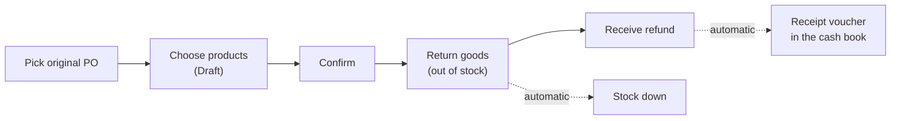

> 🌐 **Language:** [🇻🇳 Tiếng Việt](./in-out-return-order_vi.md) · 🇬🇧 English (current)

# InOut — Part 2: Return orders (returning goods to suppliers)

## Introduction
This document walks through **returning goods** to a supplier in the InOut plugin: pick the original purchase order, choose the products to return, take them out of stock and record the refund. It is for warehouse managers and accountants. After reading it you can process a complete return order and reconcile the refund precisely.

## Return workflow

## Steps

### Step 1 — Create the return order
1. Go to **Orders → [IO] Return Orders** and click **Create Return Order**.
2. **Pick the original purchase order** (one with goods actually received). The system loads the received products with their **qty received**.
3. Enter the **qty to return** per product (fractional allowed, up to 2 decimals).
4. (Optional) Add **costs** incurred by the return (e.g. return shipping), with a category; costs may be negative.
5. Click **Save return order**. The code is generated (`RO-YYYYMMDD-XXXX`).

If it worked, you see the return order detail in **Draft** status with its **reference purchase order**.

> **Never more than received**: the total to return (summed over every non-cancelled return order of the same product) cannot exceed the qty actually received. The system refuses on save.

### Step 2 — Confirm & return the goods
1. Click **Confirm** to move from **Draft** to **Confirmed**.
2. Enter the **qty actually returned** per product and save. Returns may happen in **several batches** — line status: *Pending → Partial → Returned*; the order becomes **Returned** when every line is done.
3. Product stock **goes down** by the returned quantity. Lowering the returned qty **restores** stock accordingly.

### Step 3 — Receive the refund
1. The system computes the **refundable total** = Σ(unit cost × qty returned) + costs.
2. On the order detail, under **Refunds**, click **+ Record**: amount, refund date, method → save. Several instalments are fine; watch **Refundable total / Refunded / Remaining**.
3. Each refund **becomes a receipt voucher** in the cash book and **lowers the debt** you owe that supplier.

> **Never above the refundable total**: refunded so far + new amount cannot exceed the refundable total. If the supplier gives you more than the goods were worth → record a separate **hand receipt** in the cash book (see [Part 3](./in-out-cashflow-and-debt.md)), not on the return order.

## Return order statuses

| Status | Meaning |
|------------|---------|
| Draft | Just created, not confirmed |
| Confirmed | Approved, ready to return |
| Partially returned | Some products returned, not all |
| Returned | Every product returned |
| Cancelled | Return cancelled (only possible while **nothing** was returned) |

## Search & filters
The return order list filters by **return code**, **status**, **reference purchase order** and **creation date range**.

## Conditions & Rules (know before you act)
Every rule below keeps stock and debts accurate:

**Creating a return:**
- **Pick an original purchase order** with goods actually received — Draft/cancelled orders are not listed.
- **At least 1 product**; each line comes from the received products of the original order.
- **Qty to return > 0**, at most 2 decimals.
- **Qty to return (summed over every non-cancelled return of the same product) ≤ qty received** — you cannot return more than you physically have.
- Costs may be negative; same length limits as purchase orders (name ≤ 255, order note ≤ 2000).

**Returning goods:**
- Qty returned **cannot exceed the qty to return** of that line.
- **Stock must be sufficient** to deduct — if it is not (goods already sold) the action is blocked, so stock never goes negative.

**Refunds:**
- Amount **> 0**.
- **Refunded so far + new amount ≤ refundable total** — anything extra goes through a hand receipt.

**Confirm / cancel:**
- Only a **Draft** return can be **confirmed**.
- A return can be **cancelled** only while **nothing** was returned.

**Period closing:** actions on a return inside a closed period (by the **order date**, or the **refund date** when recording/deleting refunds) are blocked.

## Q&A
**Q1: Why can't I pick a purchase order to return from?**

→ Only purchase orders with goods **actually received** (and something left to return) are listed. Draft, cancelled or fully returned orders are not.

**Q2: What does "exceeds received quantity" mean?**

→ The quantity you want to return (plus other open returns of the same product) is more than what was received. Lower the quantity.

**Q3: The supplier refunded more than the goods were worth — where do I record that?**

→ The surplus is *other income*. Create a **hand receipt** (party = that supplier) in the cash book, not on the return order.

**Q4: Does a return deduct stock automatically?**

→ Yes. When you record the qty actually returned, stock goes down immediately. If stock is insufficient the system reports an error.

**Q5: Can I cancel a return that was already carried out?**

→ No. Only returns with **nothing returned** can be cancelled. Otherwise adjust the returned quantity to match reality.

**Q6: Does a refund affect the supplier debt?**

→ Yes. A refund **lowers the debt** you owe that supplier. The formula is in [Part 3](./in-out-cashflow-and-debt.md).

---

◀ [Part 1 — Purchase orders](./in-out-purchase-order.md) · [Index](./in-out.md) · [Part 3 — Cash flow, debts & period closing](./in-out-cashflow-and-debt.md) ▶

---

📅 **Last updated:** 2026-10-03 · ✍️ **Author:** GP247
