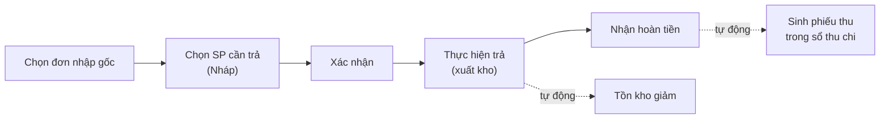

> 🌐 **Ngôn ngữ:** 🇻🇳 Tiếng Việt (hiện tại) · [🇬🇧 English](./in-out-return-order.md)

# InOut — Phần 2: Đơn trả hàng (trả hàng cho nhà cung cấp)

## Giới thiệu
Tài liệu này hướng dẫn nghiệp vụ **trả hàng** cho nhà cung cấp trong plugin InOut: chọn đơn nhập gốc, chọn sản phẩm cần trả, xuất kho và ghi nhận hoàn tiền. Dành cho quản lý kho và kế toán. Đọc xong bạn xử lý được một đơn trả hàng trọn vẹn và đối chiếu hoàn tiền chính xác.

## Quy trình trả hàng

## Các bước thực hiện

### Bước 1 — Tạo đơn trả hàng
1. Vào menu **Đơn hàng → [IO] Đơn Trả Hàng**, nhấn **Tạo Đơn Trả Hàng**.
2. **Chọn đơn nhập hàng gốc** (đơn đã nhận hàng thực tế). Hệ thống nạp danh sách sản phẩm đã nhận kèm **SL đã nhập**.
3. Nhập **SL cần trả** cho từng sản phẩm (hỗ trợ số lẻ, tối đa 2 chữ số thập phân).
4. (Tùy chọn) Thêm **chi phí** phát sinh khi trả hàng (ví dụ phí vận chuyển trả), có phân loại; chi phí chấp nhận số âm.
5. Nhấn **Lưu đơn trả hàng**. Mã đơn trả tự sinh (dạng `RO-YYYYMMDD-XXXX`).

Nếu thành công, bạn thấy trang chi tiết đơn trả ở trạng thái **Nháp**, kèm **đơn nhập tham chiếu**.

> **Không trả vượt số đã nhận**: tổng số cần trả (cộng dồn qua mọi đơn trả chưa hủy của cùng sản phẩm) không được vượt số lượng đã thực nhận. Hệ thống chặn ngay khi lưu.

### Bước 2 — Xác nhận & thực hiện trả hàng
1. Bấm **Xác nhận** để chuyển từ **Nháp** sang **Đã xác nhận**.
2. Nhập **SL thực đã trả** cho từng sản phẩm rồi lưu. Hỗ trợ trả **nhiều đợt** — trạng thái dòng: *Chờ trả → Trả một phần → Đã trả*; đơn chuyển sang **Đã trả đủ** khi mọi dòng xong.
3. Tồn kho sản phẩm **tự giảm** theo số đã trả. Sửa giảm số thực trả thì tồn kho được **hoàn lại** tương ứng.

### Bước 3 — Nhận hoàn tiền
1. Hệ thống tự tính **Tổng tiền cần hoàn** = Σ(đơn giá nhập × số lượng trả) + chi phí.
2. Trong chi tiết đơn, mục **Hoàn Tiền**, bấm **+ Ghi nhận**: số tiền, ngày hoàn, phương thức → lưu. Ghi được nhiều đợt; theo dõi **Tổng tiền cần hoàn / Đã hoàn / Còn lại**.
3. Mỗi khoản hoàn tiền **tự thành một phiếu thu** trong sổ thu chi và **làm giảm công nợ** bạn nợ nhà cung cấp đó.

> **Không hoàn vượt tổng cần hoàn**: tổng đã hoàn + khoản mới không được lớn hơn tổng tiền cần hoàn. Nhà cung cấp bù thêm ngoài giá trị hàng trả → ghi bằng **phiếu thu thủ công** riêng ở sổ thu chi (xem [Phần 3](./in-out-cashflow-and-debt_vi.md)), không nhồi vào đơn trả.

## Trạng thái đơn trả hàng

| Trạng thái | Ý nghĩa |
|------------|---------|
| Nháp | Mới tạo, chưa xác nhận |
| Đã xác nhận | Đã duyệt, sẵn sàng thực hiện trả |
| Trả một phần | Đã trả một số sản phẩm, chưa trả hết |
| Đã trả đủ | Tất cả sản phẩm đã được trả |
| Đã hủy | Đơn trả bị hủy (chỉ hủy được khi **chưa trả** sản phẩm nào) |

## Tìm kiếm & lọc danh sách
Trang danh sách đơn trả lọc được theo **mã đơn trả**, **trạng thái**, **đơn nhập tham chiếu**, và **khoảng ngày tạo**.

## Điều kiện & ràng buộc (hiểu trước khi thao tác)
Mỗi ràng buộc dưới đây đều nhằm giữ tồn kho và công nợ chính xác:

**Khi tạo đơn trả:**
- **Phải chọn đơn nhập gốc** đã nhận hàng thực tế — đơn còn Nháp/đã hủy không hiện ra.
- **Ít nhất 1 sản phẩm**; mỗi dòng chọn từ sản phẩm đã nhận của đơn gốc.
- **Số cần trả > 0**, tối đa 2 chữ số thập phân.
- **Số cần trả (cộng dồn mọi đơn trả chưa hủy của cùng sản phẩm) ≤ số đã thực nhận** — không trả nhiều hơn số hàng thực có.
- Chi phí có thể là số âm; giới hạn ký tự như đơn nhập (tên ≤ 255, ghi chú đơn ≤ 2000).

**Khi thực hiện trả:**
- Số thực trả **không vượt số cần trả** của dòng.
- **Tồn kho phải đủ** để trừ — thiếu kho (hàng đã bán mất) thì thao tác bị chặn, tránh tồn kho âm.

**Khi hoàn tiền:**
- Số tiền **> 0**.
- **Tổng đã hoàn + khoản mới ≤ tổng tiền cần hoàn** — phần bù thêm ghi bằng phiếu thu thủ công.

**Xác nhận / hủy:**
- Chỉ **xác nhận** đơn đang **Nháp**.
- Chỉ **hủy** khi **chưa trả** sản phẩm nào.

**Khóa sổ:** thao tác trên đơn thuộc kỳ đã khóa (xét theo **ngày đơn**, hoặc **ngày hoàn tiền** khi ghi/xóa hoàn tiền) đều bị chặn.

## Hỏi & Đáp (Q&A)
**Câu 1: Vì sao tôi không chọn được đơn nhập để trả?**

→ Chỉ những đơn nhập **đã nhận hàng thực tế** (còn số lượng có thể trả) mới xuất hiện. Đơn còn Nháp, đã hủy, hoặc đã trả hết sẽ không được liệt kê.

**Câu 2: Hệ thống báo "vượt số đã nhận" nghĩa là gì?**

→ Số lượng bạn định trả (cộng cả các đơn trả khác đang mở của cùng sản phẩm) lớn hơn số thực nhận. Giảm số lượng trả cho đúng.

**Câu 3: Nhà cung cấp hoàn cho tôi nhiều hơn giá trị hàng trả thì ghi ở đâu?**

→ Phần dôi ra là *thu nhập khác*. Tạo một **phiếu thu thủ công** (đối tượng = nhà cung cấp đó) trong sổ thu chi, không ghi vào đơn trả.

**Câu 4: Trả hàng có tự trừ tồn kho không?**

→ Có. Khi ghi số lượng thực đã trả, tồn kho giảm ngay. Tồn kho không đủ để trừ thì hệ thống báo lỗi.

**Câu 5: Tôi hủy đơn trả đã thực hiện được không?**

→ Không. Chỉ hủy được khi **chưa trả** sản phẩm nào. Đã trả rồi thì điều chỉnh số thực trả về đúng thực tế.

**Câu 6: Khoản hoàn tiền có ảnh hưởng công nợ nhà cung cấp không?**

→ Có. Hoàn tiền làm **giảm công nợ** bạn nợ nhà cung cấp. Cách tính ở [Phần 3](./in-out-cashflow-and-debt_vi.md).

---

◀ [Phần 1 — Đơn nhập hàng](./in-out-purchase-order_vi.md) · [Mục lục](./in-out_vi.md) · [Phần 3 — Thu chi, công nợ & khóa sổ](./in-out-cashflow-and-debt_vi.md) ▶

---

📅 **Cập nhật lần cuối:** 2026-10-03 · ✍️ **Tác giả (Author):** GP247
