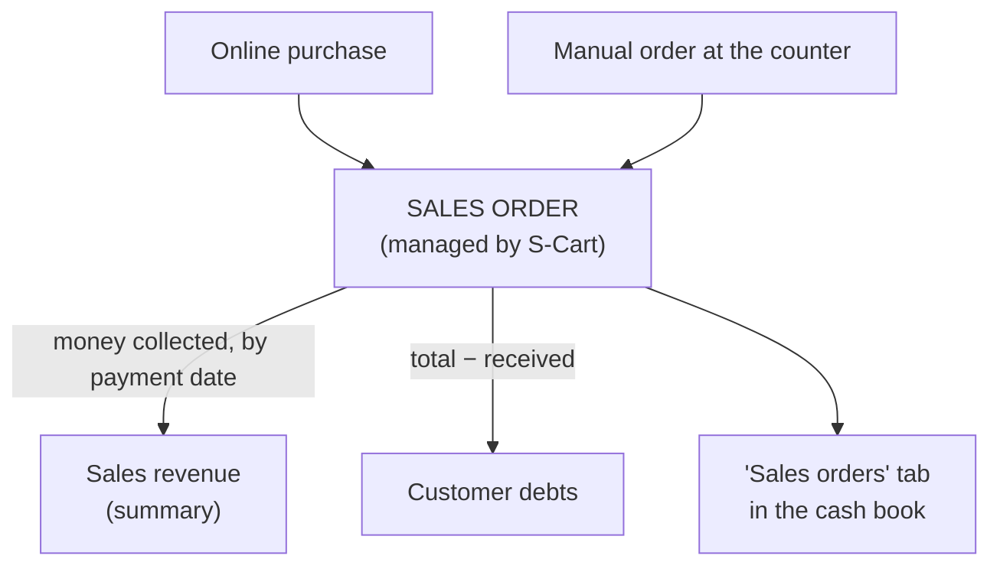

> 🌐 **Language:** [🇻🇳 Tiếng Việt](./in-out-sales-order-integration_vi.md) · 🇬🇧 English (current)

# InOut — Part 4: Sales orders (revenue & customer debts)

## Introduction
This document explains how the InOut plugin **reads S-Cart sales orders** into the cash book — **without** touching the selling process. It is for store owners and accountants who want to know why revenue and customer debts show up in InOut, and on which date those figures are counted. After reading it you know where sales data enters InOut and where to record a customer's payment correctly.

## Where sales orders come from
Sales orders are **created and managed by S-Cart**, not by InOut. There are 2 sources:

| Source | Description |
|-------|-------|
| **Online purchase** | The customer orders on the website |
| **Manual order** | An administrator creates the order in the admin (counter sale, phone order…) |

The order lifecycle, recording customer payments and refunds: see [Order lifecycle](../s-cart/order-processing/order-lifecycle.md).

## What InOut uses sales orders for

InOut **only reads** sales orders, for 3 things:

1. **Sales revenue** — the money customers **actually paid**, counted by **payment date** (not order date). Example: order placed 28 Aug, customer transfers on 2 Sep → that money belongs to September's revenue. Refunds to customers are deducted on the refund date.
2. **Customer debts** — customers with orders **not fully paid** appear under Customer debts. Example: order 5,000,000, customer paid 3,000,000 → 2,000,000 outstanding.
3. **The "Sales orders" tab** — lists orders in the selected date range: code, order total, received, outstanding, payment status.

## Where to record a customer's payment on an order
Money for **one specific order** should be recorded **on that order** — from S-Cart's order screen, or inside InOut: when creating a receipt for a customer, the **For order (optional)** box lists the customer's unpaid orders; pick one and the money is posted to that order's payment ledger, the order debt goes down and revenue updates by itself.

Use a **hand receipt without an order** only for money that **belongs to no order** (a deposit before ordering, an old debt from before the system). If the customer has unpaid orders and you leave the box empty, the system **warns** but does not block — sometimes that is intended.

> Why keep them apart? The summary adds *sales revenue* and *hand receipts* together. Recording one amount in both places **counts the money twice**.

## Who manages stock on sales
Stock on **sales** is handled by **S-Cart automatically** (see [Product stock management](../s-cart/product/product-stock-management.md)). InOut only manages stock **coming in** from and **going back** to suppliers — see [Part 5](./in-out-export-print.md).

## Conditions & Rules (know before you act)
- InOut **only reads** sales orders and **never creates/edits/deletes** them — every input rule on sales orders belongs to **S-Cart**.
- A customer appears under **Customer debts** only with an order **not fully paid** (outstanding > 0).
- **Revenue is money collected, by payment date**, not the order total or order date — so it can differ from the order totals of the same period.
- **Period closing applies to sales order money too**: no payment or refund can be recorded on an order with a date inside a closed period (see [Part 3](./in-out-cashflow-and-debt.md)).
- The "Sales orders" tab and the debts follow the **date range** selected on the Cash Flow screen.

## Q&A
**Q1: Does InOut create sales orders?**

→ No. Sales orders are created by S-Cart (online or manual). InOut only reads them for revenue and debts.

**Q2: Why does revenue in the cash book differ from the period's order totals?**

→ Revenue is **money collected**, by **payment date**. What customers have not paid sits in **debts**; money for last month's order paid this month counts this month.

**Q3: A customer pays off some debt — where do I record it?**

→ On **that order**: from the order screen, or create a receipt in InOut and pick the order under **For order**. To send the customer an online pay link, use **Create collect request** on the customer's debt detail ([Part 3](./in-out-cashflow-and-debt.md)).

**Q4: Does a sale lower stock in InOut?**

→ Stock on sales is deducted by S-Cart. InOut stays out of the selling side; it only adds/removes stock when you receive from or return to suppliers.

**Q5: Where do I see all sales orders of the month?**

→ Go to **[IO] Cash Flow**, pick the date range and open the **Sales orders** tab.

---

◀ [Part 3 — Cash flow, debts & period closing](./in-out-cashflow-and-debt.md) · [Index](./in-out.md) · [Part 5 — Export, printing, stock & history](./in-out-export-print.md) ▶

---

📅 **Last updated:** 2026-10-03 · ✍️ **Author:** GP247
