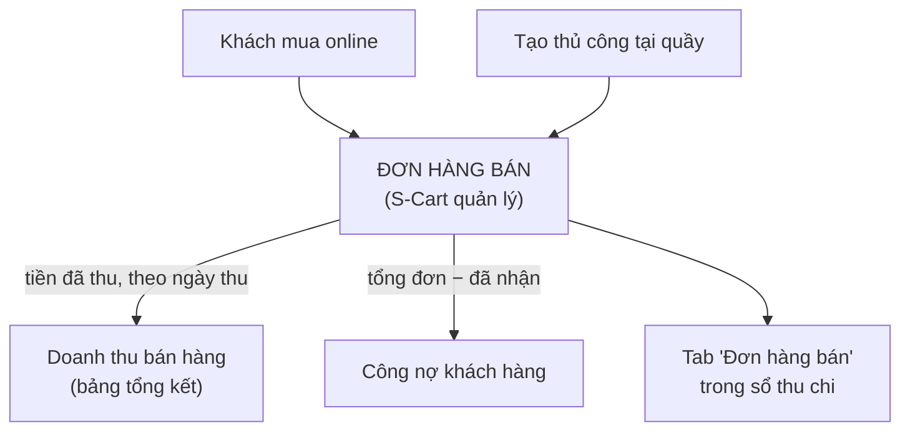

> 🌐 **Ngôn ngữ:** 🇻🇳 Tiếng Việt (hiện tại) · [🇬🇧 English](./in-out-sales-order-integration.md)

# InOut — Phần 4: Đơn hàng bán (doanh thu & công nợ khách)

## Giới thiệu
Tài liệu này giải thích cách plugin InOut **đọc đơn hàng bán** của S-Cart để đưa vào sổ thu chi — mà **không** can thiệp vào quy trình bán hàng. Dành cho chủ cửa hàng và kế toán muốn hiểu vì sao doanh thu và công nợ khách xuất hiện trong InOut, và con số đó được tính theo ngày nào. Đọc xong bạn biết dữ liệu bán hàng chảy vào InOut từ đâu và nên ghi tiền khách trả ở đâu cho đúng.

## Đơn hàng bán đến từ đâu
Đơn hàng bán do **S-Cart tạo và quản lý**, không phải InOut. Có 2 nguồn:

| Nguồn | Mô tả |
|-------|-------|
| **Khách mua online** | Khách đặt hàng trực tiếp trên website |
| **Tạo thủ công** | Quản trị viên tạo đơn trong trang quản trị (bán tại quầy, qua điện thoại…) |

Vòng đời của đơn, cách ghi tiền khách trả và hoàn tiền: xem [Vòng đời đơn hàng](../s-cart/order-processing/order-lifecycle_vi.md).

## InOut dùng đơn hàng bán để làm gì

InOut **chỉ đọc** đơn hàng bán để phục vụ 3 việc:

1. **Tính doanh thu bán hàng** — là **tiền khách đã thực trả**, tính theo **ngày thu tiền** (không phải ngày đặt hàng). Ví dụ: đơn đặt ngày 28/08, khách chuyển khoản ngày 02/09 → khoản đó nằm trong doanh thu tháng 9. Khoản hoàn lại cho khách được trừ đi đúng ngày hoàn.
2. **Theo dõi công nợ khách hàng** — khách có đơn **chưa thanh toán đủ** xuất hiện ở Công nợ khách. Ví dụ: đơn 5.000.000, khách mới trả 3.000.000 → còn nợ 2.000.000.
3. **Hiển thị tab "Đơn hàng bán"** — liệt kê đơn trong khoảng thời gian đã chọn: mã đơn, tổng đơn, đã nhận, còn nợ, trạng thái thanh toán.

## Khách trả tiền đơn hàng, ghi ở đâu
Tiền của **một đơn cụ thể** nên ghi **vào chính đơn đó** — ở màn đơn hàng của S-Cart, hoặc ngay trong InOut: khi tạo phiếu thu cho khách, ô **Thuộc đơn hàng (tùy chọn)** liệt kê các đơn còn nợ của khách; chọn đơn thì khoản tiền được ghi vào sổ thanh toán của đơn, công nợ đơn giảm và doanh thu tự cập nhật.

Chỉ dùng **phiếu thu thủ công không gắn đơn** cho tiền **không thuộc đơn nào** (đặt cọc trước khi đặt hàng, thu nợ cũ từ trước khi dùng hệ thống). Nếu khách đang có đơn còn nợ mà bạn để trống ô này, hệ thống **cảnh báo** nhưng không chặn — vì đôi khi đó là chủ ý.

> Vì sao phải tách? Bảng tổng kết cộng cả *doanh thu bán hàng* lẫn *phiếu thu thủ công*. Ghi một khoản ở cả hai nơi là **đếm trùng** tiền.

## Ai quản lý tồn kho khi bán
Tồn kho khi **bán ra** do **S-Cart xử lý tự động** (xem [Quản lý tồn kho sản phẩm](../s-cart/product/product-stock-management_vi.md)). InOut chỉ quản lý tồn kho chiều **nhập vào** và **trả ra** cho nhà cung cấp — xem [Phần 5](./in-out-export-print_vi.md).

## Điều kiện & ràng buộc (hiểu trước khi thao tác)
- InOut **chỉ đọc** đơn hàng bán, **không tạo/sửa/xóa** — mọi ràng buộc nhập liệu đơn bán do **S-Cart** kiểm soát.
- Một khách chỉ xuất hiện trong **Công nợ khách** khi có đơn **chưa thanh toán đủ** (còn nợ > 0).
- **Doanh thu tính theo tiền đã thu và ngày thu**, không phải tổng giá trị đơn hay ngày đặt — nên con số có thể khác tổng đơn trong cùng kỳ.
- **Khóa sổ áp dụng cho cả tiền của đơn bán**: không ghi nhận/hoàn tiền một đơn với ngày thuộc kỳ đã khóa (xem [Phần 3](./in-out-cashflow-and-debt_vi.md)).
- Tab "Đơn hàng bán" và công nợ hiển thị theo **khoảng thời gian** đang chọn ở màn Quản Lý Thu Chi.

## Hỏi & Đáp (Q&A)
**Câu 1: InOut có tạo đơn hàng bán không?**

→ Không. Đơn hàng bán do S-Cart tạo (online hoặc thủ công). InOut chỉ đọc lại để tính doanh thu và công nợ.

**Câu 2: Vì sao doanh thu trong sổ thu chi khác tổng đơn bán trong kỳ?**

→ Doanh thu là **tiền đã thu** tính theo **ngày thu**. Phần khách chưa trả nằm ở **công nợ**; tiền của đơn tháng trước nhưng thu tháng này thì tính vào tháng này.

**Câu 3: Khách trả thêm tiền nợ thì ghi ở đâu?**

→ Ghi vào **chính đơn đó**: ở màn đơn hàng, hoặc tạo phiếu thu trong InOut và chọn đơn ở ô **Thuộc đơn hàng**. Muốn gửi khách link thanh toán online: dùng **Tạo yêu cầu thu nợ** ở chi tiết công nợ khách ([Phần 3](./in-out-cashflow-and-debt_vi.md)).

**Câu 4: Bán hàng có làm giảm tồn kho trong InOut không?**

→ Tồn kho bán ra do S-Cart trừ tự động. InOut không đụng vào chiều bán; nó chỉ cộng/trừ kho khi bạn nhập hàng/trả hàng nhà cung cấp.

**Câu 5: Tôi muốn xem tất cả đơn bán trong tháng ở đâu?**

→ Vào **[IO] Quản Lý Thu Chi**, chọn khoảng thời gian, mở tab **Đơn hàng bán**.

---

◀ [Phần 3 — Thu chi, công nợ & khóa sổ](./in-out-cashflow-and-debt_vi.md) · [Mục lục](./in-out_vi.md) · [Phần 5 — Xuất file, in ấn, tồn kho & lịch sử](./in-out-export-print_vi.md) ▶

---

📅 **Cập nhật lần cuối:** 2026-10-03 · ✍️ **Tác giả (Author):** GP247
