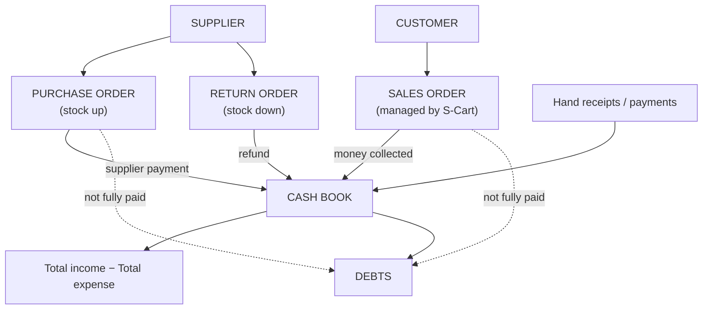

> 🌐 **Language:** [🇻🇳 Tiếng Việt](./in-out_vi.md) · 🇬🇧 English (current)

# InOut — purchases, returns, cash flow & debts in one admin

> 🚀 **InOut plugin (paid):** [https://gp247.net/en/product/plugin-inout-purchase-return.html](https://gp247.net/en/product/plugin-inout-purchase-return.html)

## Introduction
This document introduces **InOut**, the plugin that brings the "back office" of a store — **purchasing from suppliers, returns, the cash book and debts** — into the S-Cart admin, right next to sales orders. It is written for **store owners, warehouse managers and in-house accountants**. After reading this page you know what the plugin does, how money and stock flow through it, what you need to install it, and which part to read next.

This is the **index page** of the InOut documentation set. The five other parts go into each business process.

## Documentation set

| Part | Content | For |
| --- | --- | --- |
| **This page** | What InOut solves, the money & stock picture, requirements, installation, permissions | People evaluating or who just installed the plugin |
| [Part 1 — Purchase orders](./in-out-purchase-order.md) | Create → confirm → receive → pay the supplier; statuses, extra costs, cost price | Warehouse managers, buyers |
| [Part 2 — Return orders](./in-out-return-order.md) | Pick the original purchase order → return → receive the refund; return quantity limits | Warehouse managers, accountants |
| [Part 3 — Cash flow, debts & period closing](./in-out-cashflow-and-debt.md) | Cash book, summary, customer & supplier debts, opening balances, collecting/paying debts through payment requests, period closing | Accountants, business owners |
| [Part 4 — Sales orders](./in-out-sales-order-integration.md) | How revenue and customer debts are taken from S-Cart sales orders | Store owners, accountants |
| [Part 5 — Export, printing, stock & history](./in-out-export-print.md) | Excel/PDF export, document templates with signature boxes, automatic stock, operation history | Accountants, whoever prints documents |

## What InOut solves
S-Cart handles the **selling side** well: orders, customers, money received on an order. But a store also has a **buying side**: ordering from suppliers, receiving goods into stock, returning faulty goods, paying supplier debts, plus the small receipts and payments (electricity, wages, old debts collected). Without a tool these live in spreadsheets, notebooks or memory — stock drifts, debts are forgotten, and at month end nobody knows whether the store really made money.

InOut gathers all of it in **one place, the admin you already use**:

- **Purchasing with a process.** A purchase order goes Draft → Confirmed → Received → Paid; partial receipts and several payments are fine; stock and the average cost price update by themselves when goods are received.
- **Returns tied to the original purchase.** Never return more than was received; a supplier refund becomes a receipt voucher on its own.
- **One cash book for every money flow.** Sales money, supplier payments, refunds, hand receipts and payments — one summary per period.
- **Clear two-way debts.** Which customers owe you, which suppliers you owe, how much — and collect or pay straight away through **payment requests** (online pay link or hand entry).
- **Period closing.** Lock the figures you already reported; nobody can edit a document in a closed period.
- **Printable documents.** Purchase orders, return orders, receipt/payment vouchers and debt reports export to Excel/PDF on templates with signature boxes.

## The money and stock picture



Division of work: **InOut manages goods coming in and going back** (stock up/down, money paid to suppliers, money suppliers refund); **S-Cart manages goods going out** (orders, stock deducted on sale, money customers pay). InOut only **reads** sales orders to compute revenue and customer debts; it never edits them.

## What the plugin does

| Area | Features |
|---|---|
| Purchase orders | Order per supplier; many product lines, fractional quantities, tax rate per line, extra costs (negative for discounts); confirm; receive in several deliveries; pay in several instalments; cancel while nothing received; filter by code, supplier, status, date range |
| Return orders | Created from a received purchase order; cannot return more than received; return in several batches; refunds in several instalments, never above the refundable total; cancel while nothing returned |
| Cash book | Hand receipts/payments per party (customer / supplier / other); a customer receipt can be attached to a sales order so money is never counted twice; period summary with an income/expense breakdown per source; four tabs: hand vouchers, sales orders, purchase orders, return orders |
| Debts | Customers who owe you and suppliers you owe; per-order detail; supplier opening balances; **create a collect / pay-out request** straight from the debt detail screen |
| Period closing | Close up to a date, reopen when needed; every document dated inside a closed period is frozen — including money posted to sales orders |
| Export & print | Excel/PDF for purchase orders, return orders, receipt/payment vouchers, the cash book and debt reports; templates with logo and signature boxes |
| History | Who created, received, paid, cancelled, edited, deleted — with timestamps, visible in each document's detail |
| Currency | Every amount is entered and shown in the store's **base currency** |

## System requirements
- S-Cart **3.x** with `gp247/core` **3.1** or later and `gp247/shop` installed.
- The `barryvdh/laravel-dompdf` package (PDF export) — the installer tells you if it is missing.
- Runs on ordinary shared hosting: **no** cron, queue worker or websocket needed.
- To send online pay links when collecting customer debts: at least one configured payment gateway (see [Payment requests](../s-cart/order-processing/payment-request.md)). Without a gateway, hand entries still work.

## Installation
InOut is a **paid plugin**, downloaded from the GP247 library after purchase on the [product page](https://gp247.net/en/product/plugin-inout-purchase-return.html). It installs like any other plugin — pick **one** of the methods in [Installing Plugins & Templates](../extension/install-extension.md):

1. **From the GP247 library (recommended):** Admin → **Extensions → Plugins** → **Library** tab → find **InOut** → **Install**.
2. **Import a zip file:** **Import file** tab → choose the downloaded zip.
3. **Manual copy:** copy the source into `app/GP247/Plugins/InOut/` and the plugin's `public` folder into `public/GP247/Plugins/InOut/`, then install from the **Stored locally** tab.
4. **Command line** (server where you can run `php artisan`):

   ```bash
   composer require barryvdh/laravel-dompdf
   ```

   ```bash
   php artisan gp247:ext-register-license
   ```

   ```bash
   php artisan gp247:ext-install --type=plugin --key=InOut
   ```

   The first command is only needed when the site lacks the PDF package. The second is done **once per website** to connect to the library; check that `APP_URL` in `.env` is the real domain before running it. To upgrade later: `php artisan gp247:ext-update --type=plugin --key=InOut`.

If it worked, the **Orders** menu in the admin sidebar now shows three items prefixed **[IO]**: **Purchase Orders**, **Return Orders**, **Cash Flow**.

## Permissions for staff
On install the plugin creates the **"Inout Cash"** permission group covering every plugin screen. Go to **Admin → Permissions** and assign this group to the role of your accounting/warehouse staff — they can use InOut without administrator rights. General guide: [Permissions (Permission · Role · User)](../system/permission-and-role.md).

The **Create collect / pay-out request** button on the debt screens additionally needs S-Cart's **Payment requests** permission; without it the button stays hidden.

## Conditions & Rules (know before you act)
- **Uninstalling deletes all InOut data** — purchase orders, return orders, cash entries, closing dates. To pause the plugin, **Disable** it instead of uninstalling; to really remove it, export what you need to Excel first.
- **Money is kept in the store's base currency** — the cash book has one unit so figures add up.
- **With Multi-Store**, InOut data (orders, book, closing dates) belongs to the **store being administered**; each store is a separate book.
- **Period closing goes by the document date**, not the day you click — details in [Part 3](./in-out-cashflow-and-debt.md).

## Q&A
**Q1: Does InOut replace S-Cart's sales orders?**

→ No. Sales orders are still created and handled by S-Cart. InOut only reads them for collected revenue and customer debts, and adds the purchasing, returns and cash flow that S-Cart lacks.

**Q2: Which part should I read first?**

→ [Part 1 — Purchase orders](./in-out-purchase-order.md), then [Part 3 — Cash flow, debts & period closing](./in-out-cashflow-and-debt.md). Those are the two daily processes.

**Q3: Does the plugin deduct stock when I sell?**

→ The selling side is deducted by S-Cart as before. InOut only **adds** stock when goods arrive from a supplier and **removes** it when goods go back to them.

**Q4: Can non-administrator staff use it?**

→ Yes. Assign the **Inout Cash** permission group to their role. To let them create collect/pay-out payment requests, also give them **Payment requests**.

**Q5: I already owed a supplier before installing — where do I record that?**

→ Use **Opening balance** on the Debts screen — see [Part 3](./in-out-cashflow-and-debt.md).

**Q6: Is "Profit" in the summary accounting profit?**

→ No. It is the **cash collected − cash paid** gap for the period, for a quick view. A proper profit and loss statement still needs your accountant.

**Q7: Do I lose data if I disable the plugin?**

→ Disabling keeps everything; enable it again and the data is back. **Uninstalling deletes all of it** — export to Excel first if you need to keep anything.

**Q8: Can I try it before buying?**

→ Public demo: https://demo.s-cart.org

---

<sub>📅 **Last updated:** 2026-10-03 · ✍️ **Author:** GP247</sub>
