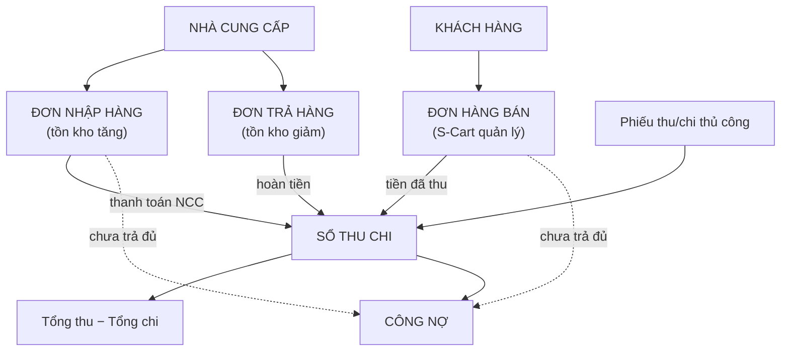

> 🌐 **Ngôn ngữ:** 🇻🇳 Tiếng Việt (hiện tại) · [🇬🇧 English](./in-out.md)

# InOut — Nhập hàng, trả hàng, thu chi & công nợ trong một trang quản trị

> 🚀 **Link plugin InOut (trả phí):** [https://gp247.net/vi/product/plugin-inout-purchase-return.html](https://gp247.net/vi/product/plugin-inout-purchase-return.html)

## Giới thiệu
Tài liệu này giới thiệu **InOut**, plugin đưa phần "hậu trường" của một cửa hàng — **nhập hàng từ nhà cung cấp, trả hàng, sổ thu chi và công nợ** — vào ngay trang quản trị S-Cart, bên cạnh đơn hàng bán. Dành cho **chủ cửa hàng, quản lý kho và kế toán nội bộ**. Đọc xong trang này, bạn biết plugin làm được gì, tiền và tồn kho chảy qua nó thế nào, cần gì để cài, và nên đọc tiếp phần nào.

Đây là **trang mục lục** của bộ tài liệu InOut. Năm phần còn lại đi sâu vào từng nghiệp vụ.

## Mục lục bộ tài liệu

| Phần | Nội dung | Dành cho |
| --- | --- | --- |
| **Trang này** | InOut giải quyết việc gì, bức tranh tiền & tồn kho, yêu cầu hệ thống, cài đặt, phân quyền | Người đang cân nhắc hoặc vừa cài plugin |
| [Phần 1 — Đơn nhập hàng](./in-out-purchase-order_vi.md) | Tạo → xác nhận → nhận hàng → thanh toán nhà cung cấp; trạng thái, chi phí phụ, giá vốn | Quản lý kho, người đặt hàng |
| [Phần 2 — Đơn trả hàng](./in-out-return-order_vi.md) | Chọn đơn nhập gốc → trả hàng → nhận hoàn tiền; giới hạn số lượng trả | Quản lý kho, kế toán |
| [Phần 3 — Thu chi, công nợ & khóa sổ](./in-out-cashflow-and-debt_vi.md) | Sổ thu chi, bảng tổng kết, công nợ khách & nhà cung cấp, số dư đầu kỳ, thu/trả nợ qua yêu cầu thanh toán, khóa sổ | Kế toán, chủ doanh nghiệp |
| [Phần 4 — Đơn hàng bán](./in-out-sales-order-integration_vi.md) | Doanh thu và công nợ khách lấy từ đơn bán của S-Cart như thế nào | Chủ cửa hàng, kế toán |
| [Phần 5 — Xuất file, in ấn, tồn kho & lịch sử](./in-out-export-print_vi.md) | Export Excel/PDF, mẫu chứng từ có chữ ký, tồn kho tự động, lịch sử thao tác | Kế toán, người in chứng từ |

## InOut giải quyết việc gì
S-Cart quản lý tốt **chiều bán ra**: đơn hàng, khách hàng, tiền thu của đơn. Nhưng một cửa hàng còn có **chiều mua vào**: đặt hàng nhà cung cấp, nhận hàng về kho, trả hàng lỗi, thanh toán công nợ, cộng thêm các khoản thu chi lặt vặt (tiền điện, lương, thu nợ cũ). Không có công cụ, các việc này thường nằm rải rác trong Excel, sổ tay hoặc trí nhớ — tồn kho lệch, công nợ quên, cuối tháng không biết mình thực lãi hay lỗ.

InOut gom tất cả về **một chỗ, cùng trang quản trị bạn đang dùng**:

- **Nhập hàng có quy trình.** Đơn nhập đi qua Nháp → Xác nhận → Nhận hàng → Thanh toán; nhận một phần, trả nhiều đợt đều được; tồn kho và giá vốn trung bình tự cập nhật lúc nhận hàng.
- **Trả hàng gắn với đơn nhập gốc.** Không trả vượt số đã nhận; hoàn tiền từ nhà cung cấp tự thành phiếu thu.
- **Một sổ thu chi cho mọi dòng tiền.** Tiền bán hàng, thanh toán nhà cung cấp, hoàn tiền, phiếu thu/chi thủ công — cùng nằm trong một bảng tổng kết theo kỳ.
- **Công nợ hai chiều rõ ràng.** Khách nào còn nợ bạn, bạn còn nợ nhà cung cấp nào, bao nhiêu — và thu/trả ngay qua **yêu cầu thanh toán** (link thanh toán online hoặc ghi nhận tay).
- **Khóa sổ theo kỳ.** Chốt số liệu đã báo cáo, không ai sửa được chứng từ của kỳ đã khóa.
- **Chứng từ in được.** Đơn nhập, đơn trả, phiếu thu/chi, báo cáo công nợ xuất Excel/PDF theo mẫu có ô chữ ký.

## Bức tranh tiền và tồn kho



Nguyên tắc phân công: **InOut quản lý chiều nhập vào và trả ra** (tồn kho tăng/giảm, tiền trả nhà cung cấp, tiền nhà cung cấp hoàn); **S-Cart quản lý chiều bán ra** (đơn hàng, trừ kho khi bán, tiền khách trả). InOut chỉ **đọc** đơn hàng bán để tính doanh thu và công nợ khách, không sửa đơn bán.

## Plugin làm được gì

| Nhóm | Chức năng |
|---|---|
| Đơn nhập hàng | Tạo đơn theo nhà cung cấp; nhiều dòng sản phẩm, số lượng lẻ, thuế suất từng dòng, chi phí phụ (kể cả chiết khấu âm); xác nhận; nhận hàng nhiều đợt; thanh toán nhiều đợt; hủy đơn chưa nhận; lọc theo mã, nhà cung cấp, trạng thái, khoảng ngày |
| Đơn trả hàng | Tạo từ đơn nhập đã nhận; chặn trả vượt số nhận; trả nhiều đợt; hoàn tiền nhiều đợt, chặn hoàn vượt; hủy đơn chưa trả |
| Sổ thu chi | Phiếu thu/chi thủ công theo đối tượng (khách / nhà cung cấp / khác); phiếu thu của khách gắn được vào đơn bán để không đếm trùng; bảng tổng kết theo kỳ với phân tích thu/chi từng nguồn; bốn tab: phiếu thủ công, đơn hàng bán, đơn nhập, đơn trả |
| Công nợ | Danh sách khách còn nợ và nhà cung cấp bạn còn nợ; chi tiết từng đơn; số dư đầu kỳ nhà cung cấp; **tạo yêu cầu thu nợ / trả nợ** thẳng từ màn chi tiết công nợ |
| Khóa sổ | Khóa đến một ngày, mở lại khi cần; mọi chứng từ có ngày trong kỳ đã khóa đều không sửa được — kể cả tiền ghi vào đơn hàng bán |
| Xuất & in | Excel/PDF cho đơn nhập, đơn trả, phiếu thu/chi, sổ thu chi, báo cáo công nợ; mẫu có logo và ô chữ ký |
| Lịch sử | Ai tạo, nhận, thanh toán, hủy, sửa, xóa — kèm thời điểm, xem ngay trong chi tiết từng chứng từ |
| Tiền tệ | Mọi số tiền nhập và hiển thị theo **đồng tiền cơ sở** của cửa hàng |

## Yêu cầu hệ thống
- S-Cart **3.x** với `gp247/core` **3.1** trở lên và `gp247/shop` đã cài.
- Gói `barryvdh/laravel-dompdf` (dùng để xuất PDF) — trình cài sẽ báo nếu thiếu.
- Chạy được trên hosting chia sẻ thông thường: **không cần** cron, queue worker hay websocket.
- Để dùng link thanh toán online khi thu nợ khách: cần ít nhất một cổng thanh toán đã cấu hình (xem [Yêu cầu thanh toán](../s-cart/order-processing/payment-request_vi.md)). Không có cổng thì vẫn ghi nhận tay được.

## Cài đặt
InOut là **plugin trả phí**, lấy từ thư viện GP247 sau khi mua tại [trang sản phẩm](https://gp247.net/vi/product/plugin-inout-purchase-return.html). Cài như mọi plugin khác — chọn **một** trong các cách ở [Cài đặt Plugin & Template](../extension/install-extension_vi.md):

1. **Từ thư viện GP247 (khuyến nghị):** Quản trị → **Phần mở rộng → Tiện ích** → tab **Thư viện** → tìm **InOut** → **Cài đặt**.
2. **Nhập file zip:** tab **Nhập file** → chọn file zip đã tải về.
3. **Chép tay:** chép mã nguồn vào `app/GP247/Plugins/InOut/` và thư mục `public` của plugin vào `public/GP247/Plugins/InOut/`, rồi cài ở tab **Đã lưu trên máy**.
4. **Dòng lệnh** (máy chủ có quyền chạy `php artisan`):

   ```bash
   composer require barryvdh/laravel-dompdf
   ```

   ```bash
   php artisan gp247:ext-register-license
   ```

   ```bash
   php artisan gp247:ext-install --type=plugin --key=InOut
   ```

   Lệnh đầu chỉ cần khi website chưa có gói xuất PDF. Lệnh thứ hai làm **một lần cho mỗi website** để kết nối thư viện; kiểm tra `APP_URL` trong `.env` là tên miền thật trước khi chạy. Lên bản mới sau này: `php artisan gp247:ext-update --type=plugin --key=InOut`.

Nếu thành công, bạn thấy trong menu **Đơn hàng** ở thanh bên admin xuất hiện ba mục có tiền tố **[IO]**: **Đơn Nhập Hàng**, **Đơn Trả Hàng**, **Quản Lý Thu Chi**.

## Phân quyền cho nhân viên
Khi cài, plugin tự tạo nhóm quyền **"Inout Cash"** gồm đủ quyền cho mọi màn của plugin. Vào **Quản trị → Phân quyền**, gán nhóm này cho vai trò của nhân viên kế toán/kho — họ dùng được InOut mà không cần quyền quản trị viên. Cách phân quyền chung: [Phân quyền (Quyền · Vai trò · Người dùng)](../system/permission-and-role_vi.md).

Riêng nút **Tạo yêu cầu thu nợ / trả nợ** ở màn công nợ cần thêm quyền **Yêu cầu thanh toán** của S-Cart; thiếu quyền đó thì nút không hiện.

## Điều kiện & ràng buộc (hiểu trước khi thao tác)
- **Gỡ cài đặt (Uninstall) xóa toàn bộ dữ liệu InOut** — đơn nhập, đơn trả, phiếu thu chi, mốc khóa sổ. Muốn tạm ngưng dùng, hãy **Tắt** (Disable) plugin thay vì gỡ; muốn gỡ thật, xuất Excel những gì cần giữ trước.
- **Tiền ghi theo đồng tiền cơ sở** của cửa hàng — sổ thu chi chỉ có một đơn vị tiền để các con số cộng được với nhau.
- **Nếu dùng Multi-Store**, số liệu InOut (đơn, sổ, mốc khóa sổ) ghi theo **cửa hàng đang quản trị**; mỗi cửa hàng là một sổ riêng.
- **Khóa sổ xét theo ngày chứng từ**, không theo ngày bạn bấm — chi tiết ở [Phần 3](./in-out-cashflow-and-debt_vi.md).

## Hỏi & Đáp (Q&A)
**Câu 1: InOut có thay phần đơn hàng bán của S-Cart không?**

→ Không. Đơn hàng bán vẫn do S-Cart tạo và xử lý. InOut chỉ đọc chúng để tính doanh thu đã thu và công nợ khách, rồi thêm phần nhập hàng, trả hàng, thu chi mà S-Cart chưa có.

**Câu 2: Tôi nên đọc phần nào trước?**

→ [Phần 1 — Đơn nhập hàng](./in-out-purchase-order_vi.md) rồi [Phần 3 — Thu chi, công nợ & khóa sổ](./in-out-cashflow-and-debt_vi.md). Đây là hai nghiệp vụ dùng hằng ngày.

**Câu 3: Plugin có tự trừ kho khi bán hàng không?**

→ Chiều bán ra do S-Cart trừ kho như trước. InOut chỉ **cộng** kho khi nhận hàng từ nhà cung cấp và **trừ** kho khi trả hàng cho họ.

**Câu 4: Nhân viên không phải quản trị viên có dùng được không?**

→ Được. Gán nhóm quyền **Inout Cash** cho vai trò của họ là đủ. Muốn họ tạo được yêu cầu thanh toán thu/trả nợ thì gán thêm quyền **Yêu cầu thanh toán**.

**Câu 5: Tôi đã có công nợ cũ với nhà cung cấp trước khi cài, ghi vào đâu?**

→ Dùng **Số dư đầu kỳ** ở màn Công nợ — xem [Phần 3](./in-out-cashflow-and-debt_vi.md).

**Câu 6: "Lợi nhuận" trong bảng tổng kết có phải lãi kế toán không?**

→ Không. Đó là **chênh lệch tiền thực thu − thực chi** trong kỳ, để theo dõi nhanh. Báo cáo kết quả kinh doanh chuẩn vẫn cần kế toán lập.

**Câu 7: Tắt plugin có mất dữ liệu không?**

→ Tắt (Disable) thì không, bật lại là dữ liệu còn nguyên. **Gỡ cài đặt (Uninstall) thì mất toàn bộ** — hãy xuất Excel trước nếu cần giữ.

**Câu 8: Muốn xem thử trước khi mua?**

→ Trang demo công khai: https://demo.s-cart.org

---

<sub>📅 **Cập nhật lần cuối:** 2026-10-03 · ✍️ **Tác giả (Author):** GP247</sub>
