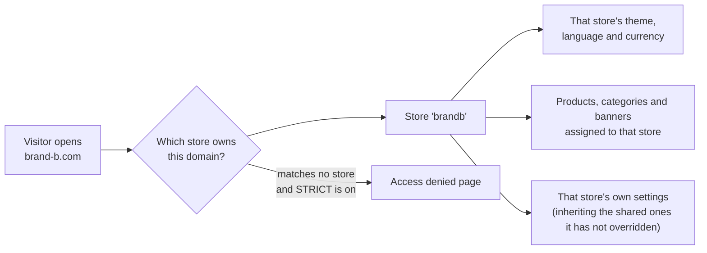
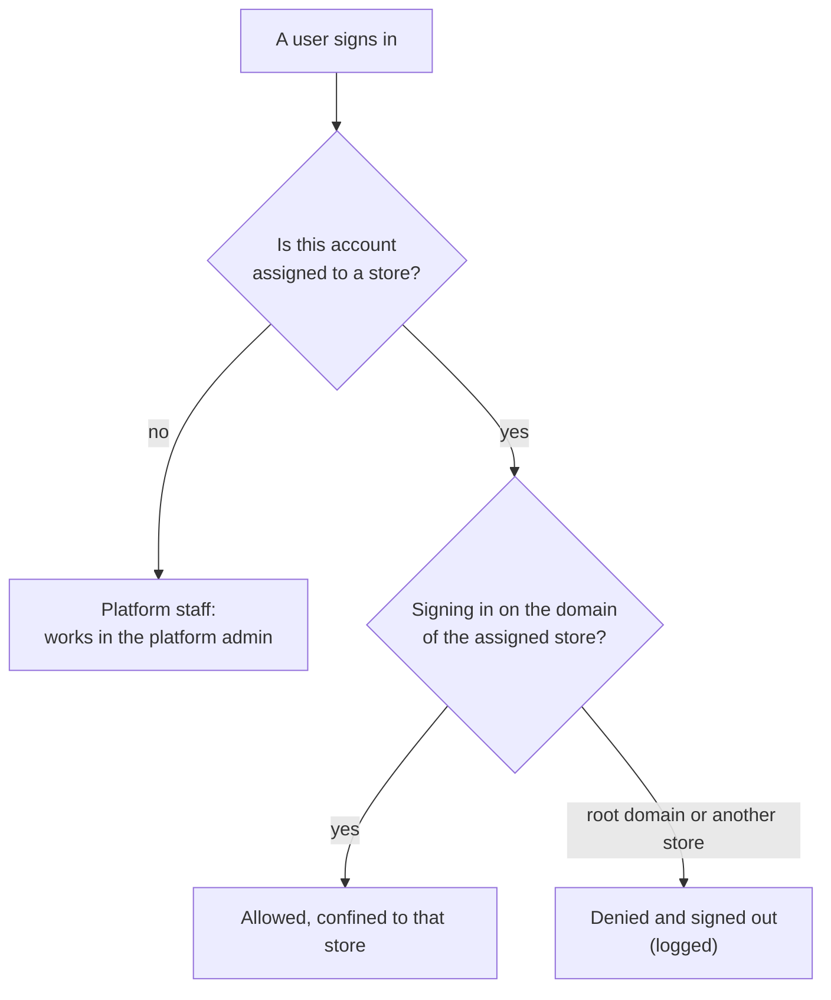

> 🌐 **Language:** [🇻🇳 Tiếng Việt](./multi-store-operations_vi.md) · 🇬🇧 English (current)

# Multi-Store — Part 2: Running several stores

## Introduction
This document describes **running a multi-store system in practice**: which data belongs to one store and which is shared, how configuration is tiered, how to hand a store to its own administrator, how to push root products into several stores, how to read system-wide reports, and how to lock or delete a store. It is written for the platform owner and operations staff. After reading it you will know which store each action affects and what the system will refuse to do. Installation is covered separately in [Part 1 — Setup](./multi-store-setup.md).

Features marked **(Pro)** require the Pro edition installed alongside the free one.

## How the system knows which store to serve
Everything starts from the **domain of the request**:

An order placed on a given domain is recorded against that store, so revenue is separated from the moment it happens.

## What is per-store and what is shared
This is the most important thing to understand before you operate.

| Data | How it behaves |
| --- | --- |
| **Products, categories** | One record can **belong to several stores** — you choose the stores when creating or editing it. Removing it from one store does not delete the product. |
| **Banners, content pages, link groups** | Assigned per store, exactly like products. |
| **Layout blocks** | **Exclusive to one store** — each store arranges its own home page. |
| **Orders** | Recorded against the store they were placed on; they never move between stores. |
| **Customers, newsletter subscribers** | Belong to the store where they signed up. |
| **Suppliers, brands, attributes, taxes** | Master data used by products, managed in the admin and applied within their respective scope. |
| **Abandoned carts, SEO redirects** | Exclusive to one store. |

When you are a platform administrator and open a screen holding per-store data, the interface offers a **store selector** to filter or assign. It only appears for platform administrators; a store administrator (Pro) never sees it, because they already work inside a single store.

## Tiered configuration
Not every setting is split per store — splitting everything would force you to re-enter the same values for each store. The system uses three tiers:

| Tier | What it means | Examples |
| --- | --- | --- |
| **System-wide** | A single value, changeable only by a platform administrator | The system's mail mode, the mail queue, catalogue structure settings |
| **Inherit + override** | The root store holds the shared value; each store sets its own only when it needs to, otherwise it uses the shared one | General information, mail/SMTP settings, customer settings, order settings |
| **Per store** | Each store has its own independent value | Theme, language, currency, contact details, logo, maintenance page, banners, layout blocks |

Where to set it: **Multi-store → Store list → Configure** on a given store. That screen gathers everything about that store in one place, including the shared-settings tabs and the selling-settings tabs as they apply to that store.

**A store's configuration covers:**
- Store details: name, description and SEO keywords per language; logo, favicon, social share image.
- Contact: phone, hotline, email, opening hours, address, office, warehouse.
- Domain, language, currency, **theme (template)**.
- **Maintenance page** content per language.
- The store's mail settings and which automatic emails are on.
- Selling settings for that store: customers, orders, display, captcha.

> ⚠️ **Changing a store's theme is a heavy operation**: the system removes the old theme's data for that store and builds the new theme's data. Concretely, **that store's layout-block arrangement is lost and must be redone** for the new theme. Products, orders and customers are unaffected.

### Plugins per store
Some plugins (payment, shipping, promotions, news, product reviews…) declare that they operate **per store**. For those, you enable/disable and configure them **separately for each store** right in the plugin management screen — for example the retail store accepts online payment while the wholesale store only allows bank transfer.

## A dedicated administrator per store (Pro)
This is the feature that matters once you no longer run every store personally.

**How to hand a store to someone** — open the **Store administrators** screen (platform administrators only):

1. Pick the **user** to assign (not a platform administrator account).
2. Pick the **store** (the root store cannot be assigned).
3. Pick a **role** — two presets ship with the plugin:
   - **Store Admin**: the store's full business scope, including its configuration and reports.
   - **Store Member**: day-to-day operations — products, orders, customers, content.

   You may create and pick your own role instead.
4. Click **Assign**. Remove it later with **Revoke**.

**Once assigned, that person:**
- signs in **on their own store's domain**, not the root domain;
- sees only that store's data;
- **cannot reach the platform admin**, even by typing the address directly.

**The boundary is held by the system, not by your permission settings.** Whatever role or permissions they are granted, a store administrator is **always blocked** from system-level actions: installing/removing plugins and themes, managing users, roles and permissions, system-wide configuration, and managing the store list itself. They can still edit **their own store's** configuration and website information (except the domain field, which stays with the platform owner).

One account **cannot be both platform staff and a store administrator**. If you need both roles, use two accounts.

## Cross-store product publishing (Pro)
When several stores sell the same item but need different prices, stock and wording, you do not have to re-enter anything.

**How it works** — open **Cross-store product publishing**: pick the root product, pick the target store, pick the target category, then click **Publish**.

The target store receives **its own independent copy of the product**, and the system **keeps a link** back to the root product. Later, when the root content changes, click **Re-sync** to update the content without touching what the store set for itself.

**Three things to remember:**
- **Single products only** — bundles and grouped products are not supported.
- **The published copy starts as a draft with a price of 0** — you must set a price before putting it on sale. That is deliberate, so nothing ever goes live at zero because somebody forgot.
- **The store's price and stock are always preserved on re-sync** — only content (name, description, and images if you chose them) is synchronised.

Each root product has **one copy per store**: publishing again returns the existing copy instead of creating a duplicate.

## System-wide reports (Pro)

**Unified dashboard** — one screen comparing your stores over the period you choose (this month / last 30 days / this year / all time): revenue, order count and **average order value** per store, with Excel export. Revenue uses the same semantics as the rest of the shop — cancelled and failed orders excluded, amounts normalised to one currency by each order's exchange rate.

**Product revenue report** — ranks root products by **combined total revenue**: revenue at the root store **plus** the revenue of every copy published into other stores. Each root product expands into rows for its store copies, each with that copy's own revenue. This tells you how much an item really sells across the whole system, not just on one website.

Both screens are for **platform administrators**; a store administrator cannot open them.

## Locking and deleting stores

### Locking a store (Pro)
Locking **suspends** a store while keeping all of its data: its domain no longer opens the website, but products, orders and customers stay untouched and you can unlock at any time.

- The control sits in the **Store list**, in the **Lock** column.
- **Only platform administrators** can lock or unlock.
- **The root store cannot be locked** — it is the foundation of the whole system and locking it would take everything down.
- Without the Pro edition the column is disabled with a Pro note.

### Deleting a store
Deletion **cannot be undone**, so the system puts two layers of protection in the way:

**Deletion is refused** while the store still has:
- **orders** — financial history must not vanish on a single click;
- **customers** — real people's accounts;
- **suppliers** — master data that shared products still reference.

The error message states how many records of each kind remain. You must move or remove them first.

**When deletion does go ahead**, the cleanup runs in a single transaction:
- Products, categories, banners and content pages are **not deleted** — they may belong to several stores, so only their **link** to this store is removed.
- What the store exclusively owned **is deleted**: layout blocks, newsletter subscribers, SEO redirects, abandoned carts, and the store's own descriptions and settings.

**Always refused**: deleting the **root store**, and deleting **the store you are currently inside**.

## Conditions & Rules (know before you act)

**When creating and editing stores**
- **Code and domain are unique** — the system identifies a store by its domain, so two stores cannot share one.
- **Language, currency, theme and title are required**.
- **The free edition allows 3 stores including the root store** — checked on the server, not just hidden in the UI.
- **Changing the theme destroys that store's old theme data** — it requires confirmation, and the layout-block arrangement must be redone.

**When assigning store administrators (Pro)**
- **The root store is never assigned to anyone** — it belongs to the platform owner.
- **A store is never assigned to a platform administrator account** — the two roles are exclusive; use two accounts if you need both.
- **A store administrator can only sign in on their own store's domain** — the root domain or another store means denial and sign-out, with the attempt logged.
- **System-level actions are always blocked** regardless of granted permissions — installing/removing plugins and themes, users/roles/permissions, system-wide configuration, managing the store list.
- **They can only open their own store's configuration** — typing another store's configuration address directly is still refused.

**When publishing products across stores (Pro)**
- **The source must be a root-store product** — you cannot publish sideways from one store to another.
- **Single products only** — bundles and grouped products are not supported.
- **The published copy always starts as a draft with price 0** — set the price and enable it before it goes live.
- **Price, stock and store-owned master data (brand, supplier, tax) are never overwritten on re-sync**.
- **One copy per root product per store** — publishing again returns the existing copy.

**When locking a store (Pro)**
- **The root store cannot be locked**.
- **Only platform administrators** may lock or unlock.
- **A locked store stops serving its domain** — the data is intact and unlocking brings it straight back.

**When deleting a store**
- **The root store cannot be deleted, nor can the store you are currently inside**.
- **Remaining orders, customers or suppliers block deletion** — deal with them first.
- **Products/categories/banners/pages are not deleted**, they only lose their link to the store.
- **The store's layout blocks, subscribers, SEO redirects and abandoned carts are deleted for good** — there is no recovery.

**When using strict domain checking (STRICT)**
- **Turning STRICT on with a domain undeclared** means that domain is refused — declare them all first.
- **The root domain in `.env` is always accepted** — so you cannot lock yourself out of the system.

## Q&A
**Q1: Two stores sell the same product — how does stock work?**

→ Two ways. Assign **the same product** to both stores and they share one stock level and one price. Use **cross-store publishing** (Pro) and each store gets its own copy with independent price and stock.

**Q2: Can a customer who registered on store A sign in on store B?**

→ A customer account belongs to the store where they registered. Treat each store as a separate website from the customer's point of view.

**Q3: If I change the mail settings on the root store, do the other stores follow?**

→ Yes, for stores that have not set their own — they inherit the shared value. A store that set its own value keeps it.

**Q4: What happens if I turn off the system's mail mode?**

→ No store can send email, because that setting is system-wide. It lives on the root store and only a platform administrator can change it.

**Q5: Can a store administrator install plugins for their own store?**

→ No. Installing and removing plugins and themes is a system-level action and is always blocked for them. You install it in the platform admin and enable it for the relevant store.

**Q6: How do I see which store performs best?**

→ Use the **unified dashboard** (Pro): revenue, order count and average order value per store over the same period, with Excel export.

**Q7: My product sells in 3 stores — how do I see its real total revenue?**

→ Use the **product revenue report** (Pro): it adds the root product's revenue to that of every store copy, and lets you inspect each copy.

**Q8: I deleted a store by mistake — can I recover it?**

→ No. That is why the system refuses deletion while orders, customers or suppliers remain. If you only want to pause a store, **lock** it (Pro) instead of deleting it.

**Q9: Can orders from different stores get mixed up?**

→ No. Each order records the store it was placed on; the admin order list filters by store, and a store administrator only ever sees their own store's orders.

---

⬅️ [Part 1 — Setup](./multi-store-setup.md) · [Index](./multi-store.md) · [Part 3 — Customization](./multi-store-customize.md) ➡️

---

📅 **Last updated:** 2026-09-21 · ✍️ **Author:** GP247
