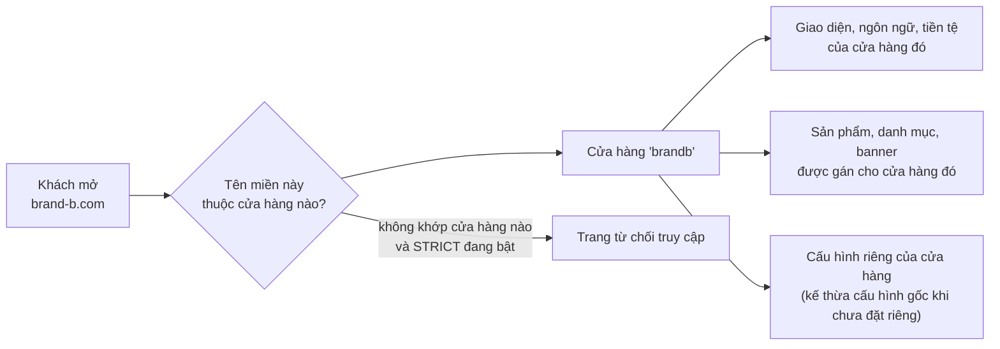
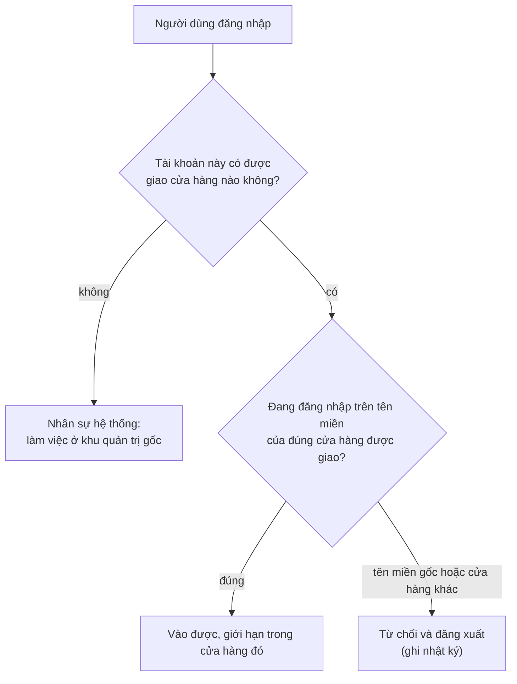

> 🌐 **Ngôn ngữ:** 🇻🇳 Tiếng Việt (hiện tại) · [🇬🇧 English](./multi-store-operations.md)

# Multi-Store — Phần 2: Vận hành nhiều cửa hàng

## Giới thiệu
Tài liệu này mô tả **vận hành một hệ thống nhiều cửa hàng trong thực tế**: dữ liệu nào riêng của từng cửa hàng và dữ liệu nào dùng chung, cấu hình phân tầng ra sao, cách giao một cửa hàng cho người quản trị riêng, cách đưa sản phẩm gốc sang nhiều cửa hàng, xem báo cáo tổng hợp, khóa và xóa cửa hàng. Dành cho chủ hệ thống và nhân sự vận hành. Đọc xong, bạn biết mỗi thao tác ảnh hưởng tới cửa hàng nào và những gì hệ thống sẽ chặn. Phần cài đặt xem riêng ở [Phần 1 — Cài đặt](./multi-store-setup_vi.md).

Tính năng ghi **(Pro)** cần cài thêm bản Pro bên cạnh bản miễn phí.

## Hệ thống nhận ra cửa hàng bằng cách nào
Mọi thứ bắt đầu từ **tên miền của request**:

Đơn hàng khách đặt trên tên miền nào sẽ được ghi nhận thuộc cửa hàng đó, nên doanh thu tách bạch được ngay từ lúc phát sinh.

## Dữ liệu nào riêng, dữ liệu nào chung
Đây là điều quan trọng nhất cần nắm trước khi vận hành.

| Loại dữ liệu | Cách hoạt động |
| --- | --- |
| **Sản phẩm, danh mục** | Một bản ghi có thể **thuộc nhiều cửa hàng** — bạn chọn cửa hàng khi tạo/sửa. Gỡ khỏi một cửa hàng không xóa sản phẩm. |
| **Banner, trang nội dung, nhóm liên kết** | Gán theo cửa hàng, cùng cơ chế như sản phẩm. |
| **Khối bố cục (layout block)** | **Riêng hẳn** của từng cửa hàng — mỗi cửa hàng tự sắp xếp trang chủ của mình. |
| **Đơn hàng** | Ghi nhận theo cửa hàng phát sinh đơn; không di chuyển giữa các cửa hàng. |
| **Khách hàng, người đăng ký nhận tin** | Thuộc cửa hàng nơi họ đăng ký. |
| **Nhà cung cấp, thương hiệu, thuộc tính, thuế** | Dữ liệu nền dùng cho sản phẩm, quản lý ở admin và gán theo phạm vi tương ứng. |
| **Giỏ hàng bỏ quên, chuyển hướng SEO** | Riêng của từng cửa hàng. |

Khi bạn là quản trị viên gốc và mở một màn có dữ liệu theo cửa hàng, giao diện có **ô chọn cửa hàng** để lọc hoặc gán. Ô này chỉ hiện với quản trị viên của hệ thống gốc; quản trị viên một cửa hàng (Pro) không thấy nó vì họ vốn chỉ làm việc trong cửa hàng mình.

## Cấu hình phân tầng
Không phải cấu hình nào cũng tách theo cửa hàng — tách hết sẽ khiến bạn phải khai lại mọi thứ cho từng cửa hàng. Hệ thống chia ba tầng:

| Tầng | Nghĩa là gì | Ví dụ |
| --- | --- | --- |
| **Toàn hệ thống** | Một giá trị duy nhất, chỉ quản trị viên gốc đổi được | Chế độ gửi email của hệ thống, hàng đợi email, cấu hình danh mục sản phẩm (cấu trúc catalog) |
| **Kế thừa + ghi đè** | Cửa hàng gốc giữ giá trị nền; mỗi cửa hàng đặt riêng khi cần, không đặt thì dùng giá trị nền | Thông tin chung, cấu hình email/SMTP, cấu hình khách hàng, cấu hình đơn hàng |
| **Riêng từng cửa hàng** | Mỗi cửa hàng một giá trị độc lập | Giao diện, ngôn ngữ, tiền tệ, thông tin liên hệ, logo, trang bảo trì, banner, khối bố cục |

Nơi đặt: **Multi-store → Danh sách cửa hàng → Cấu hình** của một cửa hàng. Màn này gom mọi cấu hình của cửa hàng đó về một chỗ, gồm cả các tab cấu hình chung và cấu hình bán hàng áp cho chính cửa hàng đó.

**Cấu hình một cửa hàng gồm:**
- Thông tin cửa hàng: tên, mô tả, từ khóa SEO theo từng ngôn ngữ; logo, biểu tượng, ảnh chia sẻ mạng xã hội.
- Liên hệ: điện thoại, đường dây nóng, email, giờ làm việc, địa chỉ, văn phòng, kho.
- Tên miền, ngôn ngữ, tiền tệ, **giao diện (template)**.
- Nội dung **trang bảo trì** theo từng ngôn ngữ.
- Cấu hình email của cửa hàng và các loại email tự động được bật/tắt.
- Cấu hình bán hàng áp cho cửa hàng: khách hàng, đơn hàng, hiển thị, captcha.

> ⚠️ **Đổi giao diện của một cửa hàng là thao tác nặng**: hệ thống gỡ dữ liệu giao diện cũ và dựng dữ liệu của giao diện mới cho cửa hàng đó, nên phải xác nhận trước khi chạy. Sắp xếp khối bố cục riêng của cửa hàng sẽ phải làm lại theo giao diện mới.

### Plugin theo cửa hàng
Một số plugin (thanh toán, vận chuyển, khuyến mãi, tin tức, đánh giá sản phẩm…) khai báo rằng chúng hoạt động **theo phạm vi cửa hàng**. Với những plugin đó, bạn bật/tắt và cấu hình **riêng cho từng cửa hàng** ngay trong màn quản lý plugin — ví dụ cửa hàng bán lẻ nhận thanh toán online, còn cửa hàng bán sỉ chỉ cho chuyển khoản.

## Quản trị viên riêng cho từng cửa hàng (Pro)
Đây là tính năng làm nên khác biệt khi bạn không tự tay quản lý mọi cửa hàng.

**Cách giao một cửa hàng cho một người** — vào màn **Quản trị viên cửa hàng** (chỉ quản trị viên hệ thống vào được):

1. Chọn **người dùng** cần giao (không phải tài khoản quản trị viên hệ thống).
2. Chọn **cửa hàng** cần giao (không chọn được cửa hàng gốc).
3. Chọn **vai trò** — có sẵn hai vai trò mẫu:
   - **Store Admin**: toàn bộ nghiệp vụ của cửa hàng, gồm cấu hình và báo cáo của cửa hàng đó.
   - **Store Member**: vận hành hằng ngày — sản phẩm, đơn hàng, khách hàng, nội dung.

   Bạn vẫn có thể tạo và chọn vai trò khác.
4. Bấm **Giao quyền**. Gỡ quyền bằng nút **Thu hồi**.

**Sau khi được giao, người đó:**
- đăng nhập **trên tên miền của cửa hàng mình**, không phải tên miền gốc;
- chỉ thấy dữ liệu của cửa hàng đó;
- **không vào được khu quản trị gốc**, kể cả khi gõ thẳng địa chỉ.

**Ranh giới do hệ thống giữ, không phụ thuộc cách bạn phân quyền.** Dù được cấp vai trò hay quyền gì, quản trị viên cửa hàng vẫn **luôn bị chặn** các thao tác cấp hệ thống: cài/gỡ plugin và giao diện, quản lý người dùng — vai trò — quyền hạn, cấu hình toàn hệ thống, và quản lý danh sách cửa hàng. Họ vẫn sửa được cấu hình **của chính cửa hàng mình** và thông tin website của cửa hàng đó (trừ ô tên miền — thuộc chủ hệ thống).

Một tài khoản **không thể vừa là nhân sự hệ thống gốc vừa là quản trị viên cửa hàng**. Cần cả hai vai thì dùng hai tài khoản riêng.

## Đồng bộ sản phẩm sang cửa hàng (Pro)
Khi nhiều cửa hàng bán cùng một mặt hàng nhưng cần giá, tồn kho và mô tả khác nhau, bạn không phải nhập lại từ đầu.

**Cách làm** — vào màn **Đồng bộ sản phẩm sang cửa hàng**: chọn sản phẩm gốc, chọn cửa hàng đích, chọn danh mục đích, rồi bấm **Đăng**.

Kết quả: cửa hàng đích nhận **một bản sản phẩm độc lập của riêng nó**, đồng thời hệ thống **giữ liên kết** về sản phẩm gốc. Về sau khi nội dung gốc thay đổi, bạn bấm **Đồng bộ lại** để cập nhật phần nội dung mà không đụng tới những gì cửa hàng đã tự đặt.

**Ba điều cần nhớ:**
- **Chỉ áp dụng cho sản phẩm đơn** — sản phẩm gói (bundle) và sản phẩm nhóm chưa hỗ trợ.
- **Bản đăng sang mặc định ở trạng thái nháp và giá 0** — bạn phải đặt giá rồi mới bật bán. Đây là chủ ý, để không bao giờ có chuyện sản phẩm lên kệ với giá 0 vì quên.
- **Giá và tồn kho của cửa hàng luôn được giữ nguyên khi đồng bộ lại** — hệ thống chỉ đồng bộ nội dung (tên, mô tả, hình ảnh nếu bạn chọn).

Mỗi sản phẩm gốc chỉ có **một bản** trong mỗi cửa hàng: đăng lại lần nữa sẽ trả về đúng bản đã có chứ không tạo thêm bản trùng.

## Báo cáo toàn hệ thống (Pro)

**Dashboard hợp nhất** — một màn so sánh các cửa hàng với nhau theo kỳ bạn chọn (tháng này / 30 ngày gần nhất / năm nay / toàn bộ): doanh thu, số đơn và **giá trị đơn trung bình** của từng cửa hàng, xuất Excel. Doanh thu dùng đúng cách tính của phần bán hàng — loại trừ đơn đã hủy và đơn thất bại, quy đổi về cùng một đồng tiền theo tỷ giá của đơn.

**Báo cáo doanh thu sản phẩm** — xếp hạng sản phẩm gốc theo **tổng doanh thu gộp**: doanh thu tại cửa hàng gốc **cộng** doanh thu của mọi bản sao đã đăng sang các cửa hàng khác. Mỗi sản phẩm gốc mở ra được các dòng con là bản sao ở từng cửa hàng kèm doanh thu riêng của bản đó. Nhờ vậy bạn biết một mặt hàng thực sự bán được bao nhiêu trên toàn hệ, chứ không chỉ ở một website.

Hai màn này dành cho **quản trị viên hệ thống**; quản trị viên một cửa hàng không mở được.

## Khóa và xóa cửa hàng

### Khóa cửa hàng (Pro)
Khóa là cách **tạm ngừng phục vụ** một cửa hàng mà vẫn giữ nguyên toàn bộ dữ liệu: tên miền của nó không còn mở ra website nữa, nhưng sản phẩm, đơn hàng, khách hàng vẫn còn nguyên và mở khóa lúc nào cũng được.

- Thao tác nằm ngay trong **Danh sách cửa hàng**, cột **Khóa**.
- **Chỉ quản trị viên hệ thống** khóa/mở khóa được.
- **Không khóa được cửa hàng gốc** — nó là nền của cả hệ thống, khóa sẽ làm sập toàn bộ.
- Khi chưa cài bản Pro, cột này bị vô hiệu kèm nhãn Pro.

### Xóa cửa hàng
Xóa là thao tác **không hoàn tác được**, nên hệ thống dựng hai lớp bảo vệ:

**Hệ thống từ chối xóa** khi cửa hàng vẫn còn:
- **đơn hàng** — lịch sử tài chính không được biến mất theo một thao tác;
- **khách hàng** — tài khoản cá nhân của người thật;
- **nhà cung cấp** — dữ liệu nền mà các sản phẩm dùng chung đang tham chiếu.

Thông báo lỗi nêu rõ còn bao nhiêu bản ghi mỗi loại. Bạn phải chuyển hoặc xóa chúng trước.

**Khi xóa được**, hệ thống dọn dẹp trong một giao dịch duy nhất:
- **Không xóa** sản phẩm, danh mục, banner, trang nội dung — chúng có thể đang thuộc nhiều cửa hàng, nên chỉ **liên kết** tới cửa hàng này bị gỡ.
- **Xóa hẳn** những gì chỉ cửa hàng đó sở hữu: khối bố cục, người đăng ký nhận tin, chuyển hướng SEO, giỏ hàng bỏ quên, mô tả và cấu hình của cửa hàng.

**Luôn bị chặn**: xóa **cửa hàng gốc**, và xóa **chính cửa hàng bạn đang đứng trong đó**.

## Điều kiện & ràng buộc (hiểu trước khi thao tác)

**Khi tạo và sửa cửa hàng**
- **Mã và tên miền là duy nhất** — hệ thống nhận diện cửa hàng bằng tên miền, nên hai cửa hàng không dùng chung một tên miền.
- **Ngôn ngữ, tiền tệ, giao diện, tiêu đề là bắt buộc**.
- **Bản miễn phí giới hạn 3 cửa hàng, tính cả cửa hàng gốc** — kiểm tra ở phía máy chủ, không chỉ ẩn nút.
- **Đổi giao diện là thao tác phá hủy dữ liệu giao diện cũ của cửa hàng đó** — phải xác nhận, và sắp xếp khối bố cục phải làm lại.

**Khi phân công quản trị viên cửa hàng (Pro)**
- **Không giao cửa hàng gốc cho ai** — cửa hàng gốc thuộc chủ hệ thống.
- **Không giao cửa hàng cho tài khoản quản trị viên hệ thống** — hai vai trò loại trừ nhau; cần cả hai thì dùng hai tài khoản.
- **Quản trị viên cửa hàng chỉ đăng nhập được trên tên miền cửa hàng mình** — vào tên miền gốc hay cửa hàng khác đều bị từ chối và đăng xuất, kèm ghi nhật ký.
- **Mọi thao tác cấp hệ thống luôn bị chặn** bất kể được cấp quyền gì — cài/gỡ plugin và giao diện, người dùng/vai trò/quyền, cấu hình toàn hệ thống, quản lý danh sách cửa hàng.
- **Họ chỉ mở được cấu hình của chính cửa hàng mình** — gõ thẳng địa chỉ cấu hình của cửa hàng khác vẫn bị chặn.

**Khi đồng bộ sản phẩm sang cửa hàng (Pro)**
- **Nguồn phải là sản phẩm của cửa hàng gốc** — không đăng chéo từ cửa hàng này sang cửa hàng khác.
- **Chỉ sản phẩm đơn** — bundle và sản phẩm nhóm chưa hỗ trợ.
- **Bản đăng sang luôn bắt đầu ở trạng thái nháp, giá 0** — đặt giá và bật bán trước khi lên kệ.
- **Giá, tồn kho và các dữ liệu nền riêng của cửa hàng (thương hiệu, nhà cung cấp, thuế) không bị ghi đè khi đồng bộ lại**.
- **Mỗi sản phẩm gốc chỉ có một bản trong mỗi cửa hàng** — đăng lại trả về bản đã có.

**Khi khóa cửa hàng (Pro)**
- **Không khóa được cửa hàng gốc**.
- **Chỉ quản trị viên hệ thống** được khóa/mở khóa.
- **Cửa hàng bị khóa không phục vụ tên miền của nó nữa** — dữ liệu vẫn nguyên vẹn, mở khóa là chạy lại.

**Khi xóa cửa hàng**
- **Không xóa được cửa hàng gốc, cũng không xóa được cửa hàng bạn đang đứng trong đó**.
- **Còn đơn hàng, khách hàng hoặc nhà cung cấp thì không xóa được** — phải xử lý chúng trước.
- **Sản phẩm/danh mục/banner/trang không bị xóa**, chỉ mất liên kết tới cửa hàng.
- **Khối bố cục, người đăng ký nhận tin, chuyển hướng SEO, giỏ hàng bỏ quên của cửa hàng bị xóa hẳn** — không khôi phục được.

**Khi dùng kiểm duyệt tên miền (STRICT)**
- **Bật STRICT mà tên miền chưa khai thì chính tên miền đó bị từ chối** — khai đủ rồi hãy bật.
- **Tên miền gốc trong `.env` luôn được chấp nhận** — nên bạn không tự khóa mình khỏi hệ thống.

## Hỏi & Đáp (Q&A)
**Câu 1: Một sản phẩm bán ở hai cửa hàng thì quản lý tồn kho thế nào?**

→ Hai cách. Gán **cùng một sản phẩm** cho cả hai cửa hàng thì hai nơi dùng chung tồn kho và chung giá. Dùng **Đồng bộ sản phẩm sang cửa hàng** (Pro) thì mỗi cửa hàng có bản riêng với giá và tồn kho độc lập.

**Câu 2: Khách hàng đăng ký ở cửa hàng A có đăng nhập được ở cửa hàng B không?**

→ Tài khoản khách thuộc cửa hàng nơi họ đăng ký. Hãy coi mỗi cửa hàng là một website riêng đối với khách.

**Câu 3: Đổi cấu hình email ở cửa hàng gốc thì các cửa hàng khác có đổi theo không?**

→ Có, với những cửa hàng chưa đặt riêng — chúng kế thừa giá trị nền. Cửa hàng nào đã đặt giá trị riêng thì giữ giá trị của nó.

**Câu 4: Tôi tắt chế độ gửi email của hệ thống thì sao?**

→ Không cửa hàng nào gửi được email, vì đây là cấu hình toàn hệ thống. Nó nằm ở cửa hàng gốc và chỉ quản trị viên hệ thống đổi được.

**Câu 5: Quản trị viên cửa hàng có tự cài plugin cho cửa hàng họ được không?**

→ Không. Cài/gỡ plugin và giao diện là thao tác cấp hệ thống, luôn bị chặn với họ. Bạn cài ở admin gốc rồi bật plugin đó cho cửa hàng tương ứng.

**Câu 6: Tôi muốn xem cửa hàng nào bán tốt nhất?**

→ Dùng **Dashboard hợp nhất** (Pro): doanh thu, số đơn và giá trị đơn trung bình của từng cửa hàng trong cùng một kỳ, xuất Excel được.

**Câu 7: Sản phẩm của tôi bán ở 3 cửa hàng, làm sao biết tổng doanh thu thật?**

→ Dùng **Báo cáo doanh thu sản phẩm** (Pro): nó cộng doanh thu của sản phẩm gốc với mọi bản sao ở các cửa hàng, và cho xem chi tiết từng bản.

**Câu 8: Tôi lỡ xóa nhầm cửa hàng thì khôi phục được không?**

→ Không. Vì vậy hệ thống chặn xóa khi còn đơn hàng, khách hàng hoặc nhà cung cấp. Nếu chỉ muốn tạm ngừng, hãy **khóa** cửa hàng (Pro) thay vì xóa.

**Câu 9: Đơn hàng của các cửa hàng có lẫn vào nhau không?**

→ Không. Mỗi đơn ghi nhận cửa hàng phát sinh; danh sách đơn ở admin lọc được theo cửa hàng, và quản trị viên một cửa hàng chỉ thấy đơn của cửa hàng mình.

---

⬅️ [Phần 1 — Cài đặt](./multi-store-setup_vi.md) · [Mục lục](./multi-store_vi.md) · [Phần 3 — Tùy chỉnh](./multi-store-customize_vi.md) ➡️

---

📅 **Cập nhật lần cuối:** 2026-09-21 · ✍️ **Tác giả (Author):** GP247
