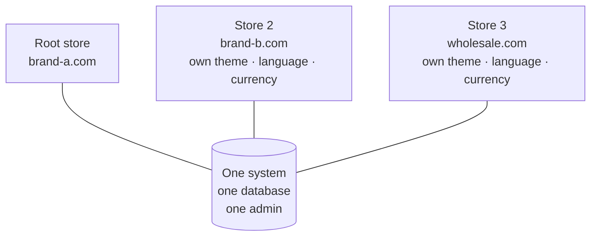

> 🌐 **Language:** [🇻🇳 Tiếng Việt](./multi-store_vi.md) · 🇬🇧 English (current)

# Multi-Store — One admin, many online stores

## Introduction
This document introduces **Multi-Store**, the plugin that lets a business **run several online stores from a single admin**: each store has its own domain, its own theme, its own language and currency, while sharing one platform and one place to manage everything. It is written for **business owners and operations staff**. After reading this page you will know what the plugin does, how far the free edition goes, what the Pro edition adds, and how Multi-Store differs from Multi-Vendor so you can pick the right model from day one.

This is the **index page** of the Multi-Store document set. The three other parts go deeper into setup, day-to-day operations and customization.

## Document set

| Part | Contents | For |
| --- | --- | --- |
| **This page** | The multi-store model, what the plugin does, Free/Pro comparison, Multi-Vendor comparison | Anyone considering more than one store |
| [Part 1 — Setup](./multi-store-setup.md) | Install the plugin, create your first extra store, point the domain, add the Pro edition, verify, troubleshooting | Whoever installs the website |
| [Part 2 — Operations](./multi-store-operations.md) | What data is shared vs per-store, tiered configuration, store administrators, cross-store products, reports, locking and deleting stores, conditions & rules | Platform owner and staff |
| [Part 3 — Customization](./multi-store-customize.md) | Per-store branding and layout, on-screen text, staff permissions, developer notes | Administrators and developers |

> 👉 Try it live on the demo site: **https://demo.s-cart.org**

## What Multi-Store solves
When a business wants **several different stores or websites** — one domain per brand, one language/currency per market, or separate wholesale and retail sites — the usual answer is to build several separate websites. The result: scattered data, several logins, duplicated running costs and no overall picture.

Multi-Store brings it all into **one place**:

- **Many stores, one admin.** Each store has its own domain, theme, language and currency — but you manage them all from a single admin.
- **One shared platform.** Products, orders and customers live in one system; nothing has to be rebuilt per website.
- **Lower cost and effort.** One installation, one place to operate, one place to update — instead of maintaining separate websites.
- **Grow gradually.** Start with one store and add more when you need them, without rebuilding anything.

When a visitor arrives, the system recognises the **domain** they opened and serves the matching store: the right theme, the right language, the right currency and that store's own catalogue.

## What the plugin does

**The free edition** is enough to run for real with up to 3 stores:

- **Create a new store** with its own code, domain, theme, language, currency and per-language descriptions.
- **Configure each store separately**: contact details, logo, social share image, maintenance page, mail settings, and that store's selling settings.
- **Assign data to a store**: you decide which products, categories, banners and content pages belong to which store.
- **Strict domain checking (STRICT)**: only declared domains open the website; unknown domains are refused.
- **Safe store deletion**: the system blocks deletion while a store still has orders, customers or suppliers.

**The Pro edition** adds what you need once you really run several stores:

- **A dedicated administrator per store**: hand a store to someone who signs in on that store's domain and only sees their own scope.
- **Cross-store product publishing**: push one root product into several stores, each getting an independent copy that keeps a link back for later re-syncing.
- **Unified dashboard**: compare revenue, order count and average order value across stores, with Excel export.
- **System-wide product revenue report**: rank root products by total revenue, including the revenue of every store copy.
- **Lock / unlock a store**: suspend a store without deleting anything.

## Free edition vs Pro edition

| Feature | 🆓 **Free** | ⭐ **Pro** |
|---|:---:|:---:|
| Number of stores | up to **3** (the root store counts) | **unlimited** |
| Multiple domains, a theme per store | ✅ | ✅ |
| Own language and currency per store | ✅ | ✅ |
| Per-store configuration | ✅ | ✅ |
| Strict domain checking (STRICT) | ✅ | ✅ |
| Assign products / categories / banners / pages to stores | ✅ | ✅ |
| **A dedicated administrator per store** (signs in on that store's domain, with 2 preset roles) | — | ✅ |
| **Cross-store product publishing** (keeps a link to the source, re-syncable) | — | ✅ |
| **Unified dashboard** (revenue / orders / AOV across stores, Excel export) | — | ✅ |
| **System-wide product revenue report** (including every store copy) | — | ✅ |
| **Lock / unlock a store** | — | ✅ |
| Support | community | GP247 paid channel |

- **Choose Free when:** you are starting out, need at most 3 stores and manage everything yourself.
- **Move to Pro when:** you need more than 3 stores, want to hand each store to its own administrator, or need system-wide reporting.

Pro installs **on top of** the free edition rather than replacing it: once installed, the locked *(Pro)* menu items open the real screens and your existing store data stays exactly as it is. How to install: [Part 1 — Setup](./multi-store-setup.md).

🔗 Product page: [gp247.net/en/product/multi-store-pro.html](https://gp247.net/en/product/multi-store-pro.html) · [Tiếng Việt](https://gp247.net/vi/product/multi-store-pro.html)

## How Multi-Store differs from Multi-Vendor
Both plugins talk about "multiple stores", but they are **two different business models**, and they **cannot be installed together** on one website (the system blocks it to protect your store data). Choose correctly from the start:

| Criterion | 🏢 **Multi-Store** | 🛒 **Multi-Vendor** |
|---|---|---|
| Who owns the goods | **One owner** — your own business | **Many independent sellers** |
| Model | Store chain / several brands of one owner | E-commerce marketplace |
| Domain | **One domain per store** | **A single domain**; each shop is a `/shop/{code}` page |
| Who lists products | You do, choosing which store they belong to | Each seller lists their own, the marketplace approves |
| Money flow | Money goes straight to your business, shared with nobody | The marketplace collects, **keeps a commission**, pays sellers per period |
| Who logs into admin | You (plus per-store administrators in the Pro edition) | Sellers use their own area and only see their shop |
| Right when | You want several websites/domains for **one business** | You want to **invite other people** to sell and earn a commission |

In short: **Multi-Store is many stores of your own; Multi-Vendor is a marketplace for many sellers.** If you need the marketplace model, see the [Multi-Vendor document set](../multi-vendor/multi-vendor.md).

> ⚠️ **The two plugins are mutually exclusive.** The installer refuses to install Multi-Store if a multi-vendor plugin is present (and the other way round), stopping before writing anything. To switch models you must uninstall the other plugin first.

## System requirements
- PHP **8.3** or newer, Composer, MySQL/MariaDB.
- S-Cart **3.x** with `gp247/core` **3.0** and `gp247/shop` installed.
- No multi-vendor plugin installed on the same website.
- **One domain per store, pointing at this same system** — see [Part 1 — Setup](./multi-store-setup.md).
- Runs on ordinary shared hosting: **no** cron, queue worker or websocket required.

## Q&A
**Q1: Do I need to build a separate website for each store?**

→ No. You install one system; each store is a domain pointing at that same system, and they are all managed from one admin.

**Q2: Can each store have its own theme, language and currency?**

→ Yes. Each store configures its own template, language, currency and many other settings — while sharing one platform. Which settings are per-store and which are shared: see [Part 2 — Operations](./multi-store-operations.md).

**Q3: Should I choose Multi-Store or Multi-Vendor?**

→ Choose Multi-Store if every store is yours. Choose Multi-Vendor if you want different sellers on one marketplace and you take a commission.

**Q4: How many stores does the free edition allow?**

→ Up to 3, **including the root store**. Move to Pro for an unlimited number.

**Q5: What is the most valuable thing Pro adds?**

→ A dedicated administrator per store, cross-store product publishing, the unified dashboard, the system-wide revenue report and store locking — all the things you need once you genuinely run several stores at once.

**Q6: If I start on Free and upgrade to Pro later, do I lose data?**

→ No. Pro installs on top of the free edition on the same platform; existing stores, products, orders and settings stay as they are.

**Q7: Why can't I install it alongside a multi-vendor plugin?**

→ The two models use the same store data in incompatible ways, and running both would corrupt it. The system blocks it deliberately; pick the one model that fits you.

**Q8: Where can I try it before deciding?**

→ The public demo site: https://demo.s-cart.org

---

📅 **Last updated:** 2026-09-21 · ✍️ **Author:** GP247
