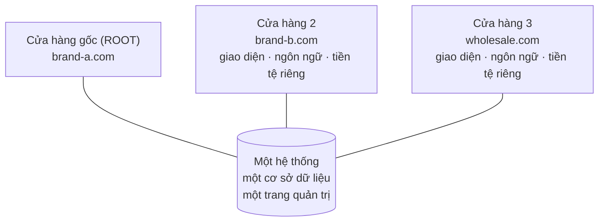

> 🌐 **Ngôn ngữ:** 🇻🇳 Tiếng Việt (hiện tại) · [🇬🇧 English](./multi-store.md)

# Multi-Store — Một trang quản trị, nhiều website bán hàng

## Giới thiệu
Tài liệu này giới thiệu **Multi-Store**, plugin cho phép doanh nghiệp **vận hành nhiều website bán hàng từ một hệ thống quản trị duy nhất**: mỗi cửa hàng có tên miền riêng, giao diện riêng, ngôn ngữ và tiền tệ riêng, nhưng dùng chung một nền tảng và một nơi quản lý. Dành cho **chủ doanh nghiệp và người phụ trách vận hành**. Đọc xong trang này, bạn biết plugin làm được gì, bản miễn phí cho tới đâu, bản Pro thêm gì, và Multi-Store khác Multi-Vendor thế nào để chọn đúng mô hình ngay từ đầu.

Đây là **trang mục lục** của bộ tài liệu Multi-Store. Ba phần còn lại đi sâu vào cài đặt, vận hành và tùy chỉnh.

## Mục lục bộ tài liệu

| Phần | Nội dung | Dành cho |
| --- | --- | --- |
| **Trang này** | Mô hình nhiều cửa hàng, plugin làm được gì, so sánh Free/Pro, so sánh với Multi-Vendor | Người đang cân nhắc mở thêm cửa hàng |
| [Phần 1 — Cài đặt](./multi-store-setup_vi.md) | Cài plugin, tạo cửa hàng đầu tiên, trỏ tên miền, cài thêm bản Pro, kiểm tra, xử lý sự cố | Người cài đặt website |
| [Phần 2 — Vận hành](./multi-store-operations_vi.md) | Dữ liệu nào riêng/chung, cấu hình phân tầng, quản trị viên cửa hàng, đồng bộ sản phẩm, báo cáo, khóa và xóa cửa hàng, điều kiện & ràng buộc | Chủ hệ thống và nhân sự vận hành |
| [Phần 3 — Tùy chỉnh](./multi-store-customize_vi.md) | Giao diện riêng từng cửa hàng, chữ hiển thị, phân quyền nhân sự, ghi chú cho lập trình viên | Người quản trị và lập trình viên |

> 👉 Xem thử trực tiếp tại trang demo: **https://demo.s-cart.org**

## Multi-Store giải quyết việc gì
Khi doanh nghiệp muốn có **nhiều cửa hàng/website khác nhau** — mỗi thương hiệu một tên miền, mỗi thị trường một ngôn ngữ/tiền tệ, hay tách website bán sỉ và bán lẻ — cách làm thông thường là dựng nhiều website riêng. Hậu quả: dữ liệu phân tán, phải đăng nhập nhiều nơi, tốn chi phí duy trì và khó nhìn tổng thể.

Multi-Store gộp tất cả về **một chỗ**:

- **Nhiều cửa hàng, một admin.** Mỗi cửa hàng có tên miền riêng, giao diện (template) riêng, ngôn ngữ và tiền tệ riêng — nhưng bạn chỉ quản lý ở một trang quản trị.
- **Dùng chung nền tảng.** Sản phẩm, đơn hàng, khách hàng nằm chung một hệ thống; không phải dựng lại từ đầu cho mỗi website.
- **Tiết kiệm chi phí và công sức.** Một lần cài đặt, một nơi vận hành, một nơi cập nhật — thay vì nuôi nhiều website tách rời.
- **Mở rộng dần.** Bắt đầu với một cửa hàng, thêm cửa hàng mới khi cần mà không phải làm lại hệ thống.

Khi một khách truy cập, hệ thống nhận ra **tên miền** họ đang mở và phục vụ đúng cửa hàng tương ứng: đúng giao diện, đúng ngôn ngữ, đúng tiền tệ, đúng danh mục sản phẩm của cửa hàng đó.

## Plugin làm được gì

**Bản miễn phí** đủ để vận hành thật với tối đa 3 cửa hàng:

- **Tạo cửa hàng mới** với mã, tên miền, giao diện, ngôn ngữ, tiền tệ và mô tả riêng theo từng ngôn ngữ.
- **Cấu hình riêng cho từng cửa hàng**: thông tin liên hệ, logo, ảnh đại diện mạng xã hội, trang bảo trì, cấu hình email, cấu hình bán hàng của cửa hàng đó.
- **Gán dữ liệu vào cửa hàng**: sản phẩm, danh mục, banner, trang nội dung thuộc cửa hàng nào là do bạn chọn.
- **Kiểm duyệt tên miền nghiêm ngặt (STRICT)**: chỉ những tên miền đã khai báo mới mở được website, tên miền lạ bị từ chối.
- **Xóa cửa hàng an toàn**: hệ thống chặn nếu cửa hàng còn đơn hàng, khách hàng hoặc nhà cung cấp.

**Bản Pro** thêm những gì cần khi vận hành nhiều cửa hàng thật sự:

- **Quản trị viên riêng cho từng cửa hàng**: giao mỗi cửa hàng cho một người, họ đăng nhập trên tên miền cửa hàng đó và chỉ thấy phạm vi của mình.
- **Đồng bộ sản phẩm sang cửa hàng**: đăng một sản phẩm gốc sang nhiều cửa hàng, mỗi nơi một bản độc lập nhưng giữ liên kết để đồng bộ lại về sau.
- **Dashboard hợp nhất**: so sánh doanh thu, số đơn và giá trị đơn trung bình giữa các cửa hàng, xuất Excel.
- **Báo cáo doanh thu sản phẩm toàn hệ thống**: xếp hạng sản phẩm gốc theo tổng doanh thu, kèm doanh thu của từng bản sao ở mỗi cửa hàng.
- **Khóa / mở khóa cửa hàng**: tạm ngừng phục vụ một cửa hàng mà không xóa dữ liệu.

## So sánh bản miễn phí và bản Pro

| Chức năng | 🆓 **Free** | ⭐ **Pro** |
|---|:---:|:---:|
| Số cửa hàng | tối đa **3** (tính cả cửa hàng gốc) | **không giới hạn** |
| Nhiều tên miền, mỗi cửa hàng một giao diện | ✅ | ✅ |
| Ngôn ngữ và tiền tệ riêng theo cửa hàng | ✅ | ✅ |
| Cấu hình riêng cho từng cửa hàng | ✅ | ✅ |
| Kiểm duyệt tên miền nghiêm ngặt (STRICT) | ✅ | ✅ |
| Gán sản phẩm / danh mục / banner / trang vào cửa hàng | ✅ | ✅ |
| **Quản trị viên riêng cho từng cửa hàng** (đăng nhập trên tên miền cửa hàng đó, kèm 2 vai trò mẫu) | — | ✅ |
| **Đồng bộ sản phẩm sang cửa hàng** (giữ liên kết nguồn, đồng bộ lại được) | — | ✅ |
| **Dashboard hợp nhất** (doanh thu / số đơn / giá trị đơn TB giữa các cửa hàng, xuất Excel) | — | ✅ |
| **Báo cáo doanh thu sản phẩm** toàn hệ thống (kèm bản sao ở từng cửa hàng) | — | ✅ |
| **Khóa / mở khóa cửa hàng** | — | ✅ |
| Hỗ trợ | cộng đồng | kênh trả phí của GP247 |

- **Chọn Free khi:** bạn mới bắt đầu, cần tối đa 3 cửa hàng và tự mình quản lý tất cả.
- **Nâng lên Pro khi:** bạn cần nhiều hơn 3 cửa hàng, muốn giao mỗi cửa hàng cho một người quản trị riêng, hoặc cần báo cáo tổng hợp toàn hệ thống.

Bản Pro cài **thêm** lên bản miễn phí, không thay thế: cài xong, các mục *(Pro)* đang khóa trong menu mở thẳng màn thật, và dữ liệu cửa hàng hiện có giữ nguyên. Cách cài: [Phần 1 — Cài đặt](./multi-store-setup_vi.md).

🔗 Trang sản phẩm: [gp247.net/vi/product/multi-store-pro.html](https://gp247.net/vi/product/multi-store-pro.html) · [English](https://gp247.net/en/product/multi-store-pro.html)

## Multi-Store khác Multi-Vendor thế nào
Hai plugin cùng nói về "nhiều cửa hàng" nhưng là **hai mô hình kinh doanh khác nhau**, và **không cài chung được** trên cùng một website (hệ thống chặn để tránh hỏng dữ liệu cửa hàng). Chọn đúng ngay từ đầu:

| Tiêu chí | 🏢 **Multi-Store** | 🛒 **Multi-Vendor** |
|---|---|---|
| Ai sở hữu hàng hóa | **Một chủ** — chính doanh nghiệp của bạn | **Nhiều người bán** độc lập cùng bán |
| Mô hình | Chuỗi cửa hàng / nhiều thương hiệu của cùng một chủ | Sàn thương mại điện tử (marketplace) |
| Tên miền | **Mỗi cửa hàng một tên miền** riêng | **Một tên miền duy nhất**; mỗi gian hàng là một trang `/shop/{mã}` |
| Ai đăng sản phẩm | Bạn đăng và chọn sản phẩm thuộc cửa hàng nào | Từng người bán tự đăng, sàn duyệt |
| Dòng tiền | Tiền về thẳng doanh nghiệp bạn, không chia cho ai | Sàn thu tiền khách, **giữ hoa hồng**, chi trả lại người bán theo kỳ |
| Ai đăng nhập quản trị | Bạn (và quản trị viên từng cửa hàng ở bản Pro) | Người bán vào khu riêng của họ, chỉ thấy gian hàng mình |
| Phù hợp khi | Bạn muốn nhiều website/tên miền cho **cùng một doanh nghiệp** | Bạn muốn **mời người khác** vào bán và ăn hoa hồng |

Nói ngắn gọn: **Multi-Store = nhiều cửa hàng của chính bạn; Multi-Vendor = một cái chợ cho nhiều người bán.** Nếu bạn cần mô hình marketplace, hãy xem [bộ tài liệu Multi-Vendor](../multi-vendor/multi-vendor_vi.md).

> ⚠️ **Hai plugin loại trừ lẫn nhau.** Trình cài đặt từ chối cài Multi-Store nếu website đang có plugin multi-vendor (và ngược lại), dừng ngay trước khi ghi bất cứ gì. Muốn đổi mô hình thì phải gỡ plugin kia trước.

## Yêu cầu hệ thống
- PHP **8.3** trở lên, Composer, MySQL/MariaDB.
- S-Cart **3.x** với `gp247/core` **3.0** và `gp247/shop` đã cài.
- Plugin multi-vendor **chưa cài** trên cùng website.
- **Mỗi cửa hàng cần một tên miền trỏ về cùng hệ thống này** — xem [Phần 1 — Cài đặt](./multi-store-setup_vi.md).
- Chạy được trên hosting chia sẻ thông thường: **không cần** cron, queue worker hay websocket.

## Hỏi & Đáp (Q&A)
**Câu 1: Tôi có cần dựng nhiều website riêng cho từng cửa hàng không?**

→ Không. Bạn chỉ cài một hệ thống; mỗi cửa hàng là một tên miền trỏ về cùng hệ thống đó và được quản lý chung trong một trang admin.

**Câu 2: Mỗi cửa hàng có được giao diện, ngôn ngữ, tiền tệ riêng không?**

→ Có. Mỗi cửa hàng cấu hình template, ngôn ngữ, tiền tệ và nhiều thiết lập riêng — dù dùng chung nền tảng. Chi tiết cấu hình nào riêng, cấu hình nào dùng chung: xem [Phần 2 — Vận hành](./multi-store-operations_vi.md).

**Câu 3: Tôi nên chọn Multi-Store hay Multi-Vendor?**

→ Chọn Multi-Store nếu tất cả cửa hàng đều là của bạn. Chọn Multi-Vendor nếu bạn muốn nhiều người bán khác nhau cùng lên sàn và bạn thu hoa hồng.

**Câu 4: Bản miễn phí dùng được bao nhiêu cửa hàng?**

→ Tối đa 3 cửa hàng, **tính cả cửa hàng gốc**. Cần nhiều hơn thì nâng lên Pro (không giới hạn).

**Câu 5: Bản Pro thêm được gì đáng giá nhất?**

→ Quản trị viên riêng theo cửa hàng, đồng bộ sản phẩm sang nhiều cửa hàng, dashboard hợp nhất, báo cáo doanh thu toàn hệ thống và khóa cửa hàng — đều là thứ cần khi bạn thật sự vận hành nhiều cửa hàng cùng lúc.

**Câu 6: Đang dùng bản miễn phí, sau này nâng lên Pro có mất dữ liệu không?**

→ Không. Pro cài thêm lên bản miễn phí trên cùng nền tảng; cửa hàng, sản phẩm, đơn hàng và cấu hình hiện có giữ nguyên.

**Câu 7: Vì sao không cài được cùng plugin multi-vendor?**

→ Hai mô hình dùng chung dữ liệu cửa hàng theo hai cách khác nhau, chạy chung sẽ hỏng dữ liệu. Hệ thống chủ động chặn để bảo vệ bạn; chỉ chọn một mô hình phù hợp.

**Câu 8: Muốn xem thử trước khi quyết định thì xem ở đâu?**

→ Trang demo công khai: https://demo.s-cart.org

---

📅 **Cập nhật lần cuối:** 2026-09-21 · ✍️ **Tác giả (Author):** GP247
