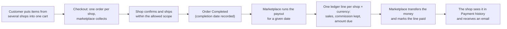
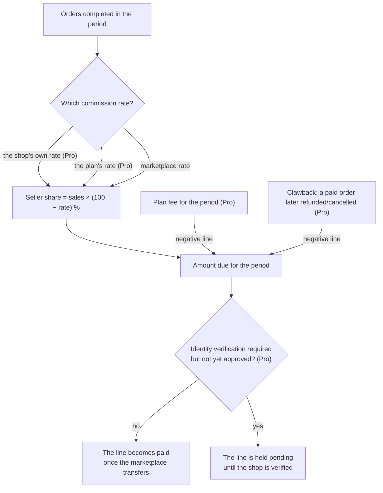
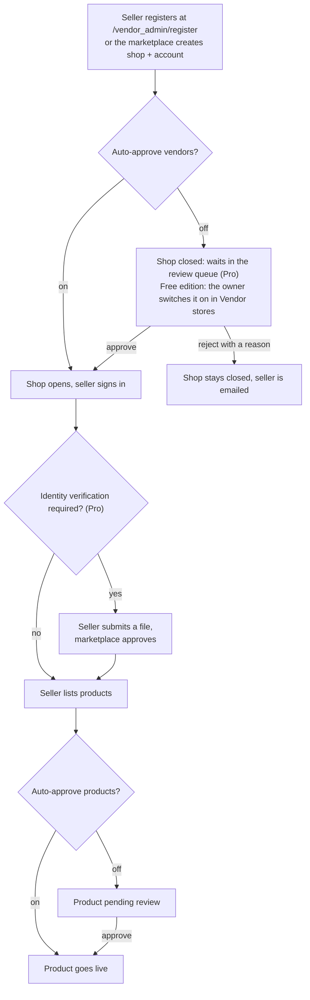
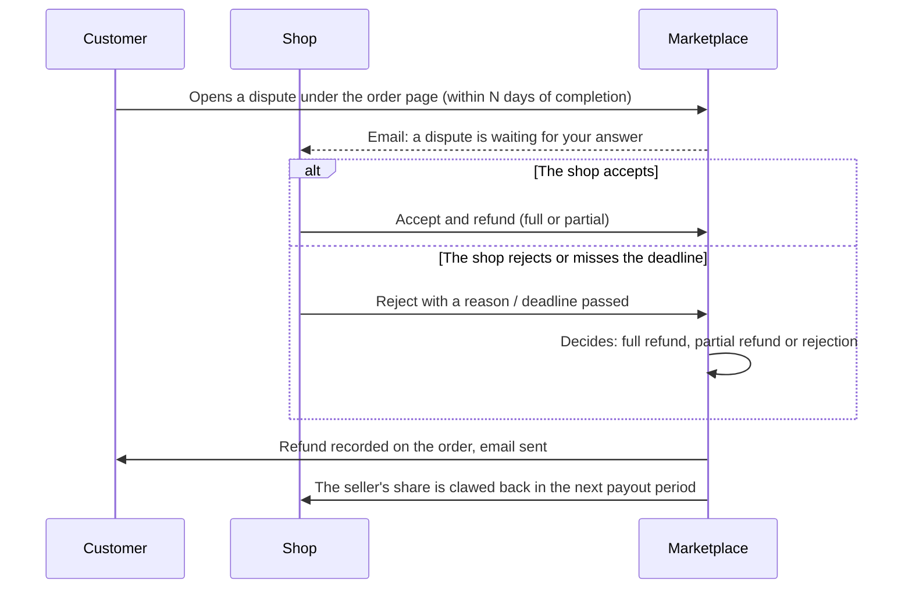

> 🌐 **Language:** [🇻🇳 Tiếng Việt](./multi-vendor-operations_vi.md) · 🇬🇧 English (current)

# Multi-Vendor — Part 2: Running the marketplace

## Introduction
This document describes **how a Multi-Vendor marketplace actually runs**: who can do what, where each setting lives, how money travels from the customer to the seller, and the conditions you need to know before acting. It is written for marketplace owners and operations staff. After reading it you will know what to configure before opening the marketplace to sellers, and how to handle the everyday situations (moderation, payouts, disputes, refunds). Installation is covered separately in [Part 1 — Setup](./multi-vendor-setup.md).

Features marked **(Pro)** require the Pro edition installed alongside the free one.

## Key URLs and screens

| Role | URL / location |
| --- | --- |
| Shop directory (customer-facing) | `/shop` — search by name, product count, rating |
| Shop page (customer-facing) | `/shop/{code}` — cover image, logo, name, product count, rating, join date, contact + three tabs **Products** / **Reviews** / **Info** |
| Per-shop quick order (Pro) | `/shop/{code}/quick-order` — when the marketplace enables "Quick order" |
| Seller admin area | `/vendor_admin` |
| Marketplace admin | S-Cart admin, **Marketplace** menu: Vendor stores · Vendor users · Quick config · Payments, plus the (Pro) screens Reports · Commission report · Review queue · Disputes · Shop plans |

## The four main flows
These four flows carry the marketplace's money and its trust.

**1. From the customer's cart to money in the seller's hands**

**2. How the amount due to a shop is calculated**

**3. Bringing a seller onto the marketplace**

**4. A customer disputes an order (Pro)**

## Who can do what

### Customers
- Browse and buy products from every shop on one website; the **shop directory** at `/shop`; each shop has **its own page**: brand header, banners, a **Products** tab (search within the shop, filter by category, sort), a **Reviews** tab (reviews of every product that shop sells — requires the *Product Rating & Review* plugin) and an **Info** tab.
- Cart, wishlist, comparison, order history — all the standard S-Cart customer features.
- **Quick order (B2B)** for a single shop (Pro, when enabled) — see [B2B wholesale](#b2b-wholesale-pro).

### Sellers
- Sign into their own admin area at `/vendor_admin` (accounts separate from marketplace admin accounts).
- **Dashboard**: order, product and customer counts; 30-day and monthly order charts.
- **Products**: create and edit products exactly as in the S-Cart admin (single, group, variants); products always belong to their own shop.
- **Shop categories**, **banners** and **suppliers** of their own.
- **Orders**: see their shop's orders (filter by keyword, status, date); update the **shipping status**; **confirm orders** within the allowed scope; enter **carrier + tracking number**; **print delivery notes**. Every change is written to the order history.
- **Shop info**: name, description, logo, cover image, address, contact.
- **Payment history**: cumulative sales, received, outstanding; each period with where the money was sent and the transaction reference; **Excel statement export** by date range (Pro).
- **Payout details** (Pro): method (bank transfer / PayPal / other), bank, account holder, account number — **stored encrypted**, only the last few digits shown.
- **Email notifications** on new orders; plus approval, payout and adjustment emails (Pro).
- Pro screens in the seller area: **My plan**, **Identity verification**, **Price groups**, **Create order**, **Reviews**, **Shop plugins**.

### The marketplace owner
- Create and edit **shops** (code, name, description, open/closed status) and **seller accounts** (email, password, shop, status).
- Allow or block seller self-registration; choose auto-approval or manual approval for **new shops** and **new/edited products**.
- Set the marketplace-wide **commission rate** and **per-shop rates** (Pro).
- **Run payouts** per period and manage the payout ledger (status, payment date, transaction reference, notes).
- Pro screens: **Review queue**, **Disputes**, **Shop plans**, **Reports**, **Commission report**, **batch payouts**.
- Full control over every shop's products and orders through the S-Cart admin.

## Marketplace settings
Go to the admin → **Marketplace** → **Quick config**. This is the **complete** set of marketplace-level settings.

| Setting | What it does | Default | Edition |
| --- | --- | --- | --- |
| Commission rate (%) | The percentage the marketplace **keeps** on completed order totals before paying the seller | 0 | Free |
| Allow vendor registration | On: anyone can register at `/vendor_admin/register`. Off: only the admin creates accounts | Off | Free |
| Auto-approve vendors | Off: new shops stay **pending** (closed) until the admin opens them | Off | Free |
| Auto-approve products | Off: products a seller creates **or edits** wait for admin approval before going live | Off | Free |
| Email sellers on new orders | Emails every active account of the shop when an order for that shop arrives | On | Free |
| Quick order | Enables the per-shop bulk ordering page | Off | Pro |
| Seller order scope | **Ship only** · **Confirm + ship** · **Confirm + ship + complete** (which puts the order into the next payout period) | Confirm + ship | Pro (the free edition is always at *Confirm + ship*) |
| Require identity verification (KYC) | On: an unverified shop **cannot put products live** and its payout lines are held pending | Off | Pro |
| Dispute window (days after completion) | Customers can only open a dispute within this window | 14 | Pro |
| Seller response days | Past this deadline an unanswered dispute escalates to the marketplace | 3 | Pro |
| Email the admin on pending reviews | Alerts the marketplace when a shop or product is waiting for review | On | Pro |
| Email sellers on approval | Alerts the seller when their shop is opened | On | Pro |
| Email sellers on payout | Alerts them when a payout period is marked paid | On | Pro |
| Email on payout adjustments | Alerts them when a clawback line is created | On | Pro |
| Email on disputes | Alerts the parties at each step of a dispute | On | Pro |
| Seller-configurable: … | One row per plugin the marketplace lets shops configure themselves | No plugin opened | Pro |

> ⚠️ Marketplace email goes through S-Cart's shared mail configuration: if the system's **mail mode** is off, **no email is sent at all**, even with these switches on.

On the free edition, Pro-only switches appear **locked** with a description and a link to an explanation page; Pro screens stay in the menu and open an explanation page until the Pro edition is installed.

## Per-shop settings
Not everything is set marketplace-wide. These are set **for one shop**, and by whom.

| Setting | Where | Who sets it |
| --- | --- | --- |
| Shop status (open/closed) | Marketplace → Vendor stores | Owner |
| Shop info (name, description, logo, cover, address, contact) | Seller area → Shop info | Seller |
| Own commission rate (%) | Marketplace → Store → Config | Owner (Pro) |
| Shop plan | Marketplace → Store → Config (plans are created under *Shop plans*) | Owner (Pro) |
| Which plugins the shop may configure | The owner ticks them in **Quick config**, the seller adjusts them in their own area | Owner opens, seller adjusts (Pro) |
| Payout details (bank, account holder, account number) | Seller area → Payment history | Seller (Pro) |
| Dealer price groups and discount levels | Seller area → Price groups | Seller (Pro) |
| Banners, the shop's own categories | Seller area → Banners / Categories | Seller |

Closing a shop stops the seller signing in and hides the shop page from customers.

## Money: commission, plans and payouts

### Commission resolved in order
Each time a period is recorded, the system asks in turn:

1. **The shop's own rate** (Pro) — set under *Marketplace → Store → Config*, accepts 0–100, empty means none.
2. **The plan's rate** (Pro), if the shop is on a plan.
3. **The marketplace-wide rate** in Quick config.

The first one found wins. That is how a strategic dealer pays 5% while a new seller pays 15% on the same marketplace. **A new rate applies to periods processed after the change**, for every order in that period — so if you want a clean cut, run the current payout first and change the rate afterwards.

### Paying a seller
1. **The order must be Completed.** When an order becomes Completed the system records its completion date; moving it back clears that date.
2. **The marketplace runs the process.** Go to **Marketplace** → **Payments**, enter a **processing date** and run it.
3. **The system groups and records.** Every completed order whose completion date is ≤ the processing date (and after the previously processed period) is grouped **per shop and per currency**. For each group the system takes that shop's commission rate and creates a ledger line with: order count, total sales, the seller's share (= 100 − commission), the **amount due** = total sales × seller share, **rounded to the currency's precision** (no decimals for VND, 2 for USD), plus the payout details the seller declared.
4. **The marketplace pays and marks it.** After transferring the money outside the system using the details on the ledger line, the owner edits the line: status paid, **transaction reference**, notes; the system records the payment date and who marked it. The seller is emailed and sees the result in **Payment history**.

> Example: commission 10%, shop A has 3 completed orders totalling 5,000,000 VND in the period → the ledger records: 3 orders, total 5,000,000, seller share 90%, amount due **4,500,000 VND**.

### Batch payouts (Pro)
A batch = (processing date, currency). The preview shows the number of shops, the total amount and **which shops are excluded and why** (not verified · no payout details · amount not positive · already paid). You download a **bank payment file** (CSV/Excel), make the transfer at your bank, then **settle the whole batch with one reference code**. Both sides reconcile using the **Excel statement** for a date range.

Because the payment file contains real account numbers, **only administrator accounts can download it, and every download is logged**.

> The plugin **does not transfer money automatically** through a bank gateway — it prepares the payment file and keeps the ledger; the transfer itself happens at your bank.

### Shop plans (Pro)
Created under the **Shop plans** menu. Each plan has: a product cap (empty = unlimited), its own commission rate (empty = marketplace rate), a **periodic fee** (monthly or yearly) and currency, plus a *default plan* flag and a *seller may choose* flag.

- The owner **assigns a plan** on the shop config screen; the period starts immediately.
- **Plan fees are not billed separately**: the system writes a **negative line** into the shop's payout ledger and **offsets it against the next payout**. No invoice, no debt collection.
- **Periods do not auto-renew**: the shop falls back to the default plan until the owner clicks *Renew* (new period, new fee).
- At the product cap the seller **cannot add new products**, but can still edit existing ones.
- With *seller may choose* on, sellers see the plan shelf under **My plan** and switch by themselves.

### Clawback when a paid order is refunded or cancelled (Pro)
- The marketplace **never asks for money back**. The system writes a **clawback line (negative)** equal to the share the seller received for that order — at the rate of the **period that was paid**, not the current rate — and **offsets it against the next period**.
- A **partial refund** is adjusted proportionally; refunding the rest later only claws back the difference.
- **Reopening the order** cancels a clawback line that has not been offset yet; if it was already offset, a **reversing** (positive) line is written.
- Every adjustment line is visible in Payment history, the statement and the commission report.

## Trust: moderation, disputes, verification

### Moderating sellers and products
The free edition moderates through the shop list and the product list. The Pro edition adds a **Review queue** — one screen gathering three things: new shops awaiting approval, products awaiting approval, and verification files awaiting approval. Approve or reject with a **mandatory reason**; the decision is **logged** and emailed to the seller; a "last rejection" column appears when an item returns to the queue.

### Two-tier disputes (Pro)
- A **signed-in** customer opens a dispute right under their own order page: issue type, description of at least 10 characters, requested amount (optional). Only for orders not cancelled or refunded, already paid or completed, and **within the N-day window** after completion (14 by default). One open dispute per order; the customer can withdraw it while the seller has not answered.
- **The seller answers first** within N days (3 by default): *Accept & refund* (full or partial, never above the refundable amount) or *Reject* with a reason ⇒ escalates to the marketplace. Missing the deadline **escalates automatically** (checked when the screen is opened — no cron needed).
- **The marketplace decides last** under the **Disputes** menu: full refund / partial refund / rejection, with a mandatory note.
- A refund decision is **written straight into the order ledger** (a full refund moves the order to *Refunded*) and **the seller's share is clawed back automatically** in the next period. Returning the money to the customer is done by the marketplace through the original payment method — outside the system, just like paying sellers.

### Identity verification — KYC (Pro)
- The seller submits a **text-based file** (individual or company: legal name, tax code or ID number — **stored encrypted**, representative, address, notes) under the **Identity verification** menu. No document photos required.
- The marketplace approves it in the **Verification** tab of the review queue; rejection needs a reason of at least 5 characters and the seller may resubmit.
- While **Require verification** is on, an unapproved shop **cannot put products live** (even with product auto-approval on) and its **payout lines are held pending** (the money is still recorded, just not paid).
- An approved shop carries a **"Verified" badge** on its shop page, in the directory and in the marketplace list. Turning the flag off blocks nothing, and the badge stays.

## B2B wholesale (Pro)

### Quick order
Each shop's `/shop/{code}/quick-order` page, enabled by the **Quick order** switch:

- search by SKU/name or by the shop's categories, and enter quantities for many products at once;
- **paste a "SKU, quantity" list** from the customer's file;
- **reorder from one of the customer's own past orders** at that shop (sign-in required);
- **export an Excel quote**.

Every line is validated before anything is added, and **the cart is only filled when all lines are valid** — invalid lines are reported by SKU with the reason.

### Dealer price groups
- Each shop creates its own **price groups** (a percentage discount across the shop's catalogue) and **assigns individual customer accounts** to them.
- The discount belongs to the **(customer, product's shop) pair**: a dealer of shop A gets **no** discount on shop B's goods, even in the same cart.
- A customer in no group is a **retail customer**; dealer prices are **never shown publicly**.
- **They do not stack with promotions** — the customer pays the **lower** of the two prices.
- Prices are resolved at the store layer, so the product page, product grids, quick order, cart, checkout and quotes **always agree**.

### Sellers creating orders for customers
The **Create order** screen in the seller area: pick a customer, add products from your own shop, prices **prefilled from that customer's group**. Made for orders taken by phone or in person.

## Seller self-service (Pro)
- **My plan**: current plan, products used / cap, fee and expiry date; switch plans if the marketplace allows.
- **Shop plugins**: enable/disable and **configure** the parameters (e.g. shipping fee, free-shipping threshold) of the plugins **the marketplace ticked open**. Untouched values inherit the marketplace defaults, with a button to return to them. **Payment gateways are never opened** — the marketplace collects the money and sellers never enter payment keys. Marketplace secrets are never shown in the seller area.
- **Reviews**: read and **publicly reply to** reviews of products their shop sells (requires the *Product Rating & Review* plugin). Approving, rejecting or deleting reviews remains with the marketplace.

## Reports (Pro)
- **Reports**: filter by date / shop / status, a chart of shops by order count, Excel export.
- **Commission report**: pick a period (this month / last month / quarter / year / custom) and the **basis** — *completed orders* (matching the payout ledger) or *placed orders* (revenue). Each shop × currency shows: order count, sales, the commission rate in force, the marketplace's share, the amount due to the seller, **already paid** (per the ledger) and **outstanding**. Pick a single shop for a month-by-month view; Excel export.

## Conditions & Rules (know before you act)

**When a seller lists a product**
- **With "Auto-approve products" off, a product is always saved unapproved**, even if the seller ticks approval themselves — the owner keeps the final say.
- **A rejected product stays unapproved**; editing and saving it resubmits it for review — and the admin sees the previous rejection reason.
- **At a plan's product cap (Pro) no new products can be added**, though existing ones can still be edited.

**When moderating**
- **A rejection needs a reason of at least 5 characters** — it is emailed to the seller and kept on record.
- **Rejecting a shop does not delete it** — the shop stays closed; the admin can approve it later or delete it manually.
- **Sellers cannot change the shop's currency or language** — so prices and taxes stay consistent marketplace-wide.

**When setting a per-shop commission (Pro)**
- **Only numbers from 0 to 100** — it is the percentage the marketplace keeps; anything else is rejected.
- **A new rate applies to periods processed after the change**, for every order in that period — run the current payout first if you want a clean cut.

**When a seller handles orders**
- **They can only move statuses within the allowed scope** (by default New/Hold → Processing) — so a seller cannot push an order into a payout period or move money and stock on their own.
- **Sellers never cancel, refund or reopen a settled order** — those actions move money and stock and belong to the marketplace.
- **Cancelled or refunded orders cannot have their tracking or shipping status edited** — the order has left the seller's hands.
- **Carrier and tracking number are limited to 100 characters, notes to 255** — enough for every carrier's format.

**When running payouts**
- **Only Completed orders count** — so you never pay for an order that can still be cancelled or refunded.
- **The processing date must be before today** — so every order for that date is settled.
- **A date already processed cannot be processed again** — the system blocks it to avoid recording the same orders twice.
- **The amount due is rounded to the currency's precision** (VND: whole numbers; USD: 2 decimals) — matching how S-Cart stores order money.
- **The marketplace transfers money outside the system** using the details the seller declared — the plugin does not push payments through a payout gateway.
- **Shops that are unverified (with KYC on) or have no payout details are excluded from a batch** — the preview states the reason.

**When a customer uses quick order (Pro)**
- **The cart is only filled when every line is valid** — invalid lines are reported by SKU with the reason; a dealer needs the exact list, not a partial cart.
- **Quantities must be whole numbers ≥ 1 and not below the product's minimum** — the minimum is set by the seller on the product.
- **Stock cannot be exceeded** when the shop manages stock and has "sell out of stock" off.
- **Only that shop's products** — an SKU from another shop is reported as "not available in this shop".
- **Reordering works only on the customer's own past orders at that shop** (sign-in required); lines no longer for sale are reported as skipped.

**When a customer opens a dispute (Pro)**
- Only for **their own order**, not cancelled or refunded, already paid or completed, and **within the N-day window** after completion.
- **One open dispute per order**; the customer can withdraw it while the seller has not answered.
- **The marketplace's final decision requires a note** — so both sides have something to refer back to later.

**When sellers configure plugins (Pro)**
- **Only plugins the marketplace ticked open** appear in the seller area; **payment plugins are never opened**.
- **Every change applies to that seller's shop only**; untouched values inherit the marketplace defaults and a "use default" button restores them.
- **Marketplace secrets are never shown in the seller area** — an empty password/key field means the shared configuration is in use.

**When using shop plans (Pro)**
- **The plan fee is written as a negative ledger line** and offset against the next period; it is never billed separately.
- **Periods do not auto-renew**: the shop falls back to the default plan until the owner clicks *Renew*.
- A seller's own plan switch is refused in three cases: the plan is not on sale, the current period's fee is already paid (preventing double charging), and downgrading to a cap below the number of products they already have.

## Q&A
**Q1: I ran the payout but no lines appeared — why?**

→ Check three things: are the orders actually Completed; is their completion date ≤ the processing date; and has that date already been processed?

**Q2: How do I set a different commission per shop?**

→ Go to Marketplace → Store → Config and enter the **own commission rate (%)** (Pro). Empty means the marketplace rate. Sellers see the rate in force in their Payment history.

**Q3: I set a per-shop rate but the shop also has a plan — which one applies?**

→ The shop's own rate wins. The order is: own rate → plan rate → marketplace rate.

**Q4: What happens if an order is refunded after the seller was already paid?**

→ The system writes a clawback line for exactly the share the seller received (at the rate of the period that was paid) and offsets it against the next period. You never have to ask for the money back.

**Q5: How does the ledger work with multiple currencies?**

→ The ledger has one line per order currency; cumulative totals are also shown per currency. Payout batches are split by currency too.

**Q6: What can a seller change on an order?**

→ The shipping status; order confirmation within the scope set in Quick config; carrier and tracking number; printing delivery notes. Cancelling, refunding, reopening and payment status belong to the marketplace owner.

**Q7: If I turn on "Require identity verification", are existing sellers blocked too?**

→ Yes: every unverified shop is blocked from putting new products live and has its payout lines held, new or long-standing alike. Warn your sellers in advance and review their files promptly.

**Q8: Can other customers see dealer prices?**

→ No. The discount only applies to customer accounts assigned to a group at that shop, and only when the customer is signed in.

**Q9: Does the bank payment file transfer money by itself?**

→ No. The plugin builds the file for you to upload to your bank; once the bank has transferred, you settle the whole batch with one reference code.

**Q10: Do sellers get an email when a new order arrives?**

→ Yes, every active account of the shop does. S-Cart's **mail mode** and the matching switch in Quick config must both be on.

---

⬅️ [Part 1 — Setup](./multi-vendor-setup.md) · [Index](./multi-vendor.md) · [Part 3 — Customization](./multi-vendor-customize.md) ➡️

---

📅 **Last updated:** 2026-09-21 · ✍️ **Author:** GP247
