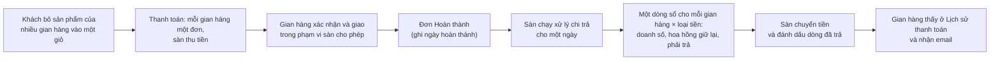
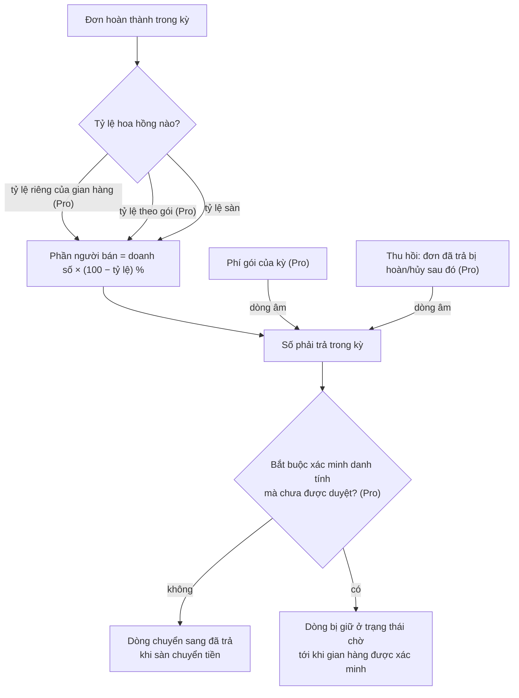
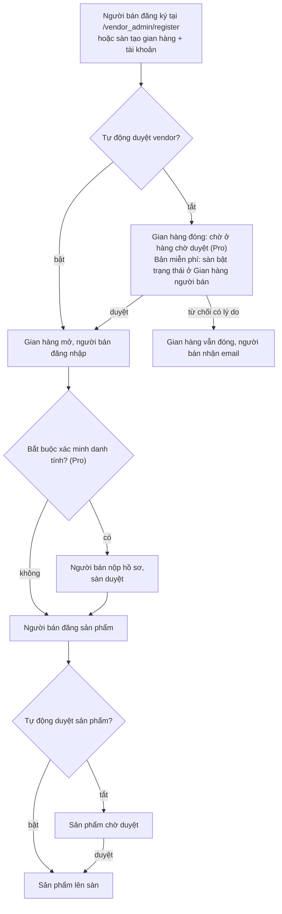
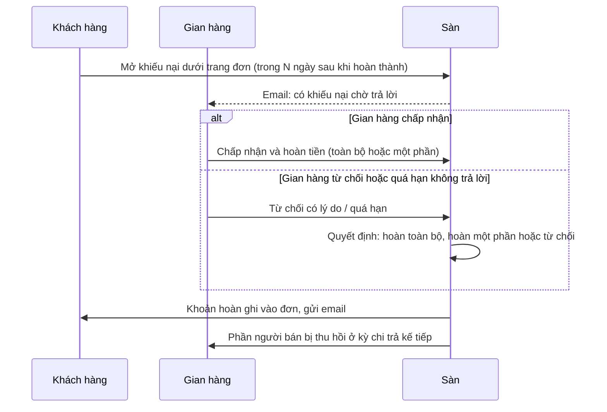

> 🌐 **Ngôn ngữ:** 🇻🇳 Tiếng Việt (hiện tại) · [🇬🇧 English](./multi-vendor-operations.md)

# Multi-Vendor — Phần 2: Vận hành sàn

## Giới thiệu
Tài liệu này mô tả **sàn Multi-Vendor vận hành ra sao trong thực tế**: ai làm được gì, cấu hình nào nằm ở đâu, tiền đi từ khách tới người bán theo đường nào, và những điều kiện bạn cần biết trước khi thao tác. Dành cho chủ sàn và nhân sự vận hành. Đọc xong, bạn biết cần cấu hình gì trước khi mở sàn cho người bán và xử lý các tình huống thường gặp (kiểm duyệt, chi trả, khiếu nại, hoàn tiền). Phần cài đặt xem riêng ở [Phần 1 — Cài đặt](./multi-vendor-setup_vi.md).

Tính năng ghi **(Pro)** cần cài thêm bản Pro bên cạnh bản miễn phí.

## Đường dẫn và màn hình chính

| Vai | Đường dẫn / vị trí |
| --- | --- |
| Danh bạ gian hàng (khách xem) | `/shop` — tìm theo tên, số sản phẩm, đánh giá |
| Trang gian hàng (khách xem) | `/shop/{mã}` — ảnh bìa, logo, tên, số sản phẩm, đánh giá, ngày tham gia, liên hệ + ba tab **Sản phẩm** / **Đánh giá** / **Thông tin** |
| Đặt hàng nhanh theo gian hàng (Pro) | `/shop/{mã}/quick-order` — khi sàn bật "Đặt hàng nhanh" |
| Khu quản trị người bán | `/vendor_admin` |
| Quản trị sàn | Khu admin S-Cart, menu **Chợ bán hàng**: Gian hàng người bán · Tài khoản người bán · Cấu hình nhanh · Thanh toán, cùng các màn (Pro) Báo cáo · Báo cáo hoa hồng · Hàng chờ duyệt · Khiếu nại · Gói gian hàng |

## Bốn luồng chính
Bốn luồng dưới đây mang tiền và niềm tin của sàn.

**1. Từ giỏ hàng của khách tới tiền về tay người bán**

**2. Số tiền phải trả một gian hàng được tính thế nào**

**3. Đưa một người bán lên sàn**

**4. Khách khiếu nại một đơn (Pro)**

## Ai làm được gì

### Khách hàng
- Duyệt và mua sản phẩm của mọi gian hàng trên cùng website; **danh bạ gian hàng** `/shop`; mỗi gian hàng có **trang riêng**: header thương hiệu, banner, tab **Sản phẩm** (tìm trong gian hàng, lọc danh mục, sắp xếp), tab **Đánh giá** (đánh giá mọi sản phẩm gian hàng đó bán — cần plugin *Product Rating & Review*) và tab **Thông tin**.
- Giỏ hàng, danh sách yêu thích, so sánh, lịch sử đơn — toàn bộ tính năng khách hàng của S-Cart.
- **Đặt hàng nhanh (B2B)** cho một gian hàng (Pro, khi sàn bật) — xem mục [Bán sỉ cho đại lý](#bán-sỉ-cho-đại-lý-pro).

### Người bán
- Đăng nhập khu quản trị riêng `/vendor_admin` (tài khoản tách khỏi tài khoản admin sàn).
- **Bảng điều khiển**: số đơn, số sản phẩm, số khách; biểu đồ đơn 30 ngày và theo tháng.
- **Sản phẩm**: tạo/sửa sản phẩm đầy đủ như admin S-Cart (đơn, nhóm, biến thể); sản phẩm luôn thuộc gian hàng của mình.
- **Danh mục gian hàng**, **banner**, **nhà cung cấp** riêng.
- **Đơn hàng**: xem đơn của gian hàng mình (lọc theo từ khóa, trạng thái, ngày); cập nhật **trạng thái giao hàng**; **xác nhận đơn** theo phạm vi sàn cho phép; nhập **hãng vận chuyển + mã vận đơn**; **in phiếu giao**. Mọi thay đổi đều ghi vào lịch sử đơn.
- **Thông tin gian hàng**: tên, mô tả, logo, ảnh bìa, địa chỉ, liên hệ.
- **Lịch sử thanh toán**: tổng bán lũy kế, đã nhận, còn lại; chi tiết từng kỳ kèm nơi chuyển tiền và mã giao dịch; **xuất bảng kê** Excel theo khoảng ngày (Pro).
- **Thông tin nhận tiền** (Pro): phương thức (chuyển khoản / PayPal / khác), ngân hàng, tên chủ tài khoản, số tài khoản — **được mã hóa khi lưu**, chỉ hiện vài số cuối.
- **Nhận email** khi có đơn mới; thêm email khi được duyệt, khi sàn đã chi trả, khi có điều chỉnh (Pro).
- Các màn Pro trong khu người bán: **Gói của tôi**, **Xác minh danh tính**, **Nhóm giá**, **Tạo đơn hàng**, **Đánh giá**, **Plugin của gian hàng**.

### Chủ sàn
- Tạo/sửa **gian hàng** (mã, tên, mô tả, trạng thái mở/đóng) và **tài khoản người bán** (email, mật khẩu, gắn gian hàng, trạng thái).
- Bật/tắt cho người bán tự đăng ký; chọn tự duyệt hay duyệt tay **gian hàng mới** và **sản phẩm mới/sửa**.
- Cấu hình **tỷ lệ hoa hồng** toàn sàn và **tỷ lệ riêng cho từng gian hàng** (Pro).
- **Xử lý chi trả** theo kỳ và quản lý sổ trả tiền (trạng thái, ngày trả, mã giao dịch, ghi chú).
- Các màn Pro: **Hàng chờ duyệt**, **Khiếu nại**, **Gói gian hàng**, **Báo cáo**, **Báo cáo hoa hồng**, **chi trả theo lô**.
- Toàn quyền trên sản phẩm và đơn hàng của mọi gian hàng qua khu admin S-Cart.

## Cấu hình sàn
Vào khu admin → **Chợ bán hàng** → **Cấu hình nhanh**. Đây là **toàn bộ** cấu hình cấp sàn.

Cột **Khoá** là tên hàng trong bảng `admin_config` — cần khi bạn phải xem hoặc sửa giá trị ngoài giao diện admin (truy vấn cơ sở dữ liệu, script nâng cấp, hoặc khi trao đổi với bộ phận hỗ trợ). Nhãn hiển thị đổi theo ngôn ngữ, khoá thì không.

| Cấu hình | Khoá (`admin_config`) | Ý nghĩa | Mặc định | Bản |
| --- | --- | --- | --- | --- |
| Tỷ lệ hoa hồng (%) | `MultiVendor_commission` | Phần trăm sàn **giữ lại** trên tổng đơn đã hoàn thành trước khi trả người bán | 0 | Free |
| Cho phép đăng ký vendor | `MultiVendor_allow_register` | Bật: ai cũng có thể tự đăng ký tại `/vendor_admin/register`. Tắt: chỉ admin tạo tài khoản | Tắt | Free |
| Tự động duyệt vendor | `MultiVendor_vendor_auto_approve` | Tắt: gian hàng mới ở trạng thái **chờ duyệt** (đóng) cho tới khi admin mở | Tắt | Free |
| Tự động duyệt sản phẩm | `MultiVendor_product_auto_approve` | Tắt: sản phẩm người bán tạo **hoặc sửa** đều chờ admin duyệt mới hiện lên sàn | Tắt | Free |
| Email cho vendor khi có đơn mới | `MultiVendor_mail_order_created` | Gửi mọi tài khoản đang hoạt động của gian hàng khi có đơn thuộc gian hàng đó | Bật | Free |
| Đặt hàng nhanh | `MultiVendor_quick_order` | Bật trang đặt hàng số lượng lớn theo gian hàng | Tắt | Pro |
| Vendor được làm gì với đơn | `MultiVendor_vendor_order_scope` | **Chỉ giao hàng** · **Xác nhận + giao hàng** · **Xác nhận + giao hàng + hoàn tất** (đơn vào kỳ chi trả kế tiếp) | Xác nhận + giao hàng | Pro (bản miễn phí luôn ở mức *Xác nhận + giao hàng*) |
| Bắt buộc xác minh danh tính (KYC) | `MultiVendor_kyc_required` | Bật: gian hàng chưa xác minh **không đưa được sản phẩm lên sàn** và dòng chi trả bị giữ ở trạng thái chờ | Tắt | Pro |
| Cửa sổ khiếu nại (số ngày sau khi đơn hoàn tất) | `MultiVendor_dispute_window_days` | Khách chỉ mở được khiếu nại trong khoảng ngày này | 14 | Pro |
| Số ngày vendor phải phản hồi | `MultiVendor_dispute_vendor_days` | Quá hạn mà gian hàng chưa trả lời, khiếu nại tự chuyển lên sàn | 3 | Pro |
| Email cho admin khi có mục chờ duyệt | `MultiVendor_mail_pending_review` | Báo sàn khi có gian hàng hoặc sản phẩm chờ duyệt | Bật | Pro |
| Email cho vendor khi được duyệt | `MultiVendor_mail_vendor_approved` | Báo người bán khi gian hàng được mở | Bật | Pro |
| Email cho vendor khi đã trả tiền | `MultiVendor_mail_payout_done` | Báo khi một kỳ chi trả được đánh dấu đã trả | Bật | Pro |
| Email khi có điều chỉnh thanh toán | `MultiVendor_mail_payout_clawback` | Báo khi có dòng thu hồi | Bật | Pro |
| Email khi có khiếu nại | `MultiVendor_mail_dispute` | Báo các bên ở từng bước của khiếu nại | Bật | Pro |
| Vendor tự cấu hình: … | `MultiVendor_vendor_plugin_<mã plugin>` | Một dòng cho mỗi plugin sàn cho phép gian hàng tự chỉnh | Không mở plugin nào | Pro |

> ⚠️ Email của sàn đi qua cấu hình email chung của S-Cart: nếu **Chế độ gửi email** của hệ thống đang tắt thì **không email nào được gửi**, kể cả khi các cờ trên đang bật.

Công tắc bị khóa hiển thị **đúng thứ đang chạy** (không bật / *Chỉ trạng thái vận chuyển*), không phải giá trị đã lưu trước đó — giá trị cũ vẫn còn và trở lại khi mở bản Pro.

Trên bản miễn phí, các công tắc chỉ-Pro hiện ở trạng thái **khóa** kèm mô tả và link giải thích; các màn Pro vẫn nằm trong menu và mở trang giải thích cho tới khi cài thêm bản Pro.

## Cấu hình theo từng gian hàng
Không phải cấu hình nào cũng đặt ở cấp sàn. Bảng dưới là những thứ đặt **riêng cho một gian hàng**, và ai là người đặt.

| Cấu hình | Đặt ở đâu | Ai đặt |
| --- | --- | --- |
| Trạng thái gian hàng (mở/đóng) | Chợ bán hàng → Gian hàng người bán | Chủ sàn |
| Thông tin gian hàng (tên, mô tả, logo, ảnh bìa, địa chỉ, liên hệ) | Khu người bán → Thông tin gian hàng | Người bán |
| Hoa hồng riêng (%) | Chợ bán hàng → Gian hàng → Cấu hình | Chủ sàn (Pro) |
| Gói gian hàng | Chợ bán hàng → Gian hàng → Cấu hình (gói tạo ở *Gói gian hàng*) | Chủ sàn (Pro) |
| Plugin gian hàng được tự cấu hình | Sàn tick ở **Cấu hình nhanh**, người bán chỉnh ở khu của họ | Chủ sàn mở, người bán chỉnh (Pro) |
| Thông tin nhận tiền (ngân hàng, chủ tài khoản, số tài khoản) | Khu người bán → Lịch sử thanh toán | Người bán (Pro) |
| Nhóm giá đại lý và mức chiết khấu | Khu người bán → Nhóm giá | Người bán (Pro) |
| Banner, danh mục riêng của gian hàng | Khu người bán → Banner / Danh mục | Người bán |

Đóng gian hàng thì người bán không đăng nhập được và trang gian hàng không hiện ra với khách.

## Tiền: hoa hồng, gói và chi trả

### Hoa hồng phân giải theo thứ tự
Mỗi lần ghi sổ một kỳ, hệ thống hỏi lần lượt:

1. **Tỷ lệ riêng của gian hàng** (Pro) — đặt ở *Chợ bán hàng → Gian hàng → Cấu hình*, nhận số 0–100, để trống là không có.
2. **Tỷ lệ của gói** mà gian hàng đang dùng (Pro), nếu có gói.
3. **Tỷ lệ chung toàn sàn** ở Cấu hình nhanh.

Cái nào có trước thì thắng. Nhờ vậy một đại lý chiến lược chịu 5% trong khi người bán mới chịu 15%, trên cùng một sàn. **Tỷ lệ mới áp cho các kỳ xử lý sau khi đổi**, cho toàn bộ đơn của kỳ đó — muốn tách bạch, hãy chạy chi trả kỳ hiện tại trước rồi mới đổi.

### Quy trình trả tiền cho người bán
1. **Đơn hàng phải ở trạng thái Hoàn thành.** Khi đơn chuyển sang Hoàn thành, hệ thống ghi ngày hoàn thành; chuyển ngược lại sẽ xóa ngày này.
2. **Sàn chạy xử lý.** Vào **Chợ bán hàng** → **Thanh toán**, nhập **ngày xử lý** rồi bấm xử lý.
3. **Hệ thống gom và ghi sổ.** Mọi đơn hoàn thành có ngày hoàn thành ≤ ngày xử lý (và sau kỳ đã xử lý trước đó) được gom **theo gian hàng và theo loại tiền**. Với mỗi nhóm, hệ thống lấy tỷ lệ hoa hồng của gian hàng đó và tạo một dòng sổ gồm: số đơn, tổng bán, tỷ lệ người bán nhận (= 100 − hoa hồng), **số tiền phải trả** = tổng bán × tỷ lệ người bán nhận, **làm tròn theo số lẻ của loại tiền** (VND không lẻ, USD 2 số lẻ), cùng nơi nhận tiền người bán đã khai.
4. **Sàn chuyển tiền và đánh dấu.** Sau khi chuyển tiền ngoài hệ thống theo thông tin trên dòng sổ, sàn sửa dòng sổ: trạng thái đã trả, **mã giao dịch**, ghi chú; hệ thống ghi ngày trả và người đánh dấu. Người bán nhận email và thấy kết quả ở **Lịch sử thanh toán**.

> Ví dụ: hoa hồng 10%, gian hàng A có 3 đơn hoàn thành tổng 5.000.000 VND trong kỳ → sổ ghi: 3 đơn, tổng 5.000.000, tỷ lệ nhận 90%, phải trả **4.500.000 VND**.

### Chi trả theo lô (Pro)
Một lô = (ngày xử lý, loại tiền). Màn xem trước cho biết số gian hàng, tổng tiền và **danh sách bị loại kèm lý do** (chưa xác minh · chưa khai tài khoản nhận tiền · số tiền không dương · đã trả). Bạn tải **file lệnh chi ngân hàng** (CSV/Excel), chuyển khoản ở ngân hàng, rồi **ghi nhận cả lô đã trả bằng một mã tham chiếu**. Hai bên đối soát bằng **bảng kê Excel** theo khoảng ngày.

File lệnh chi chứa số tài khoản thật nên **chỉ tài khoản quản trị tải được, và mỗi lần tải đều được ghi nhật ký**.

> Plugin **không tự động chuyển tiền** qua cổng ngân hàng — nó chuẩn bị file lệnh chi và ghi sổ; việc chuyển tiền do bạn thực hiện ở ngân hàng.

### Gói gian hàng (Pro)
Tạo ở menu **Gói gian hàng**. Mỗi gói gồm: trần số sản phẩm (để trống = không giới hạn), hoa hồng riêng của gói (để trống = theo sàn), **phí theo kỳ** (tháng hoặc năm) và loại tiền, cùng cờ *gói mặc định* và cờ *cho người bán tự chọn*.

- Sàn **gán gói** ở màn cấu hình gian hàng; kỳ bắt đầu ngay.
- **Phí gói không thu riêng**: hệ thống ghi một **dòng âm** vào sổ chi trả của gian hàng và **bù trừ vào kỳ chi trả kế tiếp**. Không lập hóa đơn, không đòi nợ.
- **Hết kỳ không tự gia hạn**: gian hàng rơi về gói mặc định cho tới khi sàn bấm *Gia hạn* (kỳ mới, phí mới).
- Đạt trần sản phẩm ⇒ người bán **không thêm được sản phẩm mới**, vẫn sửa được sản phẩm cũ.
- Bật *cho tự chọn* thì người bán thấy kệ gói ở **Gói của tôi** và tự đổi.

### Thu hồi khi đơn đã trả bị hoàn hoặc hủy (Pro)
- Sàn **không đòi tiền ngược**. Hệ thống ghi một **dòng thu hồi (âm)** đúng bằng phần người bán đã nhận cho đơn đó — theo tỷ lệ của **kỳ đã trả**, không phải tỷ lệ hiện tại — và **bù trừ vào kỳ kế tiếp**.
- **Hoàn một phần** điều chỉnh theo đúng phần tương ứng; hoàn nốt phần còn lại sau đó chỉ thu thêm phần chênh.
- **Đơn được mở lại** ⇒ dòng thu hồi chưa bù trừ bị hủy; nếu đã bù trừ thì ghi một dòng **đảo** (dương).
- Mọi dòng điều chỉnh hiện rõ trong Lịch sử thanh toán, bảng kê và báo cáo hoa hồng.

## Niềm tin: kiểm duyệt, khiếu nại, xác minh

### Kiểm duyệt người bán và sản phẩm
Bản miễn phí kiểm duyệt qua danh sách gian hàng và danh sách sản phẩm. Bản Pro thêm **Hàng chờ duyệt** — một màn gom ba thứ: gian hàng mới chờ duyệt, sản phẩm chờ duyệt, hồ sơ xác minh chờ duyệt. Duyệt hoặc từ chối kèm **lý do bắt buộc**; quyết định được **ghi nhật ký** và gửi email cho người bán; cột "lần từ chối gần nhất" hiện khi một mục quay lại hàng chờ.

### Khiếu nại hai cấp (Pro)
- Khách **đăng nhập** mở khiếu nại ngay dưới trang đơn của mình: chọn loại vấn đề, mô tả ≥ 10 ký tự, số tiền yêu cầu (tùy chọn). Chỉ với đơn chưa hủy/chưa hoàn, đã thanh toán hoặc đã hoàn tất, và **trong cửa sổ N ngày** sau khi đơn hoàn tất (mặc định 14). Mỗi đơn chỉ một khiếu nại đang xử lý; khách rút được khi người bán chưa phản hồi.
- **Người bán trả lời trước** trong N ngày (mặc định 3): *Chấp nhận & hoàn tiền* (toàn bộ hoặc một phần, không vượt số có thể hoàn) hoặc *Từ chối* có lý do ⇒ đẩy lên sàn. Quá hạn không trả lời ⇒ **tự đẩy lên sàn** (kiểm khi mở màn, không cần cron).
- **Sàn quyết cuối** ở menu **Khiếu nại**: hoàn toàn bộ / hoàn một phần / từ chối, bắt buộc ghi chú.
- Quyết định hoàn tiền **ghi thẳng vào sổ đơn** (hoàn đủ ⇒ đơn chuyển *Đã hoàn tiền*) và **phần của người bán tự bị thu hồi** ở kỳ kế tiếp. Tiền trả lại khách do sàn thực hiện qua phương thức thanh toán ban đầu — ngoài hệ thống, như khi chi trả cho người bán.

### Xác minh danh tính — KYC (Pro)
- Người bán nộp **hồ sơ dạng văn bản** (cá nhân hoặc doanh nghiệp: tên pháp lý, mã số thuế hoặc số giấy tờ — **lưu mã hóa**, người đại diện, địa chỉ, ghi chú) ở menu **Xác minh danh tính**. Không cần tải ảnh giấy tờ.
- Sàn duyệt ở tab **Xác minh** trong hàng chờ duyệt; từ chối phải có lý do ≥ 5 ký tự, người bán được nộp lại.
- Khi cờ **Bắt buộc xác minh** đang bật, gian hàng chưa được duyệt sẽ: **không đưa được sản phẩm lên sàn** (kể cả khi sàn bật tự duyệt sản phẩm) và **dòng chi trả bị giữ ở trạng thái chờ** (tiền vẫn ghi sổ, chưa trả).
- Gian hàng đã duyệt mang **huy hiệu "Đã xác minh"** trên trang gian hàng, danh bạ và danh sách của sàn. Tắt cờ thì không chặn gì, huy hiệu vẫn hiện.

## Bán sỉ cho đại lý (Pro)

### Đặt hàng nhanh
Trang `/shop/{mã}/quick-order` của từng gian hàng, bật bằng công tắc **Đặt hàng nhanh**:

- tìm theo SKU/tên hoặc theo danh mục của gian hàng, nhập số lượng nhiều sản phẩm một lần;
- **dán danh sách "SKU, số lượng"** từ file của khách;
- **đặt lại theo đơn cũ** của chính khách tại gian hàng đó (cần đăng nhập);
- **xuất báo giá Excel**.

Hệ thống kiểm từng dòng trước khi thêm vào giỏ và **chỉ thêm khi mọi dòng hợp lệ** — dòng sai được báo theo SKU kèm lý do.

### Nhóm giá đại lý
- Mỗi gian hàng tự tạo **nhóm giá** (một mức chiết khấu phần trăm cho cả danh mục của gian hàng) và **gán từng tài khoản khách** vào nhóm.
- Chiết khấu thuộc về **cặp (khách, gian hàng của sản phẩm)**: đại lý của gian hàng A **không** được giảm giá trên hàng của gian hàng B, kể cả khi mua chung một giỏ.
- Khách không thuộc nhóm nào là **khách lẻ**; giá đại lý **không hiển thị công khai**.
- **Không cộng dồn với khuyến mãi** — khách trả mức **thấp hơn** giữa hai giá.
- Giá được tính ở tầng cửa hàng, nên trang sản phẩm, lưới sản phẩm, đặt hàng nhanh, giỏ, thanh toán và báo giá **luôn khớp nhau**.

### Người bán tạo đơn hộ khách
Màn **Tạo đơn hàng** trong khu người bán: chọn khách, thêm sản phẩm của gian hàng mình, giá **điền sẵn theo nhóm của khách đó**. Dành cho đơn đặt qua điện thoại hoặc gặp trực tiếp.

## Người bán tự phục vụ (Pro)
- **Gói của tôi**: xem gói đang dùng, số sản phẩm đã dùng / trần, phí và ngày hết hạn; tự đổi gói nếu sàn cho phép.
- **Plugin của gian hàng**: bật/tắt và **tự cấu hình** tham số (ví dụ phí vận chuyển, ngưỡng miễn phí ship) của những plugin **sàn đã tick mở**. Giá trị chưa đổi kế thừa mặc định của sàn, có nút quay về mặc định. **Cổng thanh toán không bao giờ được mở** — sàn thu tiền, người bán không nhập khóa thanh toán. Bí mật của sàn không hiện ở khu người bán.
- **Đánh giá**: đọc và **trả lời công khai** đánh giá về sản phẩm gian hàng mình bán (cần plugin *Product Rating & Review*). Duyệt, từ chối hay xóa đánh giá vẫn thuộc về sàn.

## Báo cáo (Pro)
- **Báo cáo**: lọc theo ngày / gian hàng / trạng thái, biểu đồ gian hàng theo số đơn, xuất Excel.
- **Báo cáo hoa hồng**: chọn kỳ (tháng này / tháng trước / quý / năm / tùy chọn) và **cơ sở tính** — *đơn hoàn tất* (khớp sổ chi trả) hoặc *đơn đã đặt* (doanh thu). Mỗi gian hàng × loại tiền có: số đơn, doanh số, tỷ lệ hoa hồng đang áp, phần sàn giữ, phải trả người bán, **đã trả** (theo sổ) và **còn lại**. Chọn một gian hàng để xem theo tháng; xuất Excel.

## Điều kiện & ràng buộc (hiểu trước khi thao tác)

**Khi người bán đăng sản phẩm**
- **Sàn tắt "Tự động duyệt sản phẩm" → sản phẩm luôn lưu ở trạng thái chưa duyệt**, kể cả khi người bán tự tick duyệt — chủ sàn giữ quyền kiểm duyệt cuối.
- **Sản phẩm bị từ chối vẫn ở trạng thái chưa duyệt**; người bán sửa và lưu lại là gửi duyệt lần nữa — lý do từ chối lần trước hiện cho admin.
- **Đạt trần sản phẩm của gói (Pro) thì không thêm được sản phẩm mới**, vẫn sửa được sản phẩm cũ.

**Khi kiểm duyệt**
- **Từ chối phải có lý do, ít nhất 5 ký tự** — lý do được gửi cho người bán qua email và lưu sổ.
- **Từ chối gian hàng không xóa gian hàng** — gian hàng giữ trạng thái đóng, admin có thể duyệt lại hoặc xóa tay sau.
- **Người bán không đổi tiền tệ/ngôn ngữ của gian hàng** — để giá và thuế nhất quán trên toàn sàn.

**Khi đặt hoa hồng riêng cho gian hàng (Pro)**
- **Chỉ nhận số từ 0 đến 100** — là phần trăm sàn giữ lại; giá trị khác bị từ chối.
- **Tỷ lệ mới áp dụng cho các kỳ xử lý sau khi đổi**, cho toàn bộ đơn của kỳ đó — muốn tách bạch, hãy xử lý chi trả kỳ hiện tại trước rồi mới đổi.

**Khi người bán xử lý đơn**
- **Chỉ chuyển được trạng thái trong phạm vi sàn cho phép** (mặc định: Mới/Giữ → Đang xử lý) — tránh người bán tự đưa đơn vào kỳ chi trả hoặc làm tiền/kho chuyển động.
- **Người bán không bao giờ hủy, hoàn tiền hay mở lại đơn đã chốt** — các thao tác này làm tiền và kho thay đổi, chỉ sàn được làm.
- **Đơn đã hủy/hoàn tiền không sửa được vận đơn hay trạng thái giao hàng** — đơn đã ra khỏi tay người bán.
- **Hãng vận chuyển và mã vận đơn tối đa 100 ký tự, ghi chú 255** — vừa đủ cho mã của mọi hãng.

**Khi xử lý chi trả**
- **Chỉ đơn Hoàn thành mới được tính** — tránh trả tiền cho đơn còn có thể hủy/hoàn.
- **Ngày xử lý phải trước ngày hôm nay** — để mọi đơn của ngày đó đã chốt.
- **Không xử lý lại ngày đã xử lý** — hệ thống chặn để không ghi sổ trùng cho cùng đơn.
- **Số tiền phải trả làm tròn theo số lẻ của loại tiền** (VND: số nguyên; USD: 2 số lẻ) — khớp cách S-Cart lưu tiền đơn hàng.
- **Sàn chuyển tiền ngoài hệ thống** theo thông tin người bán đã khai — plugin không tự động chuyển tiền qua cổng chi trả.
- **Gian hàng chưa xác minh (khi bật KYC) hoặc chưa khai tài khoản nhận tiền sẽ bị loại khỏi lô chi trả** — màn xem trước nêu rõ lý do.

**Khi khách đặt hàng nhanh (Pro)**
- **Chỉ thêm vào giỏ khi mọi dòng hợp lệ** — dòng nào sai được báo theo SKU kèm lý do; đại lý cần đúng danh sách, không nhận giỏ thiếu dòng.
- **Số lượng phải là số nguyên ≥ 1 và không dưới "số lượng tối thiểu" của sản phẩm** — mức tối thiểu do người bán đặt trên sản phẩm.
- **Không vượt tồn kho** khi gian hàng bật quản lý tồn và tắt "bán khi hết hàng".
- **Chỉ sản phẩm của đúng gian hàng đó** — SKU của gian hàng khác bị báo "không có ở gian hàng này".
- **Đặt lại đơn cũ chỉ với đơn của chính khách tại gian hàng đó** (cần đăng nhập); dòng nào không còn bán được báo bỏ qua.

**Khi khách khiếu nại (Pro)**
- Chỉ mở được với **đơn của mình**, chưa hủy/chưa hoàn, đã thanh toán hoặc đã hoàn tất, và **trong cửa sổ N ngày** sau khi hoàn tất.
- **Mỗi đơn chỉ một khiếu nại đang xử lý**; khách rút được khi người bán chưa phản hồi.
- **Sàn quyết định cuối bắt buộc ghi chú** — để có căn cứ khi hai bên đối chiếu về sau.

**Khi người bán tự cấu hình plugin (Pro)**
- **Chỉ plugin sàn đã tick mở** mới hiện ở khu người bán; **plugin thanh toán không bao giờ được mở**.
- **Mọi thay đổi chỉ áp cho gian hàng của chính người bán**; giá trị chưa đổi kế thừa mặc định của sàn và có nút "Dùng mặc định" để quay lại.
- **Bí mật của sàn không hiện ở khu người bán** — ô mật khẩu/khóa để trống nghĩa là đang dùng cấu hình chung.

**Khi sàn dùng gói gian hàng (Pro)**
- **Phí gói được ghi thành dòng âm trong sổ chi trả** và bù trừ vào kỳ kế tiếp, không thu tiền riêng.
- **Hết kỳ không tự gia hạn**: gian hàng về gói mặc định cho tới khi sàn bấm *Gia hạn*.
- Người bán tự đổi gói bị từ chối trong ba trường hợp: gói không mở bán, đang trong kỳ đã trả phí (chống tính phí hai lần), và hạ xuống gói có trần thấp hơn số sản phẩm đang có.

## Hỏi & Đáp (Q&A)
**Câu 1: Chạy xử lý chi trả nhưng không ra dòng nào?**

→ Kiểm tra ba điều: đơn đã ở trạng thái Hoàn thành chưa; ngày hoàn thành có ≤ ngày xử lý không; ngày đó đã được xử lý trước đó chưa.

**Câu 2: Tôi muốn hoa hồng khác nhau cho từng gian hàng thì làm sao?**

→ Vào Chợ bán hàng → Gian hàng → Cấu hình, nhập **Hoa hồng riêng (%)** (Pro). Để trống là theo tỷ lệ sàn. Người bán thấy tỷ lệ đang áp dụng ở Lịch sử thanh toán.

**Câu 3: Tôi đặt hoa hồng riêng cho một gian hàng, nhưng gian hàng đó cũng có gói — cái nào được áp?**

→ Tỷ lệ riêng của gian hàng thắng. Thứ tự là: tỷ lệ riêng → tỷ lệ của gói → tỷ lệ sàn.

**Câu 4: Một đơn đã trả tiền cho người bán rồi mới bị hoàn thì sao?**

→ Hệ thống ghi dòng thu hồi bằng đúng phần người bán đã nhận (theo tỷ lệ của kỳ đã trả) và bù trừ vào kỳ kế tiếp. Bạn không phải đòi lại tiền.

**Câu 5: Sàn có nhiều loại tiền thì sổ trả tiền ra sao?**

→ Sổ tách dòng theo từng loại tiền của đơn; tổng lũy kế cũng hiển thị theo từng loại tiền. Lô chi trả cũng chia theo loại tiền.

**Câu 6: Người bán được sửa gì trên đơn hàng?**

→ Trạng thái giao hàng; xác nhận đơn theo phạm vi sàn đặt ở Cấu hình nhanh; hãng và mã vận đơn; in phiếu giao. Hủy, hoàn tiền, mở lại đơn và trạng thái thanh toán do chủ sàn xử lý.

**Câu 7: Bật "Bắt buộc xác minh danh tính" thì người bán cũ có bị chặn không?**

→ Có: mọi gian hàng chưa được xác minh đều bị chặn đưa sản phẩm mới lên sàn và bị giữ dòng chi trả, không phân biệt cũ hay mới. Hãy báo trước cho người bán và duyệt hồ sơ kịp thời.

**Câu 8: Giá đại lý có bị lộ cho khách khác không?**

→ Không. Chiết khấu chỉ áp cho tài khoản khách đã được gán nhóm tại chính gian hàng đó, và chỉ hiện khi khách đăng nhập.

**Câu 9: File lệnh chi có tự chuyển tiền không?**

→ Không. Plugin tạo file để bạn nạp lên ngân hàng; sau khi ngân hàng chuyển xong, bạn ghi nhận cả lô đã trả bằng một mã tham chiếu.

**Câu 10: Người bán có nhận email khi có đơn mới không?**

→ Có: mọi tài khoản đang hoạt động của gian hàng nhận email. Cần bật **Chế độ gửi email** của S-Cart và cờ tương ứng trong Cấu hình nhanh.

---

⬅️ [Phần 1 — Cài đặt](./multi-vendor-setup_vi.md) · [Mục lục](./multi-vendor_vi.md) · [Phần 3 — Tùy chỉnh](./multi-vendor-customize_vi.md) ➡️

---

📅 **Cập nhật lần cuối:** 2026-09-21 · ✍️ **Tác giả (Author):** GP247
