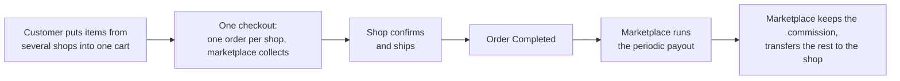

> 🌐 **Language:** [🇻🇳 Tiếng Việt](./multi-vendor_vi.md) · 🇬🇧 English (current)

# Multi-Vendor — A multi-seller marketplace for S-Cart

## Introduction
This document introduces **Multi-Vendor**, the plugin that turns an S-Cart website into a **multi-seller marketplace on a single domain**: many vendors list products on one storefront, a customer buys from several shops in a single checkout, and the marketplace collects the money then pays each seller after keeping a commission. It is written for **business owners and S-Cart site owners** considering opening a marketplace. After reading this page you will know what the plugin does, how far the free edition goes, what the Pro edition adds, and how Multi-Vendor differs from Multi-Store so you can pick the right model from day one.

This is the **index page** of the Multi-Vendor document set. The three other parts go deeper into setup, day-to-day operations and customization.

## Document set

| Part | Contents | For |
| --- | --- | --- |
| **This page** | Marketplace model, what the plugin does, Free/Pro comparison, Multi-Store comparison | Anyone considering a marketplace |
| [Part 1 — Setup](./multi-vendor-setup.md) | Install S-Cart, install the free plugin, add the Pro edition, create your first shop, change URLs, troubleshooting | Whoever installs the website |
| [Part 2 — Operations](./multi-vendor-operations.md) | Marketplace settings, commission and plans, paying sellers, moderation, disputes, identity verification, reports, conditions & rules | Marketplace owner and staff |
| [Part 3 — Customization](./multi-vendor-customize.md) | Change on-screen text and email content, restyle shop pages, staff permissions, safe-update principles | Administrators and developers |

> 👉 Try a live marketplace on the demo site: **https://m-vendor.s-cart.org**

## The model: one marketplace on one domain
Five facts shape everything about how the marketplace works:

1. **One storefront for every seller.** Products from all shops appear together on your website. Each shop has its own page at `/shop/{code}` with a cover image, logo, its own categories and three tabs Products · Reviews · Info; the shop directory lives at `/shop`.
2. **The cart splits per shop.** A customer puts items from several shops into one cart and pays once; the system automatically splits it into **one order per shop**.
3. **The marketplace collects the money.** Only the marketplace owner configures payment gateways. Sellers never enter payment keys and never collect money directly from customers.
4. **The marketplace pays sellers per period.** Periodically the owner runs a payout: the system gathers each shop's **completed** orders, keeps the commission and records the amount due.
5. **Currency and language follow the marketplace.** Shops share the marketplace currency and language — so prices and taxes stay consistent across the whole website.

Sellers get their **own admin area** at `/vendor_admin`, entirely separate from the marketplace admin: they only see their own products, orders and figures.

## What the plugin does

**For customers** — shopping on a real marketplace: browse products from every shop on one website, open the shop directory, visit each shop's own page, read reviews, put items from several shops into one cart and pay once.

**For sellers** — a complete admin area: a dashboard with order charts, products, own categories and banners, order handling for their own shop (confirm orders, update shipping status, enter tracking numbers, print delivery notes), payout details and payment history.

**For the marketplace owner** — you keep the money and the control: decide who may sell and which products go live, set the commission rate, run periodic payouts, read per-shop reports. You retain full control over every shop's products and orders through the S-Cart admin.

The Pro edition adds the tools you need once the marketplace grows: shop plans with periodic fees, clawback when a paid order is refunded, a dispute desk, identity verification, batch payouts, commission reports and B2B wholesale.

### Features by area
Features marked **Pro** require the paid plugin installed alongside the free one.

**Selling on the marketplace**

| Feature | What it does | Edition |
| --- | --- | --- |
| Directory and shop pages | `/shop` lists every shop; each shop has its own page at `/shop/{code}` with cover image, logo, banners, own categories and three tabs Products · Reviews · Info | Free |
| Seller label on products | Product cards show the name and icon of the shop selling them | Free |
| Cart split per shop | Customers buy from several shops in one checkout; the system creates one order per shop | Free |
| Public trust signals | Dispute rate, handling time, dispute response rate and ratings; computed over 90 days, hidden until the shop has enough orders | Free |
| B2B wholesale | Per-shop quick-order page (paste a "SKU, quantity" list, reorder a past order, export an Excel quote); dealer price groups set by each shop; sellers create orders on behalf of a customer at that customer's price | Pro |

**Money flow**

| Feature | What it does | Edition |
| --- | --- | --- |
| The marketplace collects | Only the owner configures payment gateways; sellers never receive money directly | Free |
| Periodic payout ledger | Completed orders are grouped per period: amount due after commission, the seller's payout details, transaction reference | Free |
| Marketplace-wide commission | One rate applied to every shop | Free |
| Per-shop commission | Resolved in order: shop's own rate → plan rate → marketplace rate | Pro |
| Shop plans | Product cap, plan commission and a periodic fee deducted straight from the next payout — a second revenue stream beside commission | Pro |
| Batch payouts | One bank payment file for many shops, Excel statements for both sides to reconcile | Pro |
| Automatic clawback | A paid order later refunded or cancelled creates a negative adjustment, offset against the next period | Pro |
| Reports | Orders per shop; commission per shop and per period, Excel export | Pro |

**Control and operations**

| Feature | What it does | Edition |
| --- | --- | --- |
| Dedicated seller admin area | `/vendor_admin`: dashboard, products, categories, banners, suppliers, orders, shop info, payment history | Free |
| Seller and product moderation | Allow or block self-registration; auto-approve or manually approve each shop and each product | Free |
| Review queue | Shops, products and verification files gathered on one screen; rejection requires a reason and is logged | Pro |
| Seller order scope | The owner chooses: shipping status only · plus order confirmation · plus order completion | Pro (Free stays at confirm + ship) |
| Two-tier disputes | The customer opens one right under the order page; the seller answers first, the marketplace decides last; refunds are recorded on the order | Pro |
| Identity verification (KYC) | Files stored encrypted, a "verified" badge; optionally blocks products from going live and holds payouts until verification completes | Pro |
| Seller-configurable plugins | Shipping, promotions… within the scope the marketplace opens; payment gateways always belong to the marketplace | Pro |
| Email notifications | Free: sellers are emailed on new orders. Pro: plus shop approval, payout, adjustment, dispute emails and pending-review alerts for the marketplace | Free · Pro |

## Free edition vs Pro edition
**Who buys Pro**: the marketplace owner. Sellers and customers pay nothing and never see an upgrade prompt — the free edition only shows the owner where each Pro feature would sit, with an explanation page one click away.

The free edition is **a real, working marketplace for up to 3 shops**. The Pro edition is a second plugin installed **on top of** the free one: once installed, every locked entry point opens the real screen — no reinstall, no data migration.

| | **Free edition** | **Pro edition** |
| --- | --- | --- |
| Number of shops | up to 3 | unlimited |
| Shop pages, directory, trust signals, cart split per shop | yes | yes |
| Commission | one marketplace-wide rate | + **per-shop rates** and plan rates |
| Shop plans (product cap, plan commission, periodic fee deducted from payouts, seller self-service plan choice) | — | yes |
| Periodic payout ledger | yes | + seller **payout details** (encrypted), **Excel statements** for both sides, **batch bank payment files** and one-click batch settlement |
| Clawback after payout (paid order refunded/cancelled) | — | automatic, offset against the next period |
| Disputes / refund requests through the marketplace | — | two-tier desk: seller answers, marketplace decides, refund recorded on the order |
| Seller identity verification (KYC) | — | encrypted files, verified badge, optional hold on products and payouts |
| Moderation | through the shop and product lists | **review queue** covering shops, products and verification files; rejections require a logged reason |
| Seller order handling | shipping status | + confirm / complete, per the level the owner chooses |
| Seller creates orders for customers | — | yes, prices prefilled from the customer's price group |
| Dealer price groups (per-customer-group discounts) | — | yes; a signed-in customer only sees their own price |
| Sellers reply to reviews of their own shop | — | yes (with the Product Rating & Review plugin) |
| Sellers configure marketplace-opened plugins (shipping, promotions…) | — | yes; payment gateways always belong to the marketplace |
| Per-shop B2B quick order | — | yes |
| Per-shop order reports and periodic commission reports, Excel export | — | yes |
| Email | seller: new order | + shop approved, payout done, clawback, verification result, dispute steps; marketplace: pending review |
| Support | community | GP247 paid channel |

How to install Pro on top of the free edition: see [Part 1 — Setup](./multi-vendor-setup.md).

## How Multi-Vendor differs from Multi-Store
Both plugins talk about "multiple shops", but they are **two different business models**, and they **cannot be installed together** on one website (the system blocks it to protect your store data). Choose correctly from the start:

| Criterion | 🛒 **Multi-Vendor** | 🏢 **Multi-Store** |
|---|---|---|
| Who owns the goods | **Many independent sellers** on your marketplace | **One owner** — your own business |
| Model | E-commerce marketplace | Store chain / several brands of one owner |
| Domain | **A single domain**; each shop is a `/shop/{code}` page | **One domain per store** |
| Who lists products | Each seller lists their own, the marketplace approves | You list them and pick which store they belong to |
| Money flow | The marketplace collects, **keeps a commission**, pays sellers per period | Money goes straight to your business, shared with nobody |
| Who logs into admin | Sellers use their own `/vendor_admin` area and only see their shop | You (plus per-store administrators in the Pro edition) |
| Right when | You want to **invite other people** to sell and earn a commission | You want several websites/domains for **one business** |

In short: **Multi-Vendor is a marketplace for many sellers; Multi-Store is many stores of your own.** If every product is yours and you only need several domains, use Multi-Store: [gp247.net/en/product/multi-store-pro.html](https://gp247.net/en/product/multi-store-pro.html).

> ⚠️ **Multi-Vendor and Multi-Store are mutually exclusive.** The installer refuses to install Multi-Vendor if Multi-Store is present (and the other way round), stopping before writing anything. To switch models you must uninstall the other plugin first.

## System requirements
- PHP **8.3** or newer, Composer, MySQL/MariaDB.
- S-Cart **3.x** with `gp247/core` **3.0** and `gp247/shop` installed.
- Multi-Store **not installed** on the same website.
- Runs on ordinary shared hosting: **no** cron, queue worker or websocket required.

## Q&A
**Q1: How is Multi-Vendor different from Multi-Store?**

→ Multi-Store = one domain per store, all goods your own. Multi-Vendor = one shared marketplace on one domain, outside sellers register to sell, the marketplace collects the money and pays them after keeping a commission. The full table is above; the two plugins cannot be installed together.

**Q2: Do sellers get their own website or domain?**

→ No. Every shop lives on the marketplace domain, reachable at `/shop/{shop-code}`.

**Q3: Who collects the customer's money?**

→ The marketplace. Sellers never enter payment gateway keys; the marketplace pays them per period after keeping the commission — see [Part 2 — Operations](./multi-vendor-operations.md).

**Q4: Do I lose anything by starting Free and moving to Pro later?**

→ No. Pro installs on top of Free; shops, seller accounts, orders and the payout ledger stay exactly where they are. Per-shop commission rates you set earlier are kept and take effect the moment Pro is installed.

**Q5: Will sellers or customers ever see an upgrade prompt?**

→ No. Only marketplace administrators see Pro items; a seller who reaches a Pro feature is simply told it belongs to the marketplace's Pro edition and to ask the marketplace.

**Q6: Does the marketplace need cron or a powerful server?**

→ No. The plugin runs on ordinary shared hosting with no cron, queue worker or websocket. Time-based work (for example a dispute past its response deadline) is checked when the relevant screen is opened.

**Q7: Where can I try it before deciding?**

→ The public demo marketplace: https://m-vendor.s-cart.org — open shop pages, the directory and the buying flow as a real customer would.

---

📅 **Last updated:** 2026-09-21 · ✍️ **Author:** GP247
