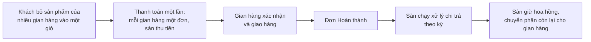

> 🌐 **Ngôn ngữ:** 🇻🇳 Tiếng Việt (hiện tại) · [🇬🇧 English](./multi-vendor.md)

# Multi-Vendor — Sàn thương mại nhiều người bán cho S-Cart

## Giới thiệu
Tài liệu này giới thiệu **Multi-Vendor**, plugin biến một website S-Cart thành **sàn thương mại điện tử nhiều người bán trên một tên miền duy nhất**: nhiều nhà cung cấp (vendor) cùng đăng sản phẩm lên một storefront, khách mua hàng của nhiều gian hàng trong một lần thanh toán, sàn đứng ra thu tiền rồi trả lại người bán sau khi giữ hoa hồng. Dành cho **chủ doanh nghiệp và chủ website S-Cart** đang cân nhắc mở sàn. Đọc xong trang này, bạn biết plugin làm được gì, bản miễn phí cho tới đâu, bản Pro thêm gì, và Multi-Vendor khác Multi-Store thế nào để chọn đúng ngay từ đầu.

Đây là **trang mục lục** của bộ tài liệu Multi-Vendor. Ba phần còn lại đi sâu vào cài đặt, vận hành và tùy chỉnh.

## Mục lục bộ tài liệu

| Phần | Nội dung | Dành cho |
| --- | --- | --- |
| **Trang này** | Mô hình sàn, plugin làm được gì, so sánh Free/Pro, so sánh với Multi-Store | Người đang cân nhắc mở sàn |
| [Phần 1 — Cài đặt](./multi-vendor-setup_vi.md) | Cài S-Cart, cài plugin miễn phí, cài thêm bản Pro, tạo gian hàng đầu tiên, đổi đường dẫn, xử lý sự cố | Người cài đặt website |
| [Phần 2 — Vận hành](./multi-vendor-operations_vi.md) | Cấu hình sàn, hoa hồng và gói, quy trình trả tiền cho người bán, kiểm duyệt, khiếu nại, xác minh danh tính, báo cáo, điều kiện & ràng buộc | Chủ sàn và nhân sự vận hành |
| [Phần 3 — Tùy chỉnh](./multi-vendor-customize_vi.md) | Đổi chữ hiển thị và nội dung email, đổi giao diện trang gian hàng, phân quyền nhân sự, nguyên tắc cập nhật an toàn | Người quản trị và lập trình viên |

> 👉 Xem thử một sàn đang chạy thật tại trang demo: **https://m-vendor.s-cart.org**

## Mô hình: một sàn chung trên một tên miền
Năm điều định hình toàn bộ cách sàn hoạt động:

1. **Một storefront cho mọi người bán.** Sản phẩm của tất cả gian hàng hiện chung trên website của bạn. Mỗi gian hàng có một trang riêng tại `/shop/{mã}` với ảnh bìa, logo, danh mục riêng và ba tab Sản phẩm · Đánh giá · Thông tin; danh bạ gian hàng nằm ở `/shop`.
2. **Giỏ hàng tách theo gian hàng.** Khách bỏ hàng của nhiều gian hàng vào một giỏ và thanh toán một lần; hệ thống tự tách thành **mỗi gian hàng một đơn hàng**.
3. **Sàn thu tiền.** Chỉ chủ sàn cấu hình cổng thanh toán. Người bán không nhập khóa thanh toán và không thu tiền trực tiếp từ khách.
4. **Sàn trả người bán theo kỳ.** Định kỳ, chủ sàn chạy xử lý chi trả: hệ thống gom các đơn **đã hoàn thành** của từng gian hàng, giữ lại hoa hồng và ghi sổ số tiền phải trả.
5. **Tiền tệ và ngôn ngữ theo sàn.** Gian hàng dùng chung tiền tệ và ngôn ngữ của sàn — để giá và thuế nhất quán trên toàn bộ website.

Người bán có **khu quản trị riêng** tại `/vendor_admin`, tách hoàn toàn khỏi khu admin của sàn: họ chỉ thấy sản phẩm, đơn hàng và số liệu của gian hàng mình.

## Plugin làm được gì

**Cho khách hàng** — mua sắm như một sàn thật: duyệt sản phẩm của mọi gian hàng trên cùng website, xem danh bạ gian hàng, vào trang riêng của từng gian hàng, đọc đánh giá, bỏ hàng nhiều gian hàng vào một giỏ rồi thanh toán một lần.

**Cho người bán** — một khu quản trị đầy đủ: bảng điều khiển với biểu đồ đơn hàng, quản lý sản phẩm, danh mục và banner riêng, xử lý đơn của gian hàng mình (xác nhận đơn, cập nhật trạng thái giao hàng, nhập mã vận đơn, in phiếu giao), khai thông tin nhận tiền và xem lịch sử thanh toán.

**Cho chủ sàn** — giữ tiền và giữ quyền: quyết ai được bán và sản phẩm nào được lên sàn, đặt tỷ lệ hoa hồng, chạy chi trả theo kỳ, xem báo cáo theo gian hàng. Toàn quyền trên sản phẩm và đơn hàng của mọi gian hàng qua khu admin S-Cart.

Bản Pro thêm công cụ cho lúc sàn đông người bán: gói gian hàng có phí theo kỳ, thu hồi tiền khi đơn bị hoàn, bàn khiếu nại, xác minh danh tính, chi trả theo lô, báo cáo hoa hồng và bán sỉ cho đại lý.

### Danh sách tính năng theo nhóm
Tính năng ghi **Pro** cần cài thêm plugin trả phí bên cạnh bản miễn phí.

**Bán hàng trên sàn**

| Tính năng | Nội dung | Bản |
| --- | --- | --- |
| Danh bạ và trang gian hàng | `/shop` liệt kê mọi gian hàng; mỗi gian hàng có trang riêng tại `/shop/{mã}` với ảnh bìa, logo, banner, danh mục riêng và ba tab Sản phẩm · Đánh giá · Thông tin | Free |
| Nhãn người bán trên sản phẩm | Thẻ sản phẩm hiện tên và biểu tượng của gian hàng bán nó | Free |
| Giỏ hàng tách theo gian hàng | Khách mua hàng nhiều gian hàng trong một lần thanh toán; hệ thống tạo mỗi gian hàng một đơn riêng | Free |
| Chỉ số tin cậy công khai | Tỷ lệ khiếu nại, thời gian chuẩn bị hàng, tỷ lệ trả lời khiếu nại và đánh giá; tính trên 90 ngày, ẩn khi gian hàng chưa đủ đơn | Free |
| Bán sỉ cho đại lý | Trang đặt hàng nhanh theo gian hàng (dán danh sách "SKU, số lượng", đặt lại đơn cũ, xuất báo giá Excel); nhóm giá đại lý do từng gian hàng tự đặt; người bán tạo đơn hộ khách theo đúng giá của khách đó | Pro |

**Dòng tiền**

| Tính năng | Nội dung | Bản |
| --- | --- | --- |
| Sàn thu tiền | Chỉ chủ sàn cấu hình cổng thanh toán; người bán không nhận tiền trực tiếp từ khách | Free |
| Sổ chi trả theo kỳ | Đơn hoàn thành được gom theo kỳ: số tiền phải trả sau hoa hồng, tài khoản nhận tiền của người bán, mã giao dịch | Free |
| Hoa hồng toàn sàn | Một tỷ lệ áp cho mọi gian hàng | Free |
| Hoa hồng riêng từng gian hàng | Phân giải theo thứ tự: tỷ lệ riêng của gian hàng → tỷ lệ của gói → tỷ lệ sàn | Pro |
| Gói gian hàng | Trần sản phẩm, hoa hồng theo gói và phí theo kỳ được trừ thẳng vào lần chi trả kế tiếp — nguồn thu thứ hai ngoài hoa hồng | Pro |
| Chi trả theo lô | Một file lệnh chi ngân hàng cho nhiều gian hàng, bảng kê Excel cho cả hai bên đối soát | Pro |
| Thu hồi tự động | Đơn đã trả tiền bị hoàn hoặc hủy sẽ tạo dòng điều chỉnh âm, bù trừ vào kỳ kế tiếp | Pro |
| Báo cáo | Đơn hàng theo gian hàng; hoa hồng theo gian hàng và theo kỳ, xuất Excel | Pro |

**Kiểm soát và vận hành**

| Tính năng | Nội dung | Bản |
| --- | --- | --- |
| Khu quản trị riêng cho người bán | `/vendor_admin`: bảng điều khiển, sản phẩm, danh mục, banner, nhà cung cấp, đơn hàng, thông tin gian hàng, lịch sử thanh toán | Free |
| Kiểm duyệt người bán và sản phẩm | Cho hoặc chặn tự đăng ký; tự động duyệt hoặc duyệt tay từng gian hàng, từng sản phẩm | Free |
| Hàng chờ duyệt | Gom gian hàng, sản phẩm và hồ sơ xác minh về một màn; từ chối bắt buộc có lý do và được ghi nhật ký | Pro |
| Phạm vi người bán xử lý đơn | Chủ sàn chọn: chỉ trạng thái giao hàng · thêm xác nhận đơn · thêm hoàn tất đơn | Pro (Free ở mức xác nhận + giao hàng) |
| Khiếu nại hai cấp | Khách mở ngay dưới trang đơn; người bán trả lời trước, sàn quyết sau; khoản hoàn ghi thẳng vào đơn | Pro |
| Xác minh danh tính (KYC) | Hồ sơ lưu mã hóa, huy hiệu "đã xác minh"; tùy chọn chặn sản phẩm lên sàn và giữ tiền chi trả tới khi xác minh xong | Pro |
| Người bán tự cấu hình plugin | Vận chuyển, khuyến mãi… trong phạm vi sàn mở; cổng thanh toán luôn thuộc về sàn | Pro |
| Email thông báo | Free: người bán nhận email khi có đơn mới. Pro: thêm email duyệt gian hàng, chi trả, điều chỉnh, khiếu nại và mục chờ duyệt cho sàn | Free · Pro |

## So sánh bản miễn phí và bản Pro
**Ai mua Pro**: chủ sàn. Người bán và khách hàng không trả gì và không bao giờ thấy lời mời nâng cấp — bản miễn phí chỉ cho chủ sàn thấy mỗi tính năng Pro sẽ nằm ở đâu, bấm vào là có trang giải thích.

Bản miễn phí là **một sàn chạy thật cho tối đa 3 gian hàng**. Bản Pro là plugin thứ hai cài **thêm** lên bản miễn phí: cài xong, mọi lối vào đang khóa mở thẳng màn thật — không cài lại, không chuyển dữ liệu.

| | **Bản miễn phí** | **Bản Pro** |
| --- | --- | --- |
| Số gian hàng | tối đa 3 | không giới hạn |
| Trang gian hàng, danh bạ, chỉ số tin cậy, giỏ tách theo gian hàng | có | có |
| Hoa hồng | một tỷ lệ toàn sàn | + **tỷ lệ riêng từng gian hàng** và tỷ lệ theo gói |
| Gói gian hàng (trần sản phẩm, hoa hồng theo gói, phí kỳ trừ vào chi trả, người bán tự chọn gói) | — | có |
| Sổ chi trả theo kỳ | có | + **tài khoản nhận tiền** của người bán (mã hóa), **bảng kê Excel** hai bên, **file lệnh chi ngân hàng theo lô** và ghi nhận đã chi cả lô một lần |
| Thu hồi sau chi trả (đơn đã trả bị hoàn/hủy) | — | tự động, bù trừ vào kỳ kế tiếp |
| Khiếu nại / yêu cầu hoàn tiền qua sàn | — | bàn hai cấp: người bán trả lời, sàn quyết, hoàn tiền ghi vào đơn |
| Xác minh danh tính người bán (KYC) | — | hồ sơ mã hóa, huy hiệu đã xác minh, tùy chọn giữ sản phẩm và chi trả |
| Kiểm duyệt | qua danh sách gian hàng và sản phẩm | **hàng chờ duyệt** gom gian hàng, sản phẩm và hồ sơ xác minh; từ chối có lý do được ghi nhật ký |
| Người bán xử lý đơn | trạng thái giao hàng | + xác nhận / hoàn tất theo mức sàn chọn |
| Người bán tạo đơn cho khách | — | có, giá điền sẵn theo nhóm giá của khách |
| Nhóm giá đại lý (chiết khấu theo nhóm khách) | — | có, khách đăng nhập chỉ thấy giá của mình |
| Người bán trả lời đánh giá của gian hàng mình | — | có (cùng plugin Product Rating & Review) |
| Người bán tự cấu hình plugin sàn mở (vận chuyển, khuyến mãi…) | — | có; cổng thanh toán luôn thuộc sàn |
| Đặt hàng nhanh B2B theo gian hàng | — | có |
| Báo cáo đơn theo gian hàng và báo cáo hoa hồng theo kỳ, xuất Excel | — | có |
| Email | người bán: đơn mới | + gian hàng được duyệt, đã chi trả, thu hồi, kết quả xác minh, các bước khiếu nại; sàn: có mục chờ duyệt |
| Hỗ trợ | cộng đồng | kênh trả phí của GP247 |

Cách cài bản Pro lên bản miễn phí: xem [Phần 1 — Cài đặt](./multi-vendor-setup_vi.md).

## Multi-Vendor khác Multi-Store thế nào
Hai plugin cùng nói về "nhiều cửa hàng" nhưng là **hai mô hình kinh doanh khác nhau**, và **không cài chung được** trên một website (hệ thống chặn để tránh hỏng dữ liệu cửa hàng). Chọn đúng ngay từ đầu:

| Tiêu chí | 🛒 **Multi-Vendor** | 🏢 **Multi-Store** |
|---|---|---|
| Ai sở hữu hàng hóa | **Nhiều người bán** độc lập cùng bán trên sàn của bạn | **Một chủ** — chính doanh nghiệp của bạn |
| Mô hình | Sàn thương mại điện tử (marketplace) | Chuỗi cửa hàng / nhiều thương hiệu của cùng một chủ |
| Tên miền | **Một tên miền duy nhất**; mỗi gian hàng là một trang `/shop/{mã}` | **Mỗi cửa hàng một tên miền** riêng |
| Ai đăng sản phẩm | Từng người bán tự đăng, sàn duyệt | Bạn đăng, chọn sản phẩm thuộc cửa hàng nào |
| Dòng tiền | Sàn thu tiền khách, **giữ hoa hồng**, chi trả lại người bán theo kỳ | Tiền về thẳng doanh nghiệp bạn, không chia cho ai |
| Ai đăng nhập quản trị | Người bán vào khu riêng `/vendor_admin`, chỉ thấy gian hàng mình | Bạn (và quản trị viên từng cửa hàng ở bản Pro) |
| Phù hợp khi | Bạn muốn **mời người khác** vào bán và ăn hoa hồng | Bạn muốn nhiều website/tên miền cho **cùng một doanh nghiệp** |

Nói ngắn gọn: **Multi-Vendor = một cái chợ cho nhiều người bán; Multi-Store = nhiều cửa hàng của chính bạn.** Nếu tất cả hàng hóa đều là của bạn và bạn chỉ cần nhiều tên miền, hãy dùng Multi-Store: [gp247.net/vi/product/multi-store-pro.html](https://gp247.net/vi/product/multi-store-pro.html).

> ⚠️ **Multi-Vendor và Multi-Store loại trừ lẫn nhau.** Trình cài đặt từ chối cài Multi-Vendor nếu website đang có Multi-Store (và ngược lại), dừng ngay trước khi ghi bất cứ gì. Muốn đổi mô hình thì phải gỡ plugin kia trước.

## Yêu cầu hệ thống
- PHP **8.3** trở lên, Composer, MySQL/MariaDB.
- S-Cart **3.x** với `gp247/core` **3.0** và `gp247/shop` đã cài.
- **Chưa cài** plugin Multi-Store trên cùng website.
- Chạy được trên hosting chia sẻ thông thường: **không cần** cron, queue worker hay websocket.

## Hỏi & Đáp (Q&A)
**Câu 1: Multi-Vendor khác Multi-Store ở đâu?**

→ Multi-Store = mỗi cửa hàng một tên miền, hàng hóa của chính bạn. Multi-Vendor = một sàn chung trên một tên miền, nhiều người bán bên ngoài đăng ký bán, sàn thu tiền rồi trả sau khi giữ hoa hồng. Bảng so sánh đầy đủ ở mục trên; hai plugin không cài chung được.

**Câu 2: Người bán có website hay tên miền riêng của họ không?**

→ Không. Mọi gian hàng nằm trên tên miền của sàn, truy cập theo đường dẫn `/shop/{mã-gian-hàng}`.

**Câu 3: Ai thu tiền của khách?**

→ Sàn thu. Người bán không nhập khóa cổng thanh toán; sàn trả họ theo kỳ sau khi giữ hoa hồng — xem [Phần 2 — Vận hành](./multi-vendor-operations_vi.md).

**Câu 4: Bắt đầu bằng bản miễn phí rồi lên Pro sau có mất gì không?**

→ Không. Pro cài thêm lên bản miễn phí; gian hàng, tài khoản người bán, đơn hàng và sổ chi trả giữ nguyên chỗ. Tỷ lệ hoa hồng riêng bạn từng đặt vẫn được lưu và có hiệu lực ngay khi cài Pro.

**Câu 5: Người bán hay khách hàng có bao giờ thấy lời mời nâng cấp không?**

→ Không. Chỉ quản trị viên sàn thấy các mục Pro; người bán chạm tới một tính năng Pro chỉ được báo rằng tính năng thuộc bản Pro của sàn và hãy đề nghị sàn.

**Câu 6: Sàn có cần cron hay máy chủ mạnh không?**

→ Không. Plugin chạy trên hosting chia sẻ thông thường, không cần cron, queue worker hay websocket. Những việc theo thời hạn (ví dụ khiếu nại quá hạn phản hồi) được kiểm ngay khi mở màn tương ứng.

**Câu 7: Muốn xem thử trước khi quyết định thì xem ở đâu?**

→ Sàn demo công khai: https://m-vendor.s-cart.org — mở trang gian hàng, danh bạ và luồng mua hàng như một khách thật.

---

📅 **Cập nhật lần cuối:** 2026-09-21 · ✍️ **Tác giả (Author):** GP247
