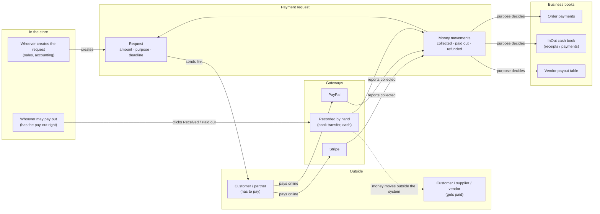
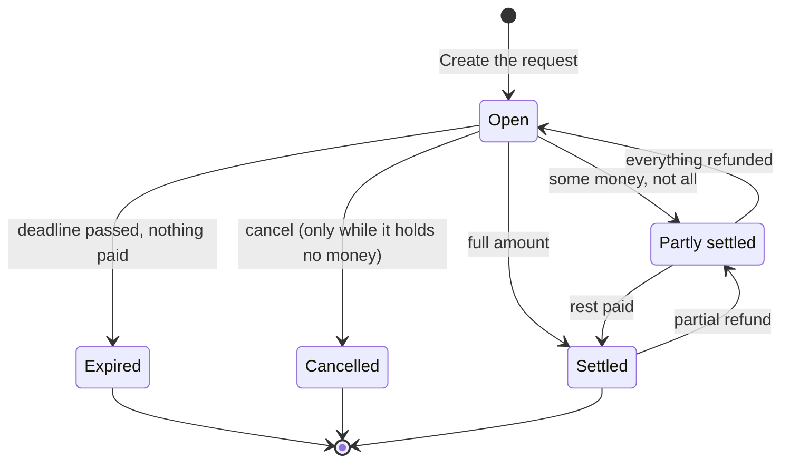
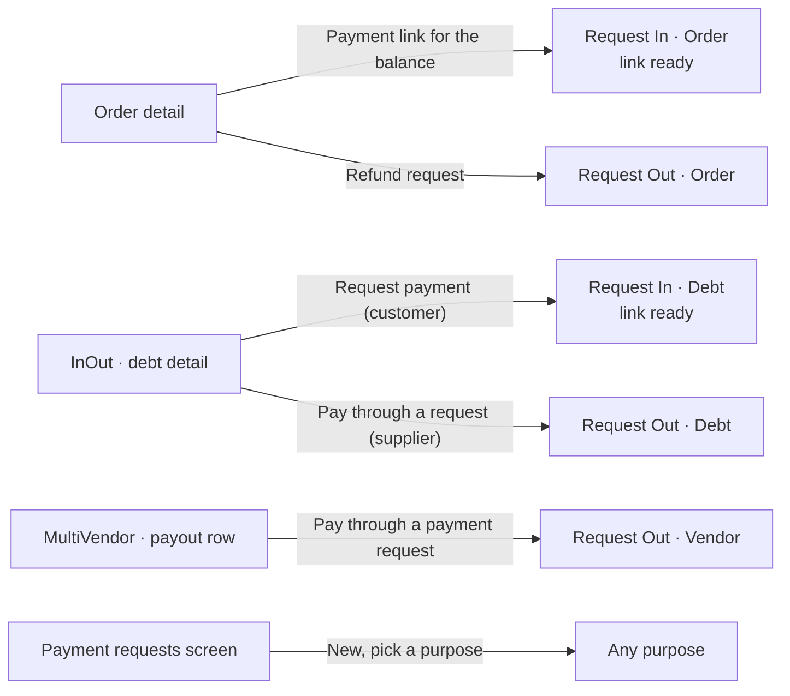
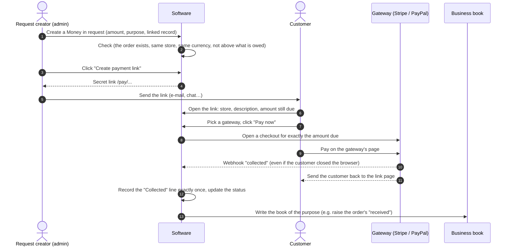
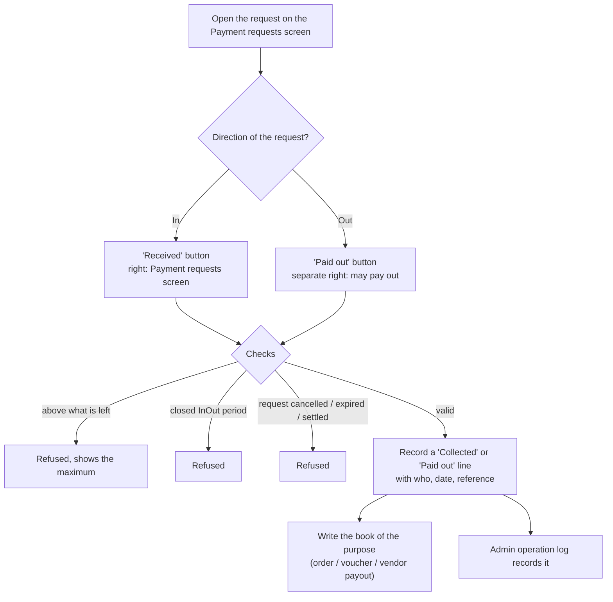
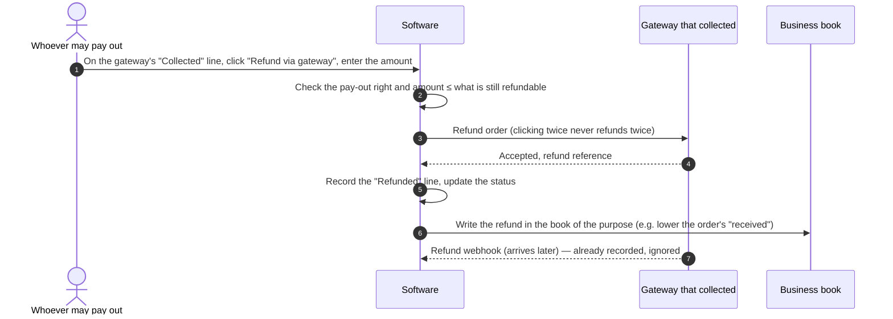
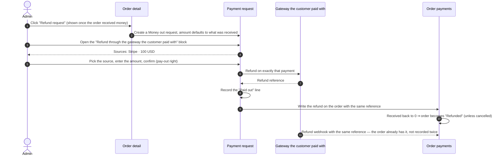

> 🌐 **Language:** [🇻🇳 Tiếng Việt](./payment-request_vi.md) · 🇬🇧 English (current)

# Payment requests — money flows outside the shopping cart

## Introduction
This document explains, in business terms, the **Payment requests** feature: what it is for, which paths money takes,
and which book each amount is written into. It is meant for store owners, accountants and operations staff. After
reading it you will know how to create a request, send a link so a customer pays online, record bank transfers and cash,
refund money, and why the system blocks certain actions.

## 1. What a payment request is

The store's checkout only takes money when a customer places an order. In real life there is plenty of money that is
**not in a shopping cart**: a customer pays a deposit and then the rest, part of an order is refunded because an item
was missing, a wholesale customer settles a debt, a supplier gets paid, a marketplace pays a vendor its sales, a separate
service fee is collected.

A **payment request** is a "slip" that records **who** has to pay or gets paid, **how much**, **in which currency**,
**what for**, and **until when**. Every time money really moves (the customer pays through Stripe, the accountant makes a
bank transfer…) it is recorded as a **money movement** under that slip. When the money arrives, the software writes it on
into the book of the matching business record: the order's payments, the InOut cash book, or the vendor payout table.

| 🟢 **Money in** | 🔴 **Money out** |
|---|---|
| A customer / partner pays the store | The store pays a customer / partner / vendor |

**What the store gains**
- **Collect what the cart cannot** — the customer just opens the link and pays online: no account, no new order.
- **Every amount in and out leaves a trail** — who recorded it, when, through which gateway, with which reference. No more digging through chats and bank statements at month end.
- **No double entry** — money for an order goes straight onto the order, a debt payment becomes a receipt/payment voucher in the cash book, a vendor payout closes the payout row.
- **Mistakes are blocked** — no hand entry above what is owed, no refund above what was collected, and the right to **pay money out** is separate from the right to create requests.

## 2. Words used in this document

| Word | Meaning |
|---|---|
| **Request** | A slip asking for money (money in) or a slip to pay money (money out). It has an amount, a currency, a purpose, a linked record and a deadline. |
| **Direction** | **In** = money coming into the store. **Out** = money leaving the store (payments, refunds). |
| **Purpose** | The business task the request serves. It decides which book is written when money moves: free-form, order, InOut debt, vendor payout. |
| **Linked record** | The record the request is attached to: an order ID, a customer / supplier code, a vendor payout row. |
| **Money movement** | One real movement of money: **Collected**, **Paid out** or **Refunded**. Each line carries the gateway's reference or the reference typed by whoever recorded it. |
| **Gateway** | How the money moves: Stripe, PayPal (online — provided by payment plugins), or **Recorded by hand** (bank transfer / cash outside the system). |
| **Payment link** | A secret `/pay/…` address sent to whoever has to pay. It shows the amount due and lets them choose an online gateway. |
| **Webhook** | A message the payment gateway sends straight to your server to say "collected / refunded" — even if the customer has closed the browser. |

## 3. The big picture

Three groups take part: **people in the store** create and record requests, **payers / payees** outside the store, and
**gateways** that move the money. The software keeps the request and its money movements in the middle, then tells the
matching business book.



The **Free-form (no linked record)** purpose writes no other book: its money stays on the request, for amounts that
belong to no order, debt or vendor.

## 4. The life of a request

The status is **worked out from the money that has moved**; nobody sets it by hand.

| Status | When |
|---|---|
| **Open** | Nothing recorded yet. |
| **Partly settled** | Some money recorded, but less than requested. |
| **Settled** | The full amount recorded. |
| **Expired** | It has a deadline, the deadline has passed and nothing has been received yet. Shown automatically — no scheduled job needed. |
| **Cancelled** | You cancelled the request (only possible while it holds no money). |



- Once a request holds money, **Direction, Amount and Currency are locked**; the description, party and deadline can still be edited.
- A request that holds money **cannot be cancelled or deleted**. To give money back, use a refund flow (sections 8, 9).
- An expired or cancelled request takes no hand entries and its link no longer accepts payments. Money a gateway
  **has really collected** is still recorded (see "Conditions & Rules").

## 5. Purposes and the books they write

The purpose decides which record the request must be attached to and **which book the money is written into**. When you
pick a purpose, the **Linked record** field relabels itself (e.g. to "Order ID") and shows a red error right under the
field if it is wrong. A plugin's purpose only appears while that plugin is installed and active.

| Purpose | Comes with | Direction | Linked to | When money moves, it is written into | Example |
|---|---|---|---|---|---|
| **Free-form (no linked record)** | Built in | 🟢 In · 🔴 Out | Optional | The request only | Installation fee, event deposit, referral commission |
| **Order: collect the balance** | Built in | 🟢 In | Order ID (e.g. `OD-SZz76cP2`) | The order's payments: "received" goes up, "due" goes down, the payment status updates itself. The order status does not change by itself | A 30% deposit order paying the other 70%; an admin-created order not paid yet |
| **Order: refund the customer** | Built in | 🔴 Out | Order ID | The order's payments: one refund line, "received" goes down. At 0 the order becomes **Refunded** (unless it was cancelled) | Refund 20% for a missing item; refund a returned order in full |
| **Partner debt (InOut)** | InOut plugin | 🟢 Collect a customer's debt · 🔴 Pay a supplier | Customer / supplier code | The cash book: one receipt or payment voucher for that partner; the debt goes down by itself. That voucher is locked against edit/delete in the cash book | Collecting a wholesale customer's debt at month end; paying a supplier for goods |
| **Vendor payout (marketplace)** | MultiVendor plugin | 🔴 Out | The period's payout row | The vendor payout table: once fully paid, that period's row becomes **Paid** with the transaction reference, and the vendor is notified | The marketplace pays a shop its September sales |

### Where to create a request from



**Creating from the business screen is the safest way**: the amount, currency, store, payer and linked record are filled
in from the original record. On the order detail, **Payment link for the balance** only shows while the order still owes
money, and **Refund request** only shows once the order has received money.

**Creating directly on the Payment requests screen**:
1. Open the menu **System config → Payment requests**.
2. Pick the **Direction**: *Money in (collect)* or *Money out (pay / refund)*.
3. Pick the **Purpose**, then fill the **Linked record** if the purpose needs one (follow the hint under the field).
4. Enter the **Amount** and pick the **Currency** from the store's currency list.
5. Enter the **Party** (who pays / gets paid) and, if you like, e-mail, phone, **Description** (the customer sees it on the payment page) and **Valid until**.
6. Save.

   If it worked, the request appears under **Requests** with the status **Open**, together with who created it and when.
   Click **New request** to go back and create another one.

## 6. Flow A · Collect money through a payment link

Use it when you want the customer to **pay online by themselves**: the balance of an order, a deposit, a debt, a service fee.

1. Open a **Money in** request and, under **Payment link**, click **Create payment link** (requests created from the order or debt screen already have one).
2. Click **Copy** and send the link to the customer (e-mail, chat, messaging app…).
3. The customer opens the link and sees the store name, the description, the payer's name, the **Amount due** and the deadline (if any).
4. The customer picks a gateway under **Choose a payment method**, clicks **Pay now** and pays on the gateway's page.
5. The gateway reports back by webhook; the software **records a Collected line by itself** and writes the business book. Nothing more to do on your side.

   If it worked, the request shows a **Collected** line with the gateway name and its transaction reference; the customer
   sees "This has been paid. Thank you!".



- The link page only shows **online gateways that are enabled and configured for the store that owns the request**; the
  money always lands in that store's gateway account. **Recorded by hand** is never shown to the customer.
- Link leaked or sent to the wrong person: click **Re-issue link** — the old link stops working at once.
- The link page **never shows** the e-mail, phone or internal notes, and asks search engines not to index it.

**What the customer sees when they cannot pay**

| The customer sees | Meaning |
|---|---|
| "This has been paid. Thank you!" | The request is **Settled**. |
| "This payment request was cancelled." | You cancelled the request. |
| "This payment link has expired — please contact the store." | The request is **Expired**. |
| "No online payment method is available — please contact the store to pay." | The store has no enabled online gateway that can collect. |
| "This cannot be paid online right now — please contact the store." | The purpose is no longer active (e.g. its plugin was turned off) or nothing is left to pay. |
| A "not found" page | Wrong link, a link that was re-issued, a **Money out** request, or another store's link. All of them answer with the same page, so someone guessing links learns nothing. |

## 7. Flow B · Record by hand (bank transfer, cash)

Use it when the money already moved **outside the system**: the customer made a bank transfer or paid cash, or the
accountant already transferred money to a supplier / vendor.

1. Open the request on the **Payment requests** screen.
2. In the recording box, check the **Amount** (pre-filled with what is still outstanding), type the **Reference** (e.g. the bank transaction ID) and the **Date** (pre-filled with today).
3. Click **Received** (money in request) or **Paid out** (money out request).

   If it worked, you see "Money recorded." and a new money movement with who recorded it, the date and the reference.



> ⚠️ The system **only records**; it never sends money out by itself. Clicking **Paid out** means you confirm you *have*
> paid the payee through your own channel. Paying money out always needs the separate **"may pay out" right** — whoever
> creates a money-out request may not be the person allowed to record that it was paid.

## 8. Flow C · Refund an amount collected through a link

The customer paid a money-in request through Stripe / PayPal and now part or all of it has to be given back. The money
goes back to **the same card / PayPal account** the customer used.

1. Open the request and, on the online gateway's **Collected** line, click **Refund via gateway**.
2. Enter the **Refund amount** (at most what is still refundable on that line), click **Refund** and confirm.

   If it worked: "Refund sent and recorded" — a **Refunded** line appears and the status steps back to partly settled /
   open. If the gateway refuses (refund window over, insufficient balance…): "The gateway refused the refund — see the
   error log" and **nothing is recorded**.



- Refunding **directly in the Stripe / PayPal dashboard** works too: the webhook brings it back onto the right request.
- An amount **recorded by hand** has no gateway refund button (that money never went through a gateway). To give back money
  a customer transferred, create a **Money out** request and click **Paid out** after transferring it back.

## 9. Flow D · Refund an order paid at checkout

The customer paid the order with Stripe / PayPal at checkout (not through a link) and now needs a refund.

1. Open the **order detail** and, in the **Payment requests** block, click **Refund request**. The software creates a
   **Money out** request with the purpose **Order: refund the customer**, the amount defaulting to what the order received.
2. Open that request: the **Refund through the gateway the customer paid with** block lists the customer's gateway
   payments for the order (*refund sources*), e.g. "Stripe · 100 USD".
3. Pick a source, enter the amount, confirm (needs the pay-out right).

   If it worked, the money goes back to the customer's card / wallet and the order gets a refund line carrying the
   gateway's own refund reference.



If you refund **outside the system** (a bank transfer back to the customer), use Flow B: once transferred, click
**Paid out** and the order records the matching refund.

## 10. Common business situations

| Situation | How | Result in the books |
|---|---|---|
| Customer paid a 30% deposit, pays the rest on delivery | Order detail → **Payment link for the balance** → send the link (Flow A) | Order: 100% received, 0 due |
| Customer pays the rest of an order by bank transfer | Open the order's money-in request → **Received** with the bank reference (Flow B) | Order: one more payment line |
| Item missing, refund 20% of an order paid with Stripe | Order detail → **Refund request** → refund through the Stripe source (Flow D) | Order: one refund line with Stripe's reference; the order keeps its status because money remains |
| Collect a wholesale customer's debt | InOut → customer debt detail → **Request payment** → send the link or click **Received** | Cash book: receipt; the customer's debt goes down |
| Pay a supplier | InOut → supplier debt detail → **Pay through a request** → the accountant transfers → someone with the pay-out right clicks **Paid out** | Cash book: payment voucher; the supplier debt goes down |
| Marketplace pays a vendor its period | MultiVendor → payout row → **Pay through a payment request** → transfer → **Paid out** | Payout row: **Paid**, the vendor is notified |
| Customer paid twice by mistake (two tabs) | Nothing to do to record it: both payments are recorded. Then refund the extra one through the gateway (Flow C) | Request: collected above the amount, with a reconciliation note |
| Collect an amount that belongs to no order (installation fee) | Payment requests screen → purpose **Free-form (no linked record)** → create a link | The request only |

## 11. Who can do what

There are two rights, granted to roles like any other right: **Payment requests** (the Payment requests screen) and
**Payment requests - pay out / refund** (may pay out). The top administrator account has both.

| Role | Can | Cannot |
|---|---|---|
| Has **Payment requests** | Create, edit, cancel requests holding no money; create / re-issue links; record **money in** by hand (Received) | Record a payout, refund |
| Also has **pay out / refund** | Everything above + **Paid out**, refund via gateway, refund through an order's source | — |
| Whoever edits orders / InOut / vendor payouts | Sees the create-request buttons **only if** they also have **Payment requests** | Create a request without that right |
| Customer / partner with the link | See the amount due, pick a gateway, pay | See the e-mail, phone, internal notes; pay a money-out request; use an old link after it was re-issued |
| Payment gateway (webhook) | Report collected, refunded (with a verified signature) | Record money with a wrong signature |

The pay-out right is **separate** so sales staff can create requests and collect money without being able to record
payouts themselves. Every money entry also goes into the admin operation log.

## 12. Customising the payment page (for template authors)

The default payment page is **a standalone page**: it carries its own CSS and depends on no template, so it always
renders correctly whether the site uses the default template or another one. It has a dark mode and works well on phones.

To give the page your site's own look, create a file with the same name in your template — it is used instead of the default:

1. Find the folder name of the template in use, e.g. `MyTheme` (inside `app/GP247/Templates/`).
2. Open a **Terminal** in the site's root folder and run, one after the other (replace `MyTheme` with your template's name):

   ```bash
   mkdir -p app/GP247/Templates/MyTheme/screen
   cp vendor/gp247/shop/src/Views/templates/GP247Front/screen/shop_payment_request.blade.php app/GP247/Templates/MyTheme/screen/
   ```

3. Edit `app/GP247/Templates/MyTheme/screen/shop_payment_request.blade.php` as you like.
4. Open any payment link to see the result. To go back to the default, just delete the file you created.

> Keep the gateway choice (`name="gateway"`), the submit button and `@csrf` in the form, or customers will not be able to
> pay. The top of the default file lists the variables you can use (amount due, total, state, gateways…).

## 13. Installation

- **Fresh install** of `gp247/shop`: the feature is there, nothing to do.
- **Running site**, after updating the `gp247/shop` package, run in the site's root folder:

  ```bash
  php artisan gp247:shop-update
  ```

  If it worked, the menu **System config → Payment requests** appears. The command only adds the missing tables, menu,
  rights and labels — it deletes or overwrites nothing, and running it again is safe. Until it has run, the Payment
  requests screen shows how to run it, and the create-request buttons on the order / InOut / MultiVendor screens hide
  themselves — no error page.

Uninstalling `gp247/shop` **does not delete** payment request data, so the money history is intact if you reinstall.

## Conditions & Rules (know before you act)

**When creating / editing a request**
- **The amount must be greater than 0**, rounded to the currency's decimals — so the slip matches the money really collected.
- **The currency must be in the store's currency list** — no mistyped currency codes.
- **The purpose must allow the chosen direction** — e.g. *Order: collect the balance* is Money in only.
- **The linked record must exist, in the same store and the same currency** — so the money lands in the right book:
  - Order: what you collect cannot exceed **the order's balance**, what you refund cannot exceed **what the order received**.
  - InOut debt: only **the cash book's base currency** (the cash book is kept in one currency).
  - Vendor payout: only an **unpaid payout row with an amount > 0**, not above that row; only **the marketplace (root store)** does it.
- **Once money has moved, Direction, Amount and Currency cannot change** — the books were written with those values; changing them now would put the books out of line.

**When recording by hand (Received / Paid out) — strict checks**
- **Not above what is left** — "Only … is still outstanding on this request". To collect more, create a new request.
- **Not on a request that is cancelled, expired or settled**, or whose purpose is no longer active.
- **Not into a closed InOut period** — so figures of a closed period never change.
- **Paid out needs the pay-out right.**

**When money moves through an online gateway**
- **Each amount is recorded exactly once** — every movement carries the gateway's transaction reference; repeated
  webhooks, the customer coming back while the webhook arrives, double clicks… are all recorded once.
- **Money a gateway has collected is always recorded** — even above the requested amount, on a request just cancelled or
  expired, or in a closed InOut period (then dated today). The line carries a reconciliation note for you to handle (e.g.
  refund the extra). Why: the money really reached the account; refusing to record it would put the books out of line
  with the real account.
- **Cancelling a request does not close a checkout the customer already has open on the gateway's page.** If they still
  pay, the money is recorded with a reconciliation note so you can refund it.
- **The store's own account** — every Stripe / PayPal call uses the settings of the store that owns the request.

**When refunding**
- **Gateway refunds only for amounts collected through a gateway that supports refunds**, and each refund is tied to its
  original collection — **total refunds of an amount never exceed that amount**.
- Refunding needs the **pay-out right**.

**When cancelling / deleting**
- **Only a request holding no money can be cancelled or deleted** — a request with money is a record of it; deleting it
  would lose the money trail. Cash-book vouchers created by a request are also locked against edit/delete in the cash
  book — handle them on the request itself.

**Payment links**
- Only for **Money in** requests that still take money.
- **Anyone with the link can pay that amount** — send it to the right person only; if it leaks, **Re-issue link**. The
  link code is long and unguessable, and the system only stores it hashed and encrypted.
- A link only opens on the domain of **the store** that owns the request.

## Q&A

**Q1: The customer already transferred the money to me — what do I do?**

→ Open the request, type the bank transaction reference in the recording box and click **Received** (Flow B, section 7).

**Q2: When I click "Paid out", does the system send the money?**

→ No. "Paid out" only records that you paid through your own channel. The system only moves money itself when you **refund via an online gateway**.

**Q3: Why can't I change the amount of a request?**

→ The request already holds money, so Direction, Amount and Currency are locked to keep the books in line. Create a new request for the difference.

**Q4: The payment page only says "No online payment method is available"?**

→ The store has no enabled online gateway that can collect. Install and enable a payment plugin (e.g. StripePayment,
PaypalExpress) for that store.

**Q5: I sent the link to the wrong person — what now?**

→ Click **Re-issue link** in the request. The old link stops working at once; send the new link to the right person.

**Q6: The customer paid twice through the gateway — how is that recorded?**

→ Both payments are recorded because the money really arrived; the extra line carries a reconciliation note. Use **Refund via gateway** on the extra line to give it back (Flow C).

**Q7: I refunded directly in the Stripe/PayPal dashboard — do I need to record it?**

→ No, for amounts the customer paid through a payment link: the gateway reports it by webhook and the refund is recorded on the right request.

**Q8: I don't see the "Partner debt" / "Vendor payout" purposes, or the create-request buttons on the order screen?**

→ A plugin's purpose only appears while InOut / MultiVendor is installed and enabled. The create-request buttons on
business screens need the **Payment requests** right, and on an order they only show while the order owes money
(collect) or has received money (refund).

**Q9: What is the deadline for?**

→ For a request that has received nothing yet, once the deadline passes the request becomes **Expired** and the link no
longer takes payments. Without a deadline, the link works until the amount is paid in full or the request is cancelled.

**Q10: The payment page does not match my site's look — can I change it?**

→ Yes. Create `screen/shop_payment_request.blade.php` in your template (section 12); delete that file to go back to the default.

---

<sub>📅 **Last updated:** 2026-10-02 · ✍️ **Author:** GP247</sub>
