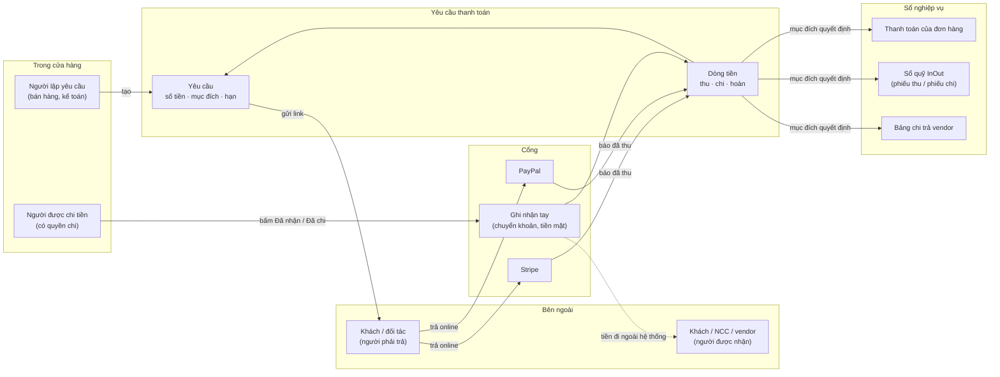
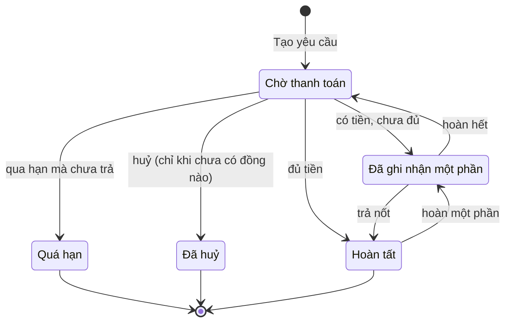
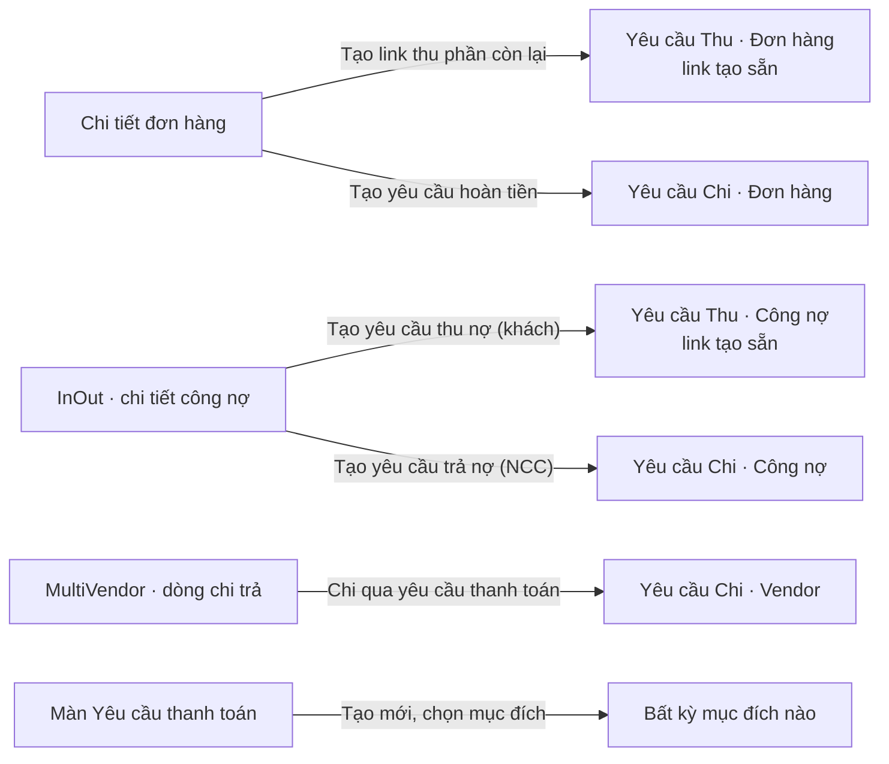
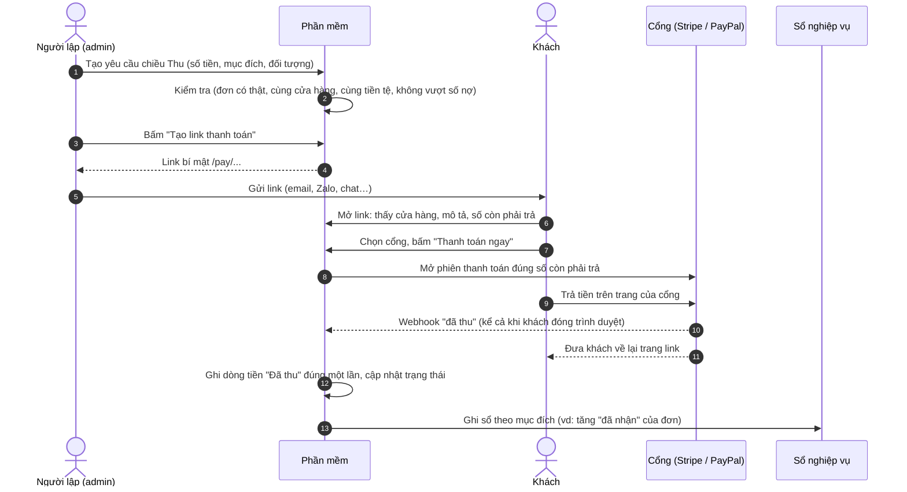
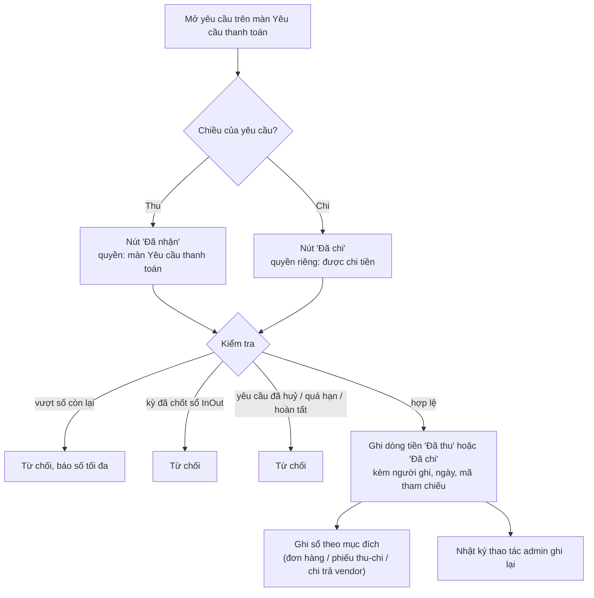
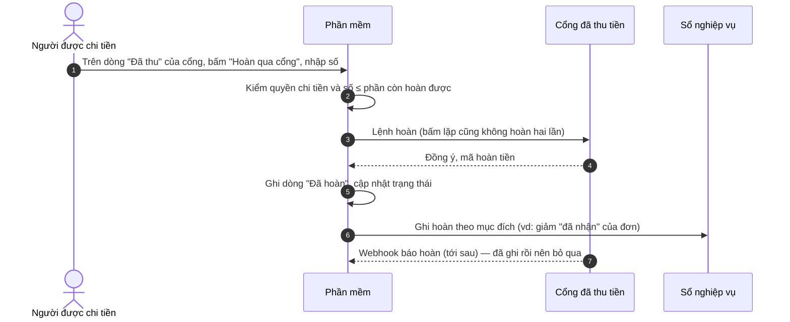
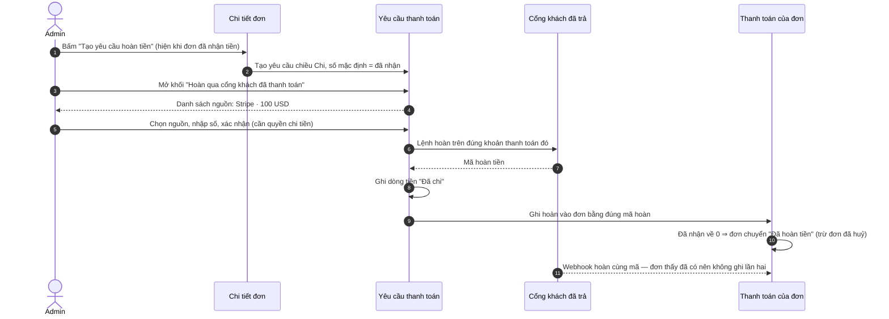

> 🌐 **Ngôn ngữ:** 🇻🇳 Tiếng Việt (hiện tại) · [🇬🇧 English](./payment-request.md)

# Yêu cầu thanh toán (Payment Request) — các luồng tiền ngoài giỏ hàng

## Giới thiệu
Tài liệu này giải thích bằng ngôn ngữ nghiệp vụ chức năng **Yêu cầu thanh toán**: nó dùng để làm gì, tiền đi theo những
đường nào, và mỗi khoản tiền được ghi vào sổ nào. Dành cho chủ cửa hàng, kế toán và nhân viên vận hành. Đọc xong bạn
biết tạo yêu cầu, gửi link cho khách trả online, ghi nhận tiền chuyển khoản/tiền mặt, hoàn tiền, và hiểu vì sao hệ thống
chặn một số thao tác.

## 1. Yêu cầu thanh toán là gì

Giỏ hàng của cửa hàng chỉ thu tiền khi khách đặt đơn. Trong thực tế còn nhiều khoản tiền **không nằm trong giỏ hàng**:
khách đặt cọc rồi trả nốt, hoàn một phần tiền vì giao thiếu hàng, thu nợ khách sỉ, trả tiền nhà cung cấp, trả tiền bán
hàng cho vendor trên sàn, thu một khoản phí dịch vụ riêng.

Một **yêu cầu thanh toán** là một "phiếu" ghi: **ai** phải trả hoặc được nhận, **bao nhiêu**, **bằng tiền gì**, **cho
việc gì**, và **hạn đến khi nào**. Mỗi lần tiền thật sự di chuyển (khách trả qua Stripe, kế toán chuyển khoản…) được ghi
thành một **dòng tiền** dưới phiếu đó. Khi tiền về, phần mềm tự ghi tiếp vào sổ của nghiệp vụ tương ứng: thanh toán của
đơn hàng, sổ quỹ InOut, hoặc bảng chi trả vendor.

| 🟢 **Thu tiền vào** | 🔴 **Chi tiền ra** |
|---|---|
| Khách / đối tác trả cho cửa hàng | Cửa hàng trả cho khách / đối tác / vendor |

**Lợi ích cho cửa hàng**
- **Thu được những khoản giỏ hàng không thu được** — khách chỉ cần mở link và trả online, không cần tài khoản, không cần đặt đơn lại.
- **Mọi đồng tiền vào/ra đều có dấu vết** — ai ghi, lúc nào, qua cổng nào, mã tham chiếu gì. Đối soát cuối tháng không phải lục tin nhắn hay sao kê.
- **Không nhập hai lần** — tiền của một đơn được cộng thẳng vào đơn, khoản trả nợ thành phiếu thu/chi trong sổ quỹ, khoản chi cho vendor đóng đợt chi trả.
- **Chặn nhầm tiền** — không ghi tay vượt số cần thu, không hoàn quá số đã thu, và quyền **chi tiền ra** tách riêng khỏi quyền tạo yêu cầu.

## 2. Từ ngữ dùng trong tài liệu

| Từ | Nghĩa |
|---|---|
| **Yêu cầu** | Phiếu đòi tiền (chiều thu) hoặc phiếu chi (chiều chi). Có số tiền, tiền tệ, mục đích, đối tượng liên kết, hạn. |
| **Chiều** | **Thu** = tiền vào cửa hàng. **Chi** = tiền ra khỏi cửa hàng (trả, hoàn). |
| **Mục đích** | Nghiệp vụ mà yêu cầu phục vụ. Quyết định sổ nào được ghi khi tiền di chuyển: tự do, đơn hàng, công nợ InOut, chi trả vendor. |
| **Đối tượng liên kết** | Bản ghi mà yêu cầu gắn vào: mã đơn hàng, mã khách hàng / nhà cung cấp, mã dòng chi trả vendor. |
| **Dòng tiền** | Một lần tiền thật sự di chuyển: **Đã thu**, **Đã chi** hoặc **Đã hoàn**. Mỗi dòng có mã tham chiếu của cổng hoặc của người ghi tay. |
| **Cổng** | Cách tiền di chuyển: Stripe, PayPal (online — đến từ plugin thanh toán), hoặc **Ghi nhận tay** (chuyển khoản / tiền mặt ngoài hệ thống). |
| **Link thanh toán** | Đường dẫn bí mật `/pay/…` gửi cho người phải trả. Mở ra thấy khoản cần trả và chọn cổng online. |
| **Webhook** | Tin nhắn cổng thanh toán gửi thẳng về máy chủ của bạn để báo "đã thu / đã hoàn" — kể cả khi khách đã đóng trình duyệt. |

## 3. Bức tranh tổng thể

Ba nhóm tham gia: **người trong cửa hàng** lập và ghi nhận yêu cầu, **người trả / người nhận** bên ngoài, và **cổng**
di chuyển tiền. Phần mềm giữ yêu cầu và dòng tiền ở giữa, rồi báo cho sổ nghiệp vụ tương ứng.



Mục đích **Khoản thu/chi tự do** không ghi vào sổ nào khác: tiền của nó chỉ nằm trên yêu cầu, dùng cho các khoản không
thuộc đơn, công nợ hay vendor.

## 4. Vòng đời một yêu cầu

Trạng thái **tự tính theo tiền đã di chuyển**, không ai sửa tay.

| Trạng thái | Khi nào |
|---|---|
| **Chờ thanh toán** | Chưa ghi nhận đồng nào. |
| **Đã ghi nhận một phần** | Đã có tiền nhưng chưa đủ số yêu cầu. |
| **Hoàn tất** | Đã ghi nhận đủ số yêu cầu. |
| **Quá hạn** | Có hạn thanh toán, đã qua hạn mà yêu cầu vẫn chưa nhận đồng nào. Hệ thống tự hiển thị, không cần tác vụ chạy định kỳ. |
| **Đã huỷ** | Bạn huỷ yêu cầu (chỉ được khi chưa có đồng nào). |



- Khi yêu cầu đã có tiền, **Chiều, Số tiền, Tiền tệ bị khoá**; mô tả, đối tác, hạn vẫn sửa được.
- Yêu cầu đã có tiền thì **không huỷ, không xoá được**. Muốn trả lại thì dùng luồng hoàn tiền (mục 8, 9).
- Yêu cầu quá hạn hoặc đã huỷ không nhận ghi tay và link không cho trả nữa. Tiền cổng **đã thật sự thu** vẫn được ghi
  (xem "Điều kiện & ràng buộc").

## 5. Các mục đích và sổ đi kèm

Mục đích quyết định yêu cầu phải gắn với bản ghi nào và **tiền được ghi vào sổ nào**. Khi chọn mục đích, ô **Đối tượng
liên kết** tự đổi nhãn (ví dụ thành "Mã đơn hàng") và báo lỗi đỏ ngay dưới ô nếu điền sai. Mục đích của plugin chỉ hiện
khi plugin đó đã cài và đang hoạt động.

| Mục đích | Có từ | Chiều | Gắn với | Khi tiền di chuyển thì ghi vào | Ví dụ |
|---|---|---|---|---|---|
| **Khoản thu/chi tự do** | Sẵn có | 🟢 Thu · 🔴 Chi | Không bắt buộc | Chỉ trên yêu cầu | Phí lắp đặt, đặt cọc sự kiện, hoa hồng cho đối tác giới thiệu |
| **Đơn hàng: thu phần còn lại** | Sẵn có | 🟢 Thu | Mã đơn hàng (vd `OD-SZz76cP2`) | Thanh toán của đơn: "đã nhận" tăng, "còn lại" giảm, trạng thái thanh toán tự cập nhật. Trạng thái đơn không tự đổi | Đơn cọc 30% trả nốt 70%; đơn tạo ở admin chưa thu tiền |
| **Đơn hàng: hoàn tiền khách** | Sẵn có | 🔴 Chi | Mã đơn hàng | Thanh toán của đơn: ghi một lần hoàn, "đã nhận" giảm. Về 0 thì đơn chuyển **Đã hoàn tiền** (trừ đơn đã huỷ) | Hoàn 20% vì giao thiếu; hoàn cả đơn bị trả lại |
| **Công nợ đối tác (InOut)** | Plugin InOut | 🟢 Thu nợ khách · 🔴 Trả nợ NCC | Mã khách hàng / nhà cung cấp | Sổ quỹ: một phiếu thu hoặc phiếu chi đúng đối tác; công nợ tự giảm. Phiếu này bị khoá sửa/xoá ở sổ quỹ | Thu nợ khách sỉ cuối tháng; trả tiền hàng cho NCC |
| **Chi trả vendor (sàn)** | Plugin MultiVendor | 🔴 Chi | Mã dòng chi trả của kỳ | Bảng chi trả vendor: khi chi đủ, dòng kỳ đó chuyển **Đã trả** kèm mã giao dịch, vendor nhận thông báo | Sàn trả tiền bán hàng tháng 9 cho một gian hàng |

### Đi từ đâu để tạo yêu cầu



**Tạo từ màn nghiệp vụ là cách an toàn nhất**: số tiền, tiền tệ, cửa hàng, người trả và đối tượng liên kết được điền
sẵn từ bản ghi gốc. Trên chi tiết đơn, nút **Tạo link thu phần còn lại** chỉ hiện khi đơn còn thiếu tiền, nút **Tạo
yêu cầu hoàn tiền** chỉ hiện khi đơn đã nhận tiền.

**Tạo trực tiếp trên màn Yêu cầu thanh toán**:
1. Vào menu **Cấu hình hệ thống → Yêu cầu thanh toán**.
2. Chọn **Chiều tiền**: *Thu tiền vào* hoặc *Chi tiền ra*.
3. Chọn **Mục đích**, rồi điền **Đối tượng liên kết** nếu mục đích yêu cầu (làm theo gợi ý dưới ô).
4. Nhập **Số tiền**, chọn **Tiền tệ** trong danh sách tiền tệ của cửa hàng.
5. Nhập **Đối tác** (tên người trả/nhận) và, nếu muốn, email, điện thoại, **Mô tả** (khách thấy mô tả trên trang thanh toán), **Hạn thanh toán**.
6. Bấm lưu.

   Nếu thành công, yêu cầu hiện trong **Danh sách yêu cầu** với trạng thái **Chờ thanh toán**, kèm người tạo và thời điểm
   tạo. Bấm **Yêu cầu mới** để quay lại tạo yêu cầu khác.

## 6. Luồng A · Thu tiền qua link thanh toán

Dùng khi muốn khách **tự trả online**: trả nốt đơn, đặt cọc, thu nợ, thu phí dịch vụ.

1. Mở yêu cầu chiều **Thu**, ở mục **Link thanh toán** bấm **Tạo link thanh toán** (tạo từ chi tiết đơn / công nợ thì link đã có sẵn).
2. Bấm **Sao chép** và gửi link cho khách (email, Zalo, chat…).
3. Khách mở link, thấy tên cửa hàng, mô tả, tên người thanh toán, **Số tiền cần thanh toán**, hạn (nếu có).
4. Khách chọn cổng ở **Chọn phương thức thanh toán**, bấm **Thanh toán ngay** và trả trên trang của cổng.
5. Cổng báo về bằng webhook; phần mềm **tự ghi dòng Đã thu** và ghi tiếp vào sổ nghiệp vụ. Bạn không phải làm gì thêm.

   Nếu thành công, mở lại yêu cầu sẽ thấy dòng **Đã thu** với tên cổng và mã giao dịch; khách thấy "Khoản này đã được
   thanh toán. Cảm ơn bạn!".



- Trang link chỉ hiện **cổng online đã bật và đã cấu hình cho đúng cửa hàng sở hữu yêu cầu**; tiền luôn vào tài khoản cổng
  của cửa hàng đó. **Ghi nhận tay** không bao giờ hiện cho khách.
- Link lộ ra ngoài hoặc gửi nhầm người: bấm **Tạo lại link** — link cũ hết dùng được ngay.
- Trang link **không hiện** email, điện thoại hay ghi chú nội bộ, và không cho công cụ tìm kiếm lập chỉ mục.

**Khách thấy gì khi không trả được**

| Khách thấy | Nghĩa là |
|---|---|
| "Khoản này đã được thanh toán. Cảm ơn bạn!" | Yêu cầu đã **Hoàn tất**. |
| "Yêu cầu thanh toán này đã bị huỷ." | Bạn đã huỷ yêu cầu. |
| "Link thanh toán đã hết hạn — vui lòng liên hệ cửa hàng." | Yêu cầu đã **Quá hạn**. |
| "Chưa có cổng thanh toán online — vui lòng liên hệ cửa hàng để thanh toán." | Cửa hàng chưa bật cổng online nào thu được tiền. |
| "Khoản này hiện không thanh toán online được — vui lòng liên hệ cửa hàng." | Mục đích không còn hoạt động (vd plugin liên quan đã tắt) hoặc không còn gì để trả. |
| Trang "không tìm thấy" | Link sai, link đã bị tạo lại, yêu cầu là chiều **Chi**, hoặc link của cửa hàng khác. Mọi trường hợp đều trả về cùng một trang để người dò link không đoán được gì. |

## 7. Luồng B · Ghi nhận tay (chuyển khoản, tiền mặt)

Dùng khi tiền đã đi **ngoài hệ thống**: khách chuyển khoản ngân hàng, trả tiền mặt, hoặc kế toán đã chuyển tiền cho nhà
cung cấp / vendor.

1. Mở yêu cầu trên màn **Yêu cầu thanh toán**.
2. Ở khung ghi nhận, kiểm tra **Số tiền** (điền sẵn số còn thiếu), nhập **Mã tham chiếu** (vd mã giao dịch ngân hàng) và **Ngày** (điền sẵn hôm nay).
3. Bấm **Đã nhận** (yêu cầu thu) hoặc **Đã chi** (yêu cầu chi).

   Nếu thành công, hiện "Đã ghi nhận tiền." và có thêm một dòng tiền kèm người ghi, ngày, mã tham chiếu.



> ⚠️ Hệ thống **chỉ ghi lại**, không tự chuyển tiền đi. Bấm **Đã chi** nghĩa là bạn xác nhận *đã* trả tiền cho người nhận
> bằng kênh của mình. Chi tiền ra luôn cần **quyền "được chi tiền"** riêng — người lập yêu cầu chi có thể không phải người
> được phép ghi nhận đã chi.

## 8. Luồng C · Hoàn khoản đã thu qua link

Khách đã trả một yêu cầu thu qua Stripe / PayPal, nay cần trả lại một phần hoặc toàn bộ. Tiền được trả về **đúng thẻ /
tài khoản PayPal** khách đã dùng.

1. Mở yêu cầu, trên dòng **Đã thu** của cổng online, bấm **Hoàn qua cổng**.
2. Nhập **Số tiền hoàn** (tối đa là số còn hoàn được của khoản đó), bấm **Hoàn tiền** và xác nhận.

   Nếu thành công: "Đã hoàn tiền và ghi vào sổ" — có dòng **Đã hoàn**, trạng thái lùi về một phần / chờ. Nếu cổng từ chối
   (hết hạn hoàn, thiếu số dư…): "Cổng thanh toán từ chối lệnh hoàn — xem nhật ký lỗi" và **không có gì được ghi**.



- Hoàn **thẳng trên trang quản trị của Stripe / PayPal** cũng được: webhook đưa về và ghi vào đúng yêu cầu.
- Khoản **ghi tay** không có nút hoàn qua cổng (tiền đó không đi qua cổng nào). Muốn trả lại khoản khách đã chuyển khoản,
  tạo yêu cầu chiều **Chi** rồi bấm **Đã chi** sau khi chuyển trả.

## 9. Luồng D · Hoàn tiền cho đơn đã trả lúc đặt hàng

Khách đã trả đơn bằng Stripe / PayPal ngay lúc đặt hàng (không qua link), nay cần hoàn.

1. Mở **chi tiết đơn hàng**, ở khối **Yêu cầu thanh toán** bấm **Tạo yêu cầu hoàn tiền**. Phần mềm tạo yêu cầu chiều
   **Chi**, mục đích **Đơn hàng: hoàn tiền khách**, số tiền mặc định bằng số đơn đã nhận.
2. Mở yêu cầu đó, khối **Hoàn qua cổng khách đã thanh toán** liệt kê các lần khách đã trả cho đơn qua cổng (gọi là *nguồn
   hoàn*), ví dụ "Stripe · 100 USD".
3. Chọn nguồn, nhập số tiền, xác nhận (cần quyền chi tiền).

   Nếu thành công, tiền về lại đúng thẻ/ví của khách và đơn có thêm một dòng hoàn mang đúng mã hoàn của cổng.



Nếu bạn hoàn **ngoài hệ thống** (chuyển khoản trả khách), dùng Luồng B: chuyển xong thì bấm **Đã chi**, đơn tự ghi hoàn tương ứng.

## 10. Tình huống doanh nghiệp thường gặp

| Tình huống | Làm thế nào | Kết quả trên sổ |
|---|---|---|
| Khách đặt cọc 30%, trả nốt khi nhận hàng | Chi tiết đơn → **Tạo link thu phần còn lại** → gửi link (Luồng A) | Đơn: đã nhận 100%, còn lại 0 |
| Khách chuyển khoản trả nốt đơn | Mở yêu cầu thu của đơn → **Đã nhận** với mã giao dịch ngân hàng (Luồng B) | Đơn: thêm một dòng thanh toán |
| Giao thiếu hàng, hoàn 20% cho đơn đã trả Stripe | Chi tiết đơn → **Tạo yêu cầu hoàn tiền** → hoàn qua nguồn Stripe (Luồng D) | Đơn: một dòng hoàn đúng mã của Stripe; đơn giữ trạng thái vì vẫn còn tiền |
| Thu nợ khách sỉ | InOut → chi tiết công nợ khách → **Tạo yêu cầu thu nợ** → gửi link hoặc **Đã nhận** | Sổ quỹ: phiếu thu; công nợ khách giảm |
| Trả tiền nhà cung cấp | InOut → chi tiết công nợ NCC → **Tạo yêu cầu trả nợ** → kế toán chuyển khoản → người có quyền chi bấm **Đã chi** | Sổ quỹ: phiếu chi; công nợ NCC giảm |
| Sàn trả tiền kỳ cho vendor | MultiVendor → dòng chi trả → **Chi qua yêu cầu thanh toán** → chuyển khoản → **Đã chi** | Dòng chi trả: **Đã trả**, vendor nhận thông báo |
| Khách lỡ trả hai lần (mở hai tab) | Không cần làm gì để ghi: cả hai khoản đều được ghi. Sau đó hoàn khoản dư qua cổng (Luồng C) | Yêu cầu: đã thu vượt, có ghi chú đối soát |
| Thu một khoản không thuộc đơn nào (phí lắp đặt) | Màn Yêu cầu thanh toán → mục đích **Khoản thu/chi tự do** → tạo link | Chỉ trên yêu cầu |

## 11. Ai làm được gì

Có hai quyền, gán cho vai trò (role) như mọi quyền khác: **Payment requests** (màn Yêu cầu thanh toán) và **Payment
requests - pay out / refund** (được chi tiền). Tài khoản quản trị cao nhất có cả hai.

| Vai trò | Được làm | Không được làm |
|---|---|---|
| Có quyền **Payment requests** | Tạo, sửa, huỷ yêu cầu chưa có tiền; tạo / tạo lại link; ghi nhận tay khoản **thu** (Đã nhận) | Ghi nhận đã chi, hoàn tiền |
| Có thêm quyền **pay out / refund** | Tất cả ở trên + **Đã chi**, hoàn qua cổng, hoàn qua nguồn của đơn | — |
| Người sửa đơn / InOut / chi trả vendor | Thấy nút tạo yêu cầu **chỉ khi** có thêm quyền **Payment requests** | Tạo yêu cầu khi thiếu quyền đó |
| Khách / đối tác có link | Xem khoản cần trả, chọn cổng, trả | Xem email, điện thoại, ghi chú nội bộ; trả yêu cầu chiều chi; dùng link cũ sau khi đã tạo lại |
| Cổng thanh toán (webhook) | Báo đã thu, đã hoàn (có chữ ký xác thực) | Ghi tiền khi chữ ký sai |

Quyền chi tiền **tách riêng** để nhân viên bán hàng tạo yêu cầu và thu tiền được, nhưng không tự ghi các khoản chi.
Mọi thao tác ghi tiền đều vào nhật ký thao tác admin.

## 12. Tuỳ chỉnh giao diện trang thanh toán (dành cho người làm template)

Trang thanh toán mặc định là **một trang độc lập**: tự mang CSS riêng, không phụ thuộc giao diện (template) nào, nên luôn
hiển thị đúng dù site dùng template mặc định hay template khác. Nó có sẵn chế độ tối và hiển thị tốt trên điện thoại.

Muốn trang mang giao diện riêng của site, tạo một file cùng tên trong template của bạn — file đó được dùng thay bản mặc định:

1. Xác định tên thư mục template đang dùng, ví dụ `MyTheme` (nằm trong `app/GP247/Templates/`).
2. Mở **Terminal** tại thư mục gốc của site, chạy lần lượt (thay `MyTheme` bằng tên template của bạn):

   ```bash
   mkdir -p app/GP247/Templates/MyTheme/screen
   cp vendor/gp247/shop/src/Views/templates/GP247Front/screen/shop_payment_request.blade.php app/GP247/Templates/MyTheme/screen/
   ```

3. Sửa file `app/GP247/Templates/MyTheme/screen/shop_payment_request.blade.php` theo ý muốn.
4. Mở một link thanh toán để xem kết quả. Muốn quay về bản mặc định, chỉ cần xoá file vừa tạo.

> Giữ nguyên ô chọn cổng (`name="gateway"`), nút gửi và `@csrf` trong form, nếu không khách sẽ không trả được tiền. Đầu
> file mặc định có ghi chú danh sách biến dùng được (số tiền cần trả, tổng, trạng thái, danh sách cổng…).

## 13. Cài đặt

- Site **cài mới** `gp247/shop`: chức năng có sẵn, không cần làm gì.
- Site **đang chạy**, sau khi cập nhật gói `gp247/shop`, chạy tại thư mục gốc của site:

  ```bash
  php artisan gp247:shop-update
  ```

  Nếu thành công, menu **Cấu hình hệ thống → Yêu cầu thanh toán** xuất hiện. Lệnh chỉ thêm bảng, menu, quyền và nhãn còn
  thiếu — không xoá hay ghi đè dữ liệu nào, chạy lại nhiều lần vẫn an toàn. Nếu chưa chạy lệnh này, màn Yêu cầu thanh
  toán hiện hướng dẫn chạy nó, và các nút tạo yêu cầu ở màn đơn hàng / InOut / MultiVendor tự ẩn — không có trang lỗi.

Gỡ `gp247/shop` **không xoá** dữ liệu của yêu cầu thanh toán, để lịch sử tiền còn nguyên nếu bạn cài lại.

## Điều kiện & ràng buộc (hiểu trước khi thao tác)

**Khi tạo / sửa yêu cầu**
- **Số tiền phải lớn hơn 0**, làm tròn theo số chữ số lẻ của tiền tệ — để số trên phiếu khớp với số thật thu được.
- **Tiền tệ phải nằm trong danh sách tiền tệ của cửa hàng** — tránh gõ sai mã tiền.
- **Mục đích phải cho phép chiều đã chọn** — ví dụ *Đơn hàng: thu phần còn lại* chỉ dùng cho chiều Thu.
- **Đối tượng liên kết phải là bản ghi có thật, cùng cửa hàng, cùng tiền tệ** — để tiền ghi vào đúng sổ:
  - Đơn hàng: số thu không vượt **phần còn lại của đơn**, số hoàn không vượt **số đơn đã nhận**.
  - Công nợ InOut: chỉ nhận **tiền cơ sở của sổ quỹ** (sổ quỹ ghi bằng một loại tiền).
  - Chi trả vendor: chỉ dòng chi trả **chưa trả, số tiền > 0**, không vượt số của dòng; chỉ **sàn (cửa hàng gốc)** thực hiện.
- **Đã có tiền thì không đổi được Chiều, Số tiền, Tiền tệ** — sổ đã ghi theo các giá trị đó, đổi lúc này làm sổ lệch.

**Khi ghi nhận tay (Đã nhận / Đã chi) — kiểm chặt**
- **Không vượt số còn lại** — báo "Yêu cầu này chỉ còn … chưa ghi nhận". Muốn thu thêm, tạo yêu cầu mới.
- **Không ghi vào yêu cầu đã huỷ, quá hạn, hoàn tất**, hay có mục đích không còn hoạt động.
- **Không ghi vào kỳ đã chốt sổ của InOut** — để số liệu kỳ đã chốt không bị thay đổi.
- **Đã chi cần quyền chi tiền.**

**Khi tiền đi qua cổng online**
- **Mỗi khoản ghi đúng một lần** — mỗi dòng tiền mang mã giao dịch của cổng; webhook gửi lặp, khách quay về trang cùng lúc
  webhook tới, bấm lặp… đều chỉ ghi một lần.
- **Tiền cổng đã thu thì luôn được ghi** — kể cả khi vượt số yêu cầu, yêu cầu vừa bị huỷ/quá hạn, hay rơi vào kỳ đã chốt
  của InOut (khi đó ghi vào hôm nay). Dòng đó kèm ghi chú đối soát để bạn xử lý (vd hoàn phần dư). Lý do: tiền đã thật sự
  về tài khoản, từ chối ghi sẽ làm sổ lệch với tài khoản thật.
- **Huỷ yêu cầu không đóng phiên thanh toán khách đang mở trên trang cổng.** Nếu khách vẫn trả, tiền được ghi kèm ghi chú
  đối soát để bạn hoàn lại.
- **Đúng tài khoản của cửa hàng** — mọi lệnh gọi Stripe / PayPal dùng cấu hình của cửa hàng sở hữu yêu cầu.

**Khi hoàn tiền**
- **Chỉ hoàn qua cổng cho khoản đã thu qua cổng có hỗ trợ hoàn**, và mỗi lần hoàn gắn với khoản thu gốc — **tổng hoàn
  của một khoản không vượt số của khoản đó**.
- Hoàn tiền cần **quyền chi tiền**.

**Khi huỷ / xoá**
- **Chỉ huỷ hoặc xoá được yêu cầu chưa có tiền** — yêu cầu có tiền là chứng từ, xoá đi sẽ mất dấu vết tiền. Phiếu sổ quỹ
  InOut do yêu cầu tạo ra cũng bị khoá sửa/xoá ở sổ quỹ — xử lý trên chính yêu cầu.

**Link thanh toán**
- Chỉ có cho yêu cầu **chiều Thu** còn nhận tiền.
- **Ai có link đều trả được khoản đó** — chỉ gửi đúng người; lộ link thì **Tạo lại link**. Mã link dài, không đoán được,
  hệ thống chỉ lưu dạng đã băm và mã hoá.
- Link chỉ mở được trên tên miền của **đúng cửa hàng** sở hữu yêu cầu.

## Hỏi & Đáp (Q&A)

**Câu 1: Khách đã chuyển khoản cho tôi rồi, tôi làm gì?**

→ Mở yêu cầu, nhập mã giao dịch ngân hàng ở khung ghi nhận, bấm **Đã nhận** (Luồng B, mục 7).

**Câu 2: Tôi bấm "Đã chi" thì hệ thống có tự chuyển tiền không?**

→ Không. "Đã chi" chỉ ghi lại việc bạn đã trả bằng kênh của mình. Hệ thống chỉ tự chuyển tiền khi bạn **hoàn qua cổng** online.

**Câu 3: Vì sao tôi không sửa được số tiền của yêu cầu?**

→ Yêu cầu đã có tiền nên Chiều, Số tiền, Tiền tệ bị khoá để sổ không lệch. Tạo một yêu cầu mới cho phần chênh lệch.

**Câu 4: Trang thanh toán chỉ báo "Chưa có cổng thanh toán online"?**

→ Cửa hàng chưa có cổng online nào đang bật và thu được tiền. Cài và bật một plugin thanh toán (vd StripePayment,
PaypalExpress) cho cửa hàng đó.

**Câu 5: Tôi gửi nhầm link cho người khác thì sao?**

→ Bấm **Tạo lại link** trong yêu cầu. Link cũ hết hiệu lực ngay; gửi link mới cho đúng người.

**Câu 6: Khách trả hai lần qua cổng thì sổ ghi thế nào?**

→ Cả hai lần đều được ghi vì tiền đã thật sự về, dòng thừa có ghi chú đối soát. Dùng **Hoàn qua cổng** trên dòng thừa để trả lại khách (Luồng C).

**Câu 7: Tôi hoàn tiền thẳng trên trang quản trị Stripe/PayPal, có cần ghi lại không?**

→ Không, với khoản khách đã trả qua link thanh toán: cổng báo về bằng webhook và khoản hoàn được ghi vào đúng yêu cầu.

**Câu 8: Không thấy mục đích "Công nợ đối tác" / "Chi trả vendor", hoặc không thấy nút tạo yêu cầu ở màn đơn hàng?**

→ Mục đích của plugin chỉ hiện khi plugin InOut / MultiVendor đã cài và đang bật. Nút tạo yêu cầu ở màn nghiệp vụ cần
quyền **Payment requests**, và ở đơn hàng chỉ hiện khi đơn còn thiếu tiền (thu) hoặc đã nhận tiền (hoàn).

**Câu 9: Hạn thanh toán dùng để làm gì?**

→ Với yêu cầu chưa nhận đồng nào, qua hạn thì yêu cầu chuyển **Quá hạn** và link không nhận tiền nữa. Không đặt hạn thì
link dùng được cho tới khi trả đủ hoặc bị huỷ.

**Câu 10: Trang thanh toán không giống giao diện site của tôi, đổi được không?**

→ Được. Tạo file `screen/shop_payment_request.blade.php` trong template của bạn (mục 12); xoá file đó là quay về bản mặc định.

---

<sub>📅 **Cập nhật lần cuối:** 2026-10-02 · ✍️ **Tác giả (Author):** GP247</sub>
