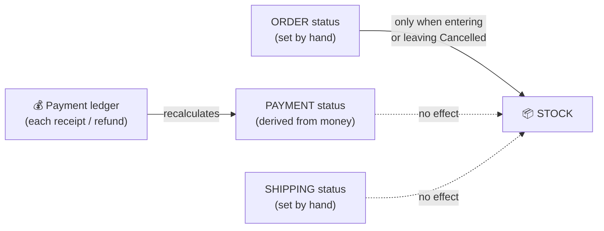
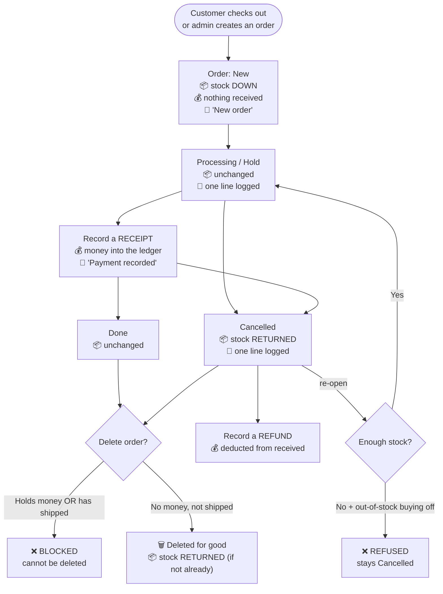

> 🌐 **Language:** [🇻🇳 Tiếng Việt](./order-lifecycle_vi.md) · 🇬🇧 English (current)

# GP247 order lifecycle — stock, money and history at every stage

## Introduction
This document walks through the **whole life of an order** in GP247: placed, processed, paid, cancelled,
re-opened, refunded, and finally deleted. For **each stage** it spells out the three things that always travel
together: what happens to **stock**, how **money** is recorded, and what the **order history** captures. Written
for shop owners, accountants and operations staff — by the end you will understand why the system behaves as it
does, and which actions are safe versus which cannot be undone.

## 1. An order carries THREE independent statuses

This is the most common source of confusion. An order does not have "a status" — it has **three**, and they
**do not follow one another automatically**:

| Status | Values | Who sets it |
|---|---|---|
| **Order status** | New · Processing · Hold · **Cancelled** · Done · Failed · Refunded | You, by hand |
| **Payment status** | Unpaid · Partial payment · Paid · Refund | **Derived by the system from the money** (you can still override) |
| **Shipping status** | Not sent · Sending · Shipping done · Refunded | You, by hand |

> ⚠️ **Changing the order status does NOT change the payment or shipping status.** Marking an order "Done" does
> not make it "Paid"; marking it "Cancelled" does not refund the customer. Three axes, three separate jobs.

**Exactly one status has a side effect on stock: "Cancelled".** Every other value is just a label.

## 2. The lifecycle at a glance

## 3. Stage by stage: stock, money, history

### 3.1. Placing the order

| | What happens |
|---|---|
| 📦 **Stock** | **Decreases** by the ordered quantity. A Bundle product decrements each component. |
| 💰 **Money** | **Nothing received yet** (even when the customer chose online payment — money is only recorded when the gateway reports back). Payment status = *Unpaid*. |
| 📝 **History** | One line: `New order`. |
| Statuses | Order = *New*, shipping = *Not sent*. |

An order created in admin decrements stock **exactly like** a storefront order — no exceptions.

### 3.2. Editing the order (adding / removing / changing line items)

| | What happens |
|---|---|
| 📦 **Stock** | Add a line → **decrease**. Delete a line → **return**. Change a quantity → only the **difference** moves. |
| 💰 **Money** | Order totals recalculated; the discount is re-split across the lines; tax is recomputed on what remains after it. **Money already received does not change** — only the outstanding balance does. |
| 📝 **History** | One line per action (`Add product: …`, `Remove item …`, `Edit product #…`). |

### 3.3. Receiving money

An order's money is a **ledger**, not a single number. Every receipt is **its own line** with a date, an amount,
a method and a transaction id.

| | What happens |
|---|---|
| 📦 **Stock** | Unchanged. |
| 💰 **Money** | A receipt line is added. `Received` = total receipts − total refunds. `Balance` = order total − received. |
| 📝 **History** | `Payment recorded: <amount> (<date>)`. |
| Statuses | Payment status is **derived**: nothing received → *Unpaid*; part → *Partial payment*; all → *Paid*; more than the total → *Refund*. |

Payment gateways (PayPal, for example) record the receipt themselves when they report success — you do not type
it in. The same transaction reported several times is recorded **once**.

### 3.4. Refunding

| | What happens |
|---|---|
| 📦 **Stock** | **Unchanged** — a refund does not mean the goods came back. To return goods, **cancel** the order. |
| 💰 **Money** | A refund line is added to the ledger. A **partial** refund records the real partial amount; the order keeps the rest as received. |
| 📝 **History** | `Refund recorded: <amount> (<date>)`. |

### 3.5. Cancelling — **the goods come back**

| | What happens |
|---|---|
| 📦 **Stock** | **All** line items are returned, **exactly once**. The system remembers which orders currently have their goods in the warehouse, so cancelling repeatedly never adds stock twice. |
| 💰 **Money** | **No automatic refund.** If the customer has paid, you must **record a refund** separately. |
| 📝 **History** | One line for the status change. |

> ℹ️ **Since v3.0**: cancelling used to do nothing to stock, and the only way to get goods back was to **delete
> the order** — so every cancellation cost you the record. Cancelling now keeps the paperwork; deleting is for
> orders that should never have existed.

### 3.6. Re-opening a cancelled order — **goods leave stock, and it can be refused**

Moving an order from *Cancelled* to any other status.

| | What happens |
|---|---|
| 📦 **Stock** | All line items are **taken back out** — but **stock is checked first**. |
| 💰 **Money** | Unchanged. |
| 📝 **History** | One line for the status change (only if it succeeds). |

While the order sat *Cancelled*, its goods were in the warehouse and **may have been sold to someone else**. So
when you re-open it:

- **Enough stock** → it is taken out and the status changes normally.
- **Not enough** and "Allow buying out of stock" is **off** → the system **refuses**, tells you why, and
  **changes nothing at all**: no line is touched and the order stays *Cancelled*.

That all-or-nothing refusal is deliberate: taking a few lines and stopping halfway would leave stock wrong while
the order still showed its old status — wrong in a way nobody could trace.

### 3.7. Deleting — **permanent, but the goods still come back**

| | What happens |
|---|---|
| 📦 **Stock** | **Returned** — if the goods have not come back already. An order cancelled earlier is not credited a second time. |
| 💰 **Money** | An order that **has handled money cannot be deleted** — the system blocks it. |
| 📝 **History** | Deleted with the order, unrecoverable. |

Deleting an order also deletes its line items, its totals and its entire history. **There is no trash bin and no
undo.**

> ✅ **There is no order of operations to remember.** You do not have to cancel before deleting — deleting returns
> the goods itself, and knows when they are already back.

> 🚫 **An order that HAS SHIPPED cannot be deleted.** While its shipping status is *Sending* or *Shipping done*,
> deletion is blocked — it would credit the goods back to stock while they sit with the customer. The deeper
> point: if the shipment really happened, deleting the record is itself the wrong move; the stock error is only
> the symptom.

**So when should you cancel, and when should you delete?**

| | Use when |
|---|---|
| **Cancel** | The order was real but is not going ahead — the customer backed out, delivery failed. The paperwork stays on file. |
| **Delete** | The order **should never have existed** — a typo, a test, a duplicate. Nothing worth keeping. |

## 4. Summary — what each action touches

| Action | 📦 Stock | 💰 Money | 📝 History | Reversible? |
|---|---|---|---|---|
| Place an order | **Down** | — | Yes | Yes (cancel/delete) |
| Add a line item | **Down** | Totals change | Yes | Yes |
| Delete a line item | **Returned** | Totals change | Yes | No |
| Change a quantity | **Difference** | Totals change | Yes | Yes |
| Record a receipt | — | **Received up** | Yes | Only by recording a refund |
| Record a refund | — | **Received down** | Yes | No |
| **Cancel the order** | **Returned** | — | Yes | Yes (re-open, if stock allows) |
| **Re-open a cancelled order** | **Down** | — | Yes | Yes (cancel again) |
| Any other status change | — | — | Yes | Yes |
| Change shipping status | — | — | Yes | Yes |
| **Delete the order** | **Returned** (if not already) | Blocked if it holds money | **All lost** | **NO** |
| Delete a **shipped** order | Blocked | Blocked | — | — |

## Conditions & Rules (know before you act)

**When placing an order / adding line items**
- **You cannot order beyond stock** while "Allow buying out of stock" is off — the same rule applies to customers
  on the storefront and to you in admin, so nothing is sold beyond what physically exists.
- **A discount may not exceed the goods (before tax)** — discounting more than the items are worth gives the
  order a negative total, which nothing downstream is built to handle. Anything larger is capped at the value of
  the goods.

**When recording money**
- **The amount must be greater than 0** — to record the opposite direction, use the refund action rather than
  entering a negative number.
- **A gateway records the amount it actually took**, even when that differs from the order total; a mismatch
  leaves the order partly paid and is logged for you to reconcile — the system does not round it to fit.
- **A closed accounting period cannot be posted into** on a date inside it (if you use the InOut plugin).

**When re-opening a cancelled order**
- **There must be enough stock** (unless "Allow buying out of stock" is on) — the goods went back to the
  warehouse when it was cancelled and may have been sold since. If there is not enough, the action is **refused
  entirely**, never applied halfway.

**When deleting an order**
- **An order that has handled money cannot be deleted** — even when its balance is back to zero after a refund.
  Deleting it would destroy the evidence of that money. Such an order should be **cancelled**, not deleted.
- **An order that has shipped cannot be deleted** — the goods are with the customer, not in your warehouse, so
  crediting them back to stock would be wrong.
- **Deletion is permanent** — line items, totals and history all go. The goods, however, do come back to stock.

## Q&A

**Q1: If I mark an order "Done", does it become "Paid" automatically?**

→ No. The three statuses (order · payment · shipping) are independent. The payment status only changes when you
**record money** against the order.

**Q2: Does cancelling an order refund the customer?**

→ No. Cancelling only returns the **goods** to stock. Money must be given back by recording a **refund**.

**Q3: I cancelled an order and pressed cancel again — does stock get added twice?**

→ No. The system remembers which orders currently have their goods in the warehouse, so the goods move exactly
once in each direction.

**Q4: Why can't I re-open a cancelled order?**

→ Because there is not enough stock to take back right now (the goods were sold while the order sat cancelled)
and "Allow buying out of stock" is off. Restock the products, or turn that option on.

**Q5: Does deleting an order return its stock?**

→ **Yes**, and if the order was already cancelled it is not credited twice. There is no cancel-then-delete order
to remember. An order that has **already shipped**, though, cannot be deleted at all.

**Q6: Why can't I delete a particular order?**

→ Two possible reasons: money has been recorded against it (deleting would destroy the evidence), or it has
already shipped (the goods are with the customer, so they must not be credited back to stock). Either way,
**cancel** it instead.

**Q7: A customer paid by PayPal — do I have to enter the amount by hand?**

→ No. The gateway records the receipt itself when it reports success, and the same transaction reported several
times is still only recorded once.

**Q8: Does a partial refund flip the whole order to "Refunded"?**

→ No. The refund is recorded for its real amount and the order keeps whatever is still received.

**Q9: I deleted an order by mistake — can I get it back?**

→ **No.** Deletion is permanent, taking the line items and the history with it. That is why orders holding money
are blocked from deletion, and why **cancelling** is the safer choice whenever you are unsure.

**Q10: What does the order history record?**

→ Every status change, every line item added/edited/removed, every totals-row edit, and every receipt or refund —
one line each, with who did it and when. One gap worth knowing: **goods moving in or out of stock when an order
is cancelled or re-opened** is currently only implied by the status-change line, not logged separately.

## Change history
<!-- Only when logic/behavior changed. Newest row on top. One row per day. -->

| Date | GP247 version | Change |
| --- | --- | --- |
| 2026-08-29 | v3.0 | New document. Reflects the lifecycle after v3.0: **cancelling returns stock**; **deleting also returns it** (only when the goods have not already come back) but is **blocked once the order has shipped**; **re-opening a cancelled order** checks stock and is refused outright when short; an order's money is a **payment ledger** of individual receipts and refunds; an order that has handled money **cannot be deleted** |

---

📅 **Last updated:** 2026-08-29 · ✍️ **Author:** GP247
