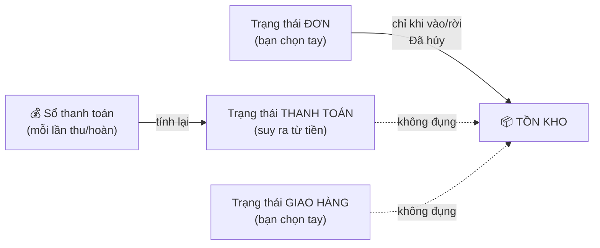
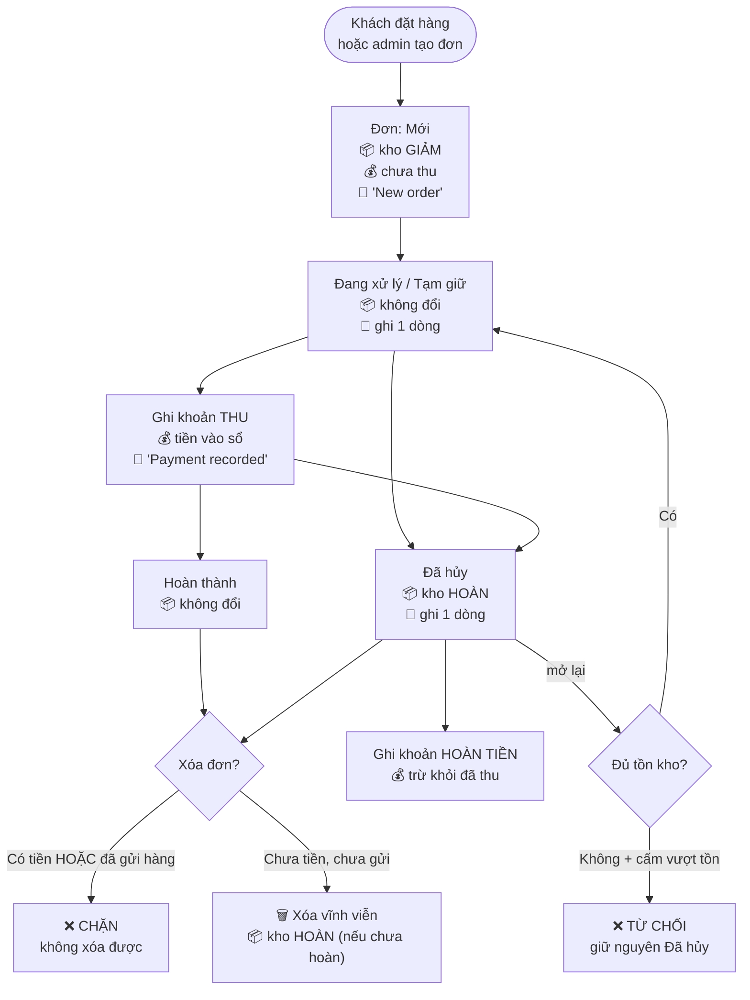

> 🌐 **Ngôn ngữ:** 🇻🇳 Tiếng Việt (hiện tại) · [🇬🇧 English](./order-lifecycle.md)

# Vòng đời đơn hàng GP247 — tồn kho, tiền và lịch sử ở từng chặng

## Giới thiệu
Tài liệu này mô tả **toàn bộ vòng đời một đơn hàng** trong GP247: từ lúc đặt, qua xử lý, thu tiền, hủy, mở lại,
hoàn tiền, cho tới khi xóa. Với **mỗi chặng**, bạn sẽ thấy rõ ba thứ luôn đi kèm: **tồn kho** biến động thế nào,
**tiền** được ghi nhận ra sao, và **lịch sử đơn** ghi lại được gì. Dành cho chủ cửa hàng, kế toán và nhân viên
vận hành — đọc xong bạn hiểu vì sao hệ thống hành xử như vậy, và biết thao tác nào an toàn, thao tác nào không
lùi lại được.

## 1. Một đơn hàng có BA trạng thái độc lập

Đây là điều gây nhầm lẫn nhiều nhất. Một đơn không có "một trạng thái" — nó có **ba**, và chúng **không tự động
kéo theo nhau**:

| Trạng thái | Các giá trị | Ai đặt |
|---|---|---|
| **Trạng thái đơn** | Mới · Đang xử lý · Tạm giữ · **Đã hủy** · Hoàn thành · Thất bại · Đã hoàn tiền | Bạn chọn tay |
| **Trạng thái thanh toán** | Chưa thanh toán · Thanh toán 1 phần · Đã thanh toán · Hoàn tiền | **Hệ thống tự suy ra từ tiền** (bạn vẫn sửa tay được) |
| **Trạng thái giao hàng** | Chưa gửi · Đang gửi · Đã gửi xong · Đã hoàn | Bạn chọn tay |

> ⚠️ **Đổi trạng thái đơn KHÔNG tự đổi trạng thái thanh toán hay giao hàng.** Đánh dấu đơn "Hoàn thành" không
> làm nó thành "Đã thanh toán"; đánh dấu "Đã hủy" không tự hoàn tiền cho khách. Ba trục là ba việc riêng.

**Chỉ đúng một trạng thái có tác dụng phụ lên tồn kho: "Đã hủy".** Mọi giá trị khác chỉ là nhãn.

## 2. Sơ đồ vòng đời tổng quát

## 3. Từng chặng: kho, tiền, lịch sử

### 3.1. Đặt đơn

| | Điều gì xảy ra |
|---|---|
| 📦 **Kho** | **Giảm** theo số lượng đặt. Sản phẩm Gói (Bundle) trừ kho từng sản phẩm con. |
| 💰 **Tiền** | **Chưa thu gì** (kể cả khi khách chọn thanh toán online — tiền chỉ được ghi khi cổng báo về). Trạng thái thanh toán = *Chưa thanh toán*. |
| 📝 **Lịch sử** | Một dòng `New order`. |
| Trạng thái | Đơn = *Mới*, giao hàng = *Chưa gửi*. |

Đơn tạo trong admin **trừ kho y hệt** đơn khách đặt ngoài storefront — không có ngoại lệ.

### 3.2. Sửa đơn (thêm/bớt/sửa dòng hàng)

| | Điều gì xảy ra |
|---|---|
| 📦 **Kho** | Thêm dòng → **giảm**. Xóa dòng → **hoàn**. Đổi số lượng → chỉ trừ/hoàn **phần chênh lệch**. |
| 💰 **Tiền** | Tổng đơn tính lại; giảm giá được chia lại về các dòng; thuế tính lại trên phần sau giảm. **Số tiền đã thu không đổi** — chỉ số còn nợ đổi theo. |
| 📝 **Lịch sử** | Một dòng cho mỗi thao tác (`Add product: …`, `Remove item …`, `Edit product #…`). |

### 3.3. Thu tiền

Tiền của đơn là một **cuốn sổ**, không phải một con số. Mỗi lần thu là **một dòng riêng** có ngày, số tiền,
phương thức và mã giao dịch.

| | Điều gì xảy ra |
|---|---|
| 📦 **Kho** | Không đổi. |
| 💰 **Tiền** | Thêm một dòng thu vào sổ. `Đã nhận` = tổng thu − tổng hoàn. `Còn lại` = tổng đơn − đã nhận. |
| 📝 **Lịch sử** | `Payment recorded: <số tiền> (<ngày>)`. |
| Trạng thái | Thanh toán **tự suy ra**: chưa thu → *Chưa thanh toán*; thu một phần → *Thanh toán 1 phần*; đủ → *Đã thanh toán*; thu quá → *Hoàn tiền*. |

Cổng thanh toán (ví dụ PayPal) tự ghi khoản thu khi báo thành công — bạn không phải nhập tay. Cùng một giao dịch
báo về nhiều lần chỉ được ghi **một lần**.

### 3.4. Hoàn tiền

| | Điều gì xảy ra |
|---|---|
| 📦 **Kho** | **Không đổi** — hoàn tiền không đồng nghĩa hàng đã về. Muốn hàng về kho thì **hủy đơn**. |
| 💰 **Tiền** | Thêm một dòng hoàn (số âm) vào sổ. Hoàn **một phần** ghi đúng số một phần, đơn vẫn ở trạng thái đã thu phần còn lại. |
| 📝 **Lịch sử** | `Refund recorded: <số tiền> (<ngày>)`. |

### 3.5. Hủy đơn — **hàng về kho**

| | Điều gì xảy ra |
|---|---|
| 📦 **Kho** | **Hoàn toàn bộ** dòng hàng của đơn, **đúng một lần**. Hệ thống ghi nhớ đơn nào đang có hàng nằm trong kho, nên hủy đi hủy lại không cộng kho nhiều lần. |
| 💰 **Tiền** | **Không tự hoàn tiền.** Nếu khách đã trả, bạn phải **ghi một khoản hoàn tiền** riêng. |
| 📝 **Lịch sử** | Một dòng ghi việc đổi trạng thái. |

> ℹ️ **Từ v3.0**: trước đây hủy đơn không làm gì với kho, và cách duy nhất lấy lại hàng là **xóa đơn** — tức mỗi
> lần hủy là mất luôn chứng từ. Nay hủy giữ lại hồ sơ, còn xóa dành cho đơn lẽ ra không nên tồn tại.

### 3.6. Mở lại đơn đã hủy — **hàng rời kho, và có thể bị từ chối**

Chuyển đơn từ *Đã hủy* sang bất kỳ trạng thái nào khác.

| | Điều gì xảy ra |
|---|---|
| 📦 **Kho** | **Trừ lại** toàn bộ dòng hàng — nhưng **kiểm tra tồn trước**. |
| 💰 **Tiền** | Không đổi. |
| 📝 **Lịch sử** | Một dòng ghi việc đổi trạng thái (chỉ khi thành công). |

Trong lúc đơn nằm ở *Đã hủy*, hàng đã về kho và **có thể đã bán cho người khác**. Vì vậy khi mở lại:

- **Đủ hàng** → trừ kho, đổi trạng thái bình thường.
- **Không đủ** và bạn đang **tắt** "Cho phép mua khi hết hàng" → hệ thống **từ chối**, báo lý do, và **không
  thay đổi gì cả**: không trừ dòng nào, đơn vẫn là *Đã hủy*.

Kiểu từ chối "được ăn cả, ngã về không" là có chủ đích: trừ vài dòng rồi dừng giữa chừng sẽ làm kho sai mà đơn
vẫn mang trạng thái cũ — không ai lần ra được.

### 3.7. Xóa đơn — **vĩnh viễn, nhưng hàng vẫn về kho**

| | Điều gì xảy ra |
|---|---|
| 📦 **Kho** | **Hoàn** — nếu hàng chưa về. Đơn đã hủy từ trước thì hệ thống biết hàng đã về rồi và **không cộng lần hai**. |
| 💰 **Tiền** | Đơn **đã phát sinh tiền thì không xóa được** — hệ thống chặn. |
| 📝 **Lịch sử** | Bị xóa cùng đơn, không khôi phục được. |

Xóa đơn cũng xóa luôn dòng hàng, dòng tổng tiền và toàn bộ lịch sử. **Không có thùng rác, không khôi phục được.**

> ✅ **Không có thứ tự nào phải nhớ.** Bạn không cần hủy trước rồi mới xóa — xóa tự trả hàng về kho, và tự biết
> khi nào hàng đã về rồi.

> 🚫 **Không xóa được đơn ĐÃ GỬI HÀNG.** Khi trạng thái giao hàng là *Đang gửi* hoặc *Đã gửi xong*, hệ thống chặn
> xóa — vì xóa sẽ cộng hàng về kho trong khi hàng đang ở chỗ khách. Sâu xa hơn: nếu lô hàng đã thật sự đi, thì
> **xóa bản ghi mới là cái sai**, sai tồn kho chỉ là triệu chứng.

**Vậy khi nào nên hủy, khi nào nên xóa?**

| | Dùng khi |
|---|---|
| **Hủy đơn** | Đơn có thật nhưng không bán nữa — khách hủy, giao thất bại. Giữ lại hồ sơ để tra cứu. |
| **Xóa đơn** | Đơn **lẽ ra không nên tồn tại** — nhập nhầm, đơn thử, trùng. Không cần giữ dấu vết. |

## 4. Bảng tổng hợp — thao tác nào chạm vào cái gì

| Thao tác | 📦 Kho | 💰 Tiền | 📝 Lịch sử | Lùi lại được? |
|---|---|---|---|---|
| Đặt đơn | **Giảm** | — | Có | Có (hủy/xóa) |
| Thêm dòng hàng | **Giảm** | Tổng đổi | Có | Có |
| Xóa dòng hàng | **Hoàn** | Tổng đổi | Có | Không |
| Tăng/giảm số lượng | **Chênh lệch** | Tổng đổi | Có | Có |
| Ghi khoản thu | — | **Tăng đã nhận** | Có | Chỉ bằng cách ghi khoản hoàn |
| Ghi khoản hoàn tiền | — | **Giảm đã nhận** | Có | Không |
| **Hủy đơn** | **Hoàn** | — | Có | Có (mở lại, nếu đủ tồn) |
| **Mở lại đơn hủy** | **Giảm** | — | Có | Có (hủy lại) |
| Đổi trạng thái khác | — | — | Có | Có |
| Đổi trạng thái giao hàng | — | — | Có | Có |
| **Xóa đơn** | **Hoàn** (nếu chưa hoàn) | Bị chặn nếu có tiền | **Mất hết** | **KHÔNG** |
| Xóa đơn **đã gửi hàng** | Bị chặn | Bị chặn | — | — |

## Điều kiện & ràng buộc (hiểu trước khi thao tác)

**Khi đặt đơn / thêm dòng hàng**
- **Không đặt vượt tồn kho** nếu bạn tắt "Cho phép mua khi hết hàng" — áp dụng như nhau cho khách ngoài
  storefront và cho bạn trong admin, để không bán quá số hàng thật có.
- **Giảm giá không vượt quá tiền hàng (chưa thuế)** — giảm nhiều hơn giá trị hàng sẽ tạo đơn tổng âm, thứ không
  màn hình nào phía sau xử lý được. Nhập vượt sẽ bị cắt về đúng bằng tiền hàng.

**Khi ghi tiền**
- **Số tiền phải lớn hơn 0** — muốn ghi chiều ngược lại thì dùng chức năng hoàn tiền, không nhập số âm.
- **Cổng thanh toán ghi đúng số tiền thật nhận**, kể cả khi khác tổng đơn; lệch thì đơn ở trạng thái trả một
  phần và được ghi log để bạn đối chiếu — hệ thống không tự làm tròn cho khớp.
- **Kỳ kế toán đã khóa thì không ghi được** vào ngày thuộc kỳ đó (nếu bạn dùng plugin InOut).

**Khi mở lại đơn đã hủy**
- **Phải còn đủ tồn kho** (trừ khi bật "Cho phép mua khi hết hàng") — vì hàng đã về kho lúc hủy và có thể đã bán
  cho người khác. Không đủ thì thao tác bị **từ chối toàn bộ**, không làm một nửa.

**Khi xóa đơn**
- **Đơn đã phát sinh tiền không xóa được** — kể cả khi số dư đã về 0 sau khi hoàn tiền. Xóa đơn sẽ hủy luôn bằng
  chứng của khoản tiền đó. Đơn có tiền thì **hủy**, đừng xóa.
- **Đơn đã gửi hàng không xóa được** — hàng đang ở chỗ khách, không ở kho; xóa sẽ cộng nhầm hàng về kho.
- **Xóa là vĩnh viễn** — mất cả dòng hàng, tổng tiền và lịch sử. Hàng thì vẫn được trả về kho.

## Hỏi & Đáp (Q&A)

**Câu 1: Tôi đánh dấu đơn "Hoàn thành" thì nó có tự thành "Đã thanh toán" không?**

→ Không. Ba trạng thái (đơn · thanh toán · giao hàng) độc lập với nhau. Trạng thái thanh toán chỉ đổi khi bạn
**ghi tiền** vào đơn.

**Câu 2: Hủy đơn có tự hoàn tiền cho khách không?**

→ Không. Hủy đơn chỉ trả **hàng** về kho. Tiền phải ghi một khoản **hoàn tiền** riêng.

**Câu 3: Tôi hủy đơn rồi bấm hủy lần nữa, kho có cộng đôi không?**

→ Không. Hệ thống ghi nhớ đơn nào đang có hàng nằm trong kho, nên hàng chỉ đi về đúng một lượt mỗi chiều.

**Câu 4: Vì sao tôi không mở lại được đơn đã hủy?**

→ Vì tồn kho hiện không đủ để trừ lại (hàng đã bán cho người khác trong lúc đơn nằm hủy) và bạn đang tắt "Cho
phép mua khi hết hàng". Hãy nhập thêm hàng, hoặc bật tùy chọn đó.

**Câu 5: Xóa đơn thì kho có tự trả lại không?**

→ **Có**, và nếu đơn đã hủy từ trước thì không cộng lần hai. Bạn không cần nhớ thứ tự hủy/xóa nào cả. Riêng đơn
**đã gửi hàng** thì không xóa được.

**Câu 6: Vì sao tôi không xóa được một đơn?**

→ Hai lý do: (1) đơn **đã phát sinh tiền** — xóa sẽ hủy mất bằng chứng của khoản tiền; (2) đơn **đã gửi hàng** —
hàng đang ở chỗ khách nên không được cộng về kho. Cả hai trường hợp: hãy **hủy** đơn thay vì xóa.

**Câu 7: Khách trả tiền qua PayPal, tôi có phải nhập tay số tiền không?**

→ Không. Cổng thanh toán tự ghi khoản thu khi báo thành công. Cùng một giao dịch báo về nhiều lần cũng chỉ được
ghi một lần.

**Câu 8: Hoàn tiền một phần thì đơn có bị chuyển thành "Đã hoàn tiền" toàn bộ không?**

→ Không. Khoản hoàn được ghi đúng số thật, đơn vẫn giữ phần tiền còn lại đã thu.

**Câu 9: Tôi xóa nhầm một đơn, khôi phục được không?**

→ **Không.** Xóa đơn là vĩnh viễn, mất cả dòng hàng và lịch sử. Đây là lý do đơn có tiền bị chặn xóa, và là lý
do nên **hủy** thay vì xóa khi còn phân vân.

**Câu 10: Lịch sử đơn ghi được những gì?**

→ Mỗi lần đổi trạng thái, thêm/sửa/xóa dòng hàng, sửa dòng tổng tiền, ghi khoản thu hoặc khoản hoàn — mỗi việc
một dòng, kèm người thao tác và thời điểm. Riêng việc **hàng vào/ra kho khi hủy hoặc mở lại đơn** hiện chỉ được
suy ra từ dòng đổi trạng thái, chưa có dòng riêng.

## Lịch sử thay đổi
<!-- Chỉ ghi khi có thay đổi về logic/hành vi. Dòng mới nhất ở trên cùng. Mỗi ngày một dòng. -->

| Ngày | Phiên bản GP247 | Thay đổi |
| --- | --- | --- |
| 2026-08-29 | v3.0 | Tài liệu mới. Phản ánh vòng đời sau v3.0: **hủy đơn hoàn kho**; **xóa đơn cũng hoàn kho** (chỉ khi hàng chưa về) nhưng **bị chặn nếu đã gửi hàng**; **mở lại đơn hủy** có kiểm tra tồn và bị từ chối toàn bộ nếu thiếu; tiền của đơn là **sổ thanh toán** từng lần thu/hoàn; đơn đã phát sinh tiền **không xóa được** |

---

📅 **Cập nhật lần cuối:** 2026-08-29 · ✍️ **Tác giả (Author):** GP247
