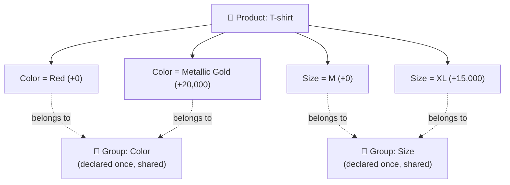
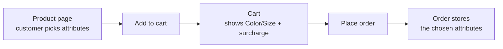

> 🌐 **Language:** [🇻🇳 Tiếng Việt](./product-attribute_vi.md) · 🇬🇧 English (current)

# Product Attributes in GP247

## Introduction
This document explains **product attributes** in GP247/S-Cart — for example choosing a **Color** or **Size**
with an extra surcharge — for **non-technical store owners**. After reading it you will understand the two-tier
structure of attributes, know how to declare them in the admin panel, understand how the surcharge is added to
the price, and know about the recently hardened price-safety behavior.

---

## 1. What is an attribute? The two-tier model

Attributes in GP247 have **two tiers**:

- **Attribute Group** — declared **once and shared** across all products. Example: `Color`, `Size`.
- **Attribute value** — attached to **each specific product**, holding a value name + an **extra surcharge** (`add_price`). Example for the `Color` group: "Red" (+0), "Metallic Gold" (+20,000).

> In short: a **Group** is a "type of choice" (Color, Size); a **value** is a concrete option of that type,
> attached per product, each option optionally adding money.

**Important:** attributes only apply to the **Single** product kind. Bundle and Group products do not use
attributes (see [Product structure](./product-structure.md)).

---

## 2. Declaring attributes (two steps)

### Step A — Create an Attribute Group (once)

1. In the admin panel, open **Admin Shop → Product & category → Attribute group**.
2. Add a new one, enter the **group name** (e.g. `Color`), set status to **On**, then Save.

   If successful, the `Color` group appears in the list and will show up in the selector when you declare values for a product.

### Step B — Assign attribute values to a product

1. Open **Product & category → Products** and edit a product (of kind **Single**).
2. Select the **"Product attribute group list"** tab.
3. For each row:
   - The left selector: pick a **Group** (e.g. `Color`).
   - The **Name** field: enter the **value name** (e.g. `Red`).
   - The number field below: enter the **surcharge** (`add_price`). Leave it `0` for no extra charge.
4. Click **"+ Product attribute group list"** to add a new row for each value (Red, Metallic Gold…).
5. Click **Submit** to save.

   If successful, on the storefront the customer will see the options with their surcharge (e.g. "Metallic Gold (+20,000)").

> **How it saves internally (for peace of mind):** each time you Submit, the system **deletes all old values and
> recreates them** from exactly the rows you entered. Any row with an empty group or empty Name is skipped.

---

## 3. How the surcharge is added to the price

The most important principle: **prices are never stored fixed in the cart** — the system always **recomputes** them when needed.

A line price = **the product's final price** + **the total surcharge of the selected attributes**, then multiplied by quantity.

- The "product's final price" already reflects any active promotion.
- The **`add_price` surcharge is added AFTER the promotion** — it is a fixed add-on and is **not** discounted by the promotion rate.
- The surcharge is also included in the line's **tax**, so the order's total tax matches the sum of the line taxes.

**Example:** a T-shirt priced at 100,000, on sale for 80,000. The customer picks "Metallic Gold (+20,000)" and
"Size XL (+15,000)": price per unit = 80,000 + 20,000 + 15,000 = **115,000**.

---

## 4. Cart and order flow

A few things worth knowing:

- **Attribute selection is required:** if a product has attributes, the customer **cannot** quick-add it to the cart — they must open the product page and choose first.
- **Same product, different choices = separate cart lines:** e.g. "T-shirt — Red" and "T-shirt — Metallic Gold" are two distinct lines. Same product + same choice merges the quantity.
- **The order records the choice:** when the customer checks out, the selected attributes are saved with the order and shown again in the admin order screen (e.g. "T-shirt (Color:Metallic Gold (+20,000))").

---

## 5. Price safety (hardened)

A recent update hardened two points for safety and data integrity:

1. **Server-authoritative surcharge (anti price tampering).** Previously the `add_price` surcharge was sent from
   the customer's browser and could, in theory, be altered to pay less. Now, when adding to the cart, the system
   **always re-reads the real surcharge from the database** by the group + value name; if the customer sends a
   choice that **does not belong to the product**, the system **rejects the add**. You do not need to do anything
   — this automatically protects every store.
2. **Order attribute data is not truncated.** The order's attribute field was widened to hold choices with
   **many groups** or **long names** without losing characters.

> Technical note (optional): this change applies to the customer storefront flow. Orders **created manually by
> staff in the admin** still allow entering the surcharge directly (it is an internal, authenticated and
> permission-controlled channel).

---

## Q&A

**Q1: What is the difference between an "Attribute Group" and an "Attribute value"?**

→ A Group is a shared type of choice (Color, Size), declared once. A value is a concrete option (Red, XL) attached per product, optionally with a surcharge.

**Q2: I don't see the "Product attribute group list" tab when editing a product?**

→ Attributes only apply to the **Single** product kind. Bundle and Group products don't have this section.

**Q3: What is the surcharge (`add_price`)?**

→ It is the extra amount added when the customer picks that value. For example choosing "Metallic Gold" adds 20,000. Leave it 0 for no extra charge.

**Q4: Is the surcharge discounted by a promotion?**

→ No. The surcharge is added **after** the promotional price; it is a fixed add-on and is not reduced by the discount rate.

**Q5: Why does the same product appear as two lines in the cart?**

→ Because the customer picked different attributes (e.g. Red vs Metallic Gold). Each distinct choice is its own line; the same choice merges quantities.

**Q6: Why can't the customer quick-add a product that has attributes?**

→ Because the attributes (Color/Size) must be chosen first. The customer has to open the product page and choose before adding to the cart.

**Q7: Can a customer alter the surcharge to pay less?**

→ No. The system always re-reads the real surcharge from the database when adding to the cart; a choice not belonging to the product is rejected.

**Q8: If I edit a product's values/surcharge, do existing orders change too?**

→ No. Placed orders keep the attributes and price at the time of purchase; changes apply only to new orders.

**Q9: What happens if I leave a row's Name field empty?**

→ A row with an empty group or empty Name is skipped when saving; no value is created.

**Q10: For an order with many attribute groups (Color + Size + …), is any information lost?**

→ No. The order's attribute field was widened to hold it all, even many groups or long names.

---

📅 **Last updated:** 2026-08-13 · ✍️ **Author:** GP247
