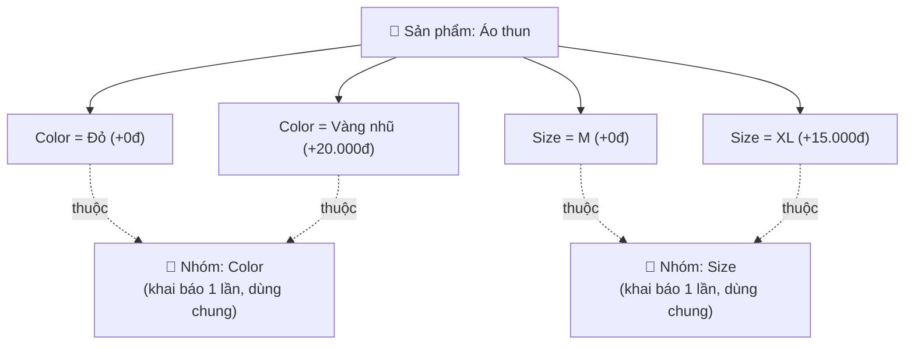
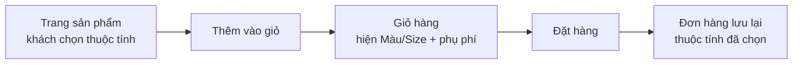

> 🌐 **Ngôn ngữ:** 🇻🇳 Tiếng Việt (hiện tại) · [🇬🇧 English](./product-attribute.md)

# Thuộc tính sản phẩm (Product Attribute) trong GP247

## Giới thiệu
Tài liệu này giải thích **thuộc tính sản phẩm** (Product Attribute) trong GP247/S-Cart — ví dụ chọn **Màu**,
**Size** kèm phụ phí cộng thêm — dành cho **chủ cửa hàng không rành kỹ thuật**. Đọc xong bạn sẽ hiểu cấu trúc
2 tầng của thuộc tính, biết cách khai báo trong trang quản trị, hiểu phụ phí được cộng vào giá thế nào, và
nắm điểm an toàn giá vừa được củng cố.

---

## 1. Thuộc tính là gì? Mô hình 2 tầng

Thuộc tính trong GP247 gồm **2 tầng**:

- **Nhóm thuộc tính (Attribute Group)** — khai báo **một lần, dùng chung** cho mọi sản phẩm. Ví dụ: `Color`, `Size`.
- **Giá trị thuộc tính (Attribute value)** — gắn vào **từng sản phẩm cụ thể**, gồm tên giá trị + **phụ phí cộng thêm** (`add_price`). Ví dụ với nhóm `Color`: "Đỏ" (+0đ), "Vàng nhũ" (+20.000đ).

> Nói ngắn gọn: **Nhóm** là "loại lựa chọn" (Màu, Size); **Giá trị** là các lựa chọn cụ thể của loại đó, gắn
> riêng cho từng sản phẩm, mỗi lựa chọn có thể cộng thêm tiền.

**Lưu ý quan trọng:** thuộc tính chỉ áp dụng cho sản phẩm loại **Đơn lẻ (Single)**. Sản phẩm loại Gói
(Bundle) hay Nhóm (Group) không dùng thuộc tính (xem [Tổ chức sản phẩm](./product-structure_vi.md)).

---

## 2. Khai báo thuộc tính (2 bước)

### Bước A — Tạo Nhóm thuộc tính (làm 1 lần)

1. Vào trang quản trị, mở màn **Admin Shop → Product & category → Attribute group** (Nhóm thuộc tính).
2. Bấm thêm mới, nhập **tên nhóm** (ví dụ `Color`), đặt trạng thái **Bật**, rồi Lưu.

   Nếu thành công, nhóm `Color` xuất hiện trong danh sách và sẽ hiện ra ở ô chọn khi bạn khai báo giá trị cho sản phẩm.

### Bước B — Gán giá trị thuộc tính cho sản phẩm

1. Mở **Product & category → Products**, bấm sửa một sản phẩm (loại **Đơn lẻ**).
2. Chọn tab **"Product attribute group list"** (Danh sách nhóm thuộc tính sản phẩm).
3. Với mỗi dòng:
   - Ô chọn bên trái: chọn **Nhóm** (ví dụ `Color`).
   - Ô **Name**: nhập **tên giá trị** (ví dụ `Đỏ`).
   - Ô số bên dưới: nhập **phụ phí cộng thêm** (`add_price`). Để `0` nếu không cộng tiền.
4. Bấm **"+ Product attribute group list"** để thêm dòng mới cho mỗi giá trị (Đỏ, Vàng nhũ…).
5. Bấm **Submit** để lưu.

   Nếu thành công, khi xem sản phẩm ở gian hàng (storefront), khách sẽ thấy các lựa chọn hiện ra kèm phụ phí (ví dụ "Vàng nhũ (+20.000đ)").

> **Cách lưu bên trong (để bạn yên tâm):** mỗi lần bấm Submit, hệ thống **xóa toàn bộ giá trị cũ rồi tạo lại**
> theo đúng những dòng bạn đang nhập. Dòng nào để trống nhóm hoặc trống Name sẽ bị bỏ qua.

---

## 3. Phụ phí được cộng vào giá thế nào

Nguyên tắc quan trọng nhất: **giá không được lưu cứng trong giỏ hàng** — hệ thống luôn **tính lại** mỗi khi cần.

Giá một dòng hàng = **giá cuối của sản phẩm** + **tổng phụ phí các thuộc tính đã chọn**, rồi nhân số lượng.

- "Giá cuối của sản phẩm" đã tính khuyến mãi (nếu đang có).
- **Phụ phí `add_price` được cộng SAU khuyến mãi** — tức nó là khoản cộng thêm cố định, **không** bị giảm theo tỉ lệ khuyến mãi.
- Phụ phí cũng được tính vào **thuế** của dòng hàng, để tổng thuế của đơn khớp với tổng thuế từng dòng.

**Ví dụ:** Áo thun giá 100.000đ, đang giảm còn 80.000đ. Khách chọn "Vàng nhũ (+20.000đ)" và "Size XL (+15.000đ)":
giá 1 chiếc = 80.000 + 20.000 + 15.000 = **115.000đ**.

---

## 4. Luồng giỏ hàng và đơn hàng

Vài điểm nên biết:

- **Bắt buộc chọn thuộc tính:** nếu sản phẩm có thuộc tính, khách **không** thể thêm nhanh vào giỏ — phải vào trang sản phẩm chọn xong mới thêm được.
- **Cùng sản phẩm, khác lựa chọn = 2 dòng giỏ riêng:** ví dụ "Áo thun — Đỏ" và "Áo thun — Vàng nhũ" nằm 2 dòng tách biệt. Cùng sản phẩm cùng lựa chọn thì gộp số lượng.
- **Đơn hàng ghi lại lựa chọn:** khi khách đặt, các thuộc tính đã chọn được lưu vào đơn và hiển thị lại trong màn quản lý đơn của admin (ví dụ "Áo thun (Color:Vàng nhũ (+20.000đ))").

---

## 5. An toàn giá (đã củng cố)

Từ bản cập nhật gần đây, GP247 củng cố 2 điểm để đảm bảo an toàn và toàn vẹn dữ liệu:

1. **Phụ phí do máy chủ quyết định (chống gian lận giá).** Trước đây phụ phí `add_price` được gửi lên từ trình
   duyệt của khách, về lý thuyết có thể bị sửa để mua rẻ hơn. Nay khi thêm vào giỏ, hệ thống **luôn lấy lại phụ
   phí thật từ cơ sở dữ liệu** theo đúng nhóm + tên giá trị; nếu khách gửi lên một lựa chọn **không thuộc sản
   phẩm**, hệ thống **từ chối thêm vào giỏ**. Bạn không phải làm gì thêm — điều này tự động bảo vệ mọi cửa hàng.
2. **Đơn hàng không bị cắt cụt thông tin thuộc tính.** Ô lưu thuộc tính của đơn hàng đã được mở rộng để chứa
   được lựa chọn có **nhiều nhóm** hoặc **tên dài** mà không bị mất chữ.

> Ghi chú kỹ thuật (không bắt buộc đọc): thay đổi này áp dụng cho luồng khách mua ở gian hàng. Đơn do **nhân
> viên tạo thủ công trong admin** vẫn cho nhập phụ phí trực tiếp (vì đây là kênh nội bộ, đã đăng nhập và phân quyền).

---

## Hỏi & Đáp (Q&A)

**Câu 1: "Nhóm thuộc tính" và "Giá trị thuộc tính" khác nhau thế nào?**

→ Nhóm là loại lựa chọn dùng chung (Màu, Size), khai báo 1 lần. Giá trị là lựa chọn cụ thể (Đỏ, XL) gắn cho từng sản phẩm, có thể kèm phụ phí.

**Câu 2: Tôi không thấy tab "Product attribute group list" khi sửa sản phẩm?**

→ Thuộc tính chỉ dùng cho sản phẩm loại **Đơn lẻ (Single)**. Nếu sản phẩm là Gói hoặc Nhóm thì không có phần này.

**Câu 3: Phụ phí (`add_price`) là gì?**

→ Là số tiền cộng thêm khi khách chọn giá trị đó. Ví dụ chọn "Vàng nhũ" cộng thêm 20.000đ. Để 0 nếu không cộng tiền.

**Câu 4: Phụ phí có bị giảm theo khuyến mãi không?**

→ Không. Phụ phí được cộng **sau** giá khuyến mãi, là khoản cộng cố định, không giảm theo tỉ lệ.

**Câu 5: Vì sao cùng một sản phẩm lại nằm 2 dòng trong giỏ?**

→ Vì khách chọn thuộc tính khác nhau (ví dụ Đỏ và Vàng nhũ). Mỗi lựa chọn khác nhau là một dòng riêng; cùng lựa chọn thì gộp số lượng.

**Câu 6: Tại sao khách không thêm nhanh vào giỏ được với sản phẩm có thuộc tính?**

→ Vì cần chọn thuộc tính trước (Màu/Size). Khách phải vào trang sản phẩm, chọn xong mới thêm vào giỏ được.

**Câu 7: Khách có thể tự sửa phụ phí để mua rẻ hơn không?**

→ Không. Hệ thống luôn lấy lại phụ phí thật từ cơ sở dữ liệu khi thêm vào giỏ; lựa chọn không thuộc sản phẩm sẽ bị từ chối.

**Câu 8: Tôi sửa lại giá trị/phụ phí của sản phẩm thì đơn hàng cũ có đổi theo không?**

→ Không. Đơn đã đặt giữ nguyên thuộc tính và giá tại thời điểm mua; thay đổi chỉ áp dụng cho đơn mới.

**Câu 9: Tôi để trống ô Name của một dòng thì sao?**

→ Dòng trống nhóm hoặc trống Name sẽ bị bỏ qua khi lưu, không tạo giá trị nào.

**Câu 10: Đơn có nhiều nhóm thuộc tính (Màu + Size + …) có bị mất thông tin không?**

→ Không. Ô lưu thuộc tính của đơn đã được mở rộng để chứa đủ, kể cả nhiều nhóm hoặc tên dài.

---

📅 **Cập nhật lần cuối:** 2026-08-13 · ✍️ **Tác giả (Author):** GP247
