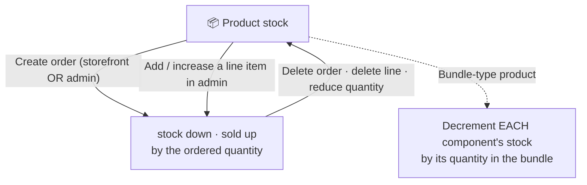

> 🌐 **Language:** [🇻🇳 Tiếng Việt](./product-stock-management_vi.md) · 🇬🇧 English (current)

# Product stock management in GP247

## Introduction
This document explains the **stock management business logic** of GP247/S-Cart for **non-technical shop owners**: when stock goes up or down, the two key settings that decide whether over-stock selling is allowed, and why an order created in the admin panel decrements stock **exactly like** an order a customer places on the storefront. After reading it you will be confident configuring stock and understanding how the numbers move.

---

## 1. The two numbers on every product

Every product has two quantity numbers to remember:

- **Stock (`stock`)**: the amount currently available to sell.
- **Sold (`sold`)**: the amount already sold (statistics only, increases automatically).

There is also a **Minimum quantity (`minimum`)**: the least a customer must buy in one order (default is 1).

> When an order is placed, the system **decreases `stock`** and **increases `sold`** by the same amount. When an order/line item is removed, stock is **returned**.

---

## 2. Stock lifecycle diagram

> If your reader cannot render the diagram, think of it simply: **an order decreases stock, removing an order returns it** — regardless of where the order was created.

---

## 3. The two settings that govern selling against stock

Two switches in **Store configuration** directly affect stock:

| Setting | Located in | Meaning |
| --- | --- | --- |
| **Stock management** (`product_stock`) | **Product** config | On = the shop tracks stock. **Off** = stock is ignored — always allow buying. |
| **Allow buy out of stock** (`product_buy_out_of_stock`) | **Order** config | On = customers may buy **beyond** stock (stock can go negative). Off = **block** when over stock. |

The system's "enough stock to sell" rule is:

> Allow the quantity if **( allow buy out of stock )** OR **( stock is not managed )** OR **( stock ≥ ordered quantity )**.

> **Hierarchy (important):** `product_stock` is the **master switch**. `product_buy_out_of_stock` **only has an effect when `product_stock` is on**. If stock management is off, the "allow buy out of stock" option **has no meaning** (the system always allows buying). The two switches **do not conflict** — they combine with OR.

There are also two related (optional) settings:
- **Hide out-of-stock products** (`product_display_out_of_stock`): with stock management on, a product at 0 is hidden from the storefront.
- **Pre-order** (`product_preorder`): allow pre-ordering even without stock.

---

## 4. When does stock DECREASE, when is it RETURNED?

**Stock decreases** (`stock` down, `sold` up) when:
1. A customer successfully places an order on the **storefront** (checkout completed).
2. You **create an order in admin** (the Create Order screen).
3. You **add** a line item, or **increase the quantity** of a line item on an admin order.

**Stock is returned** (`stock` added back) when:
1. **Deleting a whole order** → returns stock for all of its line items.
2. **Deleting a single line item** on an order.
3. **Reducing a line item's quantity** (only the difference is returned).

> ⚠️ **Changing order status does NOT return stock:** Setting an order to "Cancelled" or any other status does **not** automatically restore stock. Stock is only returned when an order or line item is **deleted**. If you cancel an order by changing its status and want the stock back, you must **delete the order** (or its line items) manually afterwards.

> Key point: **admin-created orders decrement/return stock just like customer orders**. Previously admin orders did not touch stock, causing inconsistent figures — this is now unified.

---

## 5. How do Bundle products decrement stock?

For a **Bundle (Bundle/Build)** product, selling **1 bundle** decrements the stock of **each component** by the quantity declared in the bundle (and also the bundle's own stock if it is tracked).

Example: "Gift set" = 1 box of cookies + 2 bottles of water. Selling 1 set → removes **1 box of cookies** and **2 bottles of water** from stock.

> For how to create and configure bundles, see **[Bundle products (Bundle/Combo)](./product-bundle.md)** and **[Product structure](./product-structure.md)**.

---

## 6. Over-stock is blocked UNIFORMLY on both storefront and admin

When **Stock management** (`product_stock`) is on and **Allow buy out of stock** (`product_buy_out_of_stock`) is off, if the ordered quantity exceeds stock:

- **On the storefront (customer buying):** the system **blocks** — an over-stock order cannot be placed.
- **In admin (you create/edit an order):** the system **also blocks, exactly like the storefront** — an over-stock order/line cannot be saved and an error is shown. (Applies to: creating a new order, adding a line, and increasing a line's quantity.)

> In short: **both customers and admins are blocked** on over-stock — same rule, same `product_buy_out_of_stock` setting.
>
> **Change note (from 2026-08-16):** previously admin was only *warned* but could still save an over-stock order; now it is **uniformly blocked** to prevent overselling against real stock on any channel.
>
> **Still need to create an over-stock order in admin** (sell first, backorder, restock later)? → **turn on** "Allow buy out of stock" (`product_buy_out_of_stock`). Both channels then allow over-stock (stock may go negative).

---

## 7. Step-by-step configuration (for beginners)

1. Log in to the admin panel and open **Store configuration**.
2. Open the **Product** group and find **Stock management** (`product_stock`):
   - Turn it on if you want to track stock quantities.
   - Turn it off for services / unlimited quantities (always allow buying).
3. Open the **Order** group and find **Allow buy out of stock** (`product_buy_out_of_stock`):
   - **Off** to block over-stock selling (recommended for physical goods).
   - On to allow buying even when out of stock (stock can go negative).
4. Open each **Product** and enter its **Stock (`stock`)** and **Minimum quantity (`minimum`)** if needed.
5. Save. On success the system reports a successful update and the stock numbers apply immediately on the storefront.

> Test tip: create a test order in admin for a product that has stock, then reopen that product to check that `stock` decreased and `sold` increased correctly.

---

## Q&A

**Q1: How do I make the shop ignore stock (always allow buying)?**

→ Turn off **Stock management** (`product_stock`). The system will then always allow buying without checking stock.

**Q2: How do I block customers from buying when out of stock?**

→ Turn on **Stock management** and turn **off** "Allow buy out of stock" (`product_buy_out_of_stock`). When stock reaches 0, customers can no longer order.

**Q3: Why did creating an order in admin not change stock (in the old version)?**

→ That was an old bug: admin orders did not decrement stock. The current version is fixed — admin orders decrement/return stock like customer orders.

**Q4: In admin, can I save an over-stock order?**

→ **No** (when Stock management is on and "Allow buy out of stock" is off). From **2026-08-16**, admin is **blocked just like the storefront customer** — an over-stock order/line cannot be created. If you genuinely need over-stock (sell first, backorder), **turn on** "Allow buy out of stock".

**Q5: Can stock go negative?**

→ Yes, **only when "Allow buy out of stock"** (`product_buy_out_of_stock`) is on. Then both customers and admins can order beyond stock and it goes negative (you owe stock). With that setting off, **no channel** (admin included) can create an over-stock order.

**Q6: Does deleting an order return stock automatically?**

→ Yes. Deleting a whole order or an individual line item returns the corresponding stock. Reducing a line item's quantity returns only the difference. **Note:** only the **delete** action returns stock — changing an order status (even to "Cancelled") does **not** restore stock automatically.

**Q7: How do Bundle products decrement stock?**

→ Selling 1 bundle decrements the stock of **each component** by its quantity in the bundle. See the [Bundle products](./product-bundle.md) document.

**Q8: How is "Sold" (`sold`) different from "Stock" (`stock`)?**

→ `stock` is the amount left to sell; `sold` is the amount already sold, used only for statistics and increased automatically when orders are placed.

**Q9: How do I hide products when out of stock on the storefront?**

→ Turn on **Hide out-of-stock products** (`product_display_out_of_stock`); with stock management on, a product at 0 will not be shown.

**Q10: What is the Minimum quantity (`minimum`) for?**

→ It forces customers to buy at least a certain amount per order (e.g. wholesale minimum of 10). The default is 1.

---

📅 **Last updated:** 2026-08-27 · ✍️ **Author:** GP247
