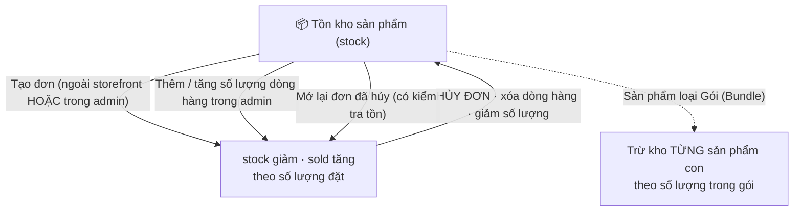

> 🌐 **Ngôn ngữ:** 🇻🇳 Tiếng Việt (hiện tại) · [🇬🇧 English](./product-stock-management.md)

# Quản lý tồn kho sản phẩm trong GP247

## Giới thiệu
Tài liệu này giải thích **nghiệp vụ quản lý tồn kho (stock)** của GP247/S-Cart cho **chủ cửa hàng không rành kỹ thuật**: tồn kho tăng/giảm khi nào, hai cấu hình quan trọng quyết định có cho bán vượt tồn hay không, và vì sao đơn tạo trong trang quản trị (admin) cũng trừ kho **giống hệt** đơn khách đặt ngoài storefront. Đọc xong bạn sẽ tự tin cấu hình và hiểu con số kho biến động thế nào.

---

## 1. Hai con số của mỗi sản phẩm

Mỗi sản phẩm có hai con số về số lượng bạn cần nhớ:

- **Tồn kho (`stock`)**: số lượng đang còn để bán.
- **Đã bán (`sold`)**: số lượng đã bán ra (chỉ để thống kê, tự cộng lên).

Ngoài ra có **Số lượng tối thiểu (`minimum`)**: số lượng ít nhất khách phải mua trong một lần (mặc định là 1).

> Khi một đơn phát sinh, hệ thống **trừ `stock`** và **cộng `sold`** cùng một lượng. Khi gỡ đơn/dòng hàng, kho được **hoàn lại**.

---

## 2. Sơ đồ vòng đời tồn kho

> Nếu nơi bạn đọc không vẽ được sơ đồ, hãy hiểu đơn giản: **hàng đang nằm ở đơn thì không nằm trong kho**. Đặt đơn → hàng rời kho. Hủy đơn → hàng về kho. Mở lại đơn đã hủy → hàng lại rời kho.

---

## 3. Hai cấu hình quyết định việc bán theo tồn kho

Có hai công tắc trong **Cấu hình cửa hàng** ảnh hưởng trực tiếp tới tồn kho:

| Cấu hình | Nằm ở | Ý nghĩa |
| --- | --- | --- |
| **Quản lý tồn kho** (`product_stock`) | Cấu hình **Sản phẩm** | Bật thì cửa hàng theo dõi tồn kho. **Tắt** thì không quan tâm kho — luôn cho mua. |
| **Cho phép mua khi hết hàng** (`product_buy_out_of_stock`) | Cấu hình **Đơn hàng** | Bật thì cho khách mua **vượt quá** tồn kho (kho có thể về âm). Tắt thì **chặn** khi vượt tồn. |

Quy tắc "còn đủ hàng để bán" của hệ thống là:

> Cho phép đặt số lượng nếu **( cho phép mua khi hết hàng )** HOẶC **( không quản lý tồn kho )** HOẶC **( tồn kho ≥ số lượng đặt )**.

> **Quan hệ phân cấp (quan trọng):** `product_stock` là **công tắc tổng**. `product_buy_out_of_stock` **chỉ có tác dụng khi `product_stock` đang bật**. Nếu tắt quản lý tồn kho, tuỳ chọn "cho phép mua khi hết hàng" **không còn ý nghĩa** (hệ thống luôn cho mua). Hai công tắc **không mâu thuẫn** — chúng ghép bằng HOẶC.

Ngoài ra còn hai cấu hình liên quan (không bắt buộc):
- **Ẩn sản phẩm hết hàng** (`product_display_out_of_stock`): khi bật quản lý kho, sản phẩm về 0 sẽ bị ẩn khỏi storefront.
- **Đặt trước** (`product_preorder`): cho đặt trước kể cả chưa có hàng.

---

## 4. Khi nào tồn kho GIẢM, khi nào ĐƯỢC HOÀN?

**Giảm kho** (`stock` giảm, `sold` tăng) xảy ra khi:
1. Khách đặt hàng thành công ngoài **storefront** (thanh toán xong).
2. Bạn **tạo đơn trong admin** (màn Tạo đơn hàng).
3. Bạn **thêm** một dòng hàng vào đơn trong admin.
4. Bạn **tăng số lượng** một dòng hàng (chỉ trừ phần chênh lệch).
5. Bạn **mở lại một đơn đã hủy** — chuyển trạng thái từ "Đã hủy" sang trạng thái khác. Hàng đã trả về kho lúc hủy nay bị lấy ra lại. **Bước này có kiểm tra tồn kho** — xem cảnh báo bên dưới.

**Hoàn kho** (`stock` được cộng lại) xảy ra khi:
1. **Hủy đơn** — chuyển trạng thái sang "Đã hủy" → hoàn kho **toàn bộ** dòng hàng của đơn.
2. **Xóa một dòng hàng** trong đơn.
3. **Giảm số lượng** một dòng hàng (chỉ hoàn phần chênh lệch).

4. **Xóa đơn hàng** → hoàn kho **nếu hàng chưa về** (đơn đã hủy trước đó thì thôi, không cộng lần hai).

**KHÔNG đụng tới tồn kho:**
- **Mọi thay đổi trạng thái khác**, ví dụ "Mới" → "Đang xử lý" → "Hoàn thành". Chỉ việc **vào** và **rời** trạng thái "Đã hủy" mới làm kho biến động.

> ℹ️ **Thay đổi từ v3.0 — đọc kỹ nếu bạn đã quen cách cũ.**
> Trước v3.0, **xóa đơn** là cách duy nhất lấy lại tồn kho, còn đổi trạng thái sang "Đã hủy" thì không làm gì cả. Nay **ngược lại**:
> - **Hủy đơn** (chuyển trạng thái sang "Đã hủy") → **hàng về kho**, đơn vẫn còn để tra cứu.
> - **Xóa đơn** → hàng cũng **về kho** (nếu chưa về), nhưng đơn **mất vĩnh viễn**.
>
> Lý do: trước đây muốn lấy lại kho thì **buộc** phải xóa đơn, tức mỗi lần hủy một đơn là **mất luôn chứng từ**. Nay bạn chọn được: hủy để giữ lại hồ sơ, hoặc xóa nếu đơn đó vốn không nên tồn tại (nhập nhầm, đơn thử).

> ✅ **Bạn không cần nhớ thứ tự nào cả.** Xóa đơn tự trả hàng về kho, và nếu đơn đã hủy từ trước thì hệ thống biết hàng đã về rồi nên **không cộng thêm lần nữa**.

> 🚫 **Không xóa được đơn đã gửi hàng.** Nếu đơn đang ở trạng thái giao hàng "Đang gửi" hoặc "Đã gửi xong", hệ thống **chặn xóa** — vì xóa sẽ cộng hàng về kho trong khi hàng đang ở chỗ khách. Trường hợp đó hãy **đổi trạng thái đơn** thay vì xóa.

> ⚠️ **Mở lại đơn đã hủy sẽ trừ kho lại — và có thể bị từ chối.** Trong lúc đơn nằm ở trạng thái "Đã hủy", hàng đã về kho và **có thể đã được bán cho người khác**. Khi bạn mở lại đơn, hệ thống kiểm tra tồn kho trước:
> - Đủ hàng → trừ kho, đơn chuyển trạng thái bình thường.
> - **Không đủ hàng** và bạn đang **tắt** "Cho phép mua khi hết hàng" → hệ thống **từ chối**, báo rõ lý do, và **không thay đổi gì cả**: không trừ dòng nào, trạng thái đơn giữ nguyên "Đã hủy". Muốn mở lại thì nhập thêm hàng, hoặc bật "Cho phép mua khi hết hàng".
>
> Kiểu từ chối "được ăn cả, ngã về không" này là có chủ đích: trừ được vài dòng rồi dừng giữa chừng sẽ làm kho sai mà đơn vẫn mang trạng thái cũ — không ai lần ra được.

> ℹ️ **Hủy đi hủy lại không cộng kho nhiều lần.** Hệ thống ghi nhớ đơn nào **đang** có hàng nằm trong kho. Một đơn bị hủy rồi mở lại rồi hủy tiếp chỉ làm hàng đi về **đúng một lượt mỗi chiều** — không có chuyện bấm hủy hai lần thì kho cộng đôi.

> Điểm quan trọng: **đơn tạo trong admin cũng trừ/hoàn kho y như đơn khách đặt ngoài**. Trước đây đơn admin từng không trừ kho, gây lệch số liệu — nay đã thống nhất.

---

## 5. Sản phẩm Gói (Bundle) trừ kho thế nào?

Với sản phẩm loại **Gói (Bundle/Build)**, khi bán **1 gói**, hệ thống trừ kho **từng sản phẩm con** theo số lượng khai báo trong gói (đồng thời cũng trừ kho của chính gói nếu gói có quản lý kho).

Ví dụ: "Bộ quà" = 1 hộp bánh + 2 chai nước. Bán 1 bộ → trừ **1 hộp bánh** và **2 chai nước** khỏi kho.

> Chi tiết cách tạo và cấu hình Gói: xem **[Sản phẩm gói (Bundle/Combo)](./product-bundle_vi.md)** và **[Tổ chức sản phẩm](./product-structure_vi.md)**.

---

## 6. Chặn vượt tồn: áp dụng THỐNG NHẤT cho cả storefront và admin

Khi bật **Quản lý tồn kho** (`product_stock`) và **tắt** "Cho phép mua khi hết hàng" (`product_buy_out_of_stock`), nếu số lượng đặt vượt tồn:

- **Ngoài storefront (khách tự mua):** hệ thống **chặn** — không cho đặt đơn vượt tồn.
- **Trong admin (bạn tự tạo/sửa đơn):** hệ thống **cũng chặn y như storefront** — không lưu được đơn/dòng hàng vượt tồn, hiện thông báo lỗi. (Áp cho cả: tạo đơn mới, thêm dòng hàng, và tăng số lượng dòng hàng.)

> Nói ngắn gọn: **cả khách lẫn admin đều bị chặn** khi vượt tồn — cùng một quy tắc, cùng một cấu hình `product_buy_out_of_stock`.
>
> **Lưu ý thay đổi (từ 2026-08-16):** trước đây admin chỉ bị *cảnh báo* nhưng vẫn lưu được đơn vượt tồn; nay đã **thống nhất chặn** để tránh bán quá số lượng thật ở mọi kênh.
>
> **Vẫn muốn tạo đơn vượt tồn qua admin** (bán trước, nợ hàng, nhập bù sau)? → **bật** "Cho phép mua khi hết hàng" (`product_buy_out_of_stock`). Khi đó cả hai kênh đều cho phép vượt tồn (kho có thể về âm).

---

## 7. Cấu hình từng bước (dành cho người mới)

1. Đăng nhập trang quản trị, vào **Cấu hình cửa hàng**.
2. Mở nhóm **Sản phẩm**, tìm mục **Quản lý tồn kho** (`product_stock`):
   - Bật nếu bạn muốn theo dõi số lượng tồn.
   - Tắt nếu bán dịch vụ/số không giới hạn (luôn cho mua).
3. Mở nhóm **Đơn hàng**, tìm mục **Cho phép mua khi hết hàng** (`product_buy_out_of_stock`):
   - **Tắt** nếu muốn chặn bán vượt tồn (khuyến nghị cho hàng vật lý).
   - Bật nếu chấp nhận cho mua kể cả khi hết (kho có thể về âm).
4. Vào từng **Sản phẩm**, nhập **Tồn kho (`stock`)** và **Số lượng tối thiểu (`minimum`)** nếu cần.
5. Lưu lại. Nếu thành công, hệ thống báo cập nhật thành công và con số tồn kho sẽ áp dụng ngay ở storefront.

> Mẹo kiểm tra: tạo thử một đơn trong admin cho một sản phẩm có tồn kho, rồi mở lại sản phẩm đó xem `stock` đã giảm và `sold` đã tăng đúng chưa.

---

## Hỏi & Đáp (Q&A)

**Câu 1: Tôi muốn cửa hàng không quan tâm tồn kho (luôn cho mua) thì làm sao?**

→ Tắt cấu hình **Quản lý tồn kho** (`product_stock`). Khi đó hệ thống luôn cho mua, không kiểm tra số lượng tồn.

**Câu 2: Tôi muốn chặn khách mua khi hết hàng?**

→ Bật **Quản lý tồn kho** và **tắt** "Cho phép mua khi hết hàng" (`product_buy_out_of_stock`). Khi tồn về 0, khách không đặt được nữa.

**Câu 3: Vì sao tôi tạo đơn trong admin mà tồn kho không đổi (ở bản cũ)?**

→ Đó là lỗi cũ: đơn admin không trừ kho. Bản hiện tại đã sửa — đơn admin trừ/hoàn kho giống đơn khách đặt ngoài.

**Câu 4: Trong admin tôi tạo đơn vượt tồn, hệ thống có cho lưu không?**

→ **Không** (khi đã bật "Quản lý tồn kho" và **tắt** "Cho phép mua khi hết hàng"). Từ **2026-08-16**, admin **bị chặn giống hệt khách** ngoài storefront — không tạo được đơn/dòng hàng vượt tồn. Nếu thực sự cần vượt tồn (bán trước, nợ hàng), hãy **bật** "Cho phép mua khi hết hàng".

**Câu 5: Tồn kho có thể về số âm không?**

→ Có, **chỉ khi bật** "Cho phép mua khi hết hàng" (`product_buy_out_of_stock`). Khi đó cả khách lẫn admin đều đặt được vượt tồn và kho về âm (bạn đang nợ hàng). Nếu **tắt** cấu hình này thì **không kênh nào** (kể cả admin) tạo được đơn vượt tồn.

**Câu 6: Xóa đơn thì tồn kho có tự trả lại không?**

→ **Có** — và nếu đơn đã hủy từ trước (hàng đã về kho rồi) thì hệ thống không cộng thêm lần nữa. Lưu ý: đơn **đã gửi hàng** thì không xóa được, vì hàng đang ở chỗ khách chứ không ở kho.

**Câu 7: Sản phẩm Gói (Bundle) trừ kho ra sao?**

→ Bán 1 gói sẽ trừ kho **từng sản phẩm con** theo số lượng trong gói. Xem thêm tài liệu [Sản phẩm gói](./product-bundle_vi.md).

**Câu 8: "Đã bán" (`sold`) khác "Tồn kho" (`stock`) thế nào?**

→ `stock` là số còn lại để bán; `sold` là số đã bán ra, chỉ dùng để thống kê và tự cộng khi có đơn.

**Câu 9: Tôi muốn ẩn sản phẩm khi hết hàng trên storefront?**

→ Bật cấu hình **Ẩn sản phẩm hết hàng** (`product_display_out_of_stock`); khi có quản lý kho, sản phẩm về 0 sẽ không hiện.

**Câu 10: Số lượng tối thiểu (`minimum`) để làm gì?**

→ Bắt khách mua tối thiểu một lượng nhất định mỗi lần (ví dụ bán sỉ tối thiểu 10). Mặc định là 1.

## Lịch sử thay đổi
<!-- Chỉ ghi khi có thay đổi về logic/hành vi. Dòng mới nhất ở trên cùng. Mỗi ngày một dòng. -->

| Ngày | Phiên bản GP247 | Thay đổi |
| --- | --- | --- |
| 2026-08-29 | v3.0 | **Hủy đơn** nay hoàn kho (trước đây không); **xóa đơn** vẫn hoàn kho nhưng chỉ khi hàng chưa về, và **bị chặn nếu đơn đã gửi hàng**; **mở lại đơn đã hủy** trừ kho lại và bị **từ chối** nếu không đủ tồn + tắt "cho phép mua khi hết hàng"; hủy/mở lại/xóa nhiều lần chỉ chuyển hàng đúng một lượt mỗi chiều |

---

📅 **Cập nhật lần cuối:** 2026-08-29 · ✍️ **Tác giả (Author):** GP247
