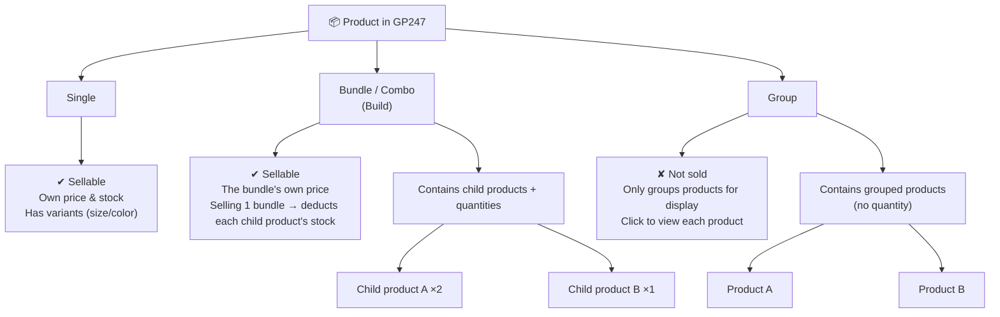

> 🌐 **Language:** [🇻🇳 Tiếng Việt](./product-structure_vi.md) · 🇬🇧 English (current)

# Product Structure in GP247: Single · Bundle · Group

## Introduction
This document explains the **3 ways to structure products** in GP247 (from version 2): **Single**,
**Bundle/Combo (Build)**, and **Group**. It is written for **non-technical** store owners: after reading,
you will tell the three apart, know which is sellable and which is display-only, and pick the right kind
for each need.

---

## 1. Overview chart

> If you are viewing this where the chart cannot render, read the **Comparison table** below — it conveys
> the same information.

---

## 2. Quick comparison

| Criterion | Single | Bundle / Combo (Build) | Group |
| --- | --- | --- | --- |
| **Customer buys directly?** | Yes | Yes | **No** (view only) |
| **Has a price?** | Yes (own price) | Yes (**the bundle's own price**) | No (shows a label, not a price) |
| **Stock** | Own stock | Bundle has its own stock; **selling 1 bundle deducts each child product's stock** | Not managed |
| **What's inside?** | Just itself | Multiple **child products + quantities** | Multiple **products** grouped together (no quantity) |
| **Variants (size, color)** | **Yes** | No | No |
| **Promotion** | Yes | Yes | No |
| **Add to cart** | Yes | Yes | No (clicks through to the product page) |

---

## 3. Each kind explained

### 3.1. Single
A normal, standalone product — e.g. "White T-shirt". This is the most common kind. Only **Single** supports
**variants** (size, color…). It has its own price and stock.

### 3.2. Bundle / Combo (Build)
One product sold as **a package** containing several **child products** with quantities — e.g. "Tet Gift
Set" = 1 box of cookies + 2 bottles of water. Key points:
- **You set the price for the bundle** (GP247 does not auto-sum the child prices).
- When a customer buys 1 bundle, the system **deducts each child product's stock** by the declared quantity.

> To create and configure this kind in detail, see the dedicated doc: **[Product Bundle (Combo)](./product-bundle.md)**.

### 3.3. Group
Only **groups products for display**, **not sold directly** — e.g. grouping related versions/colors so
customers can click between them. A Group has no price, no stock management, and no buy button; the customer
clicks a product in the group to go to that product's page.

---

## 4. Which kind should you choose?

1. Selling **one standalone item** (optionally with size/color) → choose **Single**.
2. Selling **one all-in package** of several items, counted as one sellable unit, and you want the inner
   items' stock deducted automatically → choose **Bundle**.
3. You only want to **group products so customers can browse/compare**, not sell the whole cluster → choose
   **Group**.

> Note: to see these 3 kind options when creating a product, you must **enable the `product_kind` setting**
> in Shop Configuration. If it is off, every product defaults to **Single** and the kind selector is hidden.

---

## Q&A

**Q1: I don't see the 3 product-kind options when adding a product?**

→ Enable the `product_kind` setting in Shop Configuration. When it is off, every product is Single and the
kind selector is hidden.

**Q2: Which kinds are sellable and which are not?**

→ Single and Bundle are sellable. Group is **not** sold directly — it is display-only.

**Q3: How do Bundle and Group differ?**

→ Bundle is a **sellable combo** with a price and child-stock deduction. Group only **groups products for
display** — no price, no stock, cannot be added to cart.

**Q4: Is the bundle price auto-summed from the child products?**

→ No. You set the price for the bundle yourself; GP247 does not auto-sum.

**Q5: Which kind supports variants (size, color)?**

→ Only **Single**. Bundle and Group do not use variants.

**Q6: When a customer buys 1 bundle, how is stock deducted?**

→ The bundle's stock drops by 1, and each **child product's** stock drops by its declared quantity in the bundle.

**Q7: I want a multi-item combo sold at one price — which kind?**

→ Choose **Bundle**. See the detailed creation guide in the [Product Bundle](./product-bundle.md) doc.

**Q8: I just want to group a few related products for easy browsing, not sell the cluster?**

→ Use **Group**. Customers click each product to view it; they do not buy the whole group.

**Q9: Can I change a product's kind after creating it?**

→ Yes, but consider carefully: switching to/from Bundle–Group affects the composition (child products /
grouped products) and variants. Re-check after changing.

**Q10: What if I turn off `product_kind` after creating Bundles/Groups?**

→ Products are treated as Single and the kind selector is hidden; the old bundle/group data stays in the database.

---

📅 **Last updated:** 2026-08-04 · ✍️ **Author:** GP247
