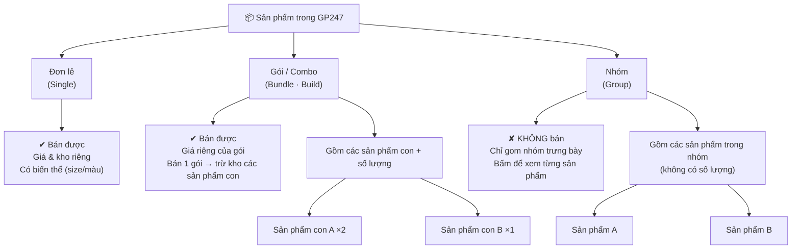

> 🌐 **Ngôn ngữ:** 🇻🇳 Tiếng Việt (hiện tại) · [🇬🇧 English](./product-structure.md)

# Tổ chức sản phẩm trong GP247: Đơn lẻ · Gói · Nhóm

## Giới thiệu
Tài liệu này giải thích **3 cách tổ chức sản phẩm** trong GP247 (từ phiên bản 2): **Đơn lẻ (Single)**,
**Gói/Combo (Bundle)** và **Nhóm (Group)**. Dành cho chủ cửa hàng **không rành kỹ thuật**: đọc xong bạn sẽ
phân biệt được 3 loại, biết loại nào bán được / loại nào chỉ để trưng bày, và chọn đúng loại cho từng nhu cầu.

---

## 1. Sơ đồ tổng quan

> Nếu bạn xem tài liệu ở nơi không vẽ được sơ đồ trên, hãy đọc **Bảng so sánh** ngay dưới — nội dung tương đương.

---

## 2. Bảng so sánh nhanh

| Tiêu chí | Đơn lẻ (Single) | Gói / Combo (Bundle) | Nhóm (Group) |
| --- | --- | --- | --- |
| **Khách mua trực tiếp?** | Có | Có | **Không** (chỉ xem) |
| **Có giá bán?** | Có (giá riêng) | Có (**giá riêng của gói**) | Không (hiện chữ, không hiện giá) |
| **Tồn kho** | Kho riêng | Gói có kho riêng; **bán 1 gói trừ kho các sản phẩm con** | Không quản lý |
| **Bên trong gồm gì?** | Chỉ một mình nó | Nhiều **sản phẩm con + số lượng** | Nhiều **sản phẩm** gom lại (không số lượng) |
| **Biến thể (size, màu)** | **Có** | Không | Không |
| **Khuyến mãi** | Có | Có | Không |
| **Thêm vào giỏ** | Được | Được | Không (bấm sang trang sản phẩm) |

---

## 3. Giải thích từng loại

### 3.1. Đơn lẻ (Single)
Sản phẩm bình thường, đứng một mình — ví dụ "Áo thun trắng". Đây là loại phổ biến nhất. Chỉ **Đơn lẻ** mới
dùng được **biến thể** (size, màu…). Có giá và kho riêng.

### 3.2. Gói / Combo (Bundle)
Một sản phẩm bán như **một gói**, bên trong gồm nhiều **sản phẩm con** kèm số lượng — ví dụ "Bộ quà Tết" =
1 hộp bánh + 2 chai nước. Điểm quan trọng:
- **Giá là do bạn tự đặt cho gói** (GP247 không tự cộng giá các sản phẩm con).
- Khi khách mua 1 gói, hệ thống **trừ kho từng sản phẩm con** theo số lượng khai báo.

> Muốn tạo và cấu hình chi tiết loại này, xem tài liệu riêng: **[Sản phẩm gói (Bundle/Combo)](./product-bundle_vi.md)**.

### 3.3. Nhóm (Group)
Chỉ để **gom nhóm trưng bày**, **không bán trực tiếp** — ví dụ gom các phiên bản/màu liên quan để khách bấm
xem qua lại. Nhóm không có giá, không quản lý kho, không có nút mua; khách bấm vào một sản phẩm trong nhóm để
chuyển sang trang sản phẩm đó.

---

## 4. Nên chọn loại nào?

1. Bán **một món độc lập** (có thể kèm size/màu) → chọn **Đơn lẻ (Single)**.
2. Bán **một combo trọn gói** gồm nhiều món, tính là một đơn vị bán, muốn tự trừ kho các món bên trong →
   chọn **Gói (Bundle)**.
3. Chỉ muốn **gom nhóm để khách dễ xem/so sánh**, không bán cả cụm → chọn **Nhóm (Group)**.

> Lưu ý: để hiện được lựa chọn 3 loại này khi tạo sản phẩm, cần **bật cấu hình `product_kind`** trong Cấu
> hình cửa hàng. Nếu tắt, mọi sản phẩm mặc định là **Đơn lẻ** và phần chọn loại bị ẩn.

---

## Hỏi & Đáp (Q&A)

**Câu 1: Tôi không thấy chỗ chọn 3 loại sản phẩm khi thêm sản phẩm?**

→ Cần bật cấu hình `product_kind` trong Cấu hình cửa hàng. Khi tắt, mọi sản phẩm là Đơn lẻ và phần chọn
loại bị ẩn.

**Câu 2: Loại nào bán được, loại nào không?**

→ Đơn lẻ và Gói (Bundle) bán được. Nhóm (Group) **không** bán trực tiếp — chỉ để trưng bày.

**Câu 3: Gói (Bundle) và Nhóm (Group) khác nhau chỗ nào?**

→ Bundle là **combo bán được**, có giá và trừ kho các sản phẩm con. Group chỉ **gom nhóm trưng bày**,
không giá, không kho, không thêm vào giỏ.

**Câu 4: Giá của gói có tự cộng từ các sản phẩm con không?**

→ Không. Bạn tự đặt giá cho gói; GP247 không tự tính tổng.

**Câu 5: Loại nào dùng được biến thể (size, màu)?**

→ Chỉ **Đơn lẻ (Single)**. Gói và Nhóm không dùng biến thể.

**Câu 6: Khách mua 1 gói thì kho trừ thế nào?**

→ Trừ 1 ở kho gói, và trừ kho **từng sản phẩm con** theo số lượng khai báo trong gói.

**Câu 7: Tôi muốn combo nhiều món tính một giá thì chọn loại nào?**

→ Chọn **Gói (Bundle)**. Xem hướng dẫn tạo chi tiết ở tài liệu [Sản phẩm gói](./product-bundle_vi.md).

**Câu 8: Tôi chỉ muốn gom vài sản phẩm liên quan cho khách dễ xem, không bán cả cụm?**

→ Dùng **Nhóm (Group)**. Khách bấm vào từng sản phẩm để xem, không mua cả nhóm.

**Câu 9: Đổi loại sản phẩm sau khi đã tạo có được không?**

→ Được, nhưng nên cân nhắc: đổi sang/khỏi Gói–Nhóm sẽ ảnh hưởng phần cấu thành (danh sách sản phẩm con /
sản phẩm trong nhóm) và biến thể. Kiểm tra lại sau khi đổi.

**Câu 10: Tắt `product_kind` sau khi đã tạo Gói/Nhóm thì sao?**

→ Các sản phẩm bị coi là Đơn lẻ và phần chọn loại bị ẩn; dữ liệu gói/nhóm cũ vẫn còn trong cơ sở dữ liệu.

---

📅 **Cập nhật lần cuối:** 2026-08-04 · ✍️ **Tác giả (Author):** GP247
