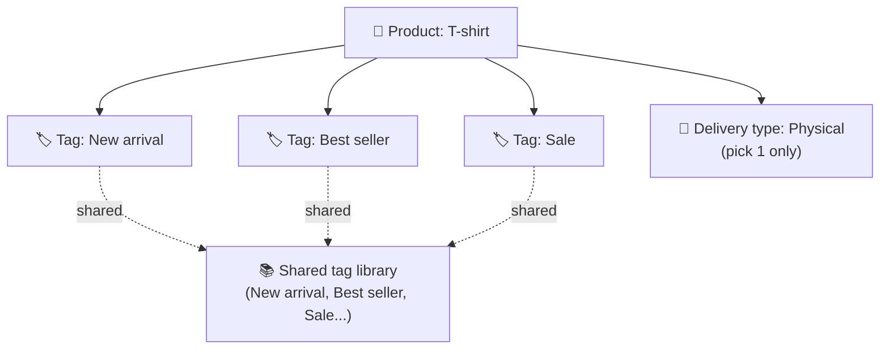

> 🌐 **Language:** [🇻🇳 Tiếng Việt](./product-tag_vi.md) · 🇬🇧 English (current)

# Product keyword tags (Product Tag) in GP247

## Introduction
This document explains **product keyword tags** (Product Tag) in GP247/S-Cart — how to attach keywords
such as `New arrival`, `Best seller`, `Sale` to products so shoppers can filter/browse by tag — written
for **non-technical store owners**. After reading it you will know how to enable the feature, create and
manage tags, assign tags to products, and understand how **disabling differs from deleting**.

> ⚠️ **Available only from `gp247/shop` version 2.1.6 onward.** If your store runs a `gp247/shop` older
> than 2.1.6, this feature does **not** exist yet — upgrade the `gp247/shop` package to 2.1.6+ and run
> `php artisan gp247:shop-update` (see [Enabling the feature](#1-enable-the-keyword-tags-feature)).

---

## First, don't confuse: "Keyword tags" is NOT "Delivery type"

The product-edit form has **two** fields that sound alike — don't mix them up:

- **Keyword tags** — the subject of this document. These are **multiple** free-form keywords you define
  yourself (`New arrival`, `Premium`…) to categorize/search. One product can carry **many** tags.
- **Delivery type** — a **single** dropdown: the product is **physical**, a **download**, or **digital**.
  This is the product's fulfillment nature, **not** a keyword tag.

> Note: in earlier releases the "Delivery type" field was mislabeled as "Tags", which was confusing. From
> 2.1.6 the label was corrected to **"Delivery type"** to separate it from **"Keyword tags"**.



---

## 1. Enable the keyword-tags feature

The feature has its own on/off switch. It is **on** by default.

1. In the admin area, open **Admin Shop → Shop configuration**.
2. Select the **Product** tab.
3. Find the line **"Use product keyword tags (multi-tag)"** and **tick** it.
4. Click **Save**.

   If it worked, the **"Keyword tags"** input appears on the product-edit form, and the storefront starts
   showing tags.

> If you just upgraded `gp247/shop` to 2.1.6 but **don't see** this config line or the "Product tags"
> menu, run the one-time database upgrade command:
> ```
> php artisan gp247:shop-update
> ```
> This command adds the config toggle, labels and menu entry for sites installed earlier. Running it
> multiple times is safe (no duplicated data).

---

## 2. Manage tags (add / edit / disable / delete)

1. Open **Admin Shop → Catalog → Product tags**.
2. The **add/edit form** is on the left, the **tag list** is on the right.
3. To **add a new tag**, fill in the left form:
   - **Name** — required. Example `New arrival`.
   - **Alias** (URL slug) — may be **left blank**; the system derives it from the name (e.g. `New arrival`
     → `new-arrival`). This is what appears in the `/tag/<alias>` link on the storefront.
   - **Sort** — required, a number ≥ 0, used for ordering.
   - **Active** — tick to make the tag visible on the storefront.
4. Click **Submit**.

   If it worked, the new tag shows up in the list on the right and can be assigned to products.

5. To **edit** a tag: click it in the list, change it, then Submit.
6. To **enable/disable** a tag: edit it and tick/untick **Active** (see [Disable vs delete](#4-how-disabling-differs-from-deleting)).
7. To **delete** a tag: use the delete button on the tag's row in the list.

---

## 3. Assign tags to products

1. Open **Catalog → Products** and click **edit** on a product.
2. Find the **"Keyword tags"** field (usually near the bottom of the form, below "Delivery type").
3. Type tag names, **separating multiple tags with commas**. Example: `New arrival, Best seller, Sale`.
   - You can **click to pick** from the suggested existing tags below the input.
   - If you type **a name that doesn't exist yet**, the system will **auto-create the new tag** when you
     save the product.
4. Click **Submit** to save the product.

   If it worked, the tags render as "chips" (rounded labels) on the storefront product-detail page, each
   clickable to a listing of all products sharing that tag.

> Dedup tip: two spellings with the same meaning **merge into one tag** if they produce the same alias.
> For example typing `New Arrival` or `new-arrival` both resolve to `new-arrival`, not two separate tags.

---

## 4. How disabling differs from deleting

This is the most easily confused part. The two actions give **very different** results.

### Disable (untick "Active") — temporarily hidden, data kept

- The tag and all its **product links stay intact**; it is only **hidden from the storefront**:
  - The tag's `/tag/<alias>` page returns **"Not found" (404)**.
  - The tag's chip **does not show** on the product-detail page.
  - When editing a product, a disabled tag **does not appear in suggestions** (but typing its exact name
    still reuses it).
- **Easily reversible:** just tick **Active** again and everything returns as before — no links lost.
- Use when: you want to **temporarily hide** a tag (e.g. a finished `Sale`) while keeping it for later.

### Delete (delete button) — removes the tag, but does NOT delete products

- The tag is **permanently deleted**. The system automatically **removes every link** between that tag and
  its products.
- **Products are NOT deleted** — they only lose their link to the deleted tag.
- That tag's `/tag/<alias>` page no longer exists; chips pointing to it disappear.
- **Not automatically reversible:** re-creating a tag with the same name later is a **new tag with no
  products attached** (the old links were removed). Only by reopening each product and re-saving that tag
  name do you reconnect them.
- Use when: you want to **remove a tag entirely** from the system.

| | Disable (Active off) | Delete |
| --- | --- | --- |
| Tag still in the system | ✅ Yes | ❌ Gone |
| Links to products | ✅ Kept | ❌ All removed |
| Products | Untouched | Untouched |
| Storefront visibility | Hidden | Hidden (tag gone) |
| Re-enable / restore | ✅ Turn Active back on | ❌ Must re-create & re-assign |

---

## Conditions & Rules (know before you act)

### When enabling/disabling the feature
- **The `product_tags` toggle must be on** for the tag input, storefront chips and `/tag/<alias>` pages to
  work — it is the master switch for the whole feature. When off: the input is hidden, chips don't show,
  and every tag page returns 404 (so a disabled feature is not exposed).
- **Never configured = treated as on** — if this config line does not exist yet (a freshly upgraded site),
  the system defaults to **on** to preserve the default behavior.

### When creating/editing a tag
- **Name is required**, max **100 characters** — no name, no save.
- **Alias must be unique** across tags, max **120 characters** — because the alias is the single address in
  the `/tag/<alias>` link; a duplicate alias makes two tags collide. Leave it blank to auto-derive from the
  name.
- **Sort is required**, a **number ≥ 0** — used to order the display.

### When tags render on the storefront
- **Only active tags show** — a disabled tag is hidden from chips, listing and its link (see
  [Disable vs delete](#4-how-disabling-differs-from-deleting)).

### When deleting a tag
- **Deleting a tag only removes links, it does not delete products** — safe for your merchandise, but the
  removed links are **not reversible**.

---

## Q&A

**Q1: Why don't I see the "Keyword tags" field or the "Product tags" menu?**

→ The feature exists only from `gp247/shop` 2.1.6 onward. Upgrade the package to 2.1.6+, run `php artisan gp247:shop-update`, and make sure the "Use product keyword tags" toggle is on.

**Q2: What's the difference between "Keyword tags" and "Delivery type"?**

→ Keyword tags are multiple free-form labels for categorizing/searching (New arrival, Sale…). Delivery type is a single dropdown: physical / download / digital. They are entirely different things.

**Q3: What happens if I leave the Alias field blank?**

→ The system derives the alias from the tag name (e.g. `New arrival` → `new-arrival`). You only need to type an alias yourself when you want a custom link.

**Q4: Does typing a not-yet-existing tag while editing a product create a new tag?**

→ Yes. When you save the product, a tag name that doesn't exist yet is auto-created as a new tag (by its corresponding alias).

**Q5: What happens when I disable a tag?**

→ The tag is hidden from the storefront (chips, listing, link 404) but keeps all its product links. Ticking Active again fully restores it.

**Q6: Does deleting a tag also delete the products?**

→ No. Deleting a tag only removes the links between the tag and its products; the products remain intact.

**Q7: Can I restore a tag I deleted by mistake?**

→ Not automatically. Re-creating a tag with the same name is a new tag with no products attached; you must reopen each product and re-save the tag to reconnect. If you only want to hide it temporarily, use Disable instead of Delete.

**Q8: Are two tags with different capitalization counted as two separate tags?**

→ No, if they resolve to the same alias. For example `New Arrival` and `new-arrival` both become `new-arrival` and merge into one.

**Q9: What if I disable the whole feature (untick "Use product keyword tags")?**

→ The tag input hides, chips don't show, and every `/tag/<alias>` page returns 404. The tag data is still there; turning it back on makes it work again.

**Q10: How many tags can one product carry?**

→ No limit — type as many tags (comma-separated) as you like, for any product type.

---

<sub>📅 **Last updated:** 2026-08-25 · ✍️ **Author:** GP247</sub>
