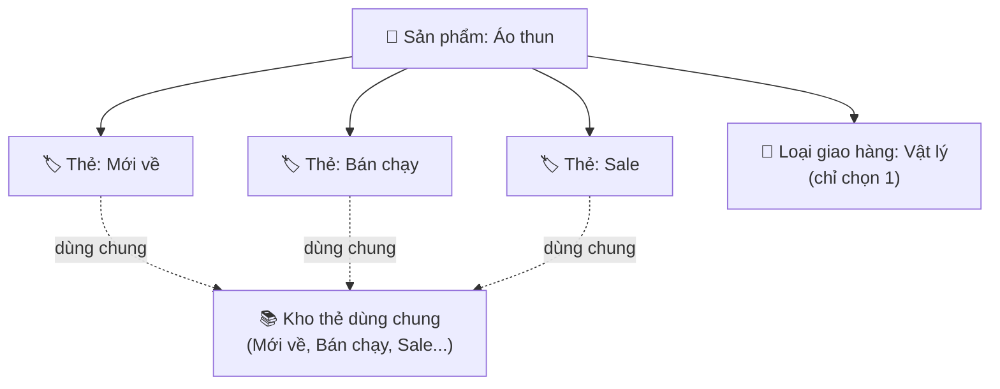

> 🌐 **Ngôn ngữ:** 🇻🇳 Tiếng Việt (hiện tại) · [🇬🇧 English](./product-tag.md)

# Thẻ từ khóa sản phẩm (Product Tag) trong GP247

## Giới thiệu
Tài liệu này giải thích **thẻ từ khóa sản phẩm** (Product Tag) trong GP247/S-Cart — cách gắn các từ khóa
như `Mới về`, `Bán chạy`, `Sale` cho sản phẩm để khách lọc/tìm theo thẻ — dành cho **chủ cửa hàng không
rành kỹ thuật**. Đọc xong bạn sẽ biết cách bật tính năng, tạo và quản lý thẻ, gán thẻ cho sản phẩm, và
hiểu rõ **tắt (disable) khác xóa (delete) thế nào**.

> ⚠️ **Chỉ có từ `gp247/shop` phiên bản 2.1.6 trở lên.** Nếu cửa hàng của bạn đang chạy bản `gp247/shop`
> cũ hơn 2.1.6 thì **chưa có** tính năng này — bạn cần cập nhật gói `gp247/shop` lên 2.1.6+ rồi chạy
> `php artisan gp247:shop-update` (xem mục [Bật tính năng](#1-bật-tính-năng-thẻ-từ-khóa)).

---

## Phân biệt trước: "Thẻ từ khóa" KHÁC "Loại giao hàng"

Trong trang sửa sản phẩm có **hai** ô nghe na ná nhau, đừng nhầm:

- **Thẻ từ khóa (Keyword tags)** — chủ đề của tài liệu này. Là **nhiều** từ khóa tự do bạn tự đặt (`Mới về`,
  `Hàng hiệu`…) để phân loại/tìm kiếm. Một sản phẩm gắn được **nhiều** thẻ.
- **Loại giao hàng (Delivery type)** — một ô chọn **duy nhất**: sản phẩm là hàng **vật lý**, **download**
  hay **số hóa (digital)**. Đây là bản chất giao hàng của sản phẩm, **không phải** thẻ từ khóa.

> Ghi chú: ở các bản trước, ô "Loại giao hàng" từng bị đặt nhãn nhầm là "Tags" gây hiểu lầm. Từ 2.1.6 nhãn
> đã được sửa lại thành **"Loại giao hàng"** để tách bạch với **"Thẻ từ khóa"**.



---

## 1. Bật tính năng thẻ từ khóa

Tính năng có một công tắc bật/tắt riêng. Mặc định là **bật**.

1. Vào trang quản trị, mở **Admin Shop → Shop configuration** (Cấu hình cửa hàng).
2. Chọn tab **Product** (Sản phẩm).
3. Tìm dòng **"Use product keyword tags (multi-tag)"** (Dùng thẻ từ khóa sản phẩm) và **tick** ô đó.
4. Bấm **Save** (Lưu).

   Nếu thành công, ô nhập **"Keyword tags"** sẽ xuất hiện trong trang sửa sản phẩm, và trang gian hàng bắt
   đầu hiển thị thẻ.

> Nếu bạn vừa cập nhật gói `gp247/shop` lên 2.1.6 mà **chưa thấy** dòng cấu hình này hoặc **chưa thấy** menu
> "Product tags", hãy chạy lệnh cập nhật cơ sở dữ liệu một lần:
> ```
> php artisan gp247:shop-update
> ```
> Lệnh này bổ sung công tắc cấu hình, nhãn và mục menu cho các site đã cài từ trước. Chạy lại nhiều lần cũng
> an toàn (không nhân đôi dữ liệu).

---

## 2. Quản lý thẻ (thêm / sửa / bật-tắt / xóa)

1. Vào **Admin Shop → Catalog → Product tags** (Thẻ sản phẩm).
2. Bên trái là **form thêm/sửa**, bên phải là **danh sách thẻ**.
3. Để **thêm thẻ mới**, điền form bên trái:
   - **Name** (Tên) — bắt buộc. Ví dụ `Mới về`.
   - **Alias** (Đường dẫn) — có thể **để trống**, hệ thống tự sinh từ tên (ví dụ `Mới về` → `moi-ve`). Đây là
     phần xuất hiện trên đường link `/tag/<alias>` ngoài gian hàng.
   - **Sort** (Thứ tự) — bắt buộc, là số ≥ 0, dùng để sắp xếp.
   - **Active** (Kích hoạt) — tick để thẻ hiển thị ngoài gian hàng.
4. Bấm **Submit** (Lưu).

   Nếu thành công, thẻ mới xuất hiện trong danh sách bên phải và có thể gán cho sản phẩm.

5. Để **sửa** một thẻ: bấm vào thẻ trong danh sách, sửa rồi Submit.
6. Để **bật/tắt** một thẻ: sửa thẻ và tick/bỏ tick **Active** (xem mục [Tắt khác xóa](#4-tắt-disable-khác-xóa-delete-thế-nào)).
7. Để **xóa** một thẻ: dùng nút xóa trên dòng thẻ trong danh sách.

---

## 3. Gán thẻ cho sản phẩm

1. Mở **Catalog → Products**, bấm **sửa** một sản phẩm.
2. Tìm ô **"Keyword tags"** (thường nằm gần cuối form, dưới ô "Loại giao hàng").
3. Gõ tên thẻ, **ngăn cách nhiều thẻ bằng dấu phẩy**. Ví dụ: `Mới về, Bán chạy, Sale`.
   - Bạn có thể **bấm chọn** từ các thẻ gợi ý có sẵn bên dưới ô nhập.
   - Nếu gõ **một tên thẻ chưa tồn tại**, hệ thống sẽ **tự tạo thẻ mới** khi bạn lưu sản phẩm.
4. Bấm **Submit** để lưu sản phẩm.

   Nếu thành công, các thẻ sẽ hiện thành các "chip" (nhãn bo tròn) ở trang chi tiết sản phẩm ngoài gian hàng,
   mỗi chip bấm được để dẫn tới trang liệt kê mọi sản phẩm cùng thẻ.

> Mẹo tránh trùng: hai cách viết cùng ý nghĩa sẽ **gộp về một thẻ** nếu ra cùng alias. Ví dụ gõ `Mới Về` hay
> `moi-ve` đều quy về thẻ `moi-ve`, không tạo hai thẻ riêng.

---

## 4. Tắt (disable) khác xóa (delete) thế nào

Đây là phần dễ nhầm nhất. Hai thao tác cho kết quả **rất khác nhau**.

### Tắt (bỏ tick "Active") — ẩn tạm, giữ nguyên dữ liệu

- Thẻ và mọi **liên kết với sản phẩm vẫn còn nguyên**, chỉ là **ẩn khỏi gian hàng**:
  - Trang `/tag/<alias>` của thẻ trả về **"Không tìm thấy" (404)**.
  - Chip của thẻ **không hiện** ở trang chi tiết sản phẩm.
  - Khi sửa sản phẩm, thẻ đã tắt **không xuất hiện trong gợi ý** (nhưng nếu gõ đúng tên vẫn dùng lại được).
- **Đảo ngược dễ dàng:** chỉ cần bật lại **Active** là mọi thứ trở lại như cũ, không mất liên kết nào.
- Dùng khi: muốn **tạm ẩn** một thẻ (ví dụ hết đợt `Sale`) mà vẫn giữ để dùng lại sau.

### Xóa (nút xóa) — bỏ hẳn thẻ, nhưng KHÔNG xóa sản phẩm

- Thẻ bị **xóa vĩnh viễn**. Hệ thống tự **gỡ mọi liên kết** giữa thẻ đó và các sản phẩm.
- **Sản phẩm KHÔNG bị xóa** — chỉ mất liên kết tới thẻ vừa xóa.
- Trang `/tag/<alias>` của thẻ đó không còn tồn tại; chip trỏ tới nó biến mất.
- **Không tự đảo ngược được:** nếu sau này tạo lại thẻ cùng tên, đó là **thẻ mới, chưa gắn sản phẩm nào**
  (các liên kết cũ đã bị gỡ). Chỉ khi bạn mở lại từng sản phẩm và lưu lại tên thẻ đó thì mới nối lại.
- Dùng khi: muốn **loại bỏ hẳn** một thẻ khỏi hệ thống.

| | Tắt (Active off) | Xóa (Delete) |
| --- | --- | --- |
| Thẻ còn trong hệ thống | ✅ Còn | ❌ Mất |
| Liên kết với sản phẩm | ✅ Giữ nguyên | ❌ Bị gỡ hết |
| Sản phẩm | Không đụng tới | Không đụng tới |
| Hiển thị gian hàng | Ẩn | Ẩn (do thẻ mất) |
| Bật/khôi phục lại | ✅ Bật lại Active | ❌ Phải tạo & gán lại |

---

## Điều kiện & ràng buộc (hiểu trước khi thao tác)

### Khi bật/tắt tính năng
- **Công tắc `product_tags` phải đang bật** thì ô nhập thẻ, chip gian hàng và trang `/tag/<alias>` mới hoạt
  động — vì đây là công tắc tổng của cả tính năng. Khi tắt: ô nhập ẩn đi, chip không hiện, và mọi trang thẻ
  trả về 404 (để tính năng đã tắt không lộ ra ngoài).
- **Chưa từng cấu hình = coi như bật** — nếu chưa có dòng cấu hình này (site mới cập nhật), hệ thống mặc định
  **bật** để giữ hành vi mặc định.

### Khi tạo/sửa thẻ
- **Name bắt buộc nhập**, tối đa **100 ký tự** — không có tên thì không lưu được.
- **Alias không được trùng** với thẻ khác, tối đa **120 ký tự** — vì alias là địa chỉ duy nhất trên đường link
  `/tag/<alias>`; trùng alias sẽ khiến hai thẻ đụng nhau. Để trống thì hệ thống tự sinh alias từ tên.
- **Sort bắt buộc**, là **số ≥ 0** — dùng để sắp thứ tự hiển thị.

### Khi thẻ hiển thị ngoài gian hàng
- **Chỉ thẻ đang bật (Active) mới hiện** — thẻ tắt sẽ bị ẩn ở cả chip, trang liệt kê lẫn đường link (xem mục
  [Tắt khác xóa](#4-tắt-disable-khác-xóa-delete-thế-nào)).

### Khi xóa thẻ
- **Xóa thẻ chỉ gỡ liên kết, không xóa sản phẩm** — an toàn cho hàng hóa, nhưng **không đảo ngược** được các
  liên kết đã gỡ.

---

## Hỏi & Đáp (Q&A)

**Câu 1: Vì sao tôi không thấy ô "Keyword tags" hay menu "Product tags"?**

→ Tính năng chỉ có từ `gp247/shop` 2.1.6 trở lên. Hãy cập nhật gói lên 2.1.6+, chạy `php artisan gp247:shop-update`, và đảm bảo công tắc "Use product keyword tags" đang bật.

**Câu 2: "Thẻ từ khóa" và "Loại giao hàng" khác gì nhau?**

→ Thẻ từ khóa là nhiều nhãn tự do để phân loại/tìm kiếm (Mới về, Sale…). Loại giao hàng là một ô chọn duy nhất: vật lý / download / số hóa. Hai thứ hoàn toàn khác nhau.

**Câu 3: Tôi để trống ô Alias thì sao?**

→ Hệ thống tự sinh alias từ tên thẻ (ví dụ `Mới về` → `moi-ve`). Bạn chỉ cần tự nhập alias khi muốn một đường link tùy chỉnh.

**Câu 4: Gõ một thẻ chưa có trong lúc sửa sản phẩm thì có tạo thẻ mới không?**

→ Có. Khi lưu sản phẩm, tên thẻ chưa tồn tại sẽ được tự tạo thành thẻ mới (theo alias tương ứng).

**Câu 5: Tắt (disable) một thẻ thì chuyện gì xảy ra?**

→ Thẻ bị ẩn khỏi gian hàng (chip, trang liệt kê, link 404) nhưng vẫn giữ nguyên liên kết với sản phẩm. Bật lại Active là khôi phục hoàn toàn.

**Câu 6: Xóa một thẻ có xóa luôn sản phẩm không?**

→ Không. Xóa thẻ chỉ gỡ liên kết giữa thẻ và các sản phẩm; sản phẩm vẫn còn nguyên.

**Câu 7: Xóa nhầm thẻ thì khôi phục được không?**

→ Không tự khôi phục được. Tạo lại thẻ cùng tên sẽ là thẻ mới chưa gắn sản phẩm; bạn phải mở lại từng sản phẩm và lưu lại thẻ để nối. Nếu chỉ muốn tạm ẩn, hãy dùng Tắt thay vì Xóa.

**Câu 8: Hai thẻ viết hoa/thường khác nhau có bị coi là hai thẻ riêng không?**

→ Không, nếu chúng quy về cùng một alias. Ví dụ `Mới Về` và `moi-ve` đều thành `moi-ve` và gộp làm một.

**Câu 9: Tôi tắt cả tính năng (bỏ tick "Use product keyword tags") thì sao?**

→ Ô nhập thẻ ẩn đi, chip không hiện, mọi trang `/tag/<alias>` trả về 404. Dữ liệu thẻ vẫn còn; bật lại là hoạt động trở lại.

**Câu 10: Một sản phẩm gắn được bao nhiêu thẻ?**

→ Không giới hạn — bạn gõ bao nhiêu thẻ (ngăn cách bằng dấu phẩy) cũng được, áp dụng cho mọi loại sản phẩm.

---

<sub>📅 **Cập nhật lần cuối:** 2026-08-25 · ✍️ **Tác giả (Author):** GP247</sub>
