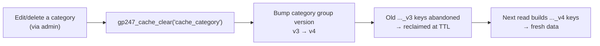

> 🌐 **Language:** [🇻🇳 Tiếng Việt](./cache-system_vi.md) · 🇬🇧 English (current)

# Cache Handling in GP247

## Introduction
This document explains **how caching works in GP247**: what the admin "Config Cache Manager" screen contains, **what GP247 caches and what it does NOT**, how to **clear cache correctly**, and how to use the cache helper functions as a developer. It is for site owners and developers. After reading it you will know how to safely enable/disable cache, clear it when data looks "stale", and understand why product price/stock is **not** cached.

## What cache is and where GP247 uses it

A cache is a temporary copy of a computed/queried result, kept so the **next read is fast** instead of hitting the database again. The trade-off: cached data can be **stale** until it expires or is cleared.

In GP247, caching is used selectively for a few **rarely-changing admin lists**:

- **Category title list** (the parent-category dropdown when adding/editing a category).
- **CMS page title list** (the page-selection dropdown).
- **Country list** (used across several forms).

> ⚠️ **GP247 does NOT cache storefront pages, and does NOT cache product price or stock.** Those must be realtime — see "What should NOT be cached".

## Cache driver — where GP247 stores cache

GP247 uses Laravel's cache system. Where cache is stored is decided by the `CACHE_STORE` variable in the `.env` file. Default:

```
CACHE_STORE=database
```

This means cache is stored in a **database table** — it works in **every environment**, including shared hosting without Redis/Memcached. It is the safest choice and GP247's default.

| Environment | Suggested `CACHE_STORE` | Notes |
| --- | --- | --- |
| Shared hosting | `database` (default) | Nothing extra to install |
| VPS / Docker | `database` or `redis` | `redis` is faster if available |
| Running tests | `array` | Cache lives in RAM for one request only |

> **Important technical note:** the `database` (and `file`) driver **does not support wildcard or tag-based cache clearing**. This is exactly why GP247 uses a "version-bump" mechanism to clear cache — see the section below.

## The "Config Cache Manager" screen — each value

Go to **Admin → Config → Cache** (Config Cache Manager). This screen writes straight to config; edits take effect immediately. The fields:

| Field | Type | Meaning |
| --- | --- | --- |
| **Status** (`cache_status`) | On/Off | **Master switch.** Off → all caches below stop working (always read from DB). |
| **Cache time** (`cache_time`) | Seconds | Default time-to-live (TTL) of a cache entry. Default **600** (10 minutes). Entering ≤ 0 or a non-number is clamped back to **600**. |
| **Cache category** (`cache_category`) | On/Off | Enable caching of the admin **Category** title list. |
| **Cache page** (`cache_page`) | On/Off | Enable caching of the admin **CMS page** title list. |
| **Cache country** (`cache_country`) | On/Off | Enable caching of the **Country** list. |

**Condition for a cache to run:** **both** switches must be on — `cache_status` (master) **and** that group's own flag. For example, categories are only cached when both `cache_status` **and** `cache_category` are on.

> 📌 Since the 2026-08-12 update, 4 old no-op flags were **removed from the screen**: `cache_product`, `cache_news`, `cache_category_cms`, `cache_content_cms`. If an older build still shows them, those are "dead" flags (no reader anywhere).

## What is cached, and what should NOT be cached

This is the most important part for using cache **the production-correct way**.

### ✅ Safe to cache (GP247 caches these)
Only **near-immutable**, **title-only** lists (id + name):
- Category titles, CMS page titles, the country list.

They are safe because: they rarely change, and they **contain no price/stock** — even if a few minutes stale, no business harm.

### ❌ Should NOT be cached
- **Product price and stock.** This is **realtime** data: prices change on promotions, stock is decremented **per order**. If cached, admin/customer may see an old price or wrong stock right after a change. That risk is **monetary**, not just cosmetic → GP247 does **not** cache products.
- **Storefront pages, cart, orders, stock** — anything time-dependent or per-user.

> Rule of thumb: **only cache things that rarely change and are unrelated to money/stock.** When in doubt, don't cache — correctness beats speed.

## The cache-clearing mechanism: "version-bump"

Because the `database` driver cannot clear cache by pattern, GP247 uses a **versioning** trick:

- Each cache group has a "version number" stored separately (e.g. the `category` group).
- The cache key **embeds that version number** in its name: `{store}_cache_category_{locale}_v{version}`.
- **Clearing cache = increment the version by 1.** Immediately, every key carrying the old number becomes "unreferenced" and is reclaimed once its TTL expires.

Benefit: **one increment** invalidates the cache for **every store × every locale** at once, without enumerating each key.



When cache is cleared **automatically**:
- Edit/delete a **Category** → bump the `category` group version.
- Edit/delete a **CMS page** → bump the `page` group version.

The `country` group uses a flat key, so it is cleared directly.

> **"Clear all" (`cache_all`) only clears GP247's cache groups** (`category`, `page`, `country`). It **no longer** wipes the entire system cache like before (avoiding accidental deletion of SEO/sitemap cache, the update-manager cache, etc.).

## For developers: the cache helper functions

GP247 ships helper functions (declared in `vendor/gp247/core/src/Library/Helpers/cache.php`):

1. **Store a value in cache** (uses the TTL from the `cache_time` config, default 600s):

   ```php
   gp247_cache_set('my_cache_key', $data);
   // or specify a custom TTL (seconds):
   gp247_cache_set('my_cache_key', $data, 3600);
   ```

2. **Clear (invalidate) a cache group:**

   ```php
   gp247_cache_clear('cache_category'); // bump the category group version
   gp247_cache_clear('cache_page');     // bump the page group version
   gp247_cache_clear('cache_country');  // forget the country key
   gp247_cache_clear('cache_all');      // clear all GP247 groups (no system-wide flush)
   ```

3. **Build your own version-based cache** (when you need bulk invalidation across store × locale):

   ```php
   // Read the current version of a group (defaults to 1)
   $ver = gp247_cache_version('my_group');

   // Embed the version in the key
   $key = 'my_group_' . $storeId . '_' . gp247_get_locale() . '_v' . $ver;

   // When the data changes, bump the version to invalidate every old key
   gp247_cache_bump('my_group');
   ```

> To "lock" a helper so GP247 does not define it (letting you override it), add the function name to the `config('gp247_functions_except')` array — every function above honors this mechanism.

## Troubleshooting

- **Data looks "stale" after an edit:** open the Cache screen and clear the relevant group, or run Laravel's cache-clear command:

  ```
  php artisan cache:clear
  ```

- **Want to fully disable cache to test:** turn off the **Status** (`cache_status`) switch on the Cache screen — everything then reads straight from the DB.
- **After deploying new code:** clear Laravel's config/route/view caches:

  ```
  php artisan optimize:clear
  ```

## Q&A

**Q1: Does enabling cache make the site much faster?**
For most sites the cached portion (a few admin title lists) is small, so the benefit is modest. GP247's cache aims to **reduce repeated queries**, not to speed up the storefront. Storefront speed depends on other factors (server, images, number of queries).

**Q2: Why is there no option to cache products?**
Because products carry **price and stock** that must be realtime. Caching them easily causes an old price / wrong stock after a change or after each order. That is a monetary risk, so GP247 deliberately does not cache products.

**Q3: I renamed a category but the dropdown still shows the old name?**
Since the 2026-08-12 update, editing/deleting a category **auto-clears** the cache correctly. If it still looks old (older build, or data changed outside admin), open the Cache screen and clear, or run `php artisan cache:clear`.

**Q4: What value should I set for "Cache time"?**
The default **600 seconds (10 minutes)** is reasonable. Set higher if data rarely changes; lower for fresher data. Entering 0 or a negative number is clamped to 600 to avoid an accidental "cache forever".

**Q5: Does "Clear all" risk deleting important data?**
No. `cache_all` only clears GP247's cache groups (`category`, `page`, `country`). It does **not** flush the whole system cache, so it never touches SEO/sitemap cache or other caches.

**Q6: My shared host has no Redis — does cache still work?**
Yes. The default `CACHE_STORE=database` stores cache in a DB table and works fine on any shared host. Nothing extra to install.

**Q7: I'm a developer — what do I use to cache my own data?**
Use `gp247_cache_set()` to store, and if you need bulk invalidation across store/locale, apply the `gp247_cache_version()` + `gp247_cache_bump()` pair as shown in the "For developers" section.

**Q8: Does turning off `cache_status` cause any harm?**
No errors — lists simply read straight from the DB (a few extra queries). It is safe to turn off when you need to verify the latest data.

---

<sub>📅 **Last updated:** 2026-08-12 · ✍️ **Author:** GP247</sub>
