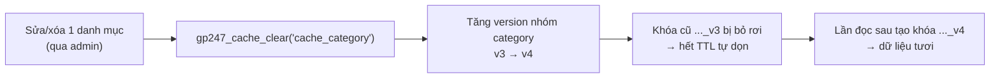

> 🌐 **Ngôn ngữ:** 🇻🇳 Tiếng Việt (hiện tại) · [🇬🇧 English](./cache-system.md)

# Xử lý Cache trong GP247

## Giới thiệu
Tài liệu này giải thích **cache (bộ nhớ đệm) trong GP247 hoạt động thế nào**: màn hình "Config Cache Manager" trong admin gồm những gì, GP247 **cache cái gì và KHÔNG cache cái gì**, cơ chế **xóa cache đúng cách**, và cách dùng các hàm cache cho lập trình viên. Dành cho chủ site và người phát triển. Đọc xong bạn biết bật/tắt cache an toàn, xóa cache khi dữ liệu bị "cũ", và hiểu vì sao giá/tồn kho sản phẩm **không** được cache.

## Cache là gì và GP247 dùng nó ở đâu

Cache là bản sao tạm của một kết quả tính toán/truy vấn, lưu lại để **lần sau lấy cho nhanh** thay vì hỏi lại cơ sở dữ liệu. Đổi lại, dữ liệu trong cache có thể **cũ (stale)** cho tới khi hết hạn hoặc bị xóa.

Trong GP247, cache được dùng có chọn lọc cho vài **danh sách ít thay đổi ở trang admin**:

- **Danh sách tiêu đề Danh mục** (dropdown chọn danh mục cha khi thêm/sửa danh mục).
- **Danh sách tiêu đề Trang CMS** (dropdown chọn trang).
- **Danh sách Quốc gia** (dùng ở nhiều form).

> ⚠️ **GP247 KHÔNG cache trang storefront, KHÔNG cache giá và tồn kho sản phẩm.** Những thứ đó cần realtime — xem mục "Cái gì KHÔNG nên cache".

## Cache driver — GP247 lưu cache ở đâu

GP247 dùng hệ thống cache của Laravel. Nơi lưu cache do biến `CACHE_STORE` trong file `.env` quyết định. Mặc định:

```
CACHE_STORE=database
```

Nghĩa là cache được lưu trong **bảng cơ sở dữ liệu** — chạy được ở **mọi môi trường**, kể cả shared host không có Redis/Memcached. Đây là lựa chọn an toàn nhất và là mặc định của GP247.

| Môi trường | `CACHE_STORE` gợi ý | Ghi chú |
| --- | --- | --- |
| Shared host | `database` (mặc định) | Không cần cài gì thêm |
| VPS / Docker | `database` hoặc `redis` | `redis` nhanh hơn nếu có sẵn |
| Chạy test | `array` | Cache chỉ nằm trong RAM một request |

> **Lưu ý kỹ thuật quan trọng:** driver `database` (và `file`) **không hỗ trợ xóa cache theo mẫu (wildcard) hay theo tag**. Đây là lý do GP247 dùng cơ chế "version-bump" để xóa cache — xem mục bên dưới.

## Màn hình "Config Cache Manager" — từng giá trị

Vào **Admin → Cấu hình → Cache** (Config Cache Manager). Màn này ghi thẳng vào cấu hình, chỉnh là có hiệu lực ngay. Các trường:

| Trường | Kiểu | Ý nghĩa |
| --- | --- | --- |
| **Status** (`cache_status`) | Bật/Tắt | **Công tắc tổng.** Tắt → toàn bộ cache bên dưới ngừng hoạt động (luôn đọc từ DB). |
| **Cache time** (`cache_time`) | Số giây | Thời gian sống (TTL) mặc định của một mục cache. Mặc định **600** (10 phút). Nhập ≤ 0 hoặc không phải số sẽ tự về **600**. |
| **Cache category** (`cache_category`) | Bật/Tắt | Bật cache danh sách tiêu đề **Danh mục** cho admin. |
| **Cache page** (`cache_page`) | Bật/Tắt | Bật cache danh sách tiêu đề **Trang CMS** cho admin. |
| **Cache country** (`cache_country`) | Bật/Tắt | Bật cache danh sách **Quốc gia**. |

**Điều kiện để một cache chạy:** cần **cả hai** công tắc cùng bật — `cache_status` (tổng) **và** cờ riêng của nhóm đó. Ví dụ danh mục chỉ được cache khi `cache_status` **và** `cache_category` đều bật.

> 📌 Từ bản cập nhật 2026-08-12, 4 cờ cũ không còn tác dụng đã được **gỡ khỏi màn hình**: `cache_product`, `cache_news`, `cache_category_cms`, `cache_content_cms`. Nếu bản cũ của bạn còn thấy chúng, đó là các cờ "chết" (không nơi nào đọc).

## Cái gì được cache, cái gì KHÔNG nên cache

Đây là phần quan trọng nhất để dùng cache **đúng chuẩn production**.

### ✅ An toàn để cache (GP247 đang cache)
Chỉ những danh sách **gần như bất biến** và **chỉ chứa tiêu đề** (id + tên):
- Tiêu đề danh mục, tiêu đề trang CMS, danh sách quốc gia.

Chúng an toàn vì: hiếm khi đổi, và **không chứa giá/tồn kho** — dù có cũ vài phút cũng không gây sai nghiệp vụ.

### ❌ KHÔNG nên cache
- **Giá và tồn kho sản phẩm.** Đây là dữ liệu **realtime**: giá đổi khi khuyến mãi, tồn kho trừ theo **từng đơn hàng**. Nếu cache, admin/khách có thể thấy giá cũ hoặc tồn sai ngay sau khi thay đổi. Rủi ro này là **tiền bạc**, không chỉ hiển thị → GP247 **không** cache sản phẩm.
- **Trang storefront, giỏ hàng, đơn hàng, tồn kho** — mọi thứ phụ thuộc thời điểm hoặc theo từng người dùng.

> Nguyên tắc rút gọn: **chỉ cache thứ ít đổi và không liên quan tiền/kho.** Khi phân vân, đừng cache — đúng đắn quan trọng hơn nhanh.

## Cơ chế xóa cache: "version-bump"

Vì driver `database` không xóa được cache theo mẫu, GP247 dùng mẹo **đánh số phiên bản (version)**:

- Mỗi nhóm cache có một "số phiên bản" lưu riêng (ví dụ nhóm `category`).
- Khóa cache **nhúng số phiên bản** vào tên: `{store}_cache_category_{ngôn-ngữ}_v{phiên-bản}`.
- **Xóa cache = tăng số phiên bản lên 1.** Ngay lập tức mọi khóa mang số cũ trở nên "không ai hỏi tới" nữa, và sẽ tự bị dọn khi hết TTL.

Ưu điểm: **một lần tăng số** là vô hiệu hóa cache cho **mọi cửa hàng × mọi ngôn ngữ** cùng lúc, không cần liệt kê từng khóa.



Khi nào cache **tự** được xóa:
- Sửa/xóa **Danh mục** → tăng version nhóm `category`.
- Sửa/xóa **Trang CMS** → tăng version nhóm `page`.

Còn nhóm `country` dùng khóa phẳng nên được xóa trực tiếp.

> **"Xóa tất cả" (`cache_all`) chỉ xóa các nhóm cache của GP247** (`category`, `page`, `country`). Nó **không** còn xóa sạch toàn bộ cache hệ thống như trước (tránh xóa nhầm cache SEO/sitemap, cache trình quản lý cập nhật…).

## Dành cho lập trình viên: các hàm cache

GP247 cung cấp sẵn các hàm helper (khai báo trong `vendor/gp247/core/src/Library/Helpers/cache.php`):

1. **Lưu một giá trị vào cache** (dùng TTL từ cấu hình `cache_time`, mặc định 600s):

   ```php
   gp247_cache_set('my_cache_key', $data);
   // hoặc chỉ định TTL riêng (giây):
   gp247_cache_set('my_cache_key', $data, 3600);
   ```

2. **Xóa (vô hiệu hóa) một nhóm cache:**

   ```php
   gp247_cache_clear('cache_category'); // tăng version nhóm category
   gp247_cache_clear('cache_page');     // tăng version nhóm page
   gp247_cache_clear('cache_country');  // xóa khóa country
   gp247_cache_clear('cache_all');      // xóa mọi nhóm GP247 (không flush toàn hệ thống)
   ```

3. **Tự làm cache theo version cho dữ liệu của bạn** (khi cần vô hiệu hàng loạt theo cửa hàng × ngôn ngữ):

   ```php
   // Đọc số phiên bản hiện tại của một nhóm (mặc định 1)
   $ver = gp247_cache_version('my_group');

   // Nhúng version vào khóa
   $key = 'my_group_' . $storeId . '_' . gp247_get_locale() . '_v' . $ver;

   // Khi dữ liệu thay đổi, tăng version để vô hiệu toàn bộ khóa cũ
   gp247_cache_bump('my_group');
   ```

> Muốn "khóa" một hàm helper không bị GP247 định nghĩa (để tự override), thêm tên hàm vào mảng `config('gp247_functions_except')` — mọi hàm trên đều tôn trọng cơ chế này.

## Xử lý sự cố thường gặp

- **Dữ liệu bị "cũ" sau khi sửa:** vào màn Cache bấm xóa nhóm tương ứng, hoặc chạy lệnh xóa cache Laravel:

  ```
  php artisan cache:clear
  ```

- **Muốn tắt hẳn cache để kiểm tra:** tắt công tắc **Status** (`cache_status`) trong màn Cache — mọi thứ sẽ đọc thẳng từ DB.
- **Sau khi deploy code mới:** nên xóa cache cấu hình/route/view của Laravel:

  ```
  php artisan optimize:clear
  ```

## Hỏi & Đáp (Q&A)

**Câu 1: Bật cache có làm site nhanh hơn nhiều không?**
Với đa số site, phần được cache (vài danh sách tiêu đề ở admin) nhỏ nên lợi ích khiêm tốn. Cache ở GP247 nhằm **giảm truy vấn lặp**, không phải để tăng tốc storefront. Storefront nhanh hay chậm phụ thuộc yếu tố khác (server, ảnh, số truy vấn).

**Câu 2: Vì sao không có tùy chọn cache sản phẩm?**
Vì sản phẩm gắn với **giá và tồn kho** cần realtime. Cache chúng dễ gây giá cũ / tồn sai sau khi thay đổi hoặc sau mỗi đơn hàng. Đây là rủi ro tiền bạc, nên GP247 cố tình không cache sản phẩm.

**Câu 3: Tôi sửa tên danh mục nhưng dropdown vẫn hiện tên cũ?**
Từ bản 2026-08-12, việc sửa/xóa danh mục **tự** xóa cache đúng cách. Nếu vẫn thấy cũ (bản cũ hơn, hoặc dữ liệu đổi ngoài admin), vào màn Cache bấm xóa, hoặc chạy `php artisan cache:clear`.

**Câu 4: "Cache time" nên đặt bao nhiêu?**
Mặc định **600 giây (10 phút)** là hợp lý. Đặt cao hơn nếu dữ liệu rất ít đổi; thấp hơn nếu muốn tươi nhanh. Nhập 0 hoặc số âm sẽ tự về 600 để tránh "cache vĩnh viễn" ngoài ý muốn.

**Câu 5: "Xóa tất cả" có xóa nhầm dữ liệu quan trọng không?**
Không. `cache_all` chỉ xóa các nhóm cache của GP247 (`category`, `page`, `country`). Nó **không** flush toàn bộ cache hệ thống, nên không đụng tới cache SEO/sitemap hay các cache khác.

**Câu 6: Shared host của tôi không có Redis, cache vẫn chạy chứ?**
Có. Mặc định `CACHE_STORE=database` lưu cache trong bảng CSDL, chạy tốt trên mọi shared host. Không cần cài thêm gì.

**Câu 7: Tôi là lập trình viên, muốn cache dữ liệu riêng thì dùng gì?**
Dùng `gp247_cache_set()` để lưu, và nếu cần vô hiệu hàng loạt theo cửa hàng/ngôn ngữ thì áp dụng bộ đôi `gp247_cache_version()` + `gp247_cache_bump()` như ví dụ ở mục "Dành cho lập trình viên".

**Câu 8: Tắt `cache_status` có ảnh hưởng gì xấu không?**
Không gây lỗi — chỉ là mọi danh sách sẽ đọc thẳng từ DB (thêm vài truy vấn). An toàn để tắt khi cần kiểm tra dữ liệu mới nhất.

---

<sub>📅 **Cập nhật lần cuối:** 2026-08-12 · ✍️ **Tác giả (Author):** GP247</sub>
