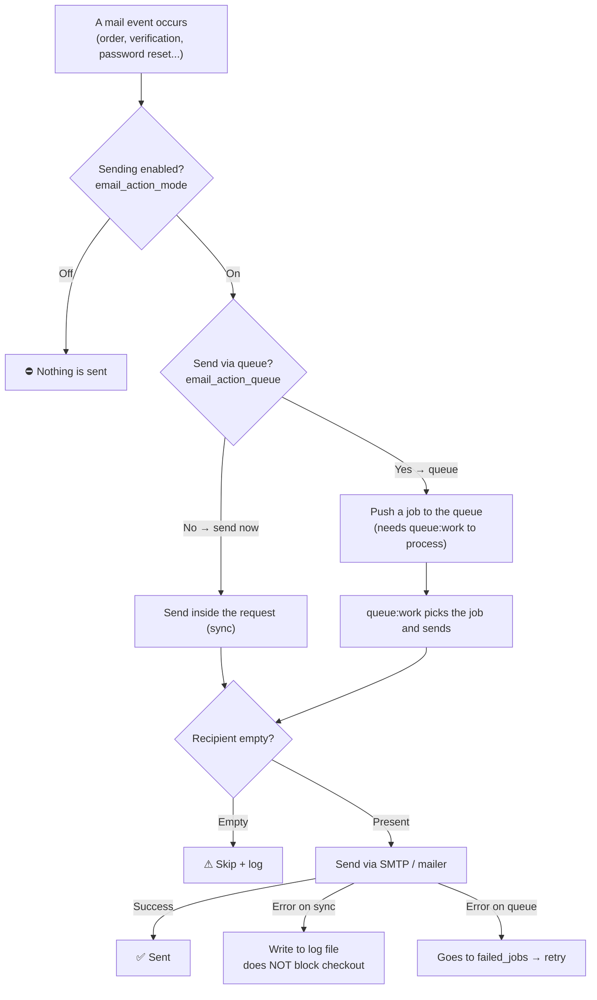
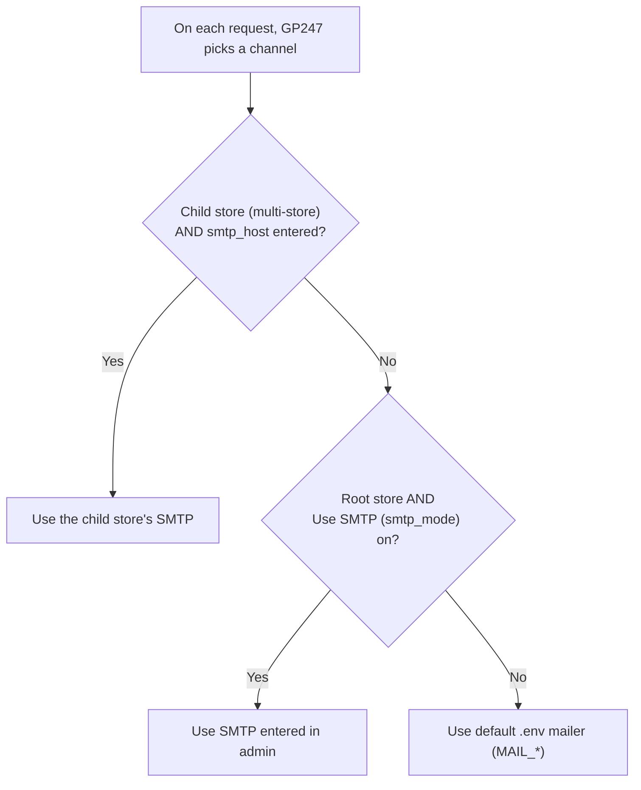

> 🌐 **Language:** [🇻🇳 Tiếng Việt](./mail-system_vi.md) · 🇬🇧 English (current)

# Mail system in GP247

## Introduction
This document explains **how GP247 sends email** (order confirmations, account verification, password reset…) in an easy-to-picture way using **flow diagrams**. It is for store owners and deployers — including non-technical readers. After reading you will understand: the steps a mail goes through, where the on/off switches are, when GP247 uses your SMTP versus the default mailer, and how to configure it correctly. Running mail through a **queue + cron** is covered separately in [Schedule & Queue](./schedule-and-queue.md).

## The big picture in one diagram

This is the full journey of an email in GP247. This single diagram gives you the overview:

**Reading the diagram:** mail proceeds only when **sending is enabled**. Then there are two paths: **send now** (while the customer clicks the button) or **via queue** (later, without making the customer wait). Before sending, GP247 checks the recipient is not empty. On failure: the "send now" path logs the error but does not break the order; the "queue" path adds it to the failed list for retry.

## The three main switches

All configured in **Admin → Configuration → Email/SMTP**, saved per store.

| Switch | Meaning | Hint |
| --- | --- | --- |
| **email_action_mode** | Turn the **whole** mail feature on/off | Must be **On** for any mail to send |
| **email_action_queue** | Send **via queue** (later) or **directly** (now) | Small site: **direct**; high volume: **queue** (see Schedule & Queue) |
| **smtp_mode** (Use SMTP) | Use **SMTP entered in admin** or the **default `.env` mailer** | Turn on to enter your own SMTP server (Gmail, SendGrid…) |

## Which "channel" does GP247 pick?

On each send, GP247 decides whether to use the admin SMTP or the default mailer in `.env`. The diagram:

> ⚠️ **A common gotcha for single-store sites:** if you do **not** enable "Use SMTP" and `.env` has no `MAIL_MAILER=smtp`, GP247 uses Laravel's default mailer `log` — meaning mail is only **written to a log file, not actually sent**. To really send: either enable "Use SMTP" and enter a server, or set `MAIL_*` in `.env`.

## SMTP configuration (when "Use SMTP" is on)

Fill in these fields on the Email/SMTP screen:

| Field | Meaning |
| --- | --- |
| `smtp_host` | SMTP server (e.g. `smtp.gmail.com`) |
| `smtp_user` / `smtp_password` | SMTP login (the password is masked as ●●● and stored **encrypted at rest** — see "Secrets at rest" below) |
| `smtp_security` | Security type: `ssl` / `tls` / empty |
| `smtp_port` | Port; **leave empty** and GP247 fills it per the table below |
| `smtp_name` / `smtp_from` | Sender name and address (empty → use the store name & email) |

**Security → port mapping** (GP247 applies the correct transport automatically):

| `smtp_security` | Connection type | Default port |
| --- | --- | --- |
| `ssl` | Encrypted immediately (implicit TLS) | 465 |
| `tls` | Upgrade to encrypted (STARTTLS) | 587 |
| empty | Unencrypted / negotiated | 587 |

## Secrets at rest

The SMTP password — and other secrets like OAuth client secrets, the captcha secret and
plugin licenses — are **encrypted in the database** (stored as `enc:v2:…`, never plaintext),
using a dedicated key `GP247_ENCRYPTION_KEY`. **Back up that key**, and **change it only with
`php artisan gp247:encryption-key-rotate`** (never by hand). Full guide — including the safe
step-by-step key change — is in [Sensitive data encryption](./data-encryption.md).

## Choosing how to send, by environment

- **Simple shared host (no cron):** use **direct** sending (queue off) — nothing extra to install.
- **Lots of mail / don't make customers wait:** enable the **queue**. You then need a way to "drain" the queue — see [Schedule & Queue](./schedule-and-queue.md).

## The reminder panel in the settings screen

Right above the Email/SMTP screen, GP247 shows a **reminder box** that adapts to your configuration, with 4 states:

| State | Meaning | What to do |
| --- | --- | --- |
| **direct** | Sending directly | No cron/worker needed |
| **queue_sync** | Queue on but `QUEUE_CONNECTION=sync` | Still sends now; to run in background switch to `database` + add a cron |
| **queue_auto** | Queue + GP247 handles the schedule | Just add **one cron line** (the box shows it ready to copy) |
| **queue_manual** | Queue + you run your own worker | Run `queue:work` via supervisor |

## What happens when a mail fails?

- **Direct:** the error is **written to the log file** (`storage/logs/gp247.log`) but does **not break** the customer's order/registration.
- **Via queue:** the error puts the job into the **`failed_jobs`** table for retry — visible, no "false success".

## Q&A

**Q1: I enabled sending but the customer receives no mail?**

→ Check 3 things: (1) is **email_action_mode** on; (2) if "Use SMTP" is **off**, `.env` must have `MAIL_MAILER=smtp` (otherwise mail only logs); (3) if the **queue** is on, you need a way to drain it (see Schedule & Queue). Also check `storage/logs/gp247.log`.

**Q2: Should I pick `ssl` or `tls`?**

→ Depends on your provider. Common: Gmail/SMTP uses `ssl` port 465, or `tls` port 587. Leave the port empty and GP247 fills the right one per the security table.

**Q3: Why is mail only written to the log instead of sent?**

→ Because Laravel's default mailer is `log`. Enable "Use SMTP" and enter a server, or set `MAIL_MAILER=smtp` plus `MAIL_*` in `.env`.

**Q4: Should I enable the "queue"?**

→ Low-volume sites don't need it (direct is simpler). High volume or slow SMTP: enable it so customers don't wait — but you must set up a cron/worker (see Schedule & Queue).

**Q5: Is the SMTP password exposed on the admin screen?**

→ It is not shown as plain text — the field is masked with ●●●, and it is **encrypted at rest** in the database (`enc:v2:…`). See [Sensitive data encryption](./data-encryption.md) for backup / key change.

**Q6: On a multi-store site, where does mail send from?**

→ Each child store **enters its own SMTP**; any store without `smtp_host` falls back to the default `.env` mailer.

**Q7: How do the customer and admin mails differ?**

→ Same order summary, different recipient: the admin receives it at the store email, the customer at their own email (with `replyTo` set to the store email). Each is sent only when its flag is on (`order_success_to_admin` / `order_success_to_customer`).

**Q8: I used `ssl` before — does updating affect me?**

→ It might: the new version genuinely uses the encrypted `smtps` connection for `ssl` (previously it may not have encrypted correctly). **Send a test mail** after updating to confirm SMTP still connects.

**Q9: How do I know a mail failed?**

→ Check `storage/logs/gp247.log` (every send error is logged there). If using the queue, also check the `failed_jobs` table.

**Q10: After changing the SMTP password/hostname, do I need to restart anything?**

→ No. Config is read per request so it takes effect immediately. Only for the queue, jobs **already sitting in the queue** run with the info in effect when they are processed.

---

📅 **Last updated:** 2026-09-04 · ✍️ **Author:** GP247
