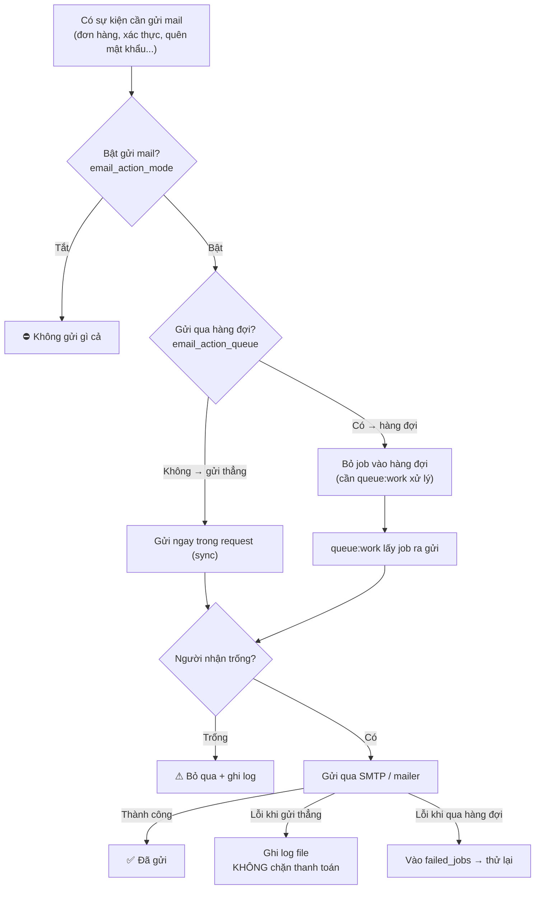
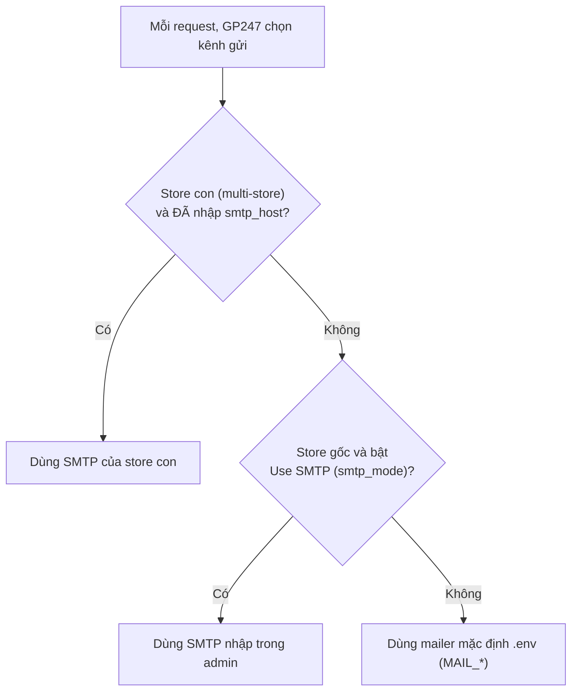

> 🌐 **Ngôn ngữ:** 🇻🇳 Tiếng Việt (hiện tại) · [🇬🇧 English](./mail-system.md)

# Hệ thống gửi mail trong GP247

## Giới thiệu
Tài liệu này giải thích **cách GP247 gửi email** (email xác nhận đơn hàng, xác thực tài khoản, quên mật khẩu…) theo cách dễ hình dung bằng **sơ đồ luồng**. Dành cho chủ site và người triển khai — kể cả người không rành kỹ thuật. Đọc xong bạn sẽ nắm được: mail đi qua những bước nào, các công tắc bật/tắt ở đâu, khi nào GP247 dùng SMTP của bạn hay mailer mặc định, và cách cấu hình cho đúng. Phần chạy mail qua **hàng đợi + cron** được tách riêng ở tài liệu [Lịch & Hàng đợi (Schedule & Queue)](./schedule-and-queue_vi.md).

## Tổng quan bằng một sơ đồ

Đây là toàn bộ hành trình của một email trong GP247. Nhìn sơ đồ này là nắm được bức tranh lớn:

**Đọc sơ đồ:** mail chỉ đi tiếp khi **bật gửi mail**. Sau đó có 2 đường: **gửi thẳng** (ngay trong lúc khách bấm nút) hoặc **qua hàng đợi** (để sau, không bắt khách chờ). Trước khi gửi, GP247 kiểm tra người nhận có trống không. Nếu gửi lỗi: đường "gửi thẳng" ghi log nhưng không làm hỏng đơn hàng; đường "hàng đợi" đưa vào danh sách lỗi để thử lại.

## Ba công tắc chính

Tất cả chỉnh trong **Admin → Cấu hình → Email/SMTP**, lưu theo từng cửa hàng.

| Công tắc | Ý nghĩa | Gợi ý |
| --- | --- | --- |
| **email_action_mode** | Bật/tắt **toàn bộ** chức năng gửi mail | Phải **Bật** thì mail mới gửi |
| **email_action_queue** | Gửi **qua hàng đợi** (để sau) hay **gửi thẳng** (ngay) | Site nhỏ để **thẳng**; site nhiều mail thì **hàng đợi** (xem tài liệu Schedule & Queue) |
| **smtp_mode** (Use SMTP) | Dùng **SMTP nhập trong admin** hay **mailer mặc định `.env`** | Bật nếu muốn nhập máy chủ SMTP riêng (Gmail, SendGrid…) |

## GP247 chọn "kênh gửi" nào?

Mỗi lần gửi, GP247 tự quyết định dùng SMTP nhập trong admin hay mailer mặc định trong file `.env`. Sơ đồ:

> ⚠️ **Lưu ý cho site 1 cửa hàng thường gặp:** nếu bạn **không** bật "Use SMTP" và trong `.env` chưa đặt `MAIL_MAILER=smtp`, GP247 sẽ dùng mailer mặc định của Laravel là `log` — tức là mail chỉ **ghi vào file log, không gửi thật**. Muốn gửi thật: hoặc bật "Use SMTP" và nhập máy chủ, hoặc cấu hình `MAIL_*` trong `.env`.

## Cấu hình SMTP (khi bật "Use SMTP")

Nhập các ô sau trong màn Email/SMTP:

| Ô nhập | Ý nghĩa |
| --- | --- |
| `smtp_host` | Máy chủ SMTP (vd `smtp.gmail.com`) |
| `smtp_user` / `smtp_password` | Tài khoản đăng nhập SMTP (mật khẩu hiển thị dạng ẩn ●●●) |
| `smtp_security` | Kiểu bảo mật: `ssl` / `tls` / để trống |
| `smtp_port` | Cổng; **để trống** thì GP247 tự chọn theo bảng dưới |
| `smtp_name` / `smtp_from` | Tên và địa chỉ người gửi (để trống → lấy tên & email cửa hàng) |

**Bảng chọn bảo mật → cổng** (GP247 tự áp dụng đúng chuẩn):

| `smtp_security` | Kiểu kết nối | Cổng mặc định |
| --- | --- | --- |
| `ssl` | Mã hoá ngay (implicit TLS) | 465 |
| `tls` | Nâng cấp mã hoá (STARTTLS) | 587 |
| để trống | Không mã hoá / tự thương lượng | 587 |

## Chọn cách gửi theo môi trường

- **Shared host đơn giản (không cron):** để **gửi thẳng** (tắt hàng đợi) — không cần cài gì thêm.
- **Có nhiều mail / không muốn khách chờ:** bật **hàng đợi**. Khi đó cần một cơ chế "rút hàng đợi" — xem chi tiết ở tài liệu [Lịch & Hàng đợi](./schedule-and-queue_vi.md).

## Panel nhắc nhở trong màn cấu hình

Ngay trên màn Email/SMTP, GP247 hiện một **khung nhắc nhở** tự đổi theo cấu hình của bạn, gồm 4 trạng thái:

| Trạng thái | Nghĩa là | Bạn cần làm |
| --- | --- | --- |
| **direct** | Đang gửi thẳng | Không cần cron/worker |
| **queue_sync** | Bật hàng đợi nhưng `QUEUE_CONNECTION=sync` | Vẫn gửi ngay; muốn chạy nền thì đổi sang `database` + thêm cron |
| **queue_auto** | Hàng đợi + GP247 tự lo lịch | Chỉ cần thêm **1 dòng cron** (khung hiện sẵn để copy) |
| **queue_manual** | Hàng đợi + bạn tự chạy worker | Chạy `queue:work` bằng supervisor |

## Nếu mail gửi lỗi thì sao?

- **Gửi thẳng:** lỗi được **ghi vào file log** (`storage/logs/gp247.log`) nhưng **không làm hỏng** đơn hàng/đăng ký của khách.
- **Qua hàng đợi:** lỗi khiến job **vào bảng `failed_jobs`** để tự thử lại — bạn thấy được và không bị "thành công giả".

## Hỏi & Đáp (Q&A)

**Câu 1: Tôi bật gửi mail rồi mà khách không nhận được mail?**

→ Kiểm tra 3 điều: (1) đã bật **email_action_mode** chưa; (2) nếu **không** bật "Use SMTP" thì `.env` phải có `MAIL_MAILER=smtp` (không thì mail chỉ ghi log); (3) nếu bật **hàng đợi** thì phải có cơ chế rút hàng đợi (xem tài liệu Schedule & Queue). Xem thêm file `storage/logs/gp247.log`.

**Câu 2: Nên chọn `ssl` hay `tls`?**

→ Tuỳ nhà cung cấp. Phổ biến: Gmail/SMTP dùng `ssl` cổng 465, hoặc `tls` cổng 587. Cứ để trống cổng, GP247 tự điền đúng theo bảng bảo mật.

**Câu 3: Vì sao mail chỉ ghi vào log mà không gửi đi?**

→ Vì mailer mặc định của Laravel là `log`. Bật "Use SMTP" và nhập máy chủ, hoặc đặt `MAIL_MAILER=smtp` cùng `MAIL_*` trong `.env`.

**Câu 4: Nên bật "hàng đợi" (queue) không?**

→ Site ít mail thì không cần (gửi thẳng cho gọn). Site nhiều mail hoặc SMTP chậm thì nên bật để khách không phải chờ — nhưng cần cài cron/worker (xem tài liệu Schedule & Queue).

**Câu 5: Mật khẩu SMTP có bị lộ trên màn admin không?**

→ Không hiển thị dạng chữ thường — ô mật khẩu che bằng ●●●. (Lưu ý kỹ thuật: hiện vẫn lưu ở dạng thô trong cơ sở dữ liệu; việc mã hoá lưu trữ đang trong kế hoạch.)

**Câu 6: Site nhiều cửa hàng (multi-store) thì gửi từ đâu?**

→ Mỗi cửa hàng con **nhập SMTP riêng**; cửa hàng nào chưa nhập `smtp_host` thì tự dùng mailer mặc định `.env`.

**Câu 7: Mail cho khách và cho admin có gì khác nhau?**

→ Cùng nội dung tóm tắt đơn, khác người nhận: admin nhận ở email cửa hàng, khách nhận ở email của họ (và có `replyTo` là email cửa hàng). Chỉ gửi khi bật cờ tương ứng (`order_success_to_admin` / `order_success_to_customer`).

**Câu 8: Trước đây tôi để `ssl`, cập nhật xong có ảnh hưởng gì?**

→ Có thể có: bản mới thực sự dùng kết nối mã hoá `smtps` cho `ssl` (trước đây có thể chưa mã hoá đúng). Hãy **gửi thử một mail** sau khi cập nhật để chắc chắn SMTP vẫn kết nối được.

**Câu 9: Làm sao biết một mail đã gửi lỗi?**

→ Xem `storage/logs/gp247.log` (mọi lỗi gửi đều ghi ở đây). Nếu dùng hàng đợi, kiểm tra thêm bảng `failed_jobs`.

**Câu 10: Đổi mật khẩu/hostname SMTP xong có phải khởi động lại gì không?**

→ Không. Cấu hình đọc theo từng request nên có hiệu lực ngay. Chỉ khi dùng hàng đợi, các job **đã nằm sẵn trong hàng đợi** vẫn chạy bằng thông tin lúc chúng được xử lý.

---

📅 **Cập nhật lần cuối:** 2026-08-05 · ✍️ **Tác giả (Author):** GP247
