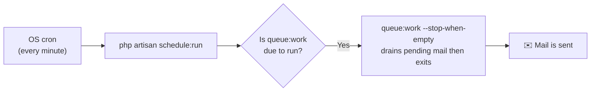

> 🌐 **Language:** [🇻🇳 Tiếng Việt](./schedule-and-queue_vi.md) · 🇬🇧 English (current)

# Scheduler & Queue (schedule:run and queue:work)

## Introduction
This document explains **two commonly confused commands** in GP247/Laravel — `queue:work` and `schedule:run` — how they differ, how they relate, and **how to set them up per environment** (shared host with/without cron, VPS). It is for store owners and deployers. After reading you will know **which cron** to set so that queued mail (and other background tasks) actually run. For the mail flow itself, see [Mail system](./mail-system.md).

## Two concepts, two different systems

### `queue:work` — the background worker (queue)
When there is work to do later (e.g. sending an email), GP247 **pushes a "job" onto the queue** and returns the page immediately. `queue:work` is the **worker process** that watches the queue and executes jobs as they appear. By default it runs **continuously**; **if nobody runs `queue:work`, the jobs sit there forever**.

> Analogy: `queue:work` = a **postal worker on standby** who delivers letters as they arrive.

### `schedule:run` — the clock that runs scheduled tasks
`schedule:run` **checks at the moment it is called** whether any time-based task is due, runs it, and **exits**. It is designed to be **called every minute by the OS cron** with **a single line**.

> Analogy: `schedule:run` = a **once-a-minute alarm** asking "is anything due yet?".

### How the two relate
They are **independent**. `schedule:run` alone does **not** process the queue — unless we **schedule `queue:work`** inside it. That is exactly what GP247 does:



## GP247 handles the schedule — you only need one cron

GP247 **auto-registers** the `queue:work` task in its scheduler. Thanks to this, on shared hosting you only need to set up **one standard cron line** for queued mail to be sent — no persistent background process required.

- **Only auto-registers when** the queue is real (`QUEUE_CONNECTION` other than `sync`) **and** the flag is on.
- **Opt-out flag:** set `GP247_SCHEDULE_QUEUE_WORK=false` in `.env` if you **run your own worker** via supervisor (typically on a VPS) — to avoid a redundant process.

## Setup by environment

### A. Shared host WITHOUT cron (simplest)
1. Go to **Admin → Configuration → Email/SMTP** and **turn off** "send via queue" (email_action_queue).
2. Done. Mail sends directly, **no cron or worker needed**.

> Don't use the queue in this environment — with no way to drain it, mail would get stuck.

### B. Shared host WITH cron (recommended for mid-size sites)
1. Go to **Admin → Configuration → Email/SMTP** and **turn on** "send via queue".
2. In `.env`, set (not `sync`):

   ```
   QUEUE_CONNECTION=database
   ```

3. In your hosting's cron manager (cPanel → **Cron Jobs**), add **one** line that runs **every minute** (replace `/path-to-project` accordingly):

   ```
   * * * * * cd /path-to-project && php artisan schedule:run >> /dev/null 2>&1
   ```

   If it works, within at most 1 minute the mail in the queue is sent. GP247 handles the `queue:work` part internally.

> The panel on the Email/SMTP screen (state **queue_auto**) shows this exact cron line for you to copy.

### C. VPS / Docker (optimal)
1. Turn on "send via queue" and set `QUEUE_CONNECTION=database` (or `redis`).
2. Run a **persistent worker** via supervisor (keep `queue:work` running):

   ```
   php artisan queue:work --tries=3
   ```

3. In `.env`, disable GP247's auto-registration to avoid a redundant run:

   ```
   GP247_SCHEDULE_QUEUE_WORK=false
   ```

> GP247's Docker setup already includes a `queue` and a `scheduler` service for this.

## Does "running twice" send mail twice?

**No.** Even if you accidentally run **both** a persistent worker **and** the auto-registered schedule, mail is **not sent twice**: the queue **locks each job to exactly one worker** (atomic reservation). Multiple workers merely **share** the jobs. The only downside is **a redundant lightweight process each minute** — and the `GP247_SCHEDULE_QUEUE_WORK=false` flag lets you turn that off.

## Q&A

**Q1: What's the difference between `schedule:run` and `queue:work`?**

→ `queue:work` is the worker that **processes background jobs** (sends mail). `schedule:run` is the **time-based clock** that checks every minute for due tasks. They are independent; `schedule:run` only touches the queue because GP247 scheduled `queue:work` inside it.

**Q2: I set the `schedule:run` cron but mail still isn't sent?**

→ Check: (1) `QUEUE_CONNECTION` is **not** `sync` (e.g. `database`); (2) `GP247_SCHEDULE_QUEUE_WORK` is not set to `false`; (3) the cron path points to the correct project directory; (4) "send via queue" is enabled in admin.

**Q3: My shared host doesn't allow background processes — is that a problem?**

→ No. Use **option B** (one `schedule:run` cron) — no background process needed. Or **option A** (direct sending, no queue).

**Q4: Is `schedule:run` alone enough, without writing my own `queue:work`?**

→ Yes. GP247 already registered `queue:work` in the schedule, so you only need one standard `schedule:run` cron.

**Q5: On a VPS I already run supervisor `queue:work` — do I need to disable anything?**

→ You should set `GP247_SCHEDULE_QUEUE_WORK=false` so GP247 doesn't schedule another `queue:work` (avoids a redundant process). Not disabling it still **won't send mail twice**, just wastes a little resource.

**Q6: What does `--stop-when-empty` mean?**

→ It means `queue:work` **drains** all pending work then **exits** (doesn't run forever) — ideal for a shared-host cron: each minute it does one pass and stops.

**Q7: With a per-minute cron, can mail be delayed by up to a minute?**

→ Yes, up to ~1 minute. For most sites that's acceptable. For near-instant delivery, use **option C** (a persistent worker on a VPS).

**Q8: My site sends lots of mail — can a per-minute cron keep up?**

→ If the volume is very high, one pass per minute may not drain it. In that case use a **persistent worker** (option C) instead of cron.

---

<sub>📅 **Last updated:** 2026-08-05 · ✍️ **Author:** GP247</sub>
