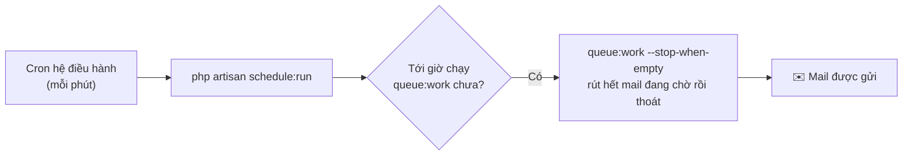

> 🌐 **Ngôn ngữ:** 🇻🇳 Tiếng Việt (hiện tại) · [🇬🇧 English](./schedule-and-queue.md)

# Lịch chạy & Hàng đợi (schedule:run và queue:work)

## Giới thiệu
Tài liệu này giải thích **hai lệnh hay bị nhầm** trong GP247/Laravel — `queue:work` và `schedule:run` — chúng khác nhau thế nào, liên quan ra sao, và **cài đặt thế nào cho từng môi trường** (shared host có/không cron, VPS). Dành cho chủ site và người triển khai. Đọc xong bạn biết cần đặt **cron nào** để mail qua hàng đợi (và các tác vụ nền khác) thật sự chạy. Phần luồng gửi mail xem tài liệu [Hệ thống gửi mail](./mail-system_vi.md).

## Hai khái niệm, hai hệ thống khác nhau

### `queue:work` — người xử lý việc nền (hàng đợi)
Khi có việc cần làm sau (ví dụ gửi một email), GP247 **bỏ một "job" vào hàng đợi** rồi trả trang về ngay. `queue:work` là **tiến trình công nhân** đứng canh hàng đợi, thấy job thì lấy ra làm. Mặc định nó chạy **liên tục**; **không có ai chạy `queue:work` → job nằm im mãi**.

> Ví von: `queue:work` = **nhân viên bưu tá trực sẵn**, có thư là mang đi gửi.

### `schedule:run` — đồng hồ chạy lịch
`schedule:run` **kiểm tra ngay lúc gọi** xem có tác vụ theo giờ nào tới hạn không, có thì chạy, rồi **thoát**. Nó được thiết kế để **cron của hệ điều hành gọi mỗi phút** bằng **đúng 1 dòng**.

> Ví von: `schedule:run` = **đồng hồ báo mỗi phút** "tới giờ làm việc gì chưa?".

### Quan hệ giữa hai lệnh
Chúng **độc lập**. `schedule:run` một mình **không** xử lý hàng đợi — trừ khi ta **lên lịch cho `queue:work`** bên trong nó. Đó chính là cách GP247 làm:



## GP247 tự lo lịch — bạn chỉ cần 1 cron

GP247 **tự đăng ký sẵn** tác vụ `queue:work` vào bộ lịch. Nhờ đó, trên shared host bạn **chỉ cần cài đúng 1 dòng cron chuẩn** là mail qua hàng đợi sẽ được gửi — không cần tiến trình nền chạy hoài.

- **Chỉ tự đăng ký khi** hàng đợi là thật (`QUEUE_CONNECTION` khác `sync`) **và** flag bật.
- **Flag tắt (opt-out):** đặt `GP247_SCHEDULE_QUEUE_WORK=false` trong `.env` nếu bạn **tự chạy worker riêng** bằng supervisor (thường trên VPS) — để tránh chạy dư.

## Cài đặt theo môi trường

### A. Shared host KHÔNG có cron (đơn giản nhất)
1. Vào **Admin → Cấu hình → Email/SMTP**, **tắt** "gửi qua hàng đợi" (email_action_queue).
2. Xong. Mail gửi thẳng, **không cần cron hay worker**.

> Không dùng hàng đợi ở môi trường này — vì không có cách rút hàng đợi, mail sẽ kẹt.

### B. Shared host CÓ cron (khuyến nghị cho site vừa)
1. Vào **Admin → Cấu hình → Email/SMTP**, **bật** "gửi qua hàng đợi".
2. Trong file `.env`, đặt (không dùng `sync`):

   ```
   QUEUE_CONNECTION=database
   ```

3. Vào trình quản lý cron của hosting (cPanel → **Cron Jobs**), thêm **một** dòng chạy **mỗi phút** (đổi `/đường-dẫn-tới-project` cho đúng):

   ```
   * * * * * cd /đường-dẫn-tới-project && php artisan schedule:run >> /dev/null 2>&1
   ```

   Nếu thành công, sau tối đa 1 phút các mail trong hàng đợi sẽ được gửi đi. GP247 đã tự lo phần `queue:work` bên trong.

> Panel trong màn Email/SMTP (trạng thái **queue_auto**) hiển thị sẵn đúng dòng cron này để bạn copy.

### C. VPS / Docker (tối ưu nhất)
1. Bật "gửi qua hàng đợi" và đặt `QUEUE_CONNECTION=database` (hoặc `redis`).
2. Chạy một **worker thường trực** bằng supervisor (giữ `queue:work` chạy nền):

   ```
   php artisan queue:work --tries=3
   ```

3. Trong `.env`, tắt phần tự-đăng-ký của GP247 để không chạy dư:

   ```
   GP247_SCHEDULE_QUEUE_WORK=false
   ```

> Docker của GP247 đã có sẵn service `queue` và `scheduler` cho mục đích này.

## "Chạy trùng" có gửi mail 2 lần không?

**Không.** Kể cả khi vô tình chạy **cả** worker thường trực **lẫn** lịch tự-đăng-ký, mail **không bị gửi 2 lần**: hàng đợi **khoá mỗi job cho đúng một worker** (cơ chế nguyên tử). Nhiều worker chỉ **chia nhau** job. Hậu quả duy nhất là **dư một tiến trình nhẹ mỗi phút** — và flag `GP247_SCHEDULE_QUEUE_WORK=false` giúp bạn tắt phần dư đó.

## Hỏi & Đáp (Q&A)

**Câu 1: `schedule:run` và `queue:work` khác gì nhau?**

→ `queue:work` là công nhân **xử lý việc nền** (gửi mail). `schedule:run` là **đồng hồ theo giờ**, mỗi phút kiểm tra có tác vụ tới hạn không. Chúng độc lập; `schedule:run` chỉ đụng tới hàng đợi vì GP247 đã lên lịch `queue:work` bên trong nó.

**Câu 2: Tôi đặt cron `schedule:run` rồi mà mail vẫn không gửi?**

→ Kiểm tra: (1) `QUEUE_CONNECTION` **khác** `sync` (ví dụ `database`); (2) flag `GP247_SCHEDULE_QUEUE_WORK` không bị đặt `false`; (3) đường dẫn trong dòng cron trỏ đúng thư mục project; (4) đã bật "gửi qua hàng đợi" trong admin.

**Câu 3: Shared host của tôi không cho chạy tiến trình nền, có sao không?**

→ Không sao. Dùng **cách B** (1 cron `schedule:run`) — không cần tiến trình nền. Hoặc **cách A** (gửi thẳng, không hàng đợi).

**Câu 4: Chỉ cần `schedule:run` là đủ, không cần tự viết lệnh `queue:work`?**

→ Đúng. GP247 đã tự đăng ký `queue:work` vào lịch, nên bạn chỉ cần 1 cron `schedule:run` chuẩn.

**Câu 5: Trên VPS tôi đã chạy supervisor `queue:work`, có cần tắt gì không?**

→ Nên đặt `GP247_SCHEDULE_QUEUE_WORK=false` để GP247 không lên lịch thêm một `queue:work` nữa (tránh dư tiến trình). Không tắt cũng **không gửi trùng mail**, chỉ hơi phí tài nguyên.

**Câu 6: `--stop-when-empty` nghĩa là gì?**

→ Nghĩa là `queue:work` **rút hết** việc đang chờ rồi **tự thoát** (không chạy hoài) — rất hợp với cron shared host: mỗi phút châm một lượt rồi tắt.

**Câu 7: Cron chạy mỗi phút thì mail có bị trễ tới 1 phút không?**

→ Có thể trễ tối đa ~1 phút. Với đa số site là chấp nhận được. Cần tức thời hơn thì dùng **cách C** (worker thường trực trên VPS).

**Câu 8: Site rất nhiều mail, cron mỗi phút có kịp không?**

→ Nếu lượng mail rất lớn, một lượt/phút có thể không rút kịp. Khi đó dùng **worker thường trực** (cách C) thay vì cron.

---

<sub>📅 **Cập nhật lần cuối:** 2026-08-05 · ✍️ **Tác giả (Author):** GP247</sub>
